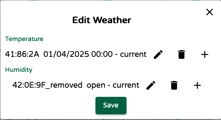
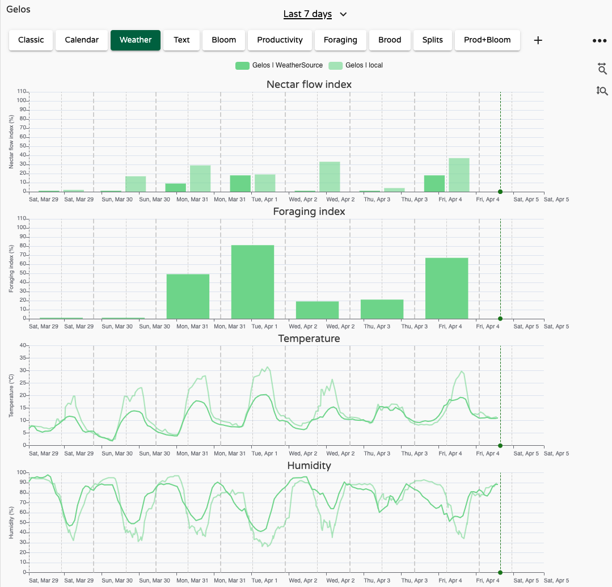
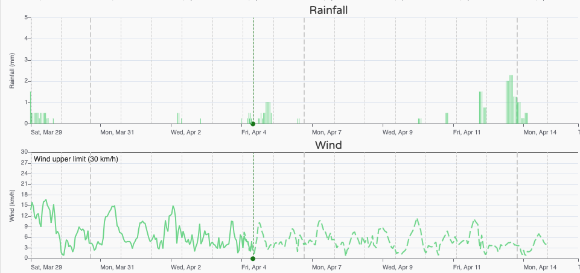
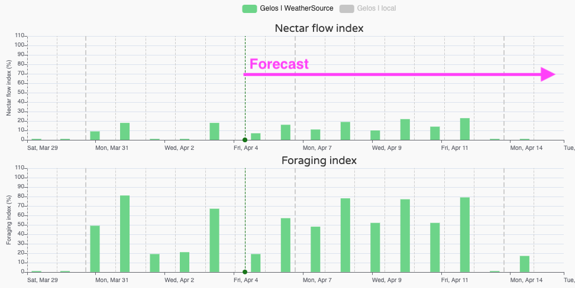

## Working with Weather

Weather conditions are a key aspect of beekeeping. You simply can't manage your apiary without considering the weather. It influences everything — from **inspection timing**, **splitting**, and **feeding needs**, to **bloom onset** and **nectar flow** in the surrounding environment. In short, weather matters — a lot.

In MyBroodMinder, each apiary has its own **Weather** object.

When you expand this section, you'll see the default weather service **WeatherSource** attached. **WeatherSource Inc.** is a dedicated company that provides reliable historical and forecast weather data.

!!! tip "WeatherSource's location accuracy"
    WeatherSource estimates weather based on the ZIP code you entered when creating your apiary. This might be a few miles away from your actual location.  
    To improve accuracy, go to `Edit Apiary > Coordinates > Edit Location`, and move the map marker to the precise spot.
    
    

### Sources

You can also add a **local weather source** using the `...` menu. This allows you to assign a BroodMinder device (like a **Weather Hub** or **BroodMinder-T/TH**) to provide real-time weather readings from the apiary itself.

!!! tip "Get precise local weather data"
    The most accurate way to measure apiary weather is to use a **weather shield** enclosing a BroodMinder-T91 Hub or a BroodMinder-TH.

Now that you acquired a deeper understanding of the different weather sources into myBroodMinder, it's time to see how to manage them and exploit the most for your beekeeping practice.

### Weather tab

The best place to start is the **Weather tab** in your dashboard canvas. This tab displays all the selected weather sources for your apiary.

Click the **Weather** item on the left sidebar to display the data on the charts. For now, skip the first two — *Nectar Flow Index* and *Foraging Index* — as we'll cover them later.

You'll notice two time series:

- `Apiary | WeatherSource` — the default data from WeatherSource Inc.
- `Apiary | Local` — data from your own BroodMinder device, if configured.

Depending on the local source, you may see temperature, humidity, or both.

**WeatherSource** provides: Temperature, Humidity, Rainfall, Wind and Cloud cover. In the example above, compared with the local weather data, WeatherSource tracks temperature well, though it may underestimate peak temperatures. This is where comparing with your local device is useful. For instance, if your apiary is in full sun, afternoon temperatures can be significantly higher.

> The thick dashed vertical grey lines represent the start of each day; the thin ones mark noon.

### Forecast

Once you're familiar with your current weather sources, you can look ahead with the forecast. In the calendar picker, check the **"Show 10-day forecast"** option:

The weather charts will now extend 10 days into the future. The vertical green dashed line marks "today". In this example, the forecast shows stable conditions ahead — no sharp warm-ups or cool-downs.
  

However, rain is expected next Sunday/Monday, while wind conditions remain stable.  
Note that **cloud cover is not included in forecasts**.

At this stage, we have seen how to assess and compare multiple weather sources. **While this deep insight is useful, it's not always practical to analyze raw weather data every day**. That's why we’ve developed tools to automate the processing and translate weather into beekeeping-relevant insights. Let's check now in depth the **Foraging Index** and the **Nectar Flow Index**.

### Indexes

Indexes provide a synthetic view of weather suitability for bees and plants.

- **Foraging Index** answers: *"Can bees forage today?"* and considers the outside temperature, the hygrometry, rain and wind.

- **Nectar Flow Index** answers: *"Can plants produce nectar today?"* and evaluates the *atmospheric conditions* for the nectarification of the *flowers*. Here too, several factors are analyzed in relation to the nectar flow conditions. 0% means that the conditions for honeyflow are not met, 100% that it is damn great. But beware, depending on your climate zone, 100% may never be reached and you will have to be satisfied with lower rates! 
To validate the forecast range, this algorithm has been developed with apiaries located in various climatic zones (temperate, cold, very cold, tropical...); We ensure you that in some cases it can reach 100% 😉

These indexes are based purely on weather conditions.  
They don't consider whether plants are actually blooming or whether your bees are acclimated to local cold — they offer **general trends**.

In practice, the **Nectar Flow Index** is often the most informative. It helps you anticipate upcoming opportunities and plan accordingly. That’s why it's featured in the **first tab of the Bees App** — it sets the tone for your daily beekeeping decisions.

!!! note "Beekeepers as weather processors"
    Every experienced beekeeper instinctively does "weather processing" — interpreting forecasts and deciding if upcoming conditions are right for bees.  
    But it’s easy to overlook key factors: warm days with no sun, night-only rainfall, or too much wind.  
    The **Nectar Flow** and **Foraging Indexes** replicate this mental model using a consistent, methodical approach.

!!! Example "Practical use of the Nectar Flow Index (NFI)"

    Understanding and utilizing the Nectar Flow Index (NFI) can significantly enhance your beekeeping practices. Here’s a guide on how to practically apply the NFI:
    
    **1. Monitor Local Blooming Plants:**
        Keep track of the types of plants in your area and their blooming periods. The NFI is only useful if there are plants in bloom.
    
    **2. Understand Plant-Specific NFI Thresholds:**
        Different plants have varying NFI thresholds for nectar release. For instance: 
        a. Rapeseed: Nectar flow generally starts at an NFI > 7 because of the cooler early-season conditions. 
        b. Sunflower: Nectar flow typically begins at an NFI > 30 during the warmer summer months.
    
    **3. Observe and Record:**
        Regularly observe your hives and note when bees start to gather nectar from different plants.
        Record the NFI readings corresponding to these observations. Over time, you'll identify specific NFI thresholds for various plants in your area.
    
    **4. Make Informed Decisions:**
        Use your observations and recorded data to make informed decisions about hive management.
            For example, if the NFI indicates that nectar flow is likely but your bees are not active, check for other factors such as plants blooming, hive health or local microclimate conditions. Plan hive movements or resource supplementation based on anticipated nectar flows.

### Overlay 

You can display weather data from **multiple apiaries side-by-side**. This is helpful when:

- Comparing conditions across different locations
- Analyzing a hive that has been moved from one location to another

Simply select the weather item from each apiary to view them together.

!!! tip "Color-coded weather series"
    Each apiary has a unique color assigned. Weather series follow this color for easy identification.  
    You can customize the color under `Apiary Name > ... > Edit Apiary > Color`.

### Colormaps

For a quick overview of upcoming weather, you can also use **colormaps**.  
These are available in the `Home > Apiary` panel and offer a compact, synthetic view of expected conditions over the next 10 days — great for comparing locations at a glance.

### Customize

All the weather magnitudes are avaialable as widgets in the toolbox to build your custom dashboard 

!!! info "FAQ: Can I connect a third-party weather station?"
    We do not offer connectors for third-party weather stations.  
    The reason is simple: the market includes a vast number of models, each with its own data format and API, making it extremely difficult to support and maintain compatibility over time.

    In the past, we attempted to support external systems, but it proved too complex for a team of our size.  
    Instead, we chose to focus our efforts on two reliable sources:
    
    - **WeatherSource**, a high-quality professional weather service  
    - **Our own BroodMinder devices**, which we know and fully control

---