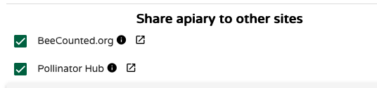

# Sharing and Collaboration

!!! abstract "What you'll learn in this chapter"
    In this chapter, you’ll explore the different ways to **share your hive data and collaborate** with others using MyBroodMinder.  
    You’ll learn how to grant access to fellow beekeepers, publish data on **BeeCounted**, create **shareable dashboards** for social media or colleagues, and even set up **Educational Dashboards** for schools, associations, or public displays.  
    Whether for teamwork, transparency, or outreach, these tools help you connect your beekeeping with the wider world.

From MyBroodMinder you have many options to share your hives with other beekeepers and friends:

## With another user
Share an Apiary (in the Apiary `… > share` ) with another MyBroodMinder user simply enter his/her account email. Acces is granted per apiary, in read only mode. They will see apiary and hives but not devices. 

## On beecounted

Share an apiary [beecounted.org](https://www.beecounted.org) (in the Apiary `… > share`, see above). By default, all free acounts are sharing on beecounted.

## On Social Media with a URL

Share a (read only) dashboard with other people and even on social media using an URL. Simply move to the Dashboard top left menu `… > share`):.
When creating the url you will notice that you have some choices : which hives to share, what time frame, frozen or continuous etc..

## Educational Dashboards

Here’s a fourth — and the most elegant — way to share your hive: Educational Dashboards.
Perfect for associations, schools, or companies, this big-screen mode lets you proudly display your bees to colleagues, students, or the public. It’s a clean, impactful way to educate and inspire.

👉 Interested? Reach out to us at support@BroodMinder.com to learn more about this service.

<i>Educational Dashboards are fun!</i>

## EU Pollinator Hub

As a BroodMinder user, you can share your apiary data with the EU Pollinator Hub.
Simply **check the Share option at the apiary level** to contribute directly to Europe’s pollinator-protection efforts.

Learn more about [EU Pollinator hub](../en/82_beelife.md).