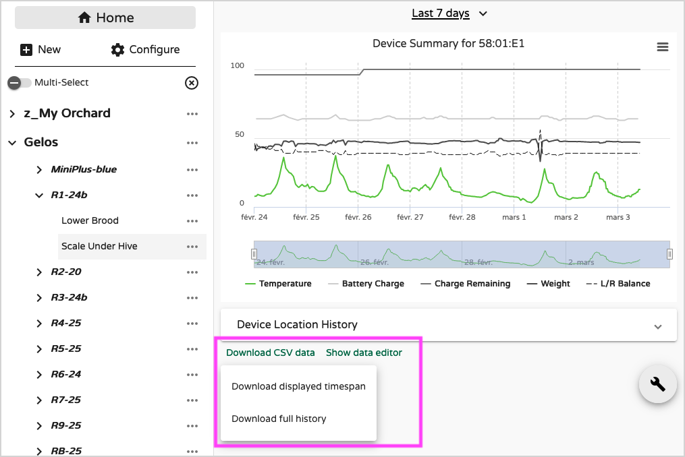
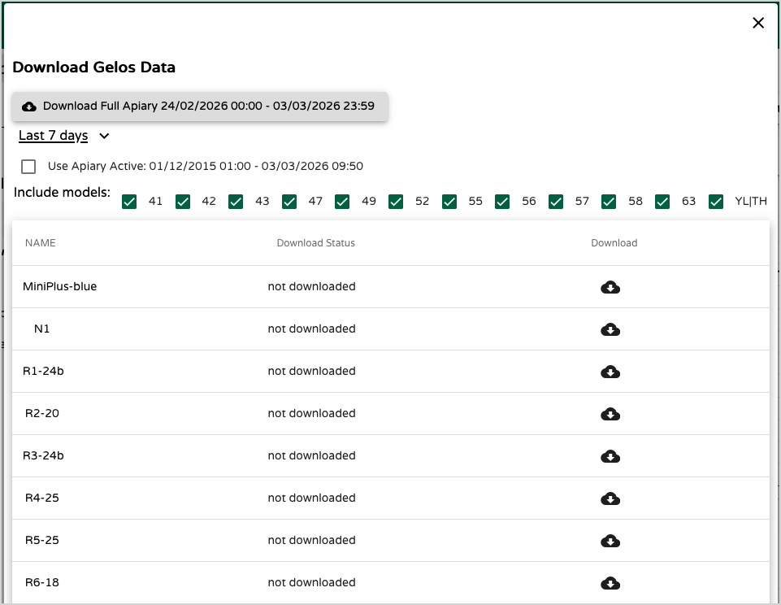

# Exporting Data

!!! abstract "What you'll learn in this chapter"
    This chapter explains how to export your hive data from MyBroodMinder for analysis, reporting, or research.  
    You’ll learn how to download data from individual devices, extract complete datasets from dashboards, and access full apiary exports for advanced use cases.  
    It also covers data cleanup before export and introduces options for deeper post-processing outside the platform.

MyBroodMinder offers **three main ways** to export your data:

- Device-level CSV export  
- Dashboard data export  
- Researcher data export (full apiary dataset)

---

## Exporting Device Data

Each device includes a **`Download CSV data`** option available from the device detail view.

You can choose to export:

- The **full history**, or  
- Only the **currently displayed time span**

### Cleaning Data Before Export

Before exporting, you may want to review and clean your data using the **`Data Editor`**.

This is especially useful if:

- You’ve identified outliers  
- A manual sync created duplicate samples  
- Multiple hubs (e.g., WiFi + Cellular) collected the same readings  

Example of duplicate samples collected by two hubs (a WiFi WFC and a cellular H|54):

### Removing Duplicates Automatically

At the bottom of the Data Editor page, use **`Remove duplicates`**.  
This removes redundant samples in a single action.

### Removing Samples Manually

To delete specific readings (for example, a clear outlier):

1. Select the samples  
2. Click **`Remove Selected`**

---

## Exporting Dashboard Data

Every custom dashboard includes a **Download mode**.

From there, you can choose which type of data to export:

- **Apiary notes**  
- **Hourly readings** (e.g., scales, internal hive sensors, BeeDar, and other device measurements)  
- **Daily readings** (e.g., algorithm-based metrics such as productivity, brood level, Nectar Flow Index, and other computed indicators)  
- **Weather data**

### Files Generated

The export generates multiple files:

**Common files (all hives):**

- Weather  
- Notes  

**Hive-specific sensor files:**

- Temperature & Brood  
- Weight & Productivity  
- Combined Readings (all sensors merged)

This structure makes it easy to:

- Analyze hives individually  
- Merge datasets externally  
- Work in Excel, R, Python, or other analysis tools  

---

## Researcher Data Export

For advanced research needs, we provide a **`Researcher Data Download`** feature at the **apiary level**.

!!! warning "Activation required"
    This feature must be activated on your account before it becomes available.  
    Please contact: **support@broodminder.com**

Once enabled, you can export the **entire dataset** from an apiary.

### Customizing Your Research Export

You can configure:

- Time span  
- Device models  
- Selected hives  

This option is ideal for:

- Scientific studies  
- Long-term data modeling  
- Large-scale comparative analysis  
- Institutional or academic projects  

---

## Summary

| Export Type | Best For | Scope |
|-------------|----------|-------|
| Device CSV | Quick analysis of one device | Single device |
| Dashboard Export | Multi-hive operational review | Dashboard-level |
| Researcher Export | Full dataset extraction | Entire apiary |

With these tools, you retain **full ownership and flexibility** over your hive data — whether for practical beekeeping, collaboration, or scientific research.

---

## Advanced Data Analysis Services

If you need analysis that goes beyond MyBroodMinder’s built-in visualization tools, we can handle advanced data processing for you.

Using exported datasets, we perform in-depth analytics and create professional visualizations using advanced graphing libraries. This enables:

- Advanced statistical analysis  
- Custom performance modeling  
- Multi-apiary comparisons  
- Productivity and nectar flow analysis  
- Research-grade reporting  
- Tailored dashboards for presentations or publications  

Whether you are conducting research, preparing a report, supporting a grant application, or optimizing your operations, we can provide structured analysis and clear visual outputs tailored to your objectives.

To discuss your project, contact us at **support@broodminder.com** and let us know your goals, timeframe, and available data. We’ll be happy to propose a solution adapted to your needs.