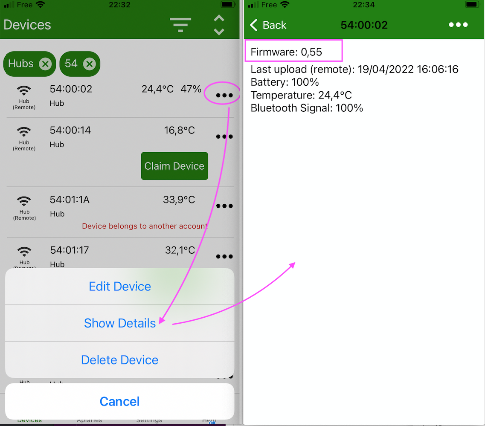

# Introduction to BroodMinder Hubs

All BroodMinder sensors transmit data via Bluetooth. There are several ways to collect the data :

1. Via your smartphone (see the Bees App section of the manual) or via a hub.

2. We use hubs to monitor and send data to the cloud automatically every hour so that you can see your current hive status anywhere there is internet available. You can picture a bicycle wheel where your BroodMinder devices are the spokes and the hub listens to all of them and sends their data to the cloud.
We also have special cases for swarming. It will send a text or email notification within 10 minutes of the event.

We offer serveral technologies for data transmission. Depending on your use case, there might be one that fits better than the others.

- BroodMinder-T91 Naked Cell Hub - Cellular hub must be recharged every 6-14 months
- BroodMinder-T91 Solar Cell Hub - Cellular hub, solar powered, never needs recharging
- BroodMinder-WIFI - WIFI hub for apiaries with good WIFI avaiable
- BroodMinder-LoRa - LoRa hub providing long range coverage solution for specific needs.

- BroodMinder-SubHub - This is a hub with no WIFI or Cellular. It can be used in remote locations to collect all sensor data into one device which makes downloading data to your cell phone very fast. It can also be used to connect remote (50-400 meters) hives to a shared BroodMinder-T91.

All of these hubs are monitored and set up using the BroodMinder Bees App. 

All of the hubs sample the BroodMinder devices every 10 minutes.

We are happy to help you configure your system. The variety of apiary locations and installations is vast and it can be confusing to get everything working correctly. We have made these tools to be flexible and work in most situations, everywhere from downtown New York City to the rural Yukon Territory or the Pyrenées mountains.

## BroodMinder Hub Firmware Update

From time to time we make updates to improve the operation of our sensors. BroodMinder devices use OTA (Over The Air) firmware updates and are very simple to perform. 

### Upgrading BroodMinder-T91 Cell hub

- Check current hub firmware installed with Bees App (see below)
- Trigger the upgrade (see below)
    - Cycle power
    - When the hub restarts it will go through a green then a blue light for 5 sec
    - During that blue light, press the central button to trigger the upgrade
    - Wait and watch for 2-3 minutes. 
    - The hub will reboot automatically
- Verify with Bees App that the firmware has upgraded

You're done. 

### Check the hub Firmware 

Open Bees App and find your hub in the `Devices` tab. Go to the `...` menu in front of it and hit `Show Details`.

Now you see the current firmware version of your hub.

### Trigger the upgrade

Cycle power and when the led becomes blue, push briefly the central button.
The upgrade is now triggered.
Wait for 2 minutes until it is installed and restarted

WATCH THE VIDEO

!!! note
    During the upgrade the hub pulls the new version over the air. **You need to be on a cell covered zone to upgrade your hub.**

### Verify

Once complete, you should see the updated firmware version in the Hub details page (as you made it before)

### Need help?

If you are still having difficulty contact us at [support@broodminder.com](mailto:support@broodminder.com)

