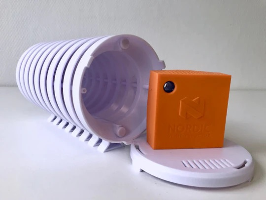
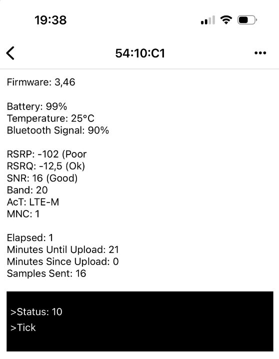
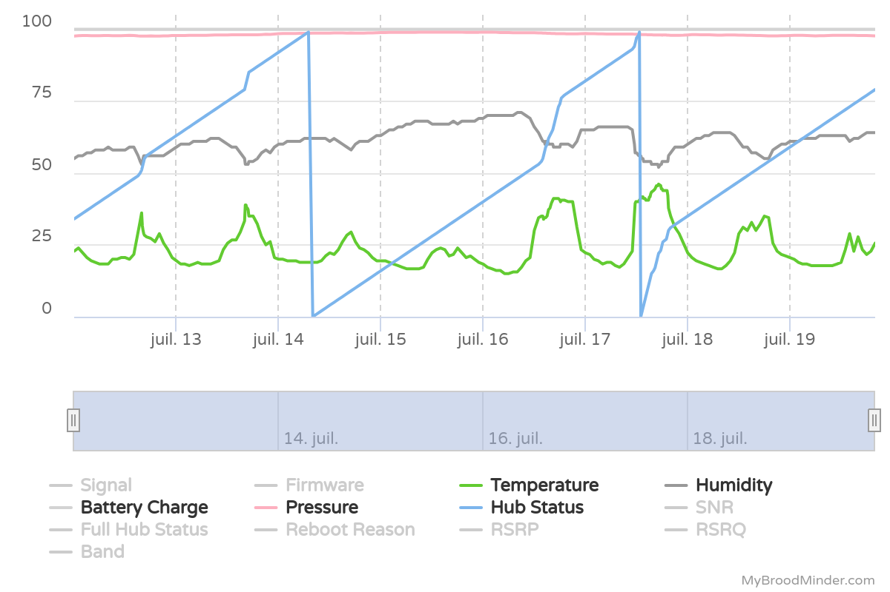
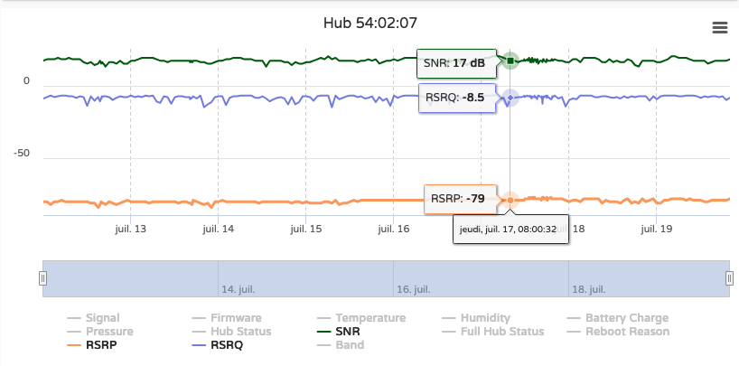
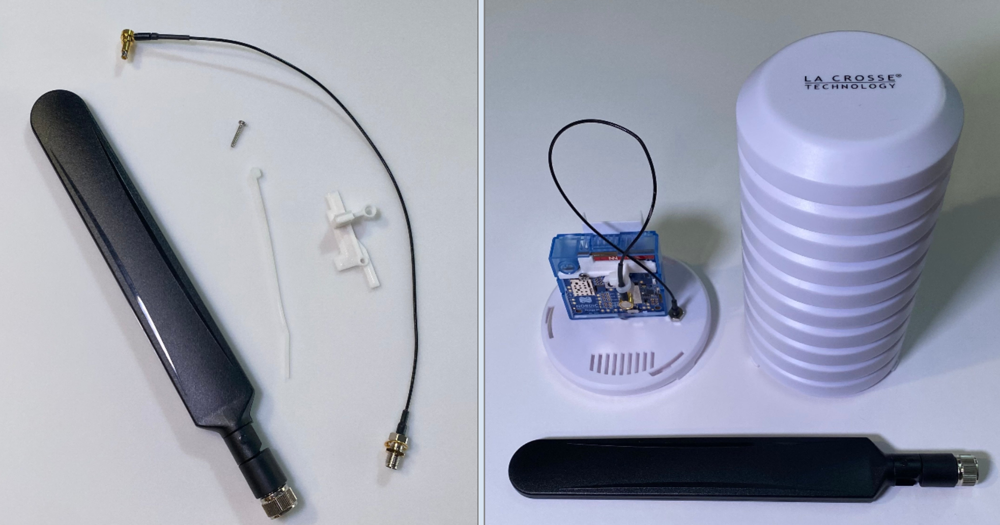
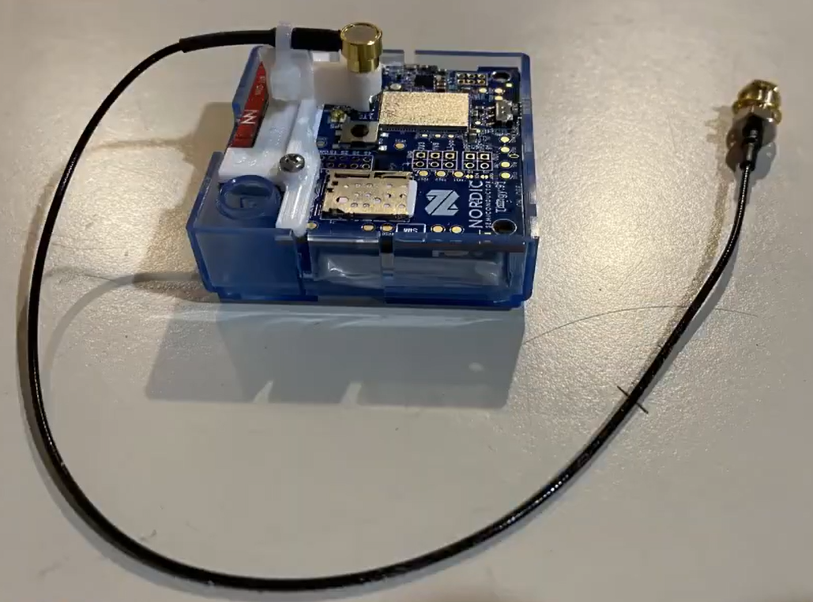

The BroodMinder-T91 (BRM-54) Cell Hub is based on the Nordic "Thingy 91".

!!! tip "Important: Real-Time Data Requires a Premium Membership"  
    Real-time data streaming through a hub is a Premium feature in MyBroodMinder. To enable it, you must have an active Premium subscription.

    Since the new membership model launched in January 2025, a single Premium membership allows you to use as many hubs as needed. Subscriptions are no longer linked to individual hubs—you only need one subscription per account, regardless of how many hubs you operate.
    
    **Note:** When you receive a hub, it is not yet linked to your account. You’ll need to claim it manually, just like any other BroodMinder device. 

Watch the video to get started:  

    

### Solar version

Lifelong powered version

### Weather version   

Use the Weather Shield to protect the T91.

---

## Steps to get your hub up and running

- We recommend you **test everything before taking it to your apiary**.

- Turn on the hub using the slide switch.

   

- In the Bees App, go to the `Devices` tab and, like every other sensor, claim your hub. This will assign it to your account.

   

- Enter the `... > Show details` menu.

   

- Here you can check some key elements of your hub such as the firmware version, network signal and quality metrics, and selected carrier.  
- At the bottom of the screen, there is a black console box displaying the current status of the hub (you must be close to the hub with your smartphone—this data is sent via Bluetooth). You can watch it boot and connect to the cloud. Most of the time, its normal status will be `tick` or `tock`, indicating smooth operation.

!!! tip
    If the hub fails to reach the network, a timeout will appear after a few attempts and the LED will begin blinking red.

- If you have a **solar T91**, ensure that the gasket is seated correctly when replacing the lid. Also, make sure the solar panel is facing the sun for most of the day.

- If you have a **naked T91**, it must be placed in a weatherproof housing. We recommend the **Lacrosse Solar Shield**, and placing the T91 in the provided **mesh bag** to prevent small insects (such as earwigs) from entering.

- Once you see it working properly, move it to your apiary. When in place, check the `tick/tock` status again to confirm proper operation and network quality at that location.

---

## Assigning the hub to an apiary

By default, hubs are automatically assigned to the apiary of the devices they are transmitting data for.  
For example, if a scale is assigned to Hive 1 in Apiary 1, and the hub is sending data for that scale, it will automatically assign itself to Apiary 1.  

⚠️ It will **not** reassign itself again if moved — manual reassignment is required in MyBroodMinder.

- Go to [MyBroodMinder.com](https://mybroodminder.com), choose `Configure`, and expand the `Hubs` section.
- Click on the `Edit` icon to assign or move the hub to an apiary.

---

## Check a hub remotely

Over time, we have implemented advanced features in our hubs that allow you (and us) to monitor and troubleshoot remotely.

Networks can be unpredictable. Between multiple carriers, antenna types, protocols, geographic environments, and variations in signal strength and quality, it may occasionally happen that a hub runs into issues (less often than you'd expect, but it happens).
When it does, having the ability to **monitor hub behavior remotely** is invaluable. In **MyBroodMinder**, you can access this by clicking on the hub name to view the **Hub Chart**.

By default, it displays key metrics such as:

- **Temperature**
- **Humidity**
- **Pressure**
- **Battery level**

These are generally self-explanatory.

### Hub Status

- **Hub Status** is a simple counter: every time the hub sends data to the cloud, it increments by 1 until it reaches 100, then resets to 0.
- If a **Swarminder event** occurs during the hour, the hub sends that too — so the counter may increment faster as you can notice in the chart above.
- A **drop to zero before reaching 100** means the hub has **restarted unexpectedly** (e.g. low power, crash, or signal failure).
- **Gaps in the graph** mean the hub was **unable to send data** for some time (no network, SIM issue, or system freeze).

Now let's look at the remaining metrics on this chart, all related with network aspects.

---

## Interpreting Cellular Network Metrics

Modern BroodMinder hubs report **3 key network quality metrics**:

### SNR – Signal to Noise Ratio

- Measures the **clarity** of the signal received.
- High SNR means **low background noise**, which is excellent.
- A **negative value** means the noise is stronger than the signal.

Ideal: the **higher the better**

### RSRQ – Reference Signal Received Quality

- Indicates the **overall quality** of the LTE connection, taking interference into account.
- Reflects both signal strength and cell congestion.
- Important when selecting between multiple nearby towers.

Ideal: the **less negative the better**

### RSRP – Reference Signal Received Power

- Measures the **strength** of the LTE signal itself.
- Helps assess whether the antenna is getting enough signal from the base station.
- Think of it as **“how loud the signal is.”**

Ideal: the **closer to 0 (in dBm), the better**

---

### Summary table of typical signal values

| Metric   | Excellent        | Good             | Acceptable        | Poor / Issue likely |
|----------|------------------|------------------|-------------------|---------------------|
| **SNR**  | > 20 dB          | 13 to 20 dB      | 5 to 13 dB        | < 5 dB or negative  |
| **RSRQ** | > –8 dB          | –10 to –8 dB     | –13 to –10 dB     | < –13 dB            |
| **RSRP** | > –80 dBm        | –90 to –80 dBm   | –100 to –90 dBm   | < –100 dBm          |

Note: Some hubs work even with poor metrics, but **lower values increase the risk of data loss or reboot cycles**.

If your hub is showing consistently bad metrics and experiencing restarts or gaps, consider:

- Moving the hub to a better-exposed location.
- Using the **external LTE antenna**.
- Switching carriers (requires special configuration).

Need help interpreting your hub’s behavior? → Contact us at **support@broodminder.com**

---

## Firmware Update

We may suggest updating your firmware depending on the situation. Please check with support@broodminder.com prior to doing this.

It is an easy process.

1) Turn the power off and back on the T91, the LED will light blue for 5 seconds
2) While the LED is blue press the silver and black push button in the middle of the unit.
3) The T91 will now begin the firmware update process. It will continue to flash blue for several minutes.
4) It will then flash green 10 times to indicate it has the firmware.
5) It will go dark for about minute while it writes the firmware and then restart.
6) All done

note: if the current firmware is too old, the unit must be returned to BroodMinder for reprogramming.

## Extended range

If you are experiencing poor cell network coverage, an external antenna may improve the situation.

We may have several solutions for your location — contact us at **support@broodminder.com**.

One example is this **External Antenna Kit**.  
The antenna plugs into the connector marked **“LTE”** on the Thingy91.

1. Place the connector through the plastic mounting bracket.  
2. Push the connector into the Thingy91’s LTE jack.  
3. Secure the bracket using the included screw.

