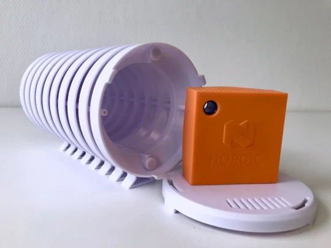
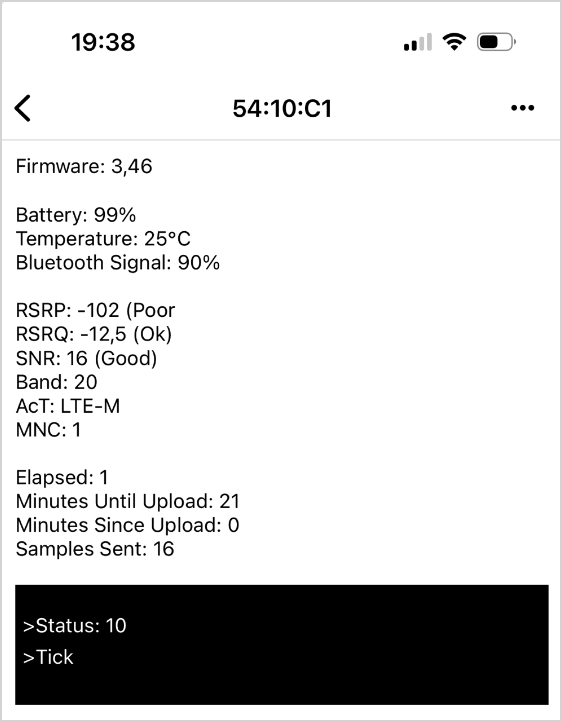
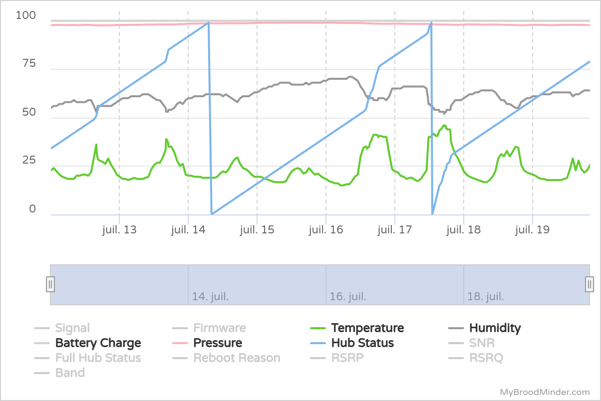
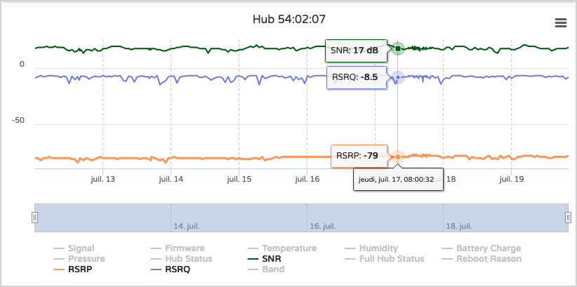
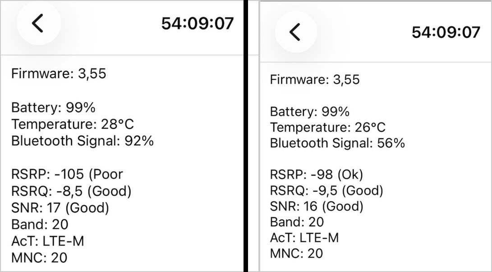
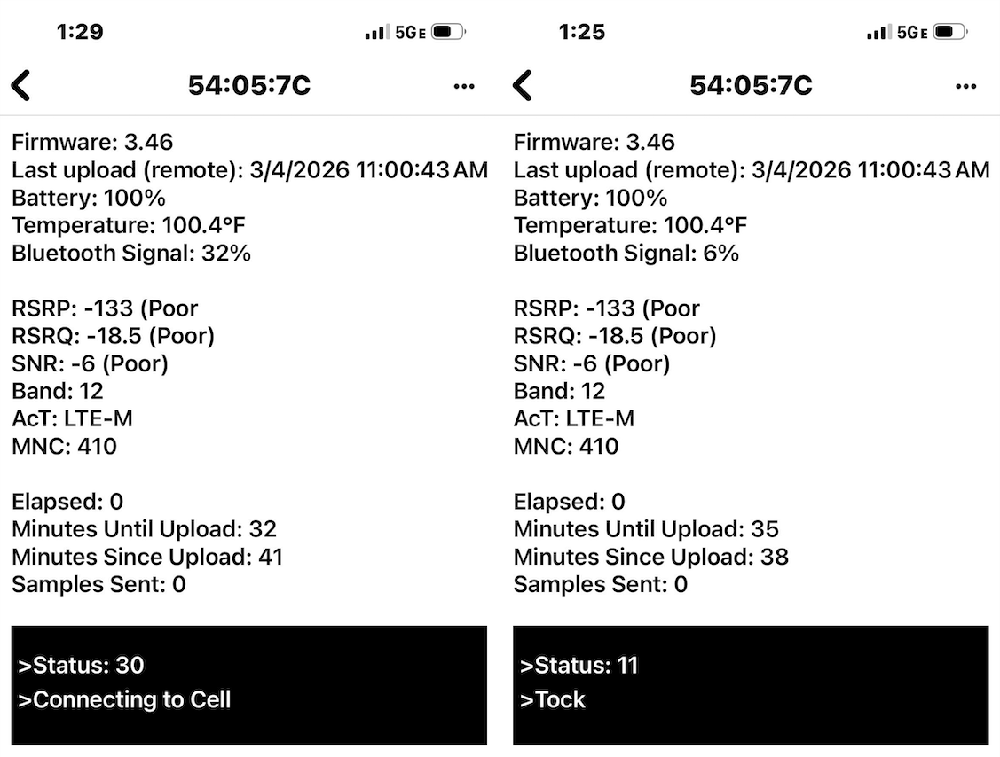
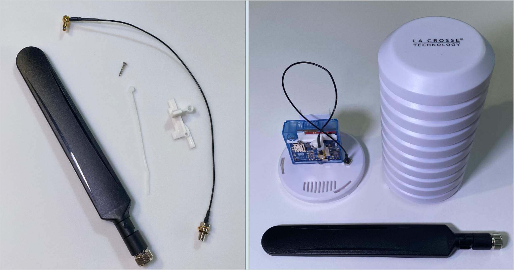
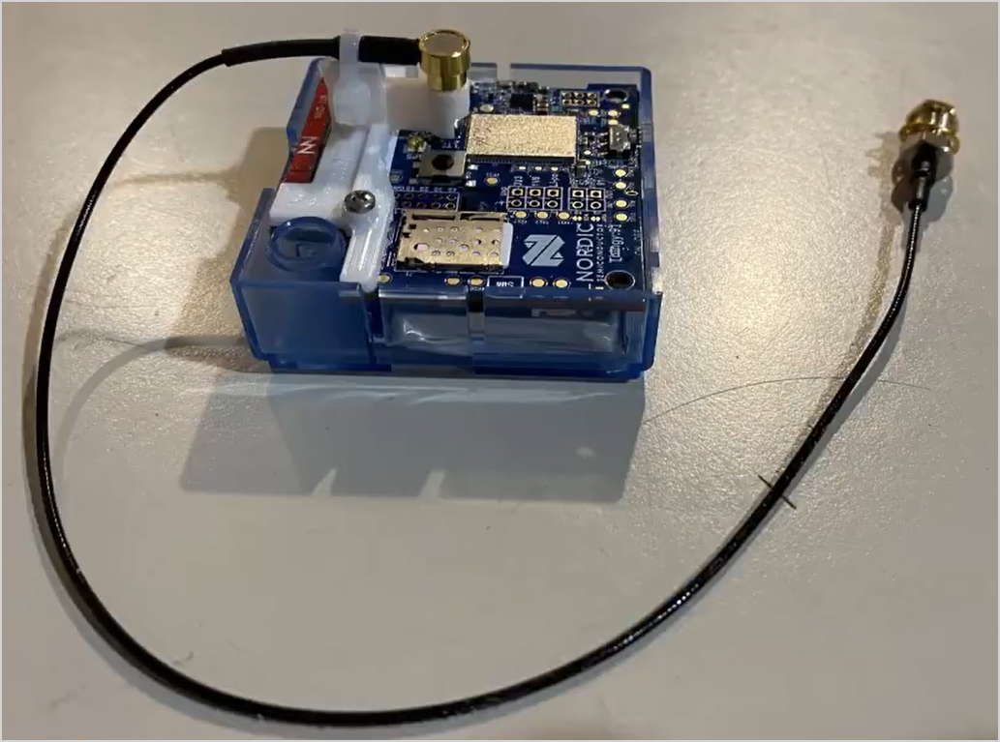

The BroodMinder-T91 (BRM-54) Cell Hub is based on the Nordic "Thingy 91".

!!! tip "Important: Real-Time Data Requires a Premium Membership"  
    Real-time data streaming through a hub is a Premium feature in MyBroodMinder. To enable it, you must have an active Premium subscription.

    Since the new membership model launched in January 2025, a single Premium membership allows you to use as many hubs as needed. Subscriptions are no longer linked to individual hubs—you only need one subscription per account, regardless of how many hubs you operate.
    
    **Note:** When you receive a hub, it is not yet linked to your account. You’ll need to claim it manually, just like any other BroodMinder device. 

Watch the video to get started:  

  

    
    
  

### Solar version

Lifelong powered version

### Weather version   

Use the Weather Shield to protect the T91.

---

## Steps to get your hub up and running

- We recommend you **test everything before taking it to your apiary**.

- Turn on the hub using the slide switch.

   

- In the Bees App, go to the `Devices` tab and, like every other sensor, claim your hub. This will assign it to your account.

   

- Enter the `... > Show details` menu.

   

- Here you can check some key elements of your hub such as the firmware version, network signal and quality metrics, and selected carrier.  
- At the bottom of the screen, there is a black console box displaying the current status of the hub (you must be close to the hub with your smartphone—this data is sent via Bluetooth). You can watch it boot and connect to the cloud. Most of the time, its normal status will be `tick` or `tock`, indicating smooth operation.

!!! tip
    If the hub fails to reach the network, a timeout will appear after a few attempts and the LED will begin blinking red.

- If you have a **solar T91**, ensure that the gasket is seated correctly when replacing the lid. Also, make sure the solar panel is facing the sun for most of the day.

- If you have a **naked T91**, it must be placed in a weatherproof housing. We recommend the **Lacrosse Solar Shield**, and placing the T91 in the provided **mesh bag** to prevent small insects (such as earwigs) from entering.

- Once you see it working properly, move it to your apiary. When in place, check the `tick/tock` status again to confirm proper operation and network quality at that location.

---

## Assigning the hub to an apiary

By default, hubs are automatically assigned to the apiary of the devices they are transmitting data for.  
For example, if a scale is assigned to Hive 1 in Apiary 1, and the hub is sending data for that scale, it will automatically assign itself to Apiary 1.  

⚠️ It will **not** reassign itself again if moved — manual reassignment is required in MyBroodMinder.

- Go to [MyBroodMinder.com](https://mybroodminder.com), choose `Configure`, and expand the `Hubs` section.
- Click on the `Edit` icon to assign or move the hub to an apiary.

---
## Firmware Upgrade

We may suggest updating your firmware depending on the situation. Please check with support@broodminder.com prior to doing this.

It is an easy process.

1. Turn the power off and back on the T91, the LED will light blue for 5 seconds
2. While the LED is blue press the silver and black push button in the middle of the unit.
3. The T91 will now begin the firmware update process. It will continue to flash blue for several minutes.
4. It will then flash green 10 times to indicate it has the firmware.
5. It will go dark for about minute while it writes the firmware and then restart.
6. All done

note: if the current firmware is too old, the unit must be returned to BroodMinder for reprogramming.

---

## Replacing SIM card
Simply push in to extract the old SIM and again push in to introduce the new one.

    

--- 

## Check a hub remotely

Over time, we have implemented advanced features in our hubs that allow you (and us) to monitor and troubleshoot remotely.

Networks can be unpredictable. Between multiple carriers, antenna types, protocols, geographic environments, and variations in signal strength and quality, it may occasionally happen that a hub runs into issues (less often than you'd expect, but it happens).
When it does, having the ability to **monitor hub behavior remotely** is invaluable. In **MyBroodMinder**, you can access this by clicking on the hub name to view the **Hub Chart**.

By default, it displays key metrics such as:

- **Temperature**
- **Humidity**
- **Pressure**
- **Battery level**

These are generally self-explanatory.

### Hub Status

- **Hub Status** is a simple counter: every time the hub sends data to the cloud, it increments by 1 until it reaches 100, then resets to 0.
- If a **Swarminder event** occurs during the hour, the hub sends that too — so the counter may increment faster as you can notice in the chart above.
- A **drop to zero before reaching 100** means the hub has **restarted unexpectedly** (e.g. low power, crash, or signal failure).
- **Gaps in the graph** mean the hub was **unable to send data** for some time (no network, SIM issue, or system freeze).

Now let's look at the remaining metrics on this chart, all related with network aspects.

---

## Interpreting Cellular Network Metrics

Modern BroodMinder hubs report **3 key network quality metrics**:

### SNR – Signal to Noise Ratio

- Measures the **clarity** of the signal received.
- High SNR means **low background noise**, which is excellent.
- A **negative value** means the noise is stronger than the signal.

Ideal: the **higher the better**

### RSRQ – Reference Signal Received Quality

- Indicates the **overall quality** of the LTE connection, taking interference into account.
- Reflects both signal strength and cell congestion.
- Important when selecting between multiple nearby towers.

Ideal: the **less negative the better**

### RSRP – Reference Signal Received Power

- Measures the **strength** of the LTE signal itself.
- Helps assess whether the antenna is getting enough signal from the base station.
- Think of it as **“how loud the signal is.”**

Ideal: the **closer to 0 (in dBm), the better**

---

### Summary table of typical signal values

| Metric   | Excellent        | Good             | Acceptable        | Poor / Issue likely |
|----------|------------------|------------------|-------------------|---------------------|
| **SNR**  | > 20 dB          | 13 to 20 dB      | 5 to 13 dB        | < 5 dB or negative  |
| **RSRQ** | > –8 dB          | –10 to –8 dB     | –13 to –10 dB     | < –13 dB            |
| **RSRP** | > –80 dBm        | –90 to –80 dBm   | –100 to –90 dBm   | < –100 dBm          |

Note: Some hubs work even with poor metrics, but **lower values increase the risk of data loss or reboot cycles**.

If your hub is showing consistently bad metrics and experiencing restarts or gaps, consider:

- Moving the hub to a better-exposed location.
- Using the **external LTE antenna**.
- Switching carriers (requires special configuration).

Need help interpreting your hub’s behavior? → Contact us at **support@broodminder.com**

---

## Optimizing Cellular Reception in Difficult Areas

Optimizing cellular coverage in challenging environments requires a simple, methodical approach. Even small improvements in signal can significantly enhance device performance.

### 1. Basic Setup (Fundamentals)

Before starting optimization, we assume you have the fundamentals in place:

- The hub is sitting on a **pod or support ~1.5 meters above ground**
- Avoid placing it directly on the ground or near dense obstacles (metal, concrete, trees, vegetation)
- Prefer **open or elevated positions** when possible

### 2. Diagnose Current Signal

Go to: **Hub → View Details**

Record the following parameters:

- **RSRP (Reference Signal Received Power)** → signal strength  
- **RSRQ (Reference Signal Received Quality)** → overall signal quality  
- **SNR / SINR (Signal-to-Noise Ratio)** → signal clarity  

👉 Take a **snapshot of current values** as your baseline.

### 3. What to Look For

- **RSRP** (most important): Aim to improve from ~**-113 dBm → closer to -100 dBm or above**
- **RSRQ / SNR**: Values closer to **0 (less negative or higher)** are better

### 4. Method: Test and Compare Positions

To find the optimal placement:

- Move the hub to a new position (even a few meters can help)
- Try different:
    - heights  
    - orientations  

- After each change:
    - **Power off and power on the hub**
    - Wait for reconnection
    - Check updated signal values

- Compare results with your initial snapshot

Repeat this process for several positions and identify the best one.

Select the position that provides:

- the **highest (least negative) RSRP**
- improved **RSRQ and SNR**
- stable connectivity over time

### 5. Example: Before and After

In this example:

- SNR was good  
- RSRQ was acceptable  
- but **signal power (RSRP) was very weak**  

Below **-100 dBm**, the risk of disconnection increases.

After repositioning the hub, we gained **+7 dBm** (**-105 → -98 dBm**), which is a **significant improvement**.

### 6. Why Small Improvements Matter

Signal strength is logarithmic:

- **A gain of +3 dB ≈ 2× signal power**

Example:
- **-113 dBm → -110 dBm = ~double the received signal**

👉 Even small gains are **highly valuable**

- Excellent: > -90 dBm  
- Good: -90 to -100 dBm  
- Poor: < -100 dBm  

!!! tip
    In difficult zones, optimization is often iterative.  
    Take your time and test multiple positions — small adjustments can lead to major improvements and will benefit your setup over the long term.

---

## Extended Range With an External Antenna

If you are experiencing extremely poor cellular network coverage, using an external antenna may significantly improve the situation.

The first step is to **assess your current conditions**. The issue may come from low signal strength, poor signal quality, low signal-to-noise ratio, or unstable connections where the hub keeps switching between cells.

If you are unsure, feel free to contact us at **support@broodminder.com** and we will help you with the diagnosis.

Below we describe typical situations and possible solutions.

---

### Diagnose first

To perform a basic diagnostic, place your hub on a pole at approximately **1.5 m height** and check connectivity.

Using your phone, go to:
**Devices > … > Show Details**

and observe the main network parameters.

Below is an example:

On the left side, you can see that the hub is attempting to connect to the cellular network (either during boot or after a disconnection).  
In the black box, the hub activity is shown in real time. In normal operation, it should alternate between *tick/tock* every few seconds, indicating that the system is running correctly (right side image).

In this example, however, we observe:

- **RSRP = -133 dBm** → extremely low signal (barely usable)  
- **RSRQ = -18.5 dB** → very poor signal quality  
- **SNR = -6 dB** → very noisy environment  

(Refer to the section *Interpreting cellular network metrics* for definitions.)

From this, we can conclude that:

- the site suffers from **very weak signal conditions**
- transmission reliability is not ensured

To restore proper operation, the target is typically around **-100 dBm**, meaning a required improvement of **~30 dB**, which is a significant challenge.

---

### Understanding LTE antennas

Depending on the gain required, several antenna types can be used. As gain increases, antennas become more directional and require more precise installation.

A **dipole antenna** is the most basic type, typically integrated into IoT devices. It radiates in all directions, making it very easy to use, but with limited performance and range.

A **panel antenna** introduces directionality while remaining easy to install. It focuses energy in a broad forward direction, providing a good compromise between simplicity and performance.

A **log-periodic** antenna is designed for wide frequency coverage and stronger directionality. It allows signals to be captured from further distances and performs well in rural or weak-signal environments.

A **Yagi antenna** pushes directionality even further. It focuses energy into a very narrow beam, providing maximum gain and range, but requires careful alignment.

#### Summary

| Type          | Direction         | Power        | Ease of Use      |
|---------------|------------------|--------------|------------------|
| Dipole        | All directions   | Low          | Very easy        |
| Panel         | Forward          | Medium       | Easy             |
| Log-periodic  | Directional      | High         | Moderate         |
| Yagi          | Very focused     | Very high    | More complex     |

---

### Actual solutions

In practice, we have had good results with the following products:

| Feature | Pulse Larsen W5150 | Sirio SMP-4G-LTE-5 | Wilson / weBoost LPDA | Sirio SLP-4G-LTE |
|--------|--------------------|---------------------|------------------------|------------------|
| **Type** | Blade dipole (omni) | Directional panel | Log-periodic | Log-periodic / Yagi |
| **Frequency range** | 617–960 / 1430–6000 MHz | 790–960 / 1710–2700 MHz | 698–2700 MHz | ~700–2700 MHz |
| **Gain (low band)** | ~1–2 dBi | 6–7 dBi @ 800 MHz | ~8.5 dBi avg | ~10–11 dBi |
| **Gain (high band)** | up to ~5.5 dBi | ~9 dBi | ~9.5 dBi peak | ~11–12 dBi |
| **Directionality** | Omni | Medium (~60–80°) | Medium-high | High (narrow beam) |
| **Front-to-back ratio** | N/A | ≥12 dB | ≥10 dB | High (~15–20 dB typical) |
| **Size** | Very compact | Compact | Medium | Large (long boom) |
| **Ease of installation** | ⭐⭐⭐⭐⭐ | ⭐⭐⭐⭐ | ⭐⭐⭐ | ⭐⭐ |
| **Performance @ low signal** | ❌ Poor | ⚠️ Limited | ✅ Good | ✅ Excellent |
| **Best use case** | Indoor / light issues | Urban / semi-rural | US rural / Band 12 | Rural / very weak signal |

---

### Typical use cases per antenna type

**Pulse Larsen W5150 (Dipole / Omni)**  
This is the default, entry-level antenna typically used directly on devices or indoors. It is suitable when signal is already acceptable and no installation effort is desired.  
> Typical RSRP range: **>-105 dBm**

---

**Sirio SMP-4G-LTE-5 (Panel)**  
This antenna is a good upgrade when signal is moderate but unstable. It is commonly used on buildings or poles and does not require precise alignment.  
> Typical RSRP range: **-105 to -120 dBm**

---

**Wilson / weBoost LPDA (Log-periodic)**  
This antenna is used in rural or suburban areas where signal must be captured from a distance. It offers a strong improvement while remaining relatively easy to install.  
> Typical RSRP range: **-115 to -125 dBm**

---

**Sirio SLP-4G-LTE (Yagi / High-gain directional)**  
This is the solution for very weak signal environments. It is designed to recover connectivity where other antennas fail.  
> Typical RSRP range: **<-120 dBm (down to ~-130 dBm)**

---

### Connecting to BroodMinder-T91

The Thingy:91 uses a **measurement probe connector (u.FL / Murata)** rather than a standard SMA connector.

You will need an adapter to connect an external antenna:  
https://www.digikey.fr/fr/products/detail/murata-electronics/MXHS83QE3000/1775923

Note that antennas may come with:

- no cable (Pulse)
- short cable (Wilson)
- long cable (Sirio)

Make sure you have the appropriate cable length or add an extension if needed.

---

### Getting the hardware

For advanced setups, we do not stock all antenna options and recommend sourcing them directly, as we do not add value in reselling them.

We do offer an entry-level **External Antenna Kit** in our store. The antenna connects to the port labeled **“LTE”** on the Thingy91. A highly recommended 3D-printed support that will ease your life with the connector is also available [here](../assets/60_hubs.assets/antennas/T91AntennaSupport.stl)

#### Installation

1. Insert the connector through the mounting bracket  
2. Push it into the LTE connector  
3. Secure with the screw  

