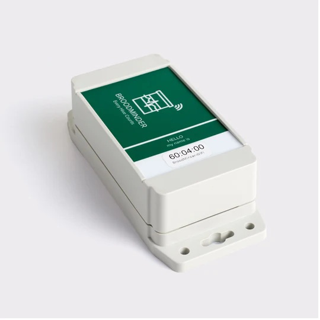
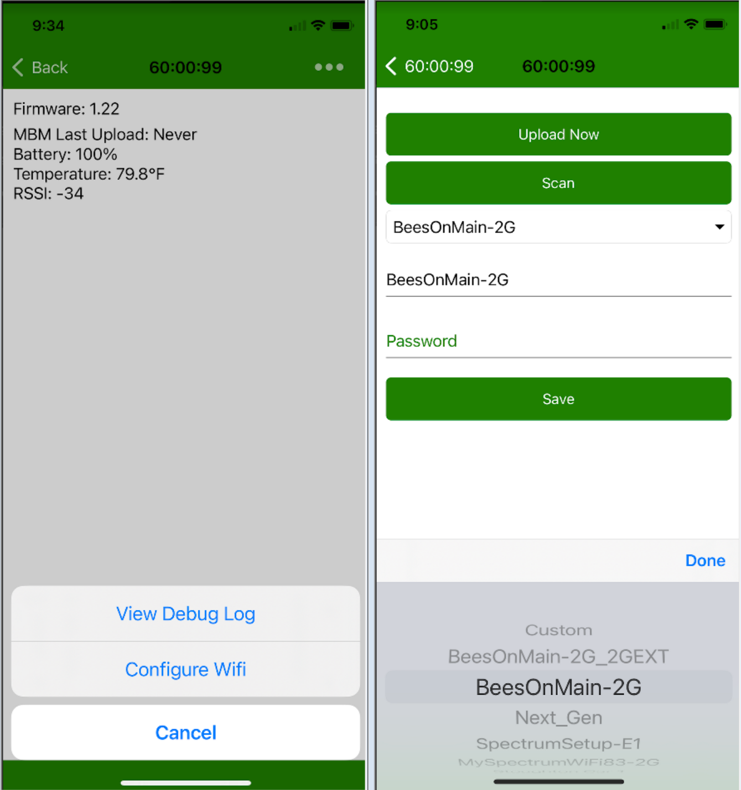
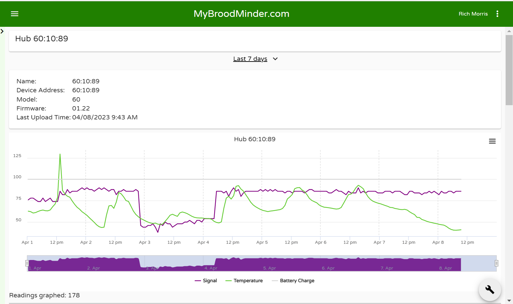

## BroodMinder-WIFI Hub (BRM-60)

If you have good WIFI in your apiary, BroodMinder-WiFi should work for you.
We recommend setting this up where there is strong WIFI and a nice work area prior to placing in your apiary.

You will find an installation video [here](https://youtu.be/10jw51jqmT0)

!!! Warning

    Broodminder-WiFi is only compatible with 2.4GHz networks. 
    It will not find, nor connect to 5GHz or mixed 2.4+5GHz networks

Installation

- We recommend you test everything before you take it to your apiary.

- You will get an email from BroodMinder when we ship the hub. If you don't then check your junk email folder, or contact us. The email has instructions on connecting the hub to your account. There are two cases.

  1. If there is a link in the email, then click it and you will be guided to connect the hub to your account and claim the one year token which is included with purchase.

  2. If there is not a link, then we assigned it to your account before shipping. 

- Remove the cover and pull out the "Remove before use" tabs. The LED should flash for a few seconds.

- Now start up the Bees App on your phone or tablet and choose the `Devices` page. You should see the BroodMinder-WIFI show up on the list. 

  pic

- Press the `Claim Device` button and follow the prompts to add it to your inventory.

  

- Click the `...` to the right of the WIFI hub and choose `Show Details`

- Choose the `...` at the top right corner and select `Configure Wifi`

  - Now you can `Scan` and search for WIFI networks that the hub can see.

  - After scanning, select your preferred hub

  - Enter the password

  - Save - the hub will now connect to your WIFI network

  - Once connected, you can press the `Upload Now` button to send data immediately.

  - You can also send data by pressing the button near the LED on the BroodMinder-WIFI circuit board.

    

- Go to MyBroodMinder.com to see the results (results shown beloware from a hub running for > 1 week)

  

  