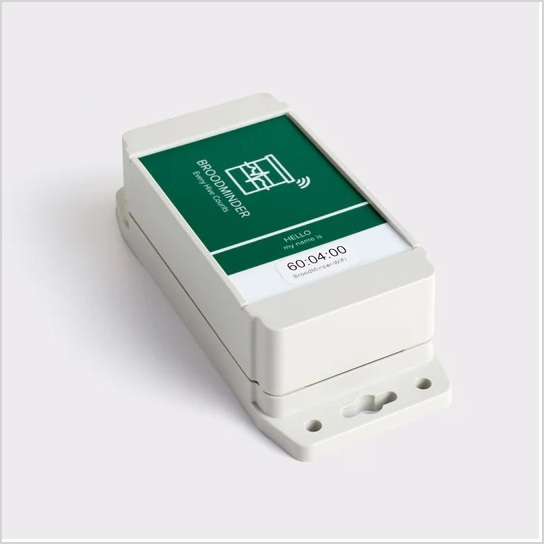
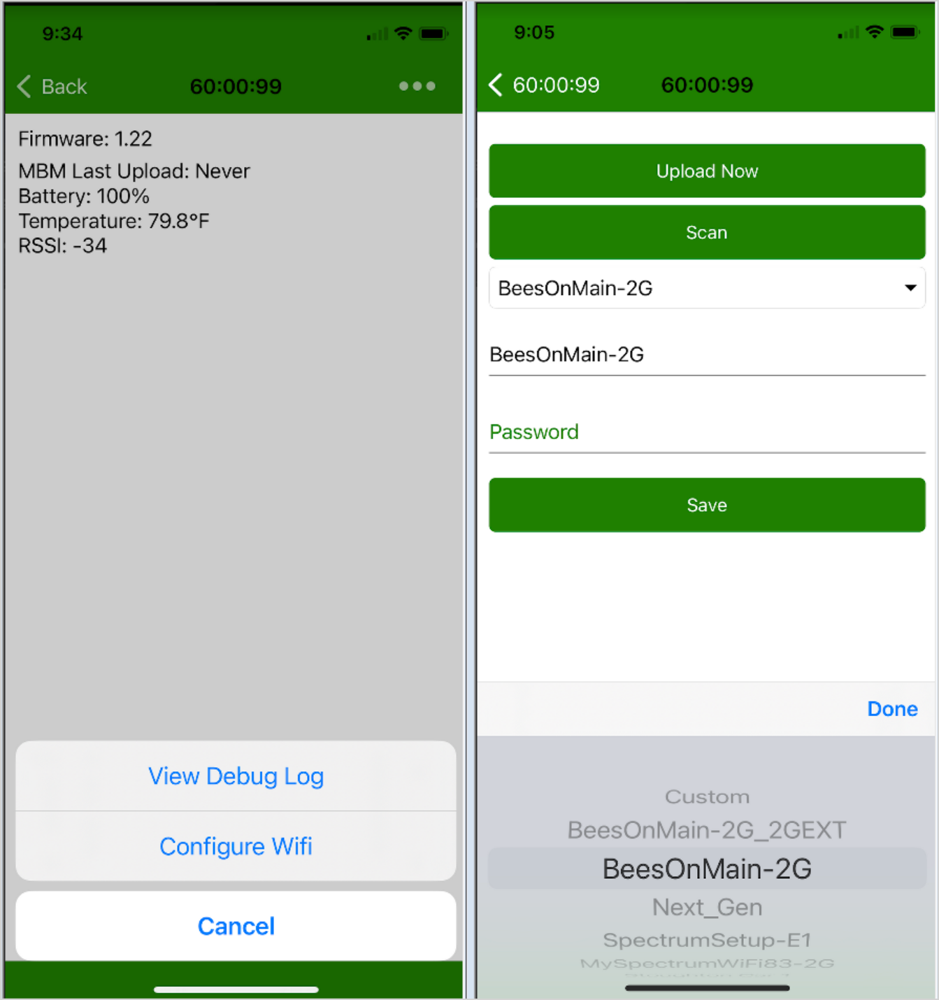
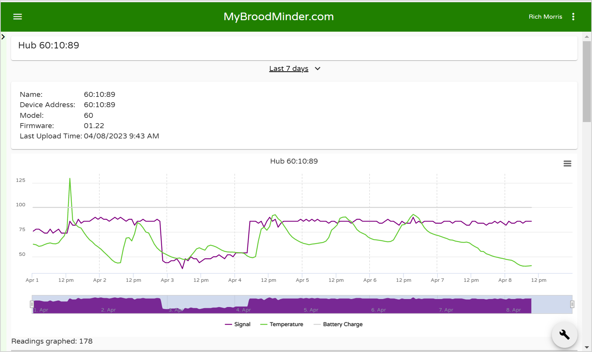

If you have good WIFI in your apiary, BroodMinder-WiFi should work for you.
We recommend setting this up where there is strong WIFI and a nice work area prior to placing in your apiary.

Watch the video to get started:  

  

    
    
  

!!! Warning

    Broodminder-WiFi is only compatible with 2.4GHz networks. 
    It will not find, nor connect to 5GHz or mixed 2.4+5GHz networks

!!! tip "Important: Real-Time Data Requires a Premium Membership"  
    Real-time data streaming through a hub is a Premium feature in MyBroodMinder. To enable it, you must have an active Premium subscription.

    Since the new membership model launched in January 2025, a single Premium membership allows you to use as many hubs as needed. Subscriptions are no longer linked to individual hubs—you only need one subscription per account, regardless of how many hubs you operate.

    **Note:** When you receive a hub, it is not yet linked to your account. You’ll need to claim it manually, just like any other BroodMinder device. 

## Installation

- We recommend you test everything before you take it to your apiary.

- Remove the cover and pull out the `Remove before use` tabs. The LED should flash for a few seconds.

- Now start up the Bees App on your phone or tablet and choose the `Devices` page. You should see the BroodMinder-WIFI show up on the list. 

- Press the `Claim Device` button and follow the prompts to add it to your inventory.

  

- Click the `...` to the right of the WIFI hub and choose `Show Details`

- Choose the `...` at the top right corner and select `Configure Wifi`

  - Now you can `Scan` and search for WIFI networks that the hub can see.

  - After scanning, select your preferred hub

  - Enter the password

  - Save - the hub will now connect to your WIFI network

  - Once connected, you can press the `Upload Now` button to send data immediately.

  - You can also send data by pressing the button near the LED on the BroodMinder-WIFI circuit board.

    
- Go to MyBroodMinder.com to see the results (results shown beloware from a hub running for > 1 week)

  

  