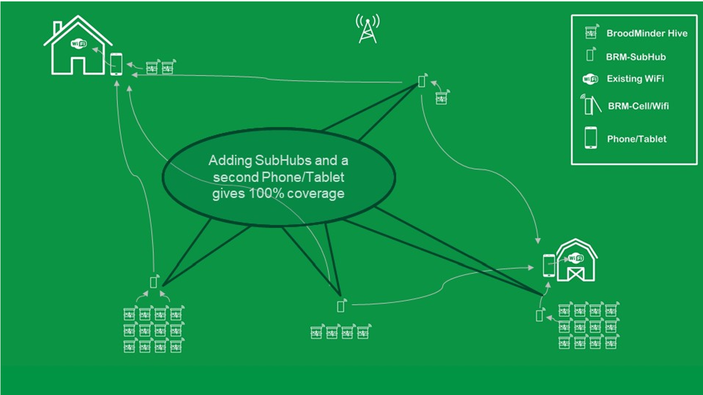

# BroodMinder-SubHub (BRM-52)

## **Installation**

The video , [BroodMinder-ASP (Apiary Starter Pack) Installation](https://youtu.be/B14U5S49EEE ) shows how this works together.

Installation is simple. Open the box and pull out the battery tabs and the -SubHub is running. You will see it show up in the phone app with an ID beginning with 52:. Once running, it will listen for other BroodMinder devices and add their data to it’s internal log. The cool part is that the -SubHub will now advertise (send out) that data to be received by a BroodMinder-CELL, or a BroodMinder app.

!!! warning 
    Due to power constraints, the BroodMinder-WiFi does not operate with the BroodMinder-SubHub.

If you are watching with a BroodMinder app, you will see your devices show up on the list. Each device is advertised for 5 seconds, rolling through all the known devices one after the other. You will see them marked in the device list as coming via the -SubHub.

The BroodMinder-Bees app is the best tool to interact with your -SubHub. You can use it to setup and also to retrieve stored data.

You *can* also take an old cell phone, connect it to your local WiFi (or with a cell subscription) and run the BroodMinder Apiary app in Hub Mode. It will push the sensor data to MyBroodMinder.com every 10 minutes. Since the phone can be plugged into the wall for power it becomes very simple.  Note that to do this you must have a BroodMinder-Premium account.

We have seen better performance with iOS (Apple) phones or tablets. Some of the older Android devices work find, but some have problems with Bluetooth locking up.

If your apiary spans a long distance, you can employ multiple -SubHubs, one for each group of hives. They do not daisy chain, but they work directly to the central -CELL or app.

## Brief Explanation

It is a Bluetooth range extender and a high speed data vault in a box about the size of a TV remote.

The BroodMinder-SubHub will listen for all your BroodMinder devices and retransmit them using its long range transmitter. This means you can ‘hear’ your BroodMinder devices over 1000 feet (330 meters) away.

Secondly, the -SubHub stores all of this data, and you can read the data using our new turbo-transfer protocol (releasing spring 2021). You can read a month's worth of data from 50 devices in 2 minutes.

And finally, it also records the temperature of itself, allowing you to see your apiaries micro-climate, or even place it inside a swarm box to see when bees move in.

The subhub is shipped in a non-waterproof case. If you want to mount it outside, we recommend installing inside a solar shield. The La Crosse Technology 925-1418 Sensor Protection Shield with Mount ($18) is a very good choice and the subhub fits perfectly in it. It also fits in the Acurite version (06054M $17). A third possibility is a Hammond 1554C2 ($11.57) waterproof box available at Digikey.com. You can also just put it in a zip lock bag as the least expensive solution. The -SubHub enclosure is 1.05” x 1.85” x 5.00” (47 x 26 x127 mm).

Why does the BroodMinder-SubHub exist?

It’s all about maximizing the value of hive monitoring. From the data our citizen scientists have been collecting over the last six years, we have learned that internal temperature tells us the most. We have learned to detect brood rearing, swarms, hive strength, and mating flights. And this is only the start. 

Fortunately, temperature is cheap and easy to measure. However, that data only does good if you can get it to the beekeeper. The -SubHub makes that easier. Here are a couple of scenarios. 

### **Scenario 1**

Setting: Your BroodMinder enabled hives are 500 feet from a building with power and you have an old cell phone.

Configuration: Put the -SubHub in the middle of your hives and the cell phone in the building. Run the apiary app in hub mode.

Outcome: Your hive data will be sent up every 10 minutes. In the event of a swarm, you will receive an email or text message as soon as it is detected.

### **Scenario 2**

Setting: This apiary is remote and there is no power nearby. You are already set up with a BroodMinder-Hub, however some of your hives or swarm traps are 700 feet away.

Configuration: Put the -SubHub near the hives. Since the -SubHub also measures temperature, you can place it inside the swarm trap to detect when bees move in. You can have multiple -SubHubs feeding the BroodMinder-CELL/WIFI hub if you wish.

Outcome: More of your apiary can be monitored with minimal cost. Temperature increase in swarm traps will show on MyBroodMinder.com when bees move in. 

## **Scenario 3**

Setting: This apiary is remote and there is no power and no cell tower nearby..

Configuration: Put the -SubHub near the hives. It will record data from all the nearby BroodMinders.

Outcome: When you visit your apiary, you can read all of the the data from all of the hives, typically in less than a minute. You will be able to view this data with the new BroodMinder-Bees app in a manner similar to MyBroodMinder. Then you can send the data to MyBroodMinder when you arrive back in civilization.

How did you do all of this magic?

It wasn’t easy. Our team has been working on the BroodMinder-SubHub and MyBroodMinder ecosystem for over a year. That time was split between solving the technical challenges and making the system flexible and easy to use. We feel it is a game changer and that you will love it.

For the folks that love all of the technical details, here they are.

The -SubHub is using the same circuitry that our BroodMinder-W2 uses. It uses a Silicon Labs, long range Bluetooth Low Energy (BLE) module. We have measured the advertising range of the module with an iPhone 11 at greater than 1000 feet. We got usable data at 1700 feet.

By using 4 AA batteries, we have much more power to play with. This enables us to listen for BroodMinder devices for 20 seconds every ten minutes with anticipated battery life greater than a year.

There is a one megabyte memory added to store the log data. This allows us to store 35,000 records or roughly data from 100 devices for two weeks (or less devices for longer, you can do the math). The -SubHub has the capacity to keep track of 128 BroodMinder devices at one time.

The data will be read using BLE SPP (Serial Port Profile). We have timed transferring the entire 35,000 record log to take about 120 seconds using iOS and less than that for new Android devices (longer for phones 4 or 5 years old). The new BroodMinder-Bees app supports this high speed transfer.

The final piece is in Advertising the data from the -SubHub. As mentioned above, the -SubHub listens for new data for 20 seconds every 10 minutes. It then modifies it’s BLE advertisement packet to ‘mock’ all of the BroodMinder devices it heard. The -SubHub advertises a different device every 5 seconds thus allowing data from 12 BroodMinders to be sent every minute which means over 100 devices in 10 minutes. 

We have established these parameters in order that the batteries last at least a year. While they will be adjustable for special circumstances, we feel that the standard setup will cover 99% of the cases.

That is basically how it works. Of course there are many, many details in making the pieces fit together seamlessly and to be supported by the equipment in the field. And, as always, during deployment we will be watching closely.

If you have a CELL or WIFI device, the subhub will amplify the data sent from the devices and extend the normal 10-15 foot range up to 300-500 feet (depending on obstacles in the way). Multiple subhubs can be located in the apiary to ensure complete coverage.

## **Range Testing**

If you are going a long distance, we have a few hints for you.

1) The -SubHub’s radio waves are directional. The batteries block the antenna. This means that the -SubHub circuit board should be on the side of the -Hub or phone receiving the data.
2) You can use the BroodMinder-Bees app to do your testing. Please watch the video  [BroodMinder-ASP (Apiary Starter Pack) Installation](https://youtu.be/B14U5S49EEE ) for the best information on this.
3) A super way to test the range is using an app and your phone. Nordic Semiconductor has an app called “nRF Connect” for both iOS and Android. It is the best Bluetooth app out there. Here are a couple of usage notes.

a.   Go to *Settings* | *Scanner* | *Scanner Timeout* >> set to *Never*

b.   Start scanning in the “*Scanner*” tab at the bottom of the app

c.   BroodMinder sensors will be named by their ID (e.g. 57:01:01)

d.   Press the up arrow beside “*No Filter*” and put a “:” in the *Name* field and flip the switch beside it. This will only show devices with a “:” (such as BroodMinder devices.). You can also limit it to a specific device this way.

e.   Now select the RSSI Graph and you will see each time the phone gets an update from the BroodMinder.

f.   There are many other great options in the program to explore if you like this sort of thing.

As a general note, detecting advertisements does not mean that you can connect to a device. Connections require stronger signals. This means that if you want to download the log, or update firmware, you may need at least a 40-50% signal level.

Good luck, we are very excited about the BroodMinder-SubHub and hope it will be of use to you.
