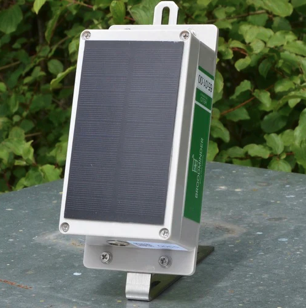

# BroodMinder-LoRa (BRM-65)

## Short Intro
LoRa (Long Range) and LoRaWAN (Long Range Wide Area Network) are technologies designed for low-power, long-range wireless communication.

- LoRa is a physical layer (or radio modulation) that enables long-range, low-power communication between devices. It uses a spread-spectrum technique to achieve high sensitivity and range, allowing devices to communicate over several kilometers with minimal energy consumption.

- LoRaWAN is a network protocol built on top of LoRa. It defines the communication protocol and system architecture for a network of LoRa devices. LoRaWAN manages how data is transmitted over the network, including encryption, data rates, and network management. It facilitates communication between end-devices (sensors, actuators) and network gateways, which then connect to a central server or cloud application.

In summary, LoRa provides the physical layer for long-range communication, while LoRaWAN provides the network protocol and management to support scalable, low-power, wide-area networks.

## LoRa Hub

The LoRa hub is working very similar to all other Cell or wifi hubs. It is tracking all the devices and sends any new data to the cloud every 10 minutes. The major diference is that instead of using a cellular network, it will use the radio frequency 915Mhz (US) and 868MHz (EU) dedicated to LoRa.

!!! tip
    Note that having different frequencies in each continent, the hubs are specifically designed for those regions

## LoRa Gateway (BRM-66)

At the other end of the emitter there should be a receiver. Depending on your location it could roam through different networks. Although you can also install a gateway that will be hooked to the internet.

This means that custom networks can be build using the pair Hub/Gateway to address specific configurations in zones with poor cellular coverage for example. 

The distance between the gateway and the Hub can range from hundreds of meters to actually kilometers. In an area with little geographical relief the range can go up to 10-15km (20-30Mi).

!!! tip
    **If you are considering this technology for your apiary, please contact us and we will advice the solution that could best fit your needs.**