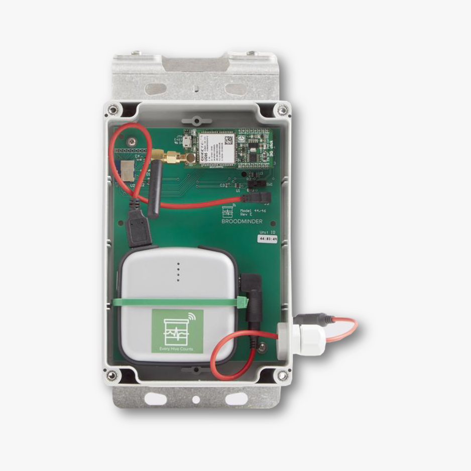

# BroodMinder-Cell 3G (BRM-44 & BRM-50)

The 3G Cell hubs have been under operation since 2018. In some countries like USA they have been disconnected but they are still delivering a good service in many other places. 
What is described below is a troubleshooting guide for Cell Hub models 44 and 50. 


These hubs are not configurable with the Broodminder Bees app. **You must install the Broodminder Cell App** [Android](https://play.google.com/store/apps/details?id=com.broodminder.cell&hl=en_US&gl=US), [iOS](https://play.google.com/store/apps/details?id=com.broodminder.cell&hl=en_US&gl=US) to manage the settings.



## Install the SIM Card
Here are the steps to install the SIM card:

1. Unplug the 3G clicBoard.
2. Open the case: slide it upward through the antenna with your thumb, then pull it up to remove it.
3. Insert the SIM card in the correct position.

4. Pull down and slide down to lock.


## Typical Startup
Turn on the hub. Upon startup, you should see:

- LED D1 (orange) blinking several times.
- LED PWR1 (green) illuminated.
- LED STAT (yellow) illuminated.
- Then, after a while, when the network connection is established, everything turns off.

Note that every time you go to the Cell app in `Configure > Diagnostics > Cell network`, you should see the green LED PWR1 illuminated.


## Connecting to the Cell Network
It may happen that your hub finds a 3G network but is unable to acquire the service.


To identify the issue, first check your APN code.

### Verify You Have the Correct APN
Each SIM provider has its own Access Point Name (APN), which could be *hologram*, *matooma.m2m*, etc. Go to `Configure > Diagnostics > Cell network > Custom APN`.


### Check Modem Communication and Trace
Right after turning on the hub, quickly go to `Configure > Diagnostics > Modem communication`. Here you can monitor the connection process. Let it run until it stops, then copy the result and send it to support.

Here's a typical startup trace:
```
AT
+UMWI: 0,1
+UMWI: 0,2
+UMWI: 0,3
+UMWI: 0,4
AT
OK
AT+UGPIOC=23,0,1
AT+UGPIOC=23,0,1
OK
AT&F0
AT&F0
OK
ATE0
ATE0
OK
AT&K3
OK
AT+CSQ
+CSQ: 14,1
AT+UPSD=0,1,"hologram0,1,""
OK
AT+UPSDA=0,3
OK
AT+ctzu=1
OK
AT+UPSND=0,0
+UPSND: 0,0,"10.59.51.129"
OK
OK
beekeeping_BaseURL?250043A5001045050043A0104000001000140000000000999999999999999.","r.txt"
OK
+UUHTTPCR: 0,1,1
AT+URDFILE="r.txt"
+URDBLOCK: "r.txt",50,"HTTP/1.0 200 OK
Content-Type: application/vnd.api"
OK
no more
AT+URDFILE="r.txt"
+URDBLOCK: "r.txt",50,".cellresponsewrappermedia+json
X-Appengine-Log-Fl"
OK
no more
AT+URDFILE="r.txt"
+URDBLOCK: "r.txt",50,"ush-Count: 0
X-Cloud-Trace-Context: b54c6eae28321"
OK
no more
AT+URDFILE="r.txt"
+URDBLOCK: "r.txt",50,"ff97d2787042a9e8a98
Date: Sun, 20 Sep 2020 15:48:"
OK
no more
AT+URDFILE="r.txt"
+URDBLOCK: "r.txt",50,"01 GMT
Server: Google Frontend
Content-Length: 4"
OK
no more
AT+URDFILE="r.txt"
+URDBLOCK: "r.txt",47,"2
{"code":"200","t":"[1600616881s2881h15]"}
"
OK
```

### Typical Trace with Wrong APN
On the left is the wrong APN, on the right is OK.
