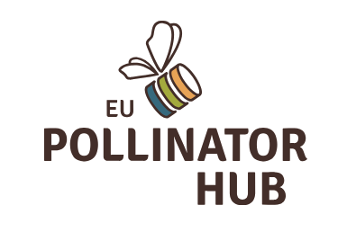

# EU Pollinator Hub

{ style="display: block; margin: 0 auto" }

!!! abstract "Summary"
    The EU Pollinator Hub is a European open platform designed to centralize and use data on pollinators to support research and public policy.  
    BroodMinder enables any beekeeper to voluntarily contribute to this initiative by sharing anonymized data from their colonies.

The **EU Pollinator Hub** is a European platform dedicated to collecting, standardizing, and visualizing data on pollinators — including managed and wild bees, colony health, pollination, and agricultural or environmental conditions.

Developed for the **EFSA (European Food Safety Authority)** and coordinated by **BeeLife**, the Hub aims to gather harmonized data following the FAIR principles (Findable, Accessible, Interoperable, Reusable).  
It is **open and open-source**, and is intended for researchers, beekeepers, farmers, NGOs, and public authorities who want to contribute to consistent and high-quality pollinator monitoring.

## What is the Pollinator Hub for?

- Providing a **consolidated overview** through maps, dashboards, and indicators to detect trends, risks, and environmental signals  
- Supporting European monitoring programs such as the **EU Pollinator Monitoring Scheme (EU-PoMS)**  
- Helping implement the **European Pollinators Initiative** (New Deal for Pollinators)

## Where to access it?

- Information website: **pollinatorhub.eu**  
- Web application: **app.pollinatorhub.eu** (dashboards, training modules, data tools)

---

# How BroodMinder integrates with the EU Pollinator Hub

As a BroodMinder user, you may choose to **share your apiary data** with the EU Pollinator Hub.  
This allows beekeepers to directly contribute to European efforts to understand and protect pollinators.

BeeLife, as the coordinator of the Hub, receives these data and integrates them into the European monitoring infrastructure.

## Data transmitted

- Sharing is activated **per apiary**  
- All **raw measurements** from devices in that apiary are shared  
- An **approximate location** is included (postal code level)

## FAQ

!!! question "When is my data sent?"
    Once activated, data is sent **daily** to the Pollinator Hub.

!!! question "If I activate sharing now, will past data be sent?"
    No. Only data collected after activation is transmitted (except for manually synced devices).

!!! question "What if I remove a device from the apiary?"
    Its data will no longer be shared.

!!! question "What if I add a new device to the apiary?"
    It will start sharing data from its first synchronization onward.

# Why share your data?

- **Better-informed policy:** Real, harmonized, continuous data helps shape more effective pollinator protection policies.  
- **Early warning:** Data contributes to alerts for disease, climate stress, floral shortages, or harmful exposures.  
- **Scientific research:** European researchers use these data to better understand pollinator dynamics and resilience.

# Data protection

All data shared through BroodMinder are **anonymized and aggregated** before transmission.  
No personal information is ever shared, and participation relies entirely on the beekeeper’s **explicit consent**.
