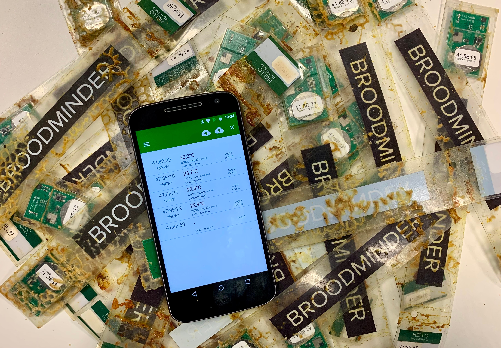
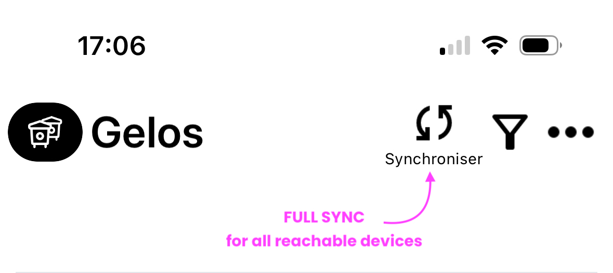
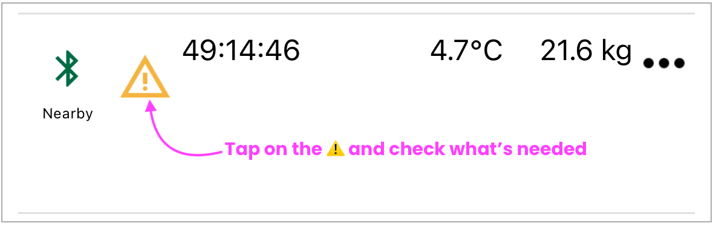
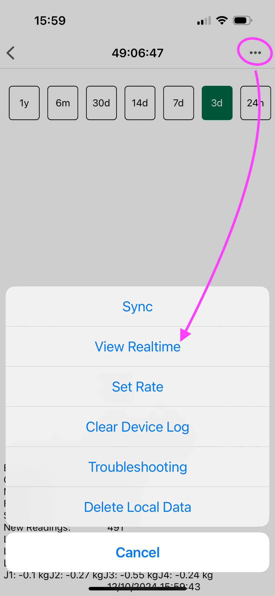
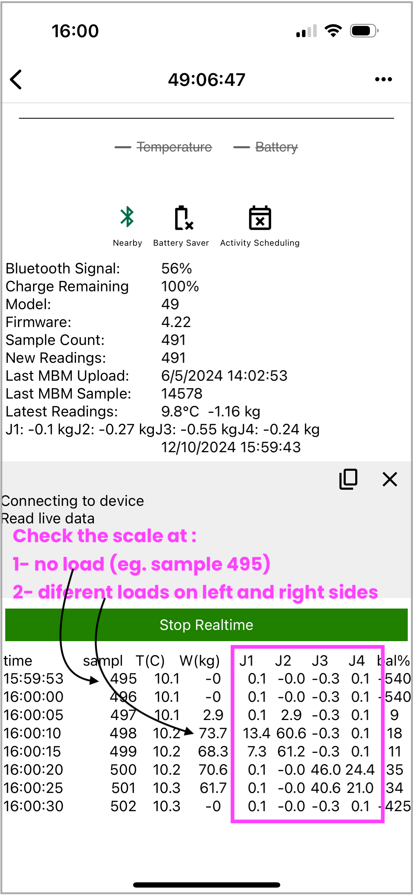
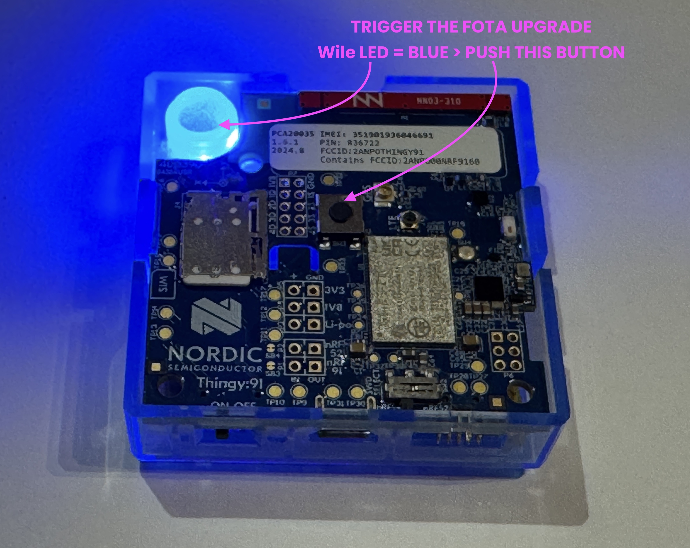

# Winter Service Check-List  

{ style="display: block; margin: 0 auto" }

To ensure peace of mind and greater efficiency, we recommend servicing all of your devices at the **end of each season**. Starting the next season with devices that have **empty memory, fresh batteries, and updated firmware** will give you the best chance for success.  

If you’d prefer us to handle this for you, visit [BroodMinder-Refresh](https://broodminder.com/products/refresh-broodminder-t2) at BroodMinder.com. We’ll clean, test, replace batteries and housings. If a device fails testing, we’ll contact you and offer a **refurbished unit at 50% of the cost of a new device**.

!!! tip "General Tips for Device Maintenance"  
    - Use **91% or higher Isopropyl or Ethyl Alcohol** to clean circuits without damaging electronics.  
    - Place wrappers in the freezer to make propolis removal easier.  
    - Check wrappers for cracks and seal any small cracks with **packing tape** or find replacement wrappers in our [e-Store](https://broodminder.com).   
    - Watch our maintenance video in the [Video Library](https://doc.mybroodminder.com/86_video_library/).  

---

## Prepare the Hardware  

- **Order CR2032 batteries** to ensure you have enough stock. Avoid expensive batteries from supermarkets. Purchase them in bulk, from reputable e-shops to guarantee quality.
- **Gather all your devices** and bring them home for servicing in a comfortable environment.  
- Perform a **full sync** of all devices using the Bees App (`Manage Tab > Sync`) to ensure no data is missed. Leave your phone syncing and enjoy a coffee (or two).  

- Once syncing is complete move to the `Devices` tab and **check for firmware upgrades**.

---

### T3 & TH3 
(Models 47 & 56)  

- Clean any dirt using **Isopropyl Alcohol**.  
- Replace the **CR2032** lithium battery.  
- The device will **restart automatically** (no power button required).  
- Verify readings and functionality.  
- Fold the device back into its wrapper.  

---

### Scales: W+, W3, W4, W5 
(models 49 and 57)

All our current scales use standard **AA batteries** (W+ uses **AAA**). Replace them if charge is below 40%.  

- Clean the scale to remove dirt.  
- Check the wrappers, box seals and cable gland nuts.  
- Use the **BeesApp RealTime feature** to verify all load cells are functional.  
- Check readings under no load first and then with known weights.  

  
  

- If needed, **tare the scale**: In Bees App, navigate to `... > Troubleshooting > Calibrate scale` and press the **Tare** button without modifying other fields.  

---

### 4G Cell Hub 
(Model 54)  

The BroodMinder-T91 hub has an internal battery lasting **4-5 months**. Recharge it fully with a USB charger (**4 hours**).  

!!! warning  
    Ensure the T91's **power switch is ON** during charging. Otherwise it won't charge.

**T91 Firmware Upgrades**
Upgrading T91 is slightly different process compared to our other devices. We use a direct-from-the-cloud-upgrade called **FOTA - Firmware Over The Air**. This process is similar to your own smartphone OS upgrade. You should check if an upgrade is available and than trigger it as described below.  

- Check your current firmware version: Go to `Devices tab > Hub ID > ... > Show details`.  

  

!!! tip "FOTA Upgrade Tips"  
    - We’re preparing **firmware version 3.4x** (Dec. 2024).  
    - Updates are done via FOTA, not through your phone.  
    - If you have version **3.x** you can triger the FOTA as described below.  
    - If you have version **1.x or 2.x**, it needs a factory upgrade. Contact us at support@broodminder.com.

**Triggering FOTA Upgrade**  
1. Cycle the hub power.  
2. Upon restart, observe the **green light** followed by a **blue light**.  
3. During the **blue light** phase (5 sec), briefly press the central button to trigger the update.  
4. Wait 2-3 minutes for the hub to reboot.  
5. Verify the firmware update using the Bees App.  

---

## Legacy Devices  

Below are the detailed procedures for our older models that are still supported.  

### T2 - Before 2023,
(Models 41 & 47)  

- [ ] Replace the battery as shown in this [video](https://www.youtube.com/watch?v=alaZtXpn-g4).  

- [ ] Power the device as demonstrated [here](https://www.youtube.com/watch?v=tN9xUTq_bSc).  

- [ ] Upgrade firmware using this [guide](https://www.youtube.com/watch?v=zK4vYvpur1E).  

### TH - Before 2020
(Model 42)  

- [ ] Replace the battery as shown in this [video](https://www.youtube.com/watch?v=tJTuL12vjps).  

### W - Before 2021
(Model 43)  

This scale uses the same circuit board as the TH model 42.
- remove the battery carefully
- clean up any dirt
- install again the wrappers

---

## Device Firmware Updates  

We regularly release updates to improve device operation. Firmware updates use **OTA (Over The Air)** technology and are easy to perform.  

**Supported Models**:  
`47, 49, 51, 52, 56, 57, 58, 59, 60 & 63`  

### Bees App Update  

Before updating firmware, ensure you’re using the latest **Bees App** version from the Android Play Store or Apple App Store.

### Basic Update Process  

1. Update the Bees App.  
2. Find the **Update Icon** next to your device in the app.  
3. Press **“Update Firmware”** or **“Sync and Update Firmware”**.  
4. Wait for 2-3 minutes.  
5. Verify the update was successful.  

If the update fails:  
- Remove the batteries for 1 minute, replace them, and retry.  
- If the issue persists, contact [support@broodminder.com](mailto:support@broodminder.com).  

