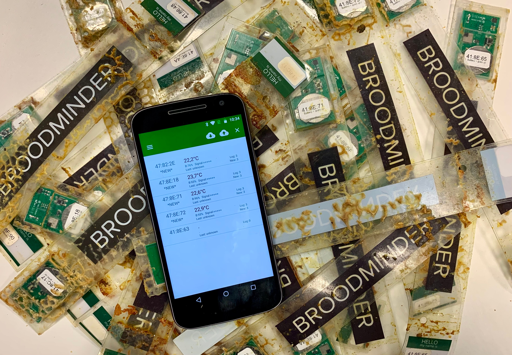
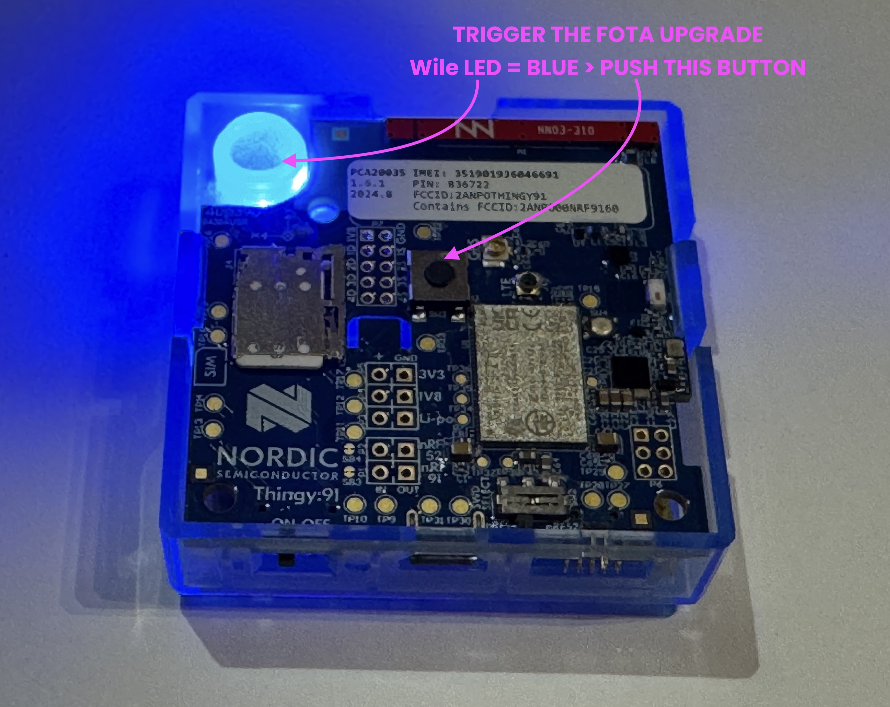
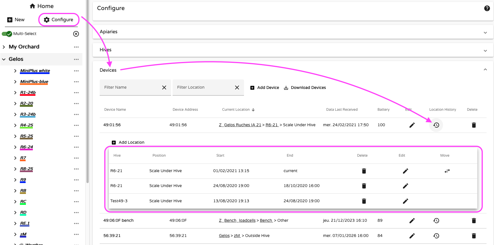
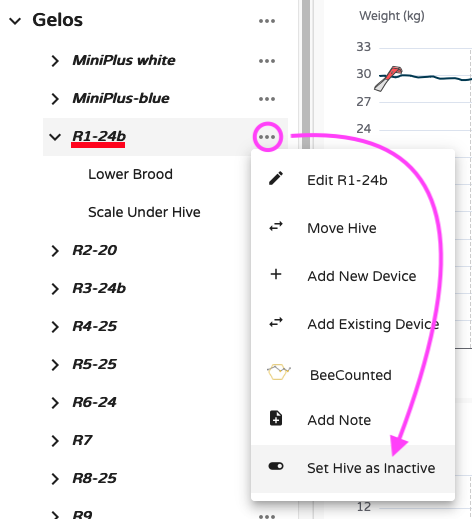
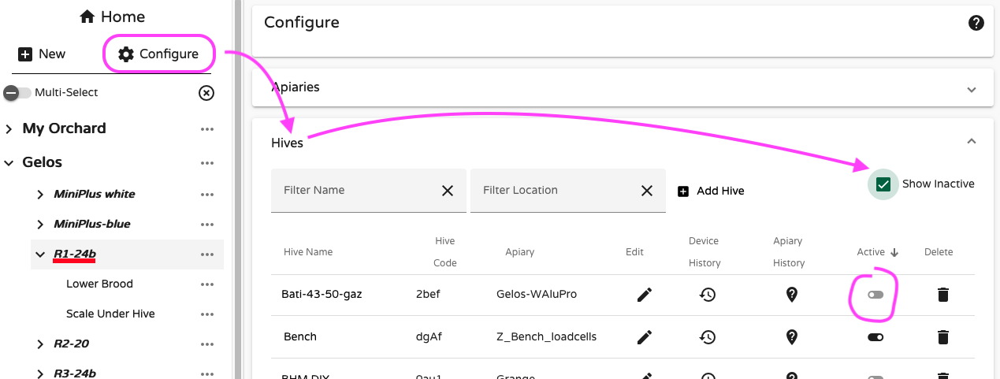
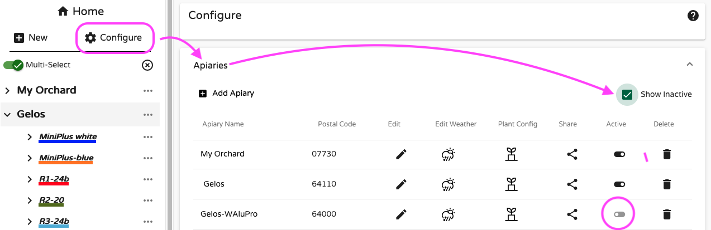

# Winter Service  

{ style="display: block; margin: 0 auto" }

To ensure peace of mind and greater efficiency, we recommend servicing all of your devices at the **end of each season**. Starting the next season with devices that have **empty memory, fresh batteries, and updated firmware** will give you the best chance for success.  

If you’d prefer us to handle this for you, visit [BroodMinder-Refresh](https://broodminder.com/products/refresh-broodminder-t2) at BroodMinder.com. We’ll clean, test, replace batteries and housings. If a device fails testing, we’ll contact you and offer a **refurbished unit at 50% of the cost of a new device**.

!!! tip "General Tips for Device Maintenance"  
    - Use **91% or higher Isopropyl or Ethyl Alcohol** to clean circuits without damaging electronics.  
    - Place wrappers in the freezer to make propolis removal easier.  
    - Check wrappers for cracks and seal any small cracks with **packing tape** or find replacement wrappers in our [e-Store](https://broodminder.com).   
    - Watch our maintenance video in the [Video Library](https://doc.mybroodminder.com/86_video_library/).  

---

## Prepare the Hardware  

- **Order CR2032 batteries** to ensure you have enough stock. Avoid expensive batteries from supermarkets. Purchase them in bulk, from reputable e-shops to guarantee quality.
- **Gather all your devices** and bring them home for servicing in a comfortable environment.  
- Perform a **full sync** of all devices using the Bees App (`Manage Tab > Sync`) to ensure no data is missed. Leave your phone syncing and enjoy a coffee (or two).  

- Once syncing is complete move to the `Devices` tab and **check for firmware upgrades**.

---

### T3 & TH3 
(Models 47 & 56)  

- Clean any dirt using **Isopropyl Alcohol**.  
- Replace the **CR2032** lithium battery.  
- The device will **restart automatically** (no power button required).  
- Verify readings and functionality.  
- Fold the device back into its wrapper.  

---

### W+, W3, W4, W5 Scales
(models 49 and 57)

All our current scales use standard **AA batteries** (W+ uses **AAA**). Replace them if charge is below 40%.  

- Clean the scale to remove dirt.  
- Check the wrappers, box seals and cable gland nuts.  
- Use the **BeesApp RealTime feature** to verify all load cells are functional.  
- Check readings under no load first and then with known weights.  

  
  

- If needed, **tare the scale**: In Bees App, navigate to `... > Troubleshooting > Calibrate scale` and press the **Tare** button without modifying other fields.  

---

### 4G Cell Hub 
(Model 54)  

The BroodMinder-T91 hub has an internal battery lasting **4-5 months**. Recharge it fully with a USB charger (**4 hours**).  

!!! warning  
    Ensure the T91's **power switch is ON** during charging. Otherwise it won't charge.

**T91 Firmware Upgrades**
Upgrading T91 is slightly different process compared to our other devices. We use a direct-from-the-cloud-upgrade called **FOTA - Firmware Over The Air**. This process is similar to your own smartphone OS upgrade. You should check if an upgrade is available and than trigger it as described below.  

- Check your current firmware version: Go to `Devices tab > Hub ID > ... > Show details`.  

  

!!! tip "FOTA Upgrade Tips"  
    - We’re preparing **firmware version 3.4x** (Dec. 2024).  
    - Updates are done via FOTA, not through your phone.  
    - If you have version **3.x** you can triger the FOTA as described below.  
    - If you have version **1.x or 2.x**, it needs a factory upgrade. Contact us at support@broodminder.com.

**Triggering FOTA Upgrade**  
1. Cycle the hub power.  
2. Upon restart, observe the **green light** followed by a **blue light**.  
3. During the **blue light** phase (5 sec), briefly press the central button to trigger the update.  
4. Wait 2-3 minutes for the hub to reboot.  
5. Verify the firmware update using the Bees App.  

---

### Legacy Devices  

Below are the detailed procedures for our older models that are still supported.  

#### T2 - Before 2023
(Models 41 & 47)  

- Replace the battery as shown in this [video](https://www.youtube.com/watch?v=alaZtXpn-g4).  

- Power the device as demonstrated [here](https://www.youtube.com/watch?v=tN9xUTq_bSc).  

- Upgrade firmware using this [guide](https://www.youtube.com/watch?v=zK4vYvpur1E).  

#### TH - Before 2020
(Model 42)  

- Replace the battery as shown in this [video](https://www.youtube.com/watch?v=tJTuL12vjps).  

#### W - Before 2021
(Model 43)  

This scale uses the same circuit board as the TH model 42.
- remove the battery carefully
- clean up any dirt
- install again the wrappers

---

## Device Firmware Updates  

We regularly release updates to improve device operation. Firmware updates use **OTA (Over The Air)** technology and are easy to perform.  

**Supported Models**:  
`47, 49, 51, 52, 56, 57, 58, 59, 60 & 63`  

### Bees App Update  

Before updating firmware, ensure you’re using the latest **Bees App** version from the Android Play Store or Apple App Store.

### Basic Update Process  

1. Update the Bees App.
2. Go to `BeesApp > user settings` and check that `Show Available Firmware updates`is toggled on 
2. Go to `BeesApp > devices` and find the **Update Icon** ⚠ next to your device in the app.  
3. Press **“Update Firmware”** or **“Sync and Update Firmware”**.  
4. Wait for 2-3 minutes.  
5. Verify the update was successful.  

If the update fails:  

- Remove the batteries for 1 minute, replace them, and retry.  
- If the issue persists, contact [support@broodminder.com](mailto:support@broodminder.com).  

## Prepare MyBroodMinder

Beyond keeping your devices up to date, it is just as important — if not more so — to ensure that your software interface is up to date before starting the new season.

Depending on your workflow, you may:
- keep all devices in the same overwintered hives, or  
- move devices to new hives at the start of each season.

Below are several ways to manage devices, hives, and apiaries, either individually or in bulk.  
Choose the method that best suits your needs.

!!! tip

    As a general rule, **never delete apiaries, hives, or devices**. Your historical data is extremely valuable, as it allows you to look back and answer questions such as:
    
    - How was the nectar flow in 2023 at apiary A?
    - When did it start?
    - How much did I harvest?
    - When did brood rearing begin last year?

    All of this information is contained in your past data and becomes more valuable over the long term.

    Over time, we will continue adding features that make it easier to explore this “time machine.” By keeping complete records today, you’ll be able to fully benefit from these tools in the future.

### Manage by device

You can manually remove devices from hives either from the **Bees App** or from **MyBroodMinder**. You may also adjust the dates on which devices were installed in a given hive. The **`Configure > Devices`** panel is the easiest and most efficient way to perform these actions.

### Manage by hive 

If you are starting up with new hives, the recommended approach is to **Set the hive as inactive**. This action will archive the former hive, removing it from your current view while preserving all historical data in your records. At the same time, any devices assigned to that hive will be automatically unassigned and made available for reuse.

In other words, with a single action you both **archive the hive** and **free the associated devices** for reassignment.

Your archived hive will disappear from the left side bar but you can always access it in `Configure > Hives`

### Manage by apiary

If, over the course of the season, you created apiaries that no longer contain any hives, we recommend **archiving** them rather than deleting them. Archiving an apiary will keep all asociated data and also archive its hives and free any associated devices, as described above.

If you plan to reuse an apiary in the future, keep it active. Please note that **deactivation is irreversible**.

As a practical tip, you can rename an unused apiary by adding a prefix such as `z_` (for example, `z_my_unused_apiary`). This will move it down the list, away from your active apiaries. When you are ready to use it again, you can simply rename it back to bring it to the top of the list.

