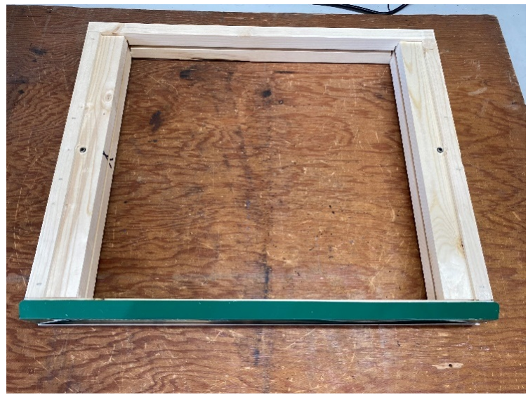

# Repair Guide

## Overview

We want these sensors to last forever. However, installing them outside or inside a beehive puts special stress on the circuit boards. We encourage everyone to repair their own if they are capable.

If you would like us to do this for you go to [BroodMinder-Refresh](https://broodminder.com/collections/service-warranty/products/refresh-broodminder-t2) at BroodMinder.com. We will clean, test, add new batteries and housings. If something fails testing, then we will contact you and offer you a refurbished device at 50% the cost of a new device.

Here is a brief list of the most typical problems (we don’t see many):

Most issues are software issues. In general, they get solved in the app or on MyBroodMinder.

- **Fast battery drain.** This is the most typical problem. Sensor batteries are all designed to last > 12 months. The cause is usually excessive moisture. 75% of the time it is repairable.
- **Weight errors.** Most are caused by installation errors. Next most prevalent caused by water infiltration due to broken housings.
- **CELL/WIFI problems**. If the unit was working and quit, then almost always due to water infiltration and the gasket being installed wrong. The second most common problem is lack of sunlight, particularly in the Pacific Northwest in the winter. You can get replacement batteries from Voltaicsystems.com. The V25 has replaced the V15. Once or twice we have seen problem with the modem connector to the circuit board. There are a lot of debugging features in the Cell App.
- **Battery holder breakage**. In devices with plastic battery holders the replacement part is MPD p/n BU2032SM-BT-GTR (https://www.digikey.com/en/products/detail/mpd-memory-protection-devices/BU2032SM-BT-GTR/2439521)
- **Battery no connect**. We don’t see this often, but the battery holder can get gunk from the bees on it. You can clean the battery connectors with isopropyl alcohol.

## **General Notes:**

- You can clean any components using 90% or greater isopropyl or ethanol alcohol. Warm it after aggressively cleaning to evaporate all moisture. This is a decent way to dry out a board since the alcohol will ‘pick up’ the extra moisture.
- Keep things dry. Cracked housings are the leading cause of scale problems. If you don’t want to purchase new housings, then just tape the old one. There are lots of good tapes out there. Clear Gorilla tape is one of our favorites.
- I refer to Digikey a lot, but many supply houses have these parts.

## **REPAIR - Fast Battery Drain  **

!!! Note

    This chapter mainly applies to old boards `B42` shipped on TH (model 42) and W (model 43) from 2016 to 2019 (see picture below)
    

The typical cause for fast battery drain is a partially shorted decoupling capacitor. They are used to add a bit of life to the battery (ironic huh?) and to ensure stable supply voltage. As time as gone on, we have become more aggressive with conformal coating. I have been told by companies making solder, that the new, more environmentally formulations for flux are the root cause. In particular, moisture can get trapped underneath capacitors and create a current path between pads. (This has also led us to use larger components in more recent designs.)

This is easy to measure if you have a DVM (current meter) that reads into the uA range. A non-auto ranging meter is much easier to use because the circuit puts out advertising pulses every 1 or 5 seconds and that messes with the auto ranging. A good board requires < 5 uA at idle, however it will bounce between that and a few mA. Below is the setup that we use. 

If you have a lot of devices, there is a new meter, the [Nordic Power Profiler Kit (PPK2)](https://www.digikey.com/en/products/detail/nordic-semiconductor-asa/NRF-PPK2/13557476?utm_adgroup=Semiconductor%20Modules&utm_source=google&utm_medium=cpc&utm_campaign=Dynamic%20Search_EN_Product&utm_term=&utm_content=Semiconductor%20Modules&gclid=Cj0KCQjwxMmhBhDJARIsANFGOSurc6RtFEOoNZ9OBuHry3w8bsyAU9aHl9WpZDuVnfX09fInn3-Yu-gaAhErEALw_wcB) and it works great and is about $100.

Note that the power may be applied on the connector as shown. Pin 1 (the square pad) is ground, pin 2 is 3.0 volts.                                   

​       In this picture I have circled the typical capacitors which cause problems. Both may be removed with almost no change in performance. If you do want to replace them, here is the info. Start with the 100uF one on the left.

Large 100 uF Digikey: 478-8155-2-ND or equivalent

Small 0.1 uF Digikey: 399-5784-2-ND or equivalent

 Sometimes it is a component on the BLE module (blue) that is not replaceable. Then the board is pretty much scrap.

It is a good idea to coat the components after replacing. You can use nail polish for this if you don’t have conformal coating material. In general, I don’t recommend paint or varnish unless you know it is OK via some other source.

More info on “Tin Whiskers” - https://nepp.nasa.gov/whisker/background/index.htm & https://www.eevblog.com/forum/projects/removing-tin-whiskers/

## **REPAIR – Will not respond– T2 (mod 47 gen with push button)**

!!! Note

    This chapter applies to BroodMinder-T boards (model 41-47) with a push button. They where shipped from 2019 to 2023 (see picture below). New T (47) and TH (56) boards are without push button.

We try to get the best parts possible, but sometimes it doesn’t work out. We have seen instances where it seems the T2 is dead and the only thing dead is the push button. It seems like the interior of the button may have develop a thin film on the connection disk (but we aren’t certain). There are a couple of ways to deal with this.

1) Replace the button (E-Switch TL3305AF160QG Digikey EG5350CT-ND)
2) We have had good luck with restoring operation by pressing the button repeatedly. As soon as you see the LED flash you know you’re on the right track. Push it quickly (3-4 times per second) for 30 seconds or so. We have seen most buttons work after this process.
3) Ignore the problem and use a knife to short across the switch terminals thus actuating the switch.

 You can see the switch guts on the board to the left. It is a “snap dome” switch which should be super reliable. Our best guess is that the dome was contaminated, and a thin film formed preventing contact. Aggressive repeated pressing seems to break through. YMMV.

## **REPAIR – Assemble the BroodMinder-W+ BRM-57 (built after 2020)**

We now use the same sensors for the BRM-57 and we fix the aluminum base permanently to the wooden top. If you disassemble it, here is how to put it back together.

 

Mount the pins along with the two washers per pin in the holes indicated.

Secure the parts together with the screws, but do not tighten the screws.

Put the plastic rain shield back on.

## **REPAIR – Scale weight problems BRM-43, original BroodMinder-W**

The scales have also been reliable unless exposed to environmental problems, typically because the housing become cracked and rain enters. Usually, a good cleanup helps. I have not seen the ADC1234 fail. Typically, it is a capacitor (as discussed above) or the battery holder (MPD p/n BU2032SM-BT-GTR). The weight sensors are also available at Digikey, FX1901-0001-0100-L by TE Connectivity Measurement Specialties.

If you are going to do much with scale repair, it is a good idea to get the PC app and a Silicon labs BLED112 dongle (available at Digikey).

Once you repair the scale and need to recalibrate it, we suggest using the PC app and to adjust the divisor and offset for each channel by trial and error. See the DIY section above for a bit more info on the PC App (available at https://www.dropbox.com/sh/vj621467gak5bd7/AAAitrIE_vKsw07AGnlgopxha?dl=0 in directory PCApp).

·    Note the divisor and offset values the appear when you connect. Write them down.

·    Set the scale wooden side down with the aluminum and housings removed.

·    Set the log period to 5 seconds (this is the fast it will go) press “Update Log Period’ and press ‘Start Real Time’

·    With no load on the scale, adjust the Offset for left and right (front only for BroodMinder-W). The value can vary widely. + or -15,000 is not unusual.

·    Apply a known weight. We suggest using a large c-clamp with a weight dangling. It should not touch the table or any part of the scale. Taping a small nut to the c-clamp will keep it situated on the sensor.

·    Adjust the Divisor to read correctly. Generally, the Divisor value should be between 1,200 and 1,400.

·    After values are set, you must press “Cal LF Weight” and Cal RF Weight” to store the values in the scale.

·    Test using the BroodMinder-Lite app in “real-time” mode to ensure that the values are stored.

## **REPAIR – BroodMinder-W2**

The W2 is pretty new, so we don’t know all of the failure modes yet. We will show you how to disassemble without destroying it.

This is what it looks like inside. It is pretty simple. The hard part is keeping bees inside and weather outside.

**Battery Shield**

An upgrade we recommend for all of the original -W2 scales is to add a plastic water shield above the battery compartment. It turns out that moisture may drip down the inside of the hive and end up here. Sandwiching a shield between directly above the batteries and below the screwed on cover prevents this from happening.

·   Remove the battery cover

·   Place the shield centered above the battery area

·   Replace the battery cover

·   Tape the corners to make watertight

 

**W2 Disassembly**

1) Remove the inner seal that is stapled in place. (be gentle)
2) Take off the two nuts holding the halves together.

   After removing the slatted rack, start by carefully prying loose the staples holding the inner seal in. Use a small putty knife if possible.

The inner seal is spandex mounted on expanded PVC. It is very flexible, but easy to poke a hole in with a knife.

 

Remove the inner seal assembly.

Note that when you reassemble, don’t stretch the spandex, that will put force on the scale.

  

Remove the two nuts holding the top to the bottom frame. 

Now you can separate the halves.

 

   If you are replacing the housing, first lay down the double stick tape. We suggest making the short pieces run to the edge in order to bridge the two housing pieces and help to seal out water.

Installing the housing is all about making certain that it does not rub.

Install the long pieces first. Be certain that the housing is centered in the metal drip ledge. If it rubs on this aluminum part, it will affect the weight reading.

When installing the short pieces, be certain to pull the long piece towards the middle so that it is tight against the frame. Leave part of the housing double stick tape covered as shown. Carefully peel it off after get the housing situated on the frame.

   It can be tricky to get the housing back in after you separate the halves. Patiently use a putty knife to do this.

   

We recommend a little blue locktite to secure the nuts.

 

## 16.3 Appendix D – Battery Power

In the winter of 2020/21, we worked to extend battery greater than 5 years. The following section provides measurement data for those interested in such matters.

In order to avoid connectors and wires, we have chosen the battery route. Our goal has always been to have batteries last between one and two years. In the absence of failures due to tin whiskers noted above, we have met that goal.

The major energy cost to BroodMinder devices is Bluetooth Low Energy (BLE) advertising. The advertisements, which contain current measurement values, are emitted once every 5 seconds (once every second for -W2). While the current draw is very short, it still adds up over the span of a year.

In early 2020, we decided to design and offer the BroodMinder-SubHub. Based on the same circuit as the BroodMinder-W2, the board can be outfitted with 4, AA batteries giving it a much larger power base to work with. With the -SubHub gathering data once every 10 minutes, it made possible to cut advertising time for the hive devices from 60 minutes to 10 minutes, cutting power consumption by nearly 75% and extending battery life to over 5 years.

The scaling for batteries in the 2020 and later boards is 0-100% represents 2.0-3.0 volts

Battery Energy  CR2032 = 225 mAh  AA (L91) = 3500 mAh AAA (L92) = 1200 mAh 

 

Note: Validation measurements were performed utilizing a new (wonderful) instrument. The crowdfunded Joulescope, DC Energy Analyzer was designed to make these types of low power DC measurements. 

