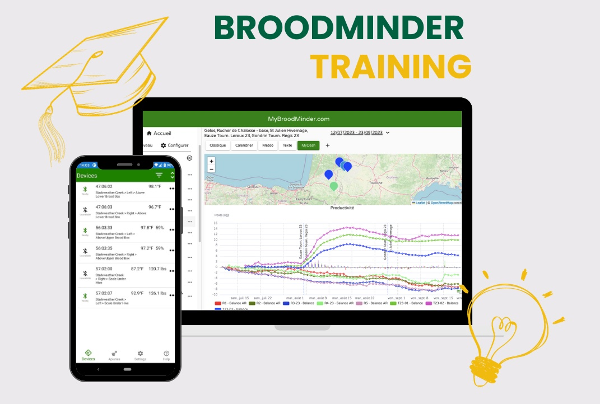

# Training Sessions

 Over the last few years the BroodMinder system has grown considerably and offers now a wide range of possibilities. Whether you are Professional beekeeper, Researcher or Hobbyist. Making honey, pollinating or even breeding bees. There is certainly an optimal usage of BroodMinder to help you draw the best outcome for your activity. 

 We do currently offer two training webinars and schedule a few sessions over the year. Check at [our store](https://eu.broodminder.com/collections/training) for scheduled sessions.

