# Guide de Démarrage Rapide

Nous avons fait de notre mieux pour rendre l'installation et l'utilisation de vos BroodMinders intuitives et faciles. Suivez le processus ci-dessous pour maîtriser tous les aspects de la solution (Capteurs, Application et Web...) et vous aurez toutes les chances de réussir.

Chaque étape est décrite en détail plus loin dans ce document.

| À LA MAISON | | | |
| -- | -- | -- | -- |
| 1. |  | [Installer l'Application](#1-install-broodminder-bees) |
| 2. |  | [Créer votre compte](#2-create-your-account) |
| 3. |  | [Alimenter vos appareils](#3-activate-your-devices) |
| 4. |  | [Assigner à une ruche](#4-assign-devices-to-hives) |
| 5. |  | [Faire votre première synchronisation](#5-make-your-first-sync) |
| 6. |  | [Allumer le Hub](#6-power-on-your-hub) |

| À VOTRE RUCHER | | | |
| -- | -- | -- | -- |
| 7. |  | [Installer les appareils dans la ruche](#7-install-devices-in-hives) |
| 8. |  | [Installer votre hub](#8-install-your-hub) |
| 9. |  | [Mettre à jour les dates de début](#9-update-start-datetime) |
| 10. |  | [Visualiser et explorer](#10-explore-and-discover) |

## Avant de commencer
Notez les meilleures pratiques suivantes :

!!! info "Configurer tout À LA MAISON"
    Assurez-vous que le système est fonctionnel avant de l'installer dans le rucher, il sera alors moins facile à configurer.

!!! info "Étiquetez vos ruches"
    Faites ce qu'il faut pour identifier vos ruches, ce sera bien meilleur.
    1, 2, 3 ..... A, B, C ... K254.

!!! info "Utilisez notre vidéothèque"
    Regardez l'aide vidéo "[Démarrage rapide avec le kit CS](https://youtu.be/6WicH4_l2FQ)"

!!! tip "Besoin d'aide ?"
    Vous pouvez toujours nous contacter à [Support@BroodMinder.com](mailto:Support@BroodMinder.com)

-----

## 🏠 COMMENCEZ À LA MAISON
###  1. Installer BroodMinder Bees

Téléchargez [Broodminder Bees](https://mybroodminder.com/beesapp) depuis votre magasin préféré. Scannez ce code QR pour y accéder :

###  2. Créer votre compte

Créez votre compte dans l'application Bees. Un seul compte pour tout : l'application et le site Web MyBroodminder.

Dans BeesApp, sur l'onglet Rucher, créez votre première *rucherie* et votre première *ruche*, elles seront nécessaires pour les prochaines étapes.

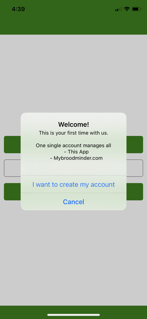

Dans Bees, vous avez plusieurs onglets que nous allons parcourir :

Passez maintenant à l'onglet **Ruchers** :

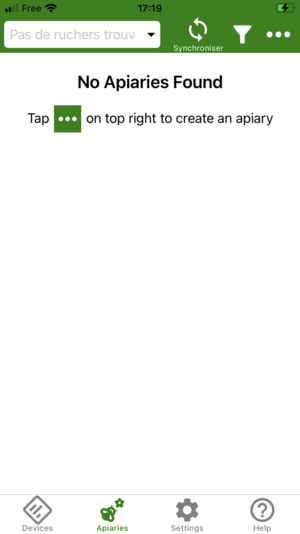

Créez votre première rucherie avec `... > Nouvelle rucherie`

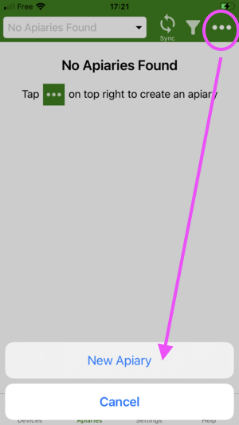

Créez votre première ruche avec `... > Nouvelle ruche`

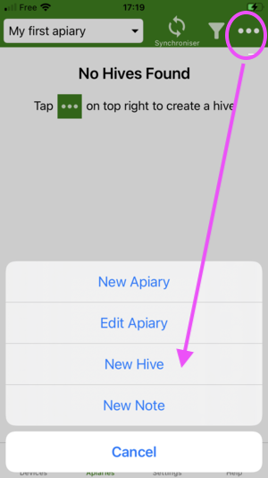

Nous pouvons maintenant passer à l'attribution des capteurs à cette ruche nouvellement créée. Mais d'abord, nous devons allumer les appareils.

###  3. Activer vos appareils
En général, tous nos appareils ont une languette de tirage.
Les anciens modèles (T2) peuvent avoir un bouton poussoir.

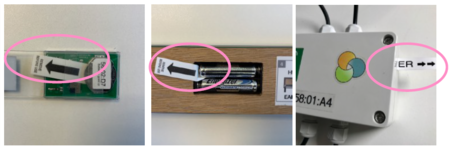

!!! warning "Prenez soin de ceci :"
    Avec n'importe quel appareil, tirer sur la languette devrait faire clignoter la carte. Si vous ne voyez aucun clignotement, appuyez sur les piles contre le contact +. Parfois, le support de pile peut être raide et empêcher le ressort de les pousser à travers. (surtout pour les piles AA)

    Ne jetez aucune pièce en plastique. Gardez-les toutes en place.

    Vérifiez que tous les joints sont correctement installés.

    Vérifiez que les passe-câbles sont bien serrés lorsque cela est approprié.

!!! tip "Comprendre le modèle d'appareil"
    Tous les capteurs BroodMinder ont un numéro de référence à 6 chiffres sous la forme XX:XX:XX. Les deux premiers chiffres de cette référence définissent le modèle :
  
    - 41, 47 : T
    - 42, 56 : TH
    - 43, 57 : W 
    - 49 : W3 et W4
    - 52 : SubHub
    - 54 : Hub
    - 58 : DIY
    - 63 : BeeDar

###  4. Assigner les appareils aux ruches

D'abord, vous devez réclamer l'appareil en cliquant sur le bouton vert `Réclamer` trouvé dans l'onglet `Appareils`. Cette opération associera chaque capteur que vous réclamez à votre compte. 
Vous serez ensuite invité à attacher le capteur à une ruche. Vous pouvez procéder ou annuler et revenir plus tard via le menu `...`. 

Attachez chaque appareil à une ruche. 

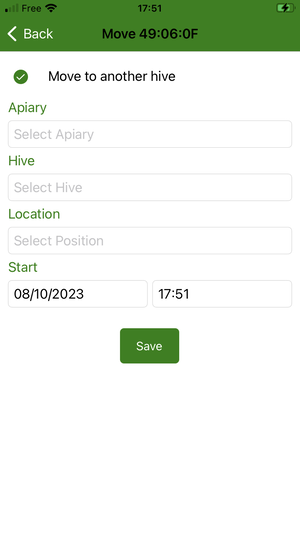

Les positions disponibles pour les appareils sont

| Position | utilisation typique |
|-- | -- |
| Bas de la couvée | TH ou T dans la boîte de couvée inférieure |
| Haut de la couvée | TH ou T dans la boîte de couvée supérieure |
| Sous le couvercle | TH ou T sous le couvercle |
| Balance sous la ruche  | balances à poids complet comme W3, W4 |
| Balance sous la ruche (arrière) | demi-poids (barre) comme W et W5|
| Beecounter | BeeDar |
| Extérieur de la ruche | choix de l'apiculteur |
| Autre| choix de l'apiculteur |
| Personnalisé [1-7]| à des fins de recherche (plusieurs appareils) |

!!! info "L'emplacement de l'appareil est important"
    Sélectionnez soigneusement l'emplacement pour les capteurs internes. Certaines métriques comme la couvée ne sont calculées que si l'appareil est attribué à l'emplacement de la couvée.
 

Maintenant, retournez à l'onglet **Ruchers** pour effectuer la première synchronisation.

###  5. Faire votre première synchronisation

Avec l'application BroodMinder Bees, il existe plusieurs façons de synchroniser :

- `Multi-Sync` est en haut de l'écran dans l'onglet `Ruchers`. Cela synchronise tous les appareils à la fois et c'est une fonctionnalité Premium.
- `Single Sync` se trouve dans les menus `...` soit dans l'onglet `Appareils` soit dans l'onglet `Ruchers`

!!! Tip
    Vous ne pouvez synchroniser que les appareils qui apparaissent en vert (à portée Bluetooth)

Maintenant, regardez vos données en utilisant `... > Afficher le graphique` ou `... > Afficher les détails`.

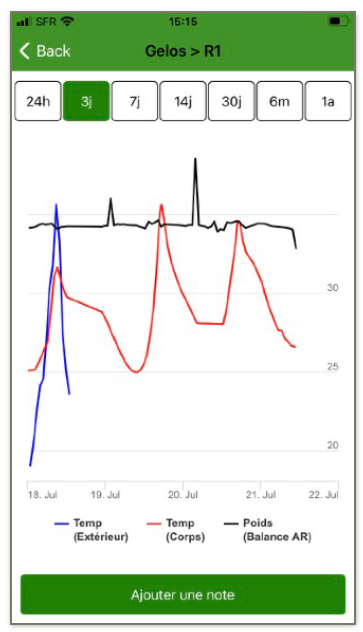

!!! info
    Lors de votre première synchronisation, vous ne verrez probablement pas beaucoup de données car il n'y a qu'un ou deux échantillons.

###  6. Allumer votre Hub

Cette étape est destinée à ceux qui possèdent un Hub pour la surveillance en temps réel.
Si vous n'avez pas de Hub, passez au [chapitre suivant](#🐝-now-move-to-the-apiary).

Souvenez-vous de la [page des Hubs](./60_hubs.md) qu'il existe plusieurs versions de hub :

- Broodminder-T91 Cellular Hub [solaire, météo, nu]
- BroodMinder-Wifi Hub
- BroodMinder-Sub-Hub

#### 6.1 Hub Météo Cellulaire
1. Retirez la protection en silicone orange
2. Mettez sous tension le hub avec le petit interrupteur noir (utilisez une pointe de stylo pour l'actionner)

3. Les voyants de couleur clignoteront en vert, puis en bleu, puis à nouveau en vert
4. Vérifiez sur l'application Bees que la transmission a été établie. Allez à `onglet Appareils > ID du Hub > Afficher les détails > MBM dernière mise à jour`, cela devrait afficher la date/heure actuelle.

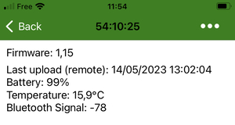

5. Réinstallez la protection orange, en commençant par le côté USB.

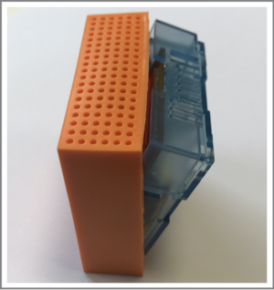

6. Insérez le T91 dans le boîtier météo avec la face USB sur le côté pour éviter la condensation sur cette face et la face opposée.

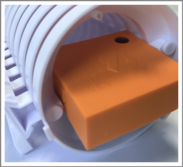

#### 6.2 Hub Solaire Cellulaire
Suivez le même processus que ci-dessus, à la différence que vous devrez brancher le USB à la batterie (nous l'expédions débranché pour éviter la décharge de la batterie pendant le transport)

1. Dévissez le couvercle.
2. Insérez la fiche USB dans la batterie.
3. Faites glisser l'interrupteur d'alimentation vers la droite

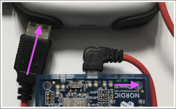

4. Le hub va démarrer et vous pouvez vérifier la transmission des données en utilisant l'application Bees comme décrit ci-dessus.

## 🐝 NOW MOVE TO THE APIARY

###  7. Installer les appareils dans les ruches

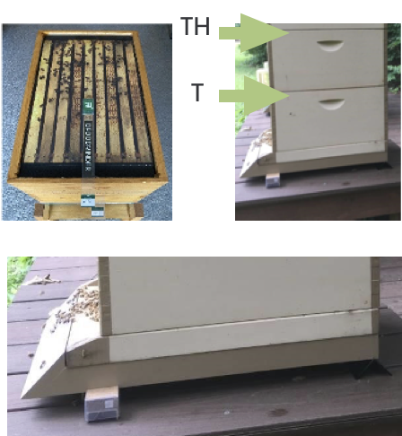

#### Capteurs internes

Installez le BroodMinder-T (modèle 47) et -TH (modèle 56) sur le cadre central (généralement no. 5), en commençant du côté gauche vu de l'avant de la ruche. L'identifiant à l'extrémité de la languette doit dépasser pour être visible de l'avant de la ruche.

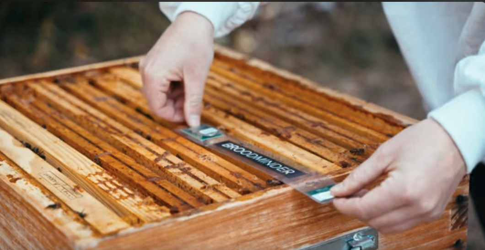

#### Balances
Placez votre balance BroodMinder-W de préférence **à l'arrière** de la ruche. Assurez-vous que la ruche est aussi nivelée que possible. 
Les balances BroodMinder-W3 et W4 ne nécessitent pas un nivellement précis.

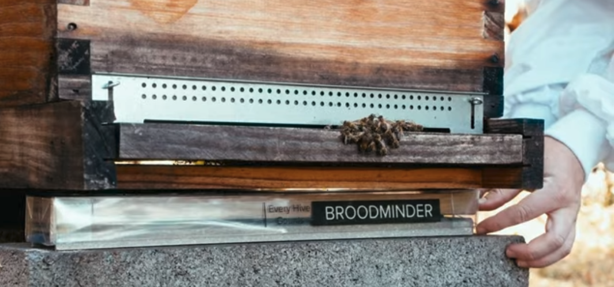

#### BeeDar
Le BeeDar est monté à l'avant de la ruche, centré sur l'axe de la ruche. La hauteur depuis le pont de vol est juste pour vous permettre de manipuler les réducteurs d'entrée sans souci. Typiquement 5 à 7 cm au-dessus du sol.

Le BeeDar a un angle "vue" horizontal de 85° et un angle vertical de 30°.
Vous pouvez le suspendre avec deux vis de 4 mm de diamètre.

###  8. Installer votre hub

Cette étape est facultative : elle est destinée uniquement à ceux qui possèdent un Hub pour la surveillance en temps réel.

En règle générale, pour n'importe quel type de hub, vous devez savoir que
- la portée globale du Hub <=> des capteurs internes est d'environ 10 mètres (30 pieds)
- la portée globale du Hub <=> des capteurs externes est d'environ 30 à 40 mètres

!!! Important 
    - les hubs doivent être situés à au moins 1,5 mètre du sol (la réception cellulaire et Wifi diminue BEAUCOUP lorsqu'ils sont proches du sol) 
    - évitez une exposition directe au soleil

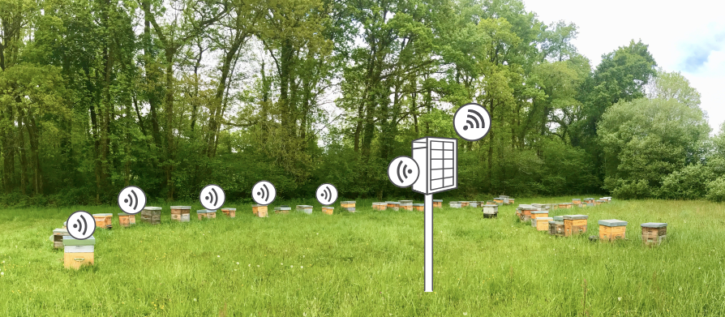

Il existe plusieurs façons d'installer le hub
- les versions solaires peuvent être placées sur une nacelle, murale ou même sur la ruche

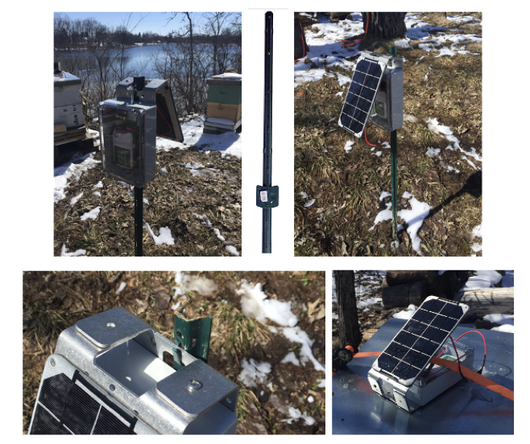

- les autres versions cellulaires et les SubHubs s'installent bien à l'intérieur du boîtier météo

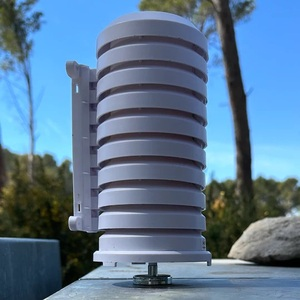

Maintenant, vérifiez la connectivité
- Vérifiez la connectivité du hub avec l'application Bees (dans l'onglet `Appareils > ID du hub > ... > Afficher les détails`)
- Vous devriez avoir un signal réseau supérieur à 20% pour être à l'aise.

###  9. Mettre à jour la date/heure de début

Pour éviter d'avoir des mesures de l'extérieur de la ruche, modifiez la date de début des capteurs.
Pour ce faire, allez à `BeesApp > Ruchers > dépliez les ruches pour voir les capteurs > "..." > Changer la position actuelle`. 
Modifiez la `date/heure de début`.

###  10. Explorer et découvrir

Maintenant, vous pouvez également aller sur [MyBroodMinder.com](https://mybroodminder.com) et explorer vos données.

Connectez-vous avec le même compte que celui que vous avez créé dans l'application Bees.

Dans cette interface, vous pourrez suivre les niveaux de couvain, les gains et pertes de poids, configurer vos alertes ou même la météo passée et prévue ainsi que les indices de flux de nectar et bien plus encore !

!!! info
    Attention : Certaines données sont calculées quotidiennement et vous commencerez à les voir à partir du J+3 (le J+1 ne compte pas car données partielles, le J+2 sera le premier jour complet qui sera affiché le jour suivant => J+3)
