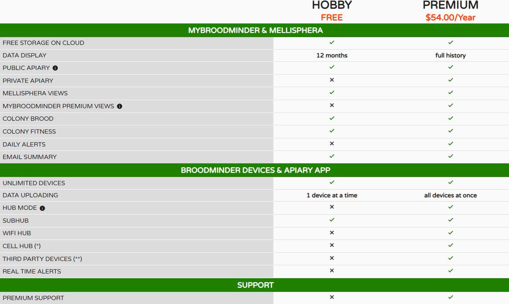
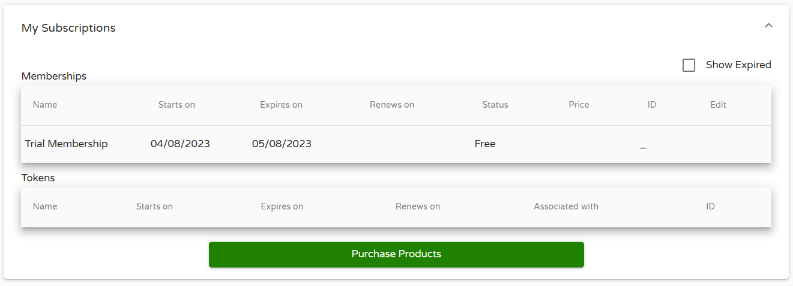
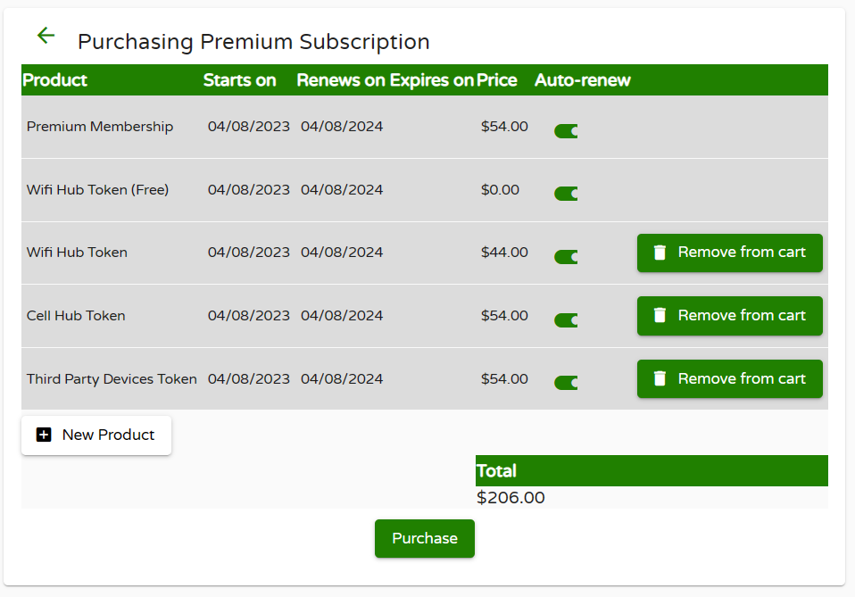
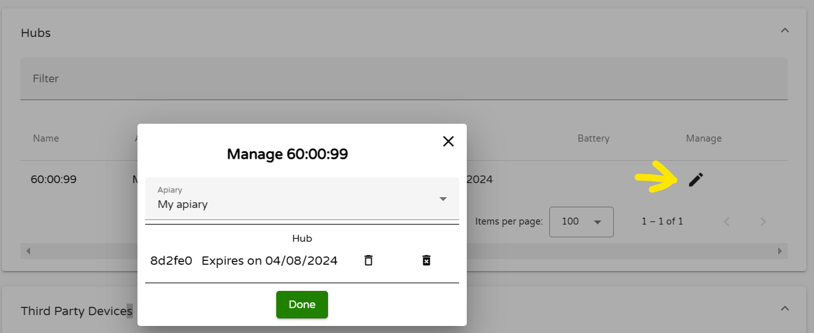

# Tokens

## Why?

We have worked very hard for 8 years to create the BroodMinder eco system. While we wish we could provide all of this for free, the reality is that it takes a lot of work to keep things running and do improvements. We must also pay for cloud usage and data storage. 

We will continue to provide basic functionality for free and only require subscriptions for advanced functionality.

The advance features we offer are:

- Advanced MyBroodMinder.com view and analytics
- 3rd party sensor support (YoLink LoRa devices)
- Real-time uploads from BroodMinder cell and WIFI hub devices

We administrate these subscriptions with our token system. This allows the use of debit/charge cards and leaves control of the charges in the hands of our customers.

Yes, it can be confusing. We will continue to improve and simplify the system, but it is surprising difficult to accomplish this. We appreciate your patience.

If you need help, please contact us at support@broodminder.com. We are happy to assist you and get you up and running.

## How?

We have several tokens that we use. 

- **No Subscription** - If you do not have an active subscription you will have these features and limitations listed above.
- **Trial Membership** - When you sign up for an account, you are given MyBroodMinder-Premium features for one month.
- **MyBroodMinder-Premium** - This gives you access to additional data processing and display features. We include one free WIFI token with the Premium subscription.
- **Wifi Hub Token** - This token is required for each of your BroodMinder-WIFIs that are sending data 24/7.
- **Cell Hub Token** - Like the WIFI token except that we include a cellular data plan.
- **Third Party Devices Token** - MyBroodMinder supports receiving data from YoLink devices. Multiple devices are supported with one token.

To purchase tokens, go to "Configure" then "My Subscriptions" and press "Purchase Products"

Choose the tokens that you need

When you press purchase, you will be taken to the service we use to collect and administrate credit card & paypal information. We do not store your CC information, we leave that to the pros. FYI that company is [Braintree](https://www.braintreepayments.com/) which is a Paypal company.

Once you have your tokens, you can assign them in the Hubs configuration screen.

