# Physics and Tech Stuff

We know a lot of you like to fiddle around. So, for the interested and motivated student, here is more information and DIY software stuff.

## BLE Advertising Information

Note: If you have suggestions for improving the explanation, then us the details. 

For those brave souls with the gumption to create their own data harvesting equipment, we provide information on the BLE advertising protocol that BroodMinder uses. Indeed our own BroodMinder-CELL, WiFi, and -SubHub uses the advertising to eavesdrop on the devices and then forward the data directly to MyBroodMinder.com. 

There are several nice BLE Explorer programs available. Our favorites are:

- Android & iOS – nrfConnect by Nordic Semiconductor. The Android version is best, but we use both all of the time. It has a nice signal level graphing feature.
- PC – Bluetooth LE Explorer by Microsoft. Unfortunately, this program doesn’t show the advertising data.
- Mac – BlueSee – This app seems to work nicely and it does show the manufacturers data in the advertising packet.

You will likely notice that the first 3 bytes of the device ID are always 06:09:16 then follows the particular device ID which is always Model:ID:ID. Some devices (iOS & Mac) hide the true ID, so we also include that in the name field in the extended advertising packet. 

**Advertising Packet Makeup for BroodMinder** 

 When you read advertising packets from BLE, you can identify BroodMinder products by looking at the following. 

 The data will look something like this. – this example is from device 43:30:07 

 

GAP Scan Response Event ------------------------------------------------------------------------------------

ble_evt_gap_scan_response: rssi=-77, packet_type=0, sender=[ 07 30 43 80 07 00 ], address_type=0, bond=255,  data=[ **02 01 06 02 0a 03 18 ff 8d 02 2b 15 02 00 02 21 00 d0 62 00 ff 7f 05 80 37 07 30 43 00 00 00** ] 

 Note: Values are in decimal unless preceded with 0x 

1) Check for "Manufacturer Specific Data" flag 
Bytes 6,7 = 0x18, 0xff 

2) Check for IF, LLC as the manufacturer 
Bytes 8,9 = 0x8d, 0x02 

Bytes 10-29 are the data from the BroodMinder as outlined below.          
	DeviceModelIFllc_1 = 0x2b (43d = scale)    
	DeviceVersionMinor_1 = 0x15 (21d) 
	DeviceVersionMajor_1 = 0x02 (FW 2.21) 
	Elapsed_2V2 = 0x21 (33d) 
	Temperature_2V2 = 0x62d0 
	WeightL_2V2 = 0x7FFF 
	WeightR_2V2 = 0x8005 

 

The mapping for all models is on the next page

| PRIMARY   |                 |       |                                                       |                                    |
| --------- | --------------- | ----- | ----------------------------------------------------- | ---------------------------------- |
| Byte      | Type            | Value | Parameter                                             |                                    |
| 0         | Ad field Length | 02    |                                                       |                                    |
| 1         | Field Type      | 01    | Connectible                                           |                                    |
| 2         | Value           | 06    | LE General Discovery, Connectible, Single Mode Device |                                    |
| 3         | Ad field Length | 02    |                                                       |                                    |
| 4         | Field Type      | 0A    | Xmit Power                                            |                                    |
| 5         | Value           | 03    | Power in DB                                           |                                    |
| 6         | Ad field Length | 24    |                                                       |                                    |
| 7         | Field Type      | FF    | Manufacturer data                                     |                                    |
| 8         | Value           | 8d    | IF, LLC = 0x028d, 653                                 |                                    |
| 9         | Value           | 02    | IF, LLC = 0x028d, 653                                 |                                    |
| 10        | Value           |       | Model                                                 |                                    |
| 11        | Value           |       | Version Minor                                         |                                    |
| 12        | Value           |       | Version Major                                         |                                    |
| 13        | Value           |       | Realtime Temp1                                        | 47/49/56/57/58 (SM&XLR)            |
| 14        | Value           |       | Battery                                               |                                    |
| 15        | Value           |       | Elapsed                                               |                                    |
| 16        | Value           |       | Elapsed                                               |                                    |
| 17        | Value           |       | Temperature                                           | 47& above is centicenigrade + 5000 |
| 18        | Value           |       | Temperature                                           |                                    |
| 19        | Value           |       | Realtime Temp2                                        | 47/49/56/57/58 (SM&XLR)            |
| 20        | Value           |       | WeightL                                               |                                    |
| 21        | Value           |       | WeightL                                               |                                    |
| 22        | Value           |       | WeightR                                               |                                    |
| 23        | Value           |       | WeightR                                               |                                    |
| 24        | Value           |       | Humidity                                              | will be 0 for 41/47/49/52          |
| 25        | Value           |       | WeightL2/SM_Time0                                     | 49/57/58 (XLR)                     |
| 26        | Value           |       | WeightL2/SM_Time1                                     | 49/57/58 (XLR)                     |
| 27        | Value           |       | WeightR2/SM_Time2                                     | 49/57/58 (XLR)                     |
| 28        | Value           |       | WeightR2/SM_Time3                                     | 49/57/58 (XLR)                     |
| 29        | Value           |       | Realtime total weight / Swarm State                   | 47/49/56/57/58 (SM&XLR)            |
| 30        | Value           |       | Realtime total weight                                 | 47/49/56/57/58 (SM&XLR)            |
|           |                 |       |                                                       |                                    |
| SECONDARY |                 |       | Extended Advertising Packet                           |                                    |
| Byte      | Type            | Value | Parameter                                             |                                    |
| 0         | Ad field Length | 09    |                                                       |                                    |
| 1         | Type            | 09    | Complete Local Name                                   |                                    |
| 2         |                 | 4'    | ascii name                                            |                                    |
| 3         |                 | 2'    |                                                       |                                    |
| 4         |                 | :'    |                                                       |                                    |
| 5         |                 | 0'    |                                                       |                                    |
| 6         |                 | 0'    |                                                       |                                    |
| 7         |                 | :'    |                                                       |                                    |
| 8         |                 | 0'    |                                                       |                                    |
| 9         |                 | 0'    |                                                       |                                    |

Note: BRM52 BroodMinder-SubHub is different as explained below.

Here are the equations 

	if (ModelNumber == 41 | ModelNumber == 42 | ModelNumber == 43)
	{
		temperatureDegreesF = e.data[byteNumAdvTemperature_2V2] + 		(e.data[byteNumAdvTemperature_2V2 + 1] << 8);
		temperatureDegreesF = (temperatureDegreesF / Math.Pow(2, 16) * 165 - 40) * 9 / 5 + 32;
	}
	else
	{
		double temperatureDegreesC = e.data[byteNumAdvTemperature_2V2] + (e.data[byteNumAdvTemperature_2V2 + 1] << 8);
		temperatureDegreesC = (temperatureDegreesC - 5000) / 100;
		temperatureDegreesF = temperatureDegreesC * 9 / 5 + 32;
	}
		humidityPercent = e.data[byteNumAdvHumidity_1V2];
	if (ModelNumber == 43)
	{
		weightL = e.data[byteNumAdvWeightL_2V2 + 1] * 256 + e.data[byteNumAdvWeightL_2V2 + 0] - 32767;
		weightScaledL = weightL / 100;
		weightR = e.data[byteNumAdvWeightR_2V2 + 1] * 256 + e.data[byteNumAdvWeightR_2V2 + 0] - 32767;
		weightScaledR = weightR / 100;
	} 
	else if (ModelNumber == 49 | ModelNumber == 57 | ModelNumber == 58)
	{
		weightR = e.data[byteNumAdvWeightL_2V2 + 1] * 256 + e.data[byteNumAdvWeightL_2V2 + 0] - 32767;
		weightScaledR = weightR / 100;
		weightL = e.data[byteNumAdvWeightR_2V2 + 1] * 256 + e.data[byteNumAdvWeightR_2V2 + 0] - 32767;
		weightScaledL = weightL / 100;
		weightR2 = e.data[byteNumAdvWeightL2_2V2 + 1] * 256 + e.data[byteNumAdvWeightL2_2V2 + 0] - 32767;
		weightScaledR2 = weightR2 / 100;
		weightL2 = e.data[byteNumAdvWeightR2_2V2 + 1] * 256 + e.data[byteNumAdvWeightR2_2V2 + 0] - 32767;
		weightScaledL2 = weightL2 / 100;
	}
	realTimeTemperature = ((float)(e.data[byteNumAdvRealTimeTemperature2] * 256 + e.data[byteNumAdvRealTimeTemperature1] - 5000) / 100) * 9 / 5 + 32;
	
	realTimeWeight = (float)(e.data[byteNumAdvRealTimeWeight2] * 256 + e.data[byteNumAdvRealTimeWeight1] - 32767 ) / 100 ;
SM_Time is the unix time of last temperature event. Time0 = LSB, Time3 = MSB, it will be time since boot if time has not been set in the device by a device sync.

 **BRM-52 BroodMinder-SubHub**

The -SubHub does some tricky advertising. The advertising changes every 5 seconds to send out a different device. It will roll through all devices (including itself) and then repeat.

We call these Mock Advertisements. Depending on what operating system is being used, you may or may not (e.g. iOS) be able to see the true device ID (e.g. 06:09:16:52:01:23). That is why we place the device ID in the extended advertising byte. Also note that it is difficult to read the extended advertising for some devices, however for those, you typically *can* read the true device ID.

 The Mock ID resides in byte 13, 19, and 30. That makes the process as follows:

1. Establish if this is a -SubHub by the ID (either the true ID or the ID in the extended advertising). It will always be 52:xx:xx.
2. If it is a “52” device, then parse bytes 13/19/30. E.g. 43/01/23 will be 43:01:23
3. Parse the rest of the advertising packet according to the device type based on the model byte (byte 10)

 Easy Peasy 😉 

## BroodMinder-W physics 

There are many ways the BroodMinder hive scale can be used and since it only measures a fraction of the total hive weight, the design and placement of the auxiliary support and the BroodMinder scale positioning becomes an integral part of the total hive weight measuring system. Generally, the more effort is put into this, the better the results will be. The hive support systems shown below start from the easiest to the most sophisticated with highest uncertainty to lowest. It is up the individual user to decide what to implement. 

*NOTE: the most typical error source is inadequate support under the scale. This can result in strange behavior as the hive flexes as it expands and contracts due to sun, rain, temperature, etc. Providing a flat support will improve results. An easy fix is to place a ¾” plywood sheet (or equivalent) under the scales.* 

*ADDITIONAL NOTE: If all you want to see is honey flow, good support is not required. You will just have to ignore the daily fluctuations. You will still be able to observe the overall change in weight.* 

​       

a) Default Arrangement 

This is the default arrangement with the scale at the front of the hive and a 2×4 as an auxiliary support (fulcrum) at the back: 

​      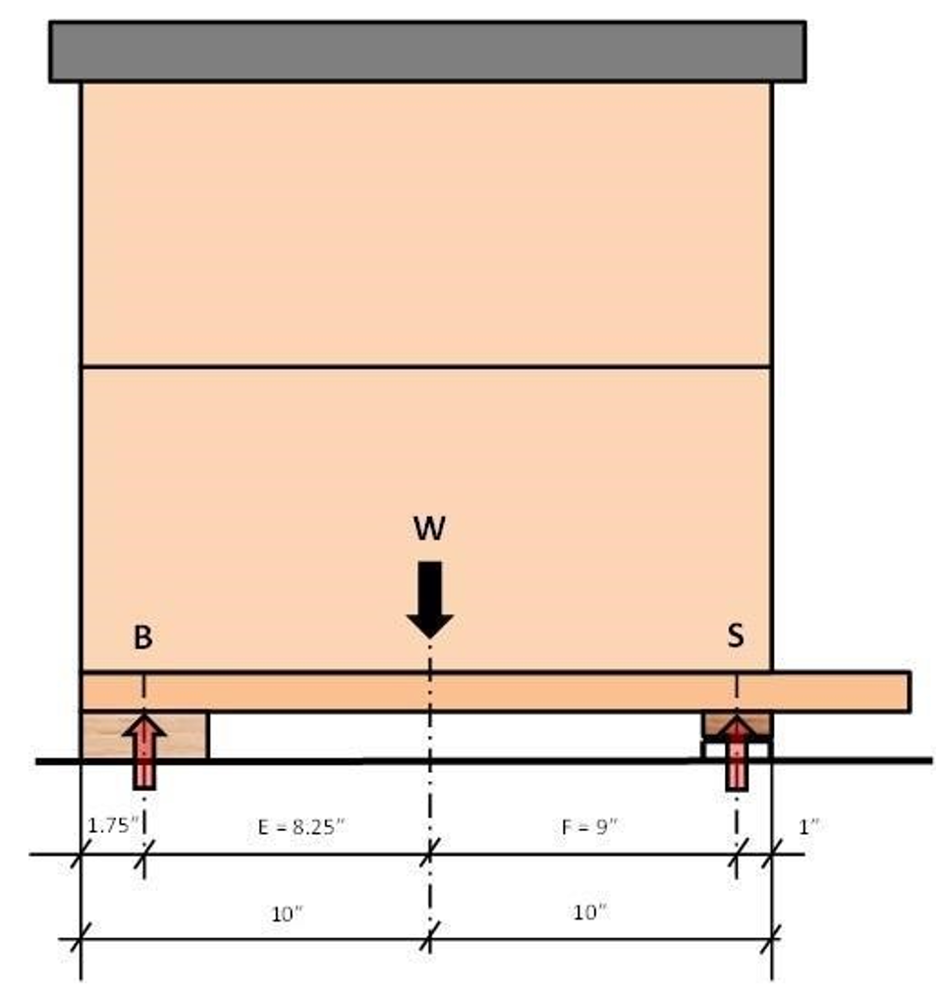                          

Here are some calculations surrounding the setup: 

Assumptions 

The hive weight W is distributed evenly and the center of gravity is in the middle of the hive. For simplicity, the front overhang of the bottom board is not considered. Hive weight is assumed to be 100%. 

Calculations 

  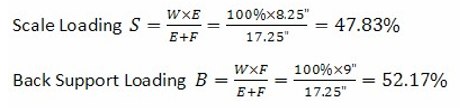

When using standard 2×4 lumber as a back support and aligning it with the back of the hive, the total hive weight W can be calculated from the weight on the scale S as: 

  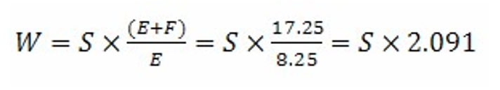

Therefore, use 2.09 as the default hive scale factor in the app if you are using this setup. This of course can be fine tuned once some weight measurement are available. 

The chart below shows the scale correction factor for different scale and fulcrum arrangements. The X-Axis is the position of the fulcrum point in inches from the back of the hive. The different lines represent the scale centerline position in inches from the back of the hive. Arrows show the example above. 

  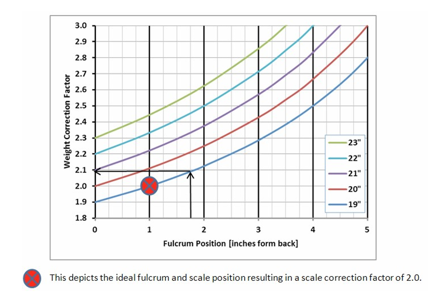

​       

b) Alternate Arrangement 1 

Based on the above, the auxiliary support should be placed 1” from the back of the hive. It is recommended to attach a trim piece on top of the 2×4. This will help for accurate positioning of the auxiliary support. 

  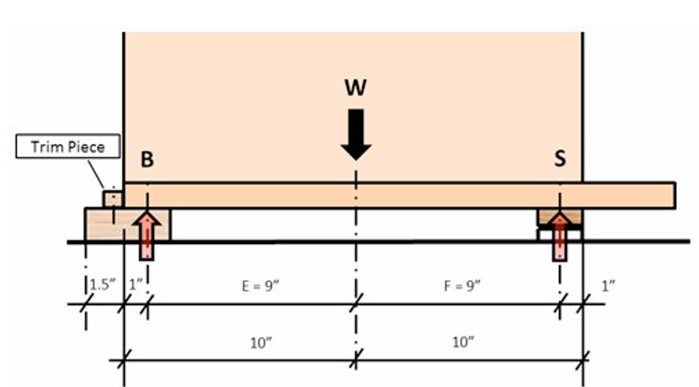

Now we have equal moment arms E and F and the hive scale correction factor becomes 2.0 which is the default in the mobile app. There are however some other influence factors which should not be overlooked. The real fulcrum point of the auxiliary support is anywhere between the back of the hive and the front of the aux support due to variations of the support system levelness and potential warpage of the 2×4 itself. 

  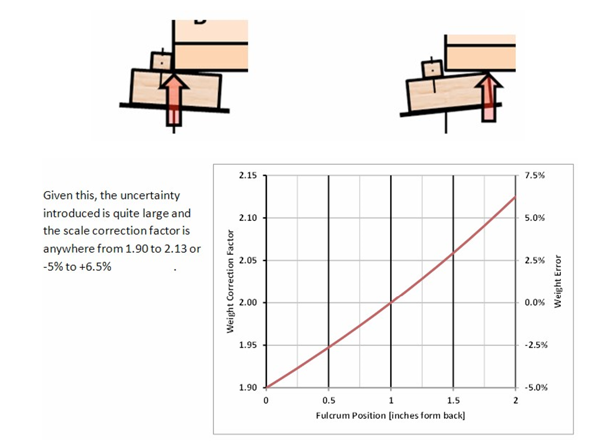

  

​       

c) Alternate Arrangement 2 

A different support system can be used which has a defined fulcrum point and is not affected by the alignment of the support structure: 

Take a piece of pine or oak, about ¾” thick and 2” wide. Length needs to be the width of the hive. Cut a small kerf into it. The kerf needs to be as deep as the width of the saw blade. Attach this piece to the underside of the bottom board of the hive. Align it flush with the back. Then place a piece of 1” by 1/8” 6061 or 6063 aluminum angle, same length as the wood strip, under it to support the hive. The corner of the aluminum angle rests in the kerf. The total hight of the aluminum angle and the wood needs to be equal or slightly bigger than the scale height to ensure the hive is level or even slightly tilted forward to ensure water drainage away from the hive entrance. 

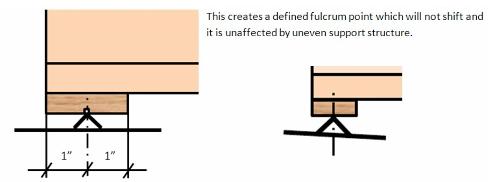

  d) Lateral Balancing 

All of the above support systems are affected by undefined lateral weight shift since the hive is resting on more than three points. There are two points at the front inside the hive scale and a linear support at the back of the hive. This could lead to overload on one of the load cells in the scale and therefore, lateral balancing is typically required if the support system under the hive is not one continuous platform, i.e. separate cinder blocks for the front and the back of the hive. 

Read the weight from each load cell individually by switching to the real time display with the app. In this mode, the weight on the scale is shown as %Left, % Right. The right hand side of the scale is the side with the device identification sticker. No further action is required if the L/R difference is less than 10%. 

If not then shim the scale on the side with the lower weight reading until the weight readings match. Alternatively, shimming can also be done under the back support on the opposite side of the low weight reading. 

​       

e) 3-Point Hive Support 

  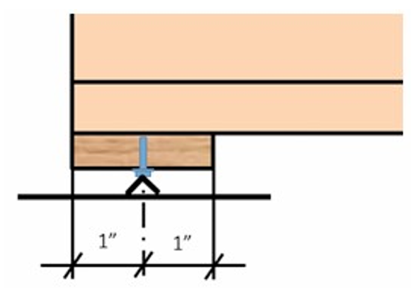

There is a way to alleviate the need for lateral balancing by introducing a true 3-point support system. The parts are similar to the ones used in arrangement 2 but instead of using a 1” angle, for this arrangement you will need a ¾” angle. A 7/32” hole is drilled in the middle of the board instead of cutting a kerf. A ¼” x 0.5” slotted machine screw is used as center support. The screw will cut its own threads into the board. The slot in the screw head is aligned so that it can rest on the edge of the aluminum angle in a single point without sliding off. 

  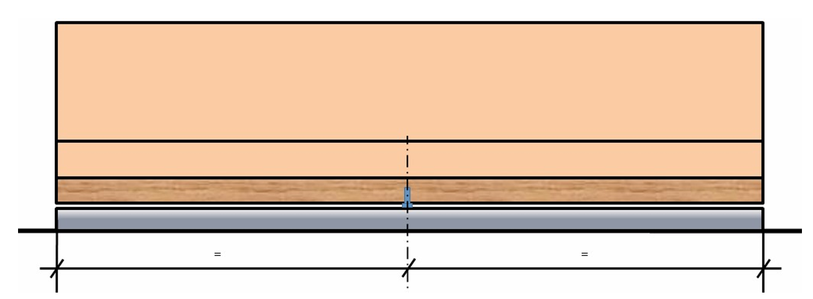

There is a small gap between the aluminum angle and the wood board. It has to be ensured that this gap is even width across the hive. The screw in the middle should be the only contact point. This will ensure that the correct weight is measured and at the same time it is the “safety net” against the hive falling over if excessive uneven loading is taking place, i.e during hive inspections. 

​       

f)  BroodMinder Scale Positioning 

Most of the above has been dealing with the auxiliary support. Let’s focus now on the scale positioning. 

As shown in the previous sections, it is desirable to have the front face of the scale placed in line with the front face of the hive body. Moving it further in would improve accuracy at the expense of hive stability and moving it further out would reduce accuracy with little improved hive stability. 

  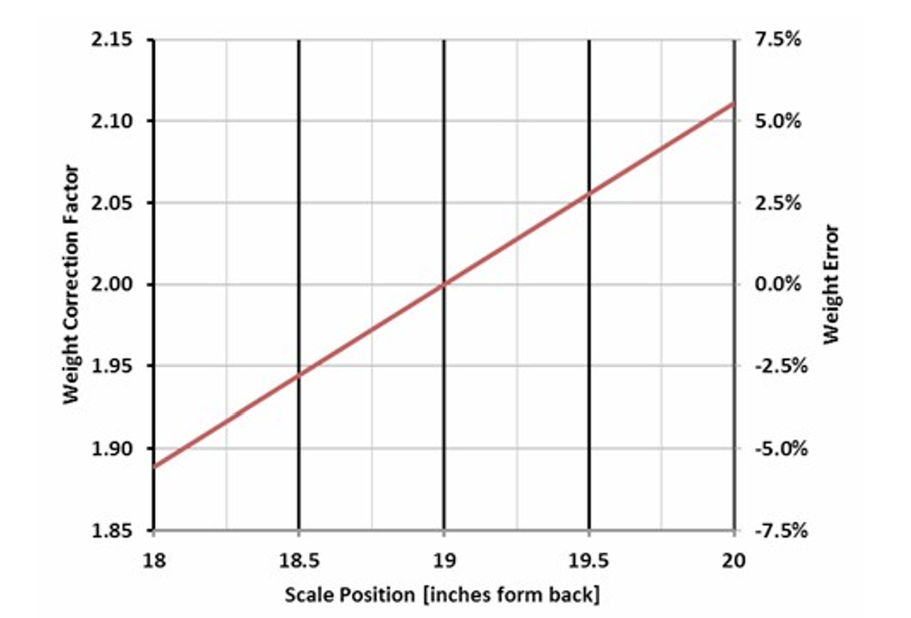

This chart shows the influence of scale placement on the scale correction factor and scale error introduced due to inaccurate positioning of the scale. The influence is 5.6% per inch 

 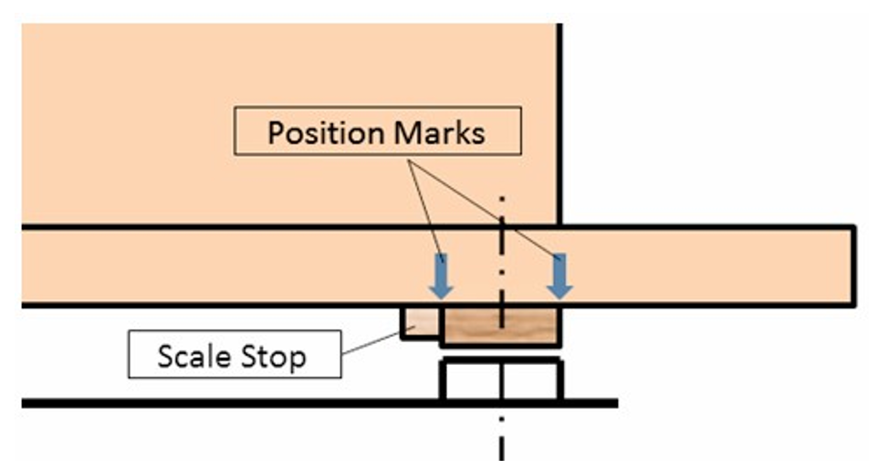 

It is advisable to mark the scale position on the bottom board of the hive or to attach a mechanical stop. This will help to put the scale back into the same location after it has been pulled for a battery change or some other reason. 
