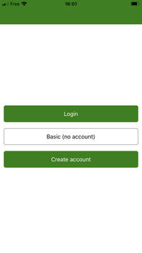
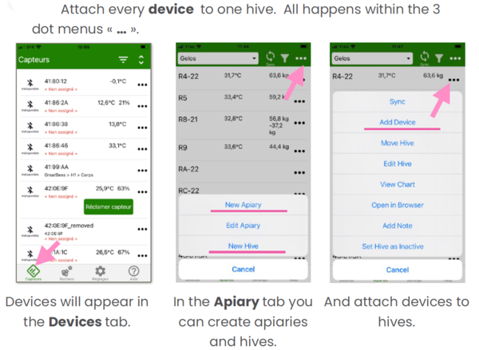
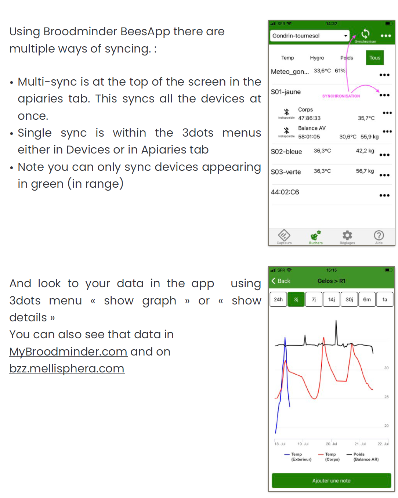

# Quick Start Guide

We have done our best to make the installation and usage of your BroodMinder intuitive and easy. 

## Follow these steps

## Note the following best practices:

### Use our video library

Watch the video help "[Quick Start with CS Kit](https://youtu.be/6WicH4_l2FQ)"

### Identify your hives

1, 2, 3, A, B, C, *, # : do what it takes to identify your hives, it will be much better.

### Prepare everything AT HOME

Make sure the system is functional before installing it in the apiary, then it will be less easy to set up.

### Follow the steps one by one

By following the steps in this guide one by one and doing what is advised, there will be no worries.

### Need help?

[Support@BroodMinder.com](mailto:Support@BroodMinder.com)

-----

## 🏠 START AT HOME
###  1. Install BroodMinder Bees

Download [Broodminder Bees](https://mybroodminder.com/beesapp) from your preferred store. Scan this QR code to be headed to it :

###  2. Create your account

Create your account into the Bees App. A single account for everything : App and Web MyBroodminder.

In BeesApp, on the Apiary tab, create your first *apiary* and your first *hive*, they will be needed for the next steps.

###  3. Activate your devices

###  4. Assign devices to hives

###  5. Make your first sync

## 🐝 NOW MOVE TO THE APIARY

###  6. Install devices in hives

Install BroodMinder-T and -TH in the middle frame (usually n°5) starting from the left side seen from the rear of the hive. T2 shall be over the brood box and TH over the super.

Place your BroodMinder-W scale at the rear side of the hive. Make sure that the hive is leveled as well as possible. 

###  7. Update start date/time

To avoid having measurements from outside the hive, change the start date of the sensors.
To do so, go to `BeesApp > Apiaries > unfold the hives to see the sensors > "..." > Change the current position`. 
Edit the `start date/time`.

###  8. Explore and discover

Now you can also go to MyBroodMinder.com and explore your data.

In this interface you will be able to follow the brood levels, the weight gains and losses, configure your alerts or even the past and forecasted weather as well as the nectar-flow indexes  and much more!

!!! note
    Attention: Some data is computed daily and you will begin to see it from D+3 (D1 does not count because partial data, D2 will be the first complete day which will be posted the following day => D3)

