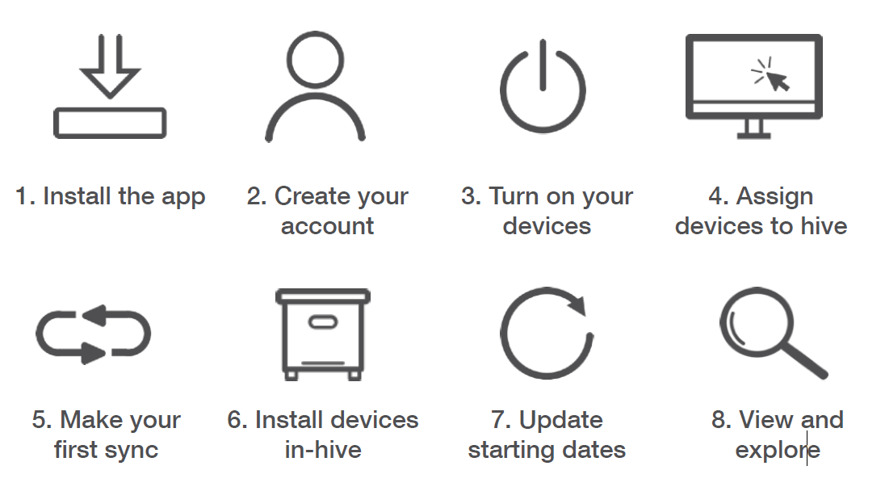
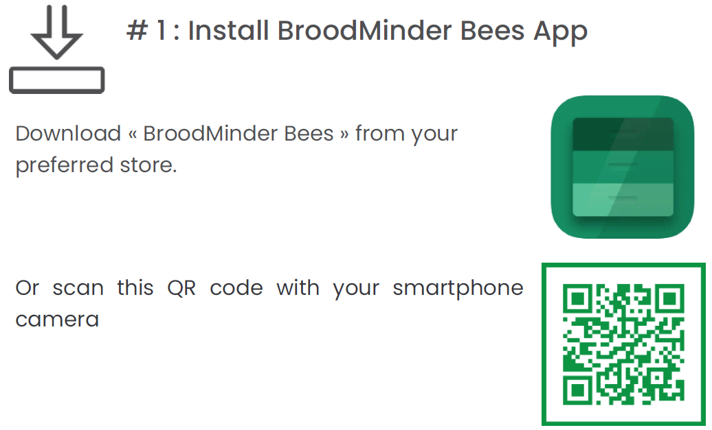
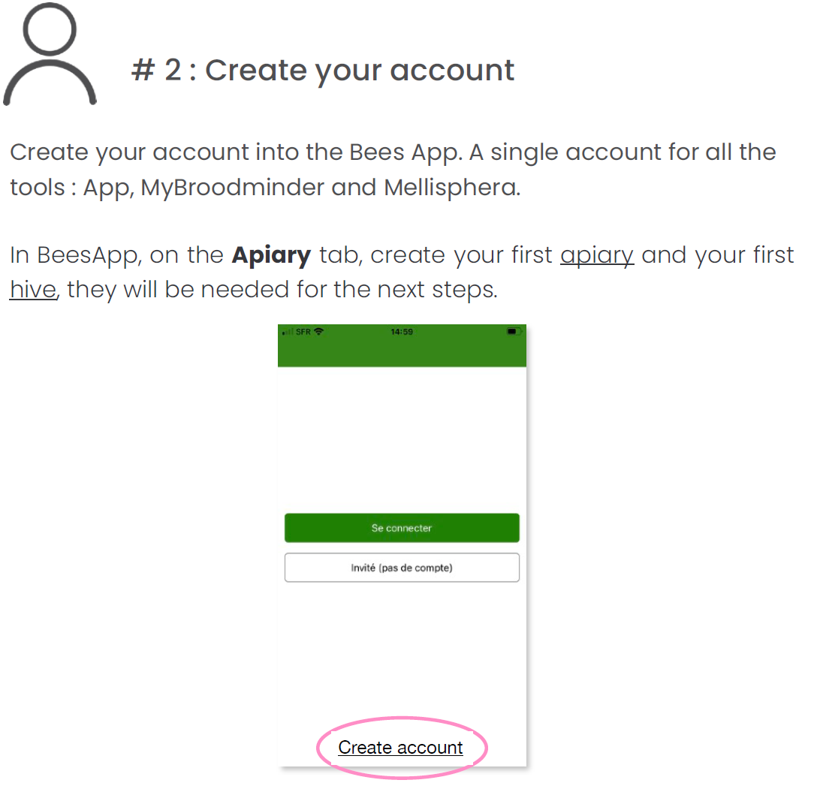
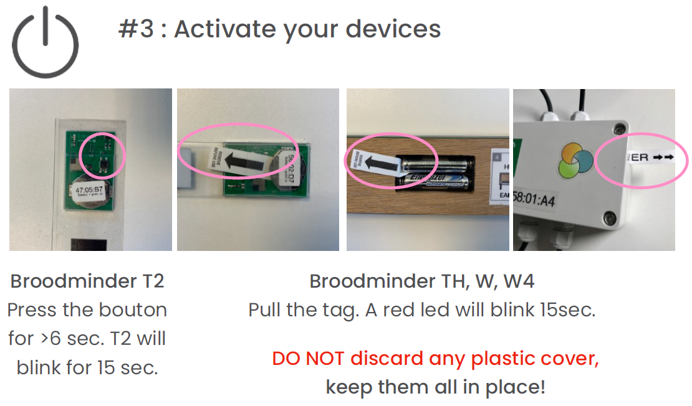
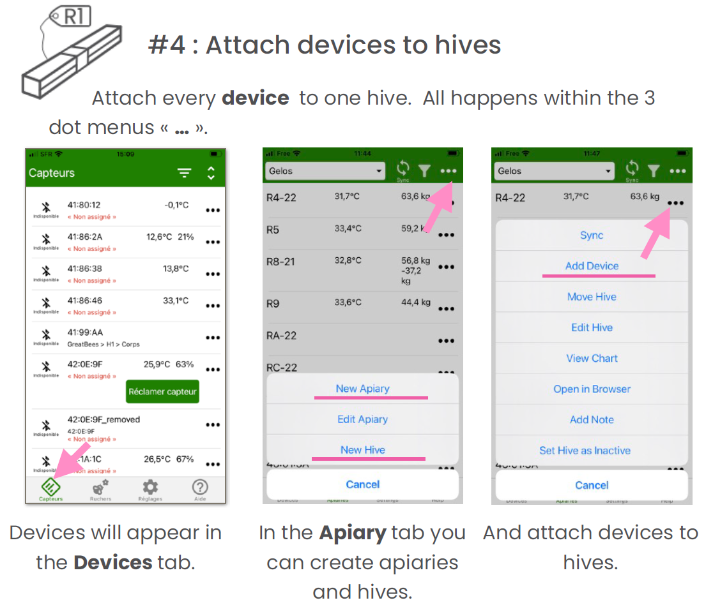
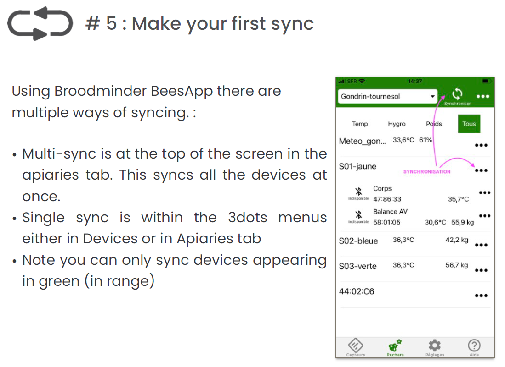

# Quick Start Guide

We have done our best to make the installation and usage of your BroodMinder intuitive and easy. 

### Follow these steps

## Note the following best practices:

## Use our video library

Watch the video help "[Quick Start with CS Kit](https://youtu.be/6WicH4_l2FQ)"

### Identify your hives

1, 2, 3, A, B, C, *, # : do what it takes to identify your hives, it will be much better.

### Prepare everything AT HOME

Make sure the system is functional before installing it in the apiary, then it will be less easy to set up.

### Follow the steps one by one

By following the steps in this guide one by one and doing what is advised, there will be no worries.

### Need help?

Support@BroodMinder.com

### Now you can also go to MyBroodMInder.com and see your data there.

