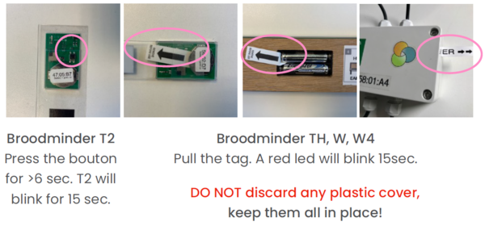
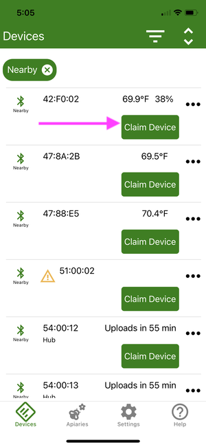
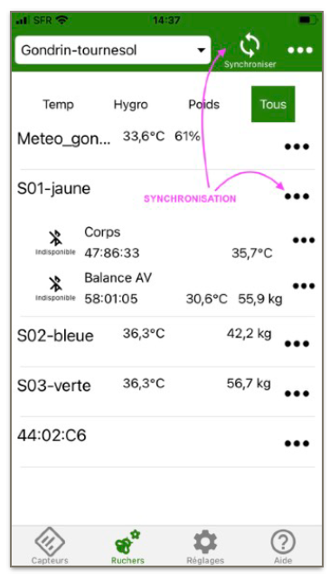
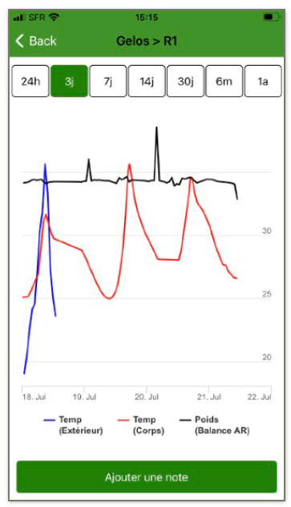
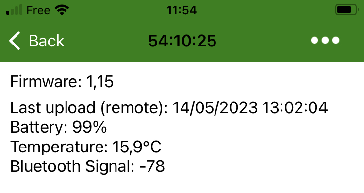
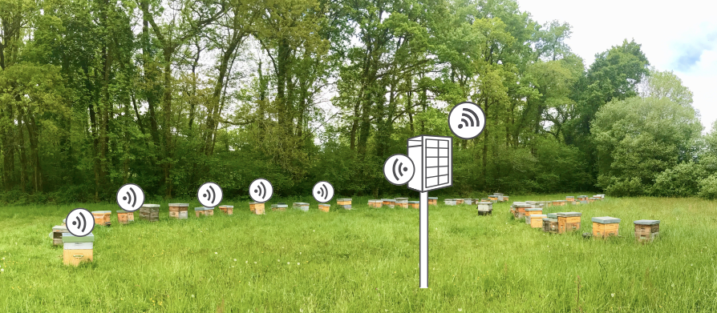

# Quick Start Guide

We have done our best to make the installation and usage of your BroodMinder intuitive and easy. 

## Follow these steps

| | |  | |
| -- | -- | -- | -- |
| AT HOME   |  | | 
| 1. |   | Install the App | 
| 2. |   | Create your account | 
| 3. |   | Power your devices | 
| 4. |   | Assign to a hive | 
| 5. |   | Make your first sync | 
| 6. |   | Power on Hub | 
| IN YOUR APIARY  |  | | 
| 7. |   | Install devices in hive | 
| 8. |   | Install your hub | 
| 9. |   | Update starting dates | 
| 10. |   | View and explore | 

## Note the following best practices:

A. Use our video library

- Watch the video help "[Quick Start with CS Kit](https://youtu.be/6WicH4_l2FQ)"

B. Tag your hives

- 1, 2, 3, A, B, C, *, # : do what it takes to identify your hives, it will be much better.

C. Prepare everything AT HOME

- Make sure the system is functional before installing it in the apiary, then it will be less easy to set up.

Need help?

- You can always contact us at [Support@BroodMinder.com](mailto:Support@BroodMinder.com)

-----

## 🏠 START AT HOME
###  1. Install BroodMinder Bees

Download [Broodminder Bees](https://mybroodminder.com/beesapp) from your preferred store. Scan this QR code to be headed to it :

###  2. Create your account

Create your account into the Bees App. A single account for everything : App and Web MyBroodminder.

In BeesApp, on the Apiary tab, create your first *apiary* and your first *hive*, they will be needed for the next steps.

In Bees you have several tabs that we will navigate :

Now go to `Hives Tab > ... > New apiary` and create an apiary and a hive.

We can then assign sensors to this newly created hive.

 

###  3. Activate your devices
In general all our devices have a pull strip.
Older models (T2) might have a push button.

!!! warning "Take care of this:"
    With any device, pulling the tab should make the board blink. If you do not see any blink, push the batteries against the + contact. Sometimes the battery holder can be stiff and avoid the spring to push them through. (mostly for AA batteries)

    Do not discard any plastic part. Keep them all in place.
    
    Check that all seals are properly installed.
    
    Verify that cable glands are tight too when appropriate.

###  4. Assign devices to hives

First you need to claim the device by clicking on the green `Claim` button found in the `Devices` tab. This operation will associate each sensor you claim to your account . 
You will then be asked to attach the sensor to a hive. You can proceed or cancel and come back later via the menu `...`. 

Attach each device to a hive. 

 

###  5. Make your first sync

Using BroodMinder Bees App there are multiple ways of syncing: 

- `Multi-Sync` is at the top of the screen in the `Apiaries` tab. This syncs all devices at once and is a Premium feature.
- `Single Sync`is within the 3dots `...`menus, either in `Devices`or in `Apiaries` tab

!!! Tip
    You can only sync devices appearing in green (within bluetooth range)

Now look to your data using `... > Show Graph` or `... > Show Details`.

!!! info
    On your first sync you probably do not see much data since there is only one or two samples.

###  6. Power-On your Hub

This stage is optional : only intended for those owning a Hub for real time monitoring.
If you do not have a Hub, move to the [next chapter](#🐝-now-move-to-the-apiary).

Remember from [Hubs page](./60_hubs/) that there are several hub versions: 

- Broodminder-T91 Cellular Hub [solar, weather, naked]
- BroodMinder-Wifi Hub
- BroodMinder-Sub-Hub

#### 6.1 Cellular Weather hub
1. Remove the orange silicon protection
2. Power ON the hub with the small black switch (use a pen tip to operate)

3. Color Leds will blink green, then blue, then green again
4. Check on Bees App that transmission has been established. Go to `Devices tab > Hub ID > Show details > MBM last upload ` shall display current date/time.

5. Install orange protection again, starting from the USB side.

6. Insert the T91 within the weather shield with the USB face sidewise to avoid condensation deposition on this and the opposite face.

#### 6.2 Cellular Solar hub
Follow the same process as above, with the difference that you will have to plug in the USB to the battery (we ship unpluged to avoid battery discharge during transport)

1. Unscrew the cover lid.
2. Insert the USB plug into the battery
3. Slide the power switch to the right

4. Hub will start and you can check data transmission using Bees App as described above.

## 🐝 NOW MOVE TO THE APIARY

###  7. Install devices in hives

Install BroodMinder-T and -TH in the middle frame (usually n°5) starting from the left side seen from the rear of the hive. T2 shall be over the brood box and TH over the super.

Place your BroodMinder-W scale at the rear side of the hive. Make sure that the hive is leveled as well as possible. 

###  8. Install your hub

This stage is optional : only intended for those owning a Hub for real time monitoring.

As a general rule for any kind of hub you should know that
- overall range for Hub <=> internal devices is ~ 10 meters (30ft)
- overall range for Hub <=> external devices is ~ 30-40 m

!!! Important 
    - hubs should be located at least at 1.5m height from the ground (Cellular and Wifi reception damps A LOT when close to the ground) 
    - avoid direct sun exposition

There are multiple ways to install the hub
- solar versions can go on a pod or mural or even on hive

- other cell versions and SubHubs install nicely within the weather shield

Now check Connectivity
- Check hub connectivity with Bees App (in the `devices Tab > hub ID > ... > Show details`)
- You should have a Network signal greater than 20% to be comfort.

###  9. Update start date/time

To avoid having measurements from outside the hive, change the start date of the sensors.
To do so, go to `BeesApp > Apiaries > unfold the hives to see the sensors > "..." > Change the current position`. 
Edit the `start date/time`.

###  10. Explore and discover

Now you can also go to MyBroodMinder.com and explore your data.

In this interface you will be able to follow the brood levels, the weight gains and losses, configure your alerts or even the past and forecasted weather as well as the nectar-flow indexes  and much more!

!!! info
    Attention: Some data is computed daily and you will begin to see it from D+3 (D1 does not count because partial data, D2 will be the first complete day which will be posted the following day => D3)

