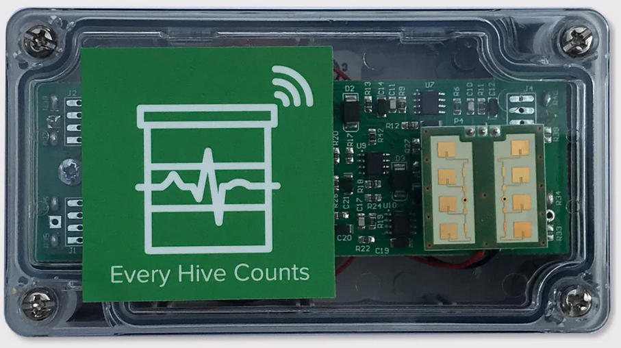

# Sensors

## Installing your Broodminder sensors - Location, Location, Location

### Device locations

The Citizen Science Package contains two Broodminder-TH (temperature and humidity) or T2 (temperature only) Devices and a Broodminder-W hive scale. Here is where you install these devices:

### Broodminder-TH2SM (BRM-56)

We introduced the BroodMinder-TH2SM in May of 2020. This sensor will also watch for temperature events such as swarms. Any time the sensor see as 4 degree F (2C) increase in temperature (when brood is present) then the sensor records the 30 minutes before and 40 minutes after with 1 minute resolution and sets a flag indicating a temperature event has occurred. See the data interpretation section for more information. 

All Broodminder-TH device IDs start with 56 so they should be easy to recognize. The normal placement of the sensor is on top of the frame near the middle of the hive box of interest. This position is chosen for several reasons:

- Heat rises, therefore the sensor will feel the heat of the brood below.

- The brood tends towards the middle of the hive and then surrounds the brood with pollen and honey. Placing the temperature sensor here has the best chance of sensing the brood.

- Using this standardized position allows for cross-hive comparisons across the world.

If you are in a cold climate and you overwinter in more than two boxes, then you may want to move the sensors up to under the inner cover. This is because as the cluster moves above a sensor, that sensor tends to sense the outside temperature (since heat rises).

By placing the Broodminder-TH sensor right below the inner cover, you will sense the heat of the entire hive.  Condensation is very likely when it reaches 100% and you may want to inspect the hive and take appropriate action if necessary.

Note: Relative humidity (RH) depends both on moisture in the air and temperature. As temperature goes down, RH goes up. A good example is when RH = 100% outside dew forms. The same thing will happen in your hive.

If you move the Broodminder-TH to the top, then you may want to move the other Broodminder-TH to right below the top box. That way you will see as the cluster moves up past this box.

As a final note, the Broodminder-TH is thin enough that if you want to experiment with different positions such as between the frames you can. We would love to know how this works for you and what you learn.

Whatever position you choose, you can add a tag to the data using the Broodminder app. We'll talk about doing that in a later chapter.

The CR2032 battery is replaceable by opening the wrapper. It should last more than a year and we recommend replacement each fall before the low temperatures of winter.

### Broodminder-T2SM (47)

We introduced the BroodMinder-T2SM in May of 2020. This sensor will also watch for temperature events such as swarms. Any time the sensor see as 4 degree F (2C) increase in temperature (when brood is present) then the sensor records the 30 minutes before and 40 minutes after with 1 minute resolution and sets a flag indicating a temperature event has occurred. See the data interpretation section for more information. 

All BroodMinder -T2SM device IDs start with 47 so they should be easy to recognize. The BroodMinder-T2 (**Temperature**) is a cost reduced version of the BroodMinder-TH2. It will sense the hive temperature which will indicate brood rearing during the season and winter survival during the winter. Place it above where you believe most of the brood activity will be. In the winter we suggest that you put it on the frames of the upper most hive box so that it catches all of the rising heat from the cluster.

The T2 exists in 2 versions. One with a button, and one without a button.

For the version with no button, just remove the "remove before use" tag and it will run automatically.

The button version is a little more complicated.

For the button version, to turn on the BroodMinder-T2, press the button for 10 seconds. **The LED will flash 10 times to indicate success. IF YOU DON’T HOLD THE BUTTON LONG ENOUGH, YOUR T2 WILL SHUT DOWN AFTER ABOUT 10 SECONDS.** If you ever want to know if the -T2 is operating, press the button again, and the LED will flash momentarily to indicate the battery is fine and the device is operating.

To change the battery, simply cut the tape on three sides around the circuit board. Then swing the board out and replace the battery with a new CR2032. Be sure to seal the circuit board again using packing tape.

If you want to turn off the T2, you must do it with the BroodMinder app. 

- Find the device and select the graph screen.

- Choose device settings (the gear in the upper right corner of the screen).

- Choose Sample Rate then choose “Power Off”. This is only available for T2 devices.

- Go back to the graph screen and sync the device. After it finishes, it will power off the T2.

### Broodminder-W (BRM-57)

The Broodminder-W ( **W**eight) goes under the hive. There is an extensive writeup about positioning the scale in appendix A. That is a good thing to read, but if you are in a hurry, here are the basics.

The CR2032 battery is replaceable. It should last more than a year and we recommend replacement each fall before the low temperatures of winter.

_NOTE: the most typical error source is inadequate support under the scale. This can result in strange behavior as the hive flexes as it expands and contracts due to sun, rain, temperature, etc. Providing a flat support will improve results. An easy fix is to place a ¾" plywood sheet (or equivalent) under the scales._

_ADDITIONAL NOTE: If all you want to see is honey flow, good support is not required. You will just have to ignore the daily fluctuations. You will still be able to observe the overall change in weight._

#### Place the scale in the shade

The Broodminder-W has a temperature sensor inside which reads the local temperature. For the temperature to be accurate, it should be shaded from direct sun. This temperature is also used to compensate the weight sensors so avoiding the temperature spike created by direct sunshine will improve performance.

Being in the shade will also extend the housing life. We use UV resistant plastic, but in the direct sun even that will become degraded. If this happens, you can order a new housing on Broodminder.com.

#### Get the Broodminder-W level

We have done our best to make installation simple. However, you need to pay attention to a couple of things.

Make sure the hive is level. This doesn't mean "crazy level" but if your hive looks like the Leaning Tower of Pisa, then you won't get good results. 2x4's and shims are your friends. By using a few 2x4's and shims creatively, you can level almost anything! We also find that screwing the 2x4's together makes life better and more stable.

After you install the Broodminder -W, look at the end of it. Through the plastic cover, (remember… install it _with_ the plastic cover), you will see the upper wooden piece and the lower aluminum piece. Make sure that they do not touch. This will ensure that all the weight is sitting on the two little buttons on top of the aluminum base and not somewhere else.

#### Typical installation, not as accurate

Using the typical installation, you will see small changes to the hive however, the absolute accuracy will not be as good. For improved accuracy, see the recommendations of the next section.

The Broodminder-W is designed to measure ½ of the hive weight. To do this, we want you to support one side of the hive (front or back, left or right) with a 2x4 or similar [However, we recommend that you use a piece of 2" angle for the support. By orienting it so that the point of the angle iron is up, it gives a very precise pivot point. You should be able get this at your local hardware store. Aluminum is extra nice because it won't rust. A great place to get just what you need for less than $5 each is [Speedy Metals](https://www.speedymetals.com/pc-2186-8344-2-x-2-angle-6061-t6-aluminum-extruded.aspx)(1/8" {A} x 2" {B} x 2" {C} Angle 6061-T6 Aluminum, Extruded).]

The Broodminder-W is placed under the opposite side.

There is a nice explanation of the math and physics involved in Appendix A, however it boils down to this. **Do your best to place the support and the scale directly under the wall of the hive body.** That will give good results.

#### Better installation, more accurate 

A better way to install will require a few modifications to your bottom board. You will make a couple of small cuts that will be used to accommodate precise and repeatable placement of the scale and support.

First off, we recommend that you use a piece of 2" angle for the support. By orienting it so that the point of the angle iron is up, it gives a very precise pivot point. You should be able get this at your local hardware store. Aluminum is extra nice because it won't rust. A great place to get just what you need for less than $5 each is [Speedy Metals](https://www.speedymetals.com/pc-2186-8344-2-x-2-angle-6061-t6-aluminum-extruded.aspx)(1/8" {A} x 2" {B} x 2" {C} Angle 6061-T6 Aluminum, Extruded).

Now we want to make the cuts in the bottom board. For this setup we recommend using front and back supports and not side to side. That given, you must choose whether to place the Broodminder-W under the front of the hive, or the back of the hive.

In general, it is better to place the Broodminder-W out of the sun. This is because the sun will heat the scale and give you a false reading of the outside temperature. Placing it in the shady side of the scale avoids this problem. It will also make the housing last longer.

Next you will cut the bottom board. For the angle iron side, you will cut a groove the width of your saw blade that the point of the angle will fit in. For the scale side, you will cut a notch 3/16" deep that ends 1" inside the center of the hive body wall. See the images below.

## BroodMinder-BeeDar

New in 2023, the BroodMinder-BeeDar is an activity monitor for your hive. 

- Radar is used to detect the number of flying bees. The radar emits from the square, green and gold sensor. This should be approximately over the entrance.
- Audio is used to detect the overall sound level of the hive. The audio sensor is mounted to the back of the box and couples to your beehive by screwing the BroodMinder-BeeDar to your hive box which then acts a bit like a guitar.

The BeeDar was invented by Dr. Herb Aumann from the University of Maine and Main Biosensors LLC. There is a nice academic paper about it here.

 https://www.researchgate.net/publication/349017653_Janus_A_Combined_Radar_and_Vibration_Sensor_for_Beehive_Monitoring

Installation is easy

- Remove the BeeDar lid and remove the 2 loose flat screws.
- Pull out the "Remove Before Use" tag. The LED on the circuit board should flash for several seconds. If it doesn't, then you might need to remove the one screw which holds the circuit board, take out the board and check the batteries. (Sometimes a part of the tag can rip and remain under the battery terminal.)
- Screw the BeeDar to your hive using the flat head screws and the holes that are in the upper right and lower left of the BeeDar.
- Replace the lid and tighten the screws making certain that the gasket is in place correctly.

The BeeDar senses motion and is tuned to be particularly sensitive to bees. When it collects data, it will record the motion for 30 seconds and then take the average. By default this will happen every 15 minutes. Data is transferred to MyBroodMinder just like every other BroodMinder device.

The sensitivity of the BeeDar is a fan beam emanating from the radar sensor. The box should be mounded level and do not point it up by tipping the box backwards (such as on an angled landing board). This will do a good job of sensing rain falling which is not the goal.

Note: The BeeDar audio will not work as well with a plastic hive as with a wooden hive due to the acoustic properties of plastic.

## Routine Maintenance

There is not much routine maintenance that is required. Please note that if your batteries are lasting less than 6 months, something is wrong and you should contact [Support@Broodminder.com](mailto:Support@Broodminder.com) for replacement or refurbishment.

### Spring

We have a video talking about spring maintenance on the support page at [mybroodminder.com/resources](https://mybroodminder.com/app/resources).

In the spring, it is a good time to clean up your devices. You can use 91% or better Isopropyl or Ethyl Alcohol, it will not harm the electronics.

You can place the wrappers in the freezer and then propolis will break off more easily.

**Ensure that the scale wrapper is not cracked, that will allow rain to harm the sensors.** You can seal any cracks with packing tape.

We also have replacem ent wrappers for all the devices on our website at Broodminder.com.

We also offer Refresh service where we replace the housings and batteries and test the devices. This is a very good option every couple of years to ensure that your devices are operating properly. There is more information at https://broodminder.com/collections/service-warranty/products/refresh-broodminder-t2

### Fall

Prior to winter, replace all of the batteries in your BroodMinders. (A good place to buy them is Amazon.com or Digikey.com. You can get them for less than $0.50 each). 

**Ensure that the scale wrapper is not cracked, that will allow rain to harm the sensors.** You can seal any cracks with packing tape or order replacement wrappers at Broodminder.com.

## Device Software Updates

The Broodminder-T2 and the Broodminder-Hub devices have provision for Over-The-Air (OTA) upgrades. These are performed by the Bees app. For more information, go to this link.

[mybroodminder.com/resources](https://mybroodminder.com/app/resources)