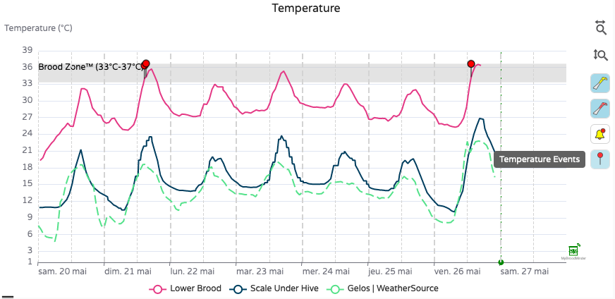
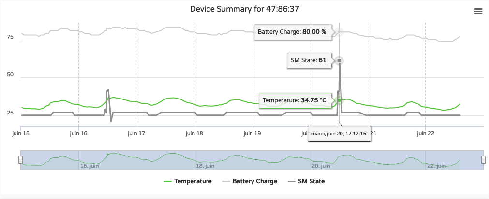
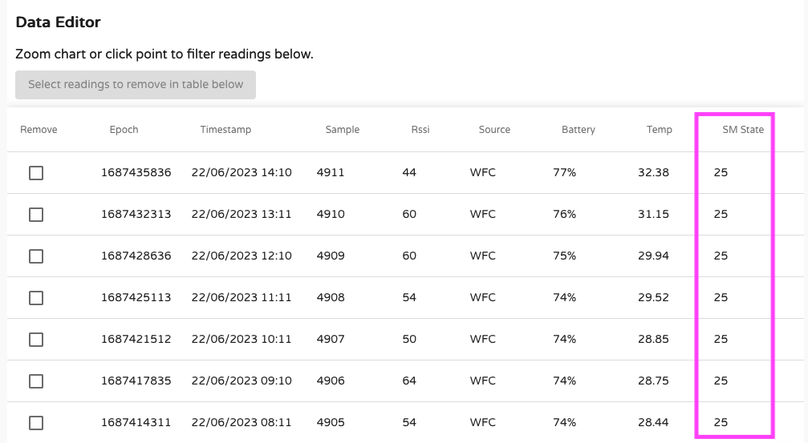

## Broodminder-TH (56)

This sensor measures in-hive temperature and humidity and will also watch for temperature events such as swarms. Based on those informations we will be computing Brood level, hive fitness and a set of specific alerts (hotter and colder limits, excessive humidity..) 

The first BroodMinder-TH was released in 2016. It was model 42 and was evolved into TH2 back in 2019. The SwarmMinder (see below) version TH2SM was introduced in May of 2020 evolving to model 56. In 2023 it was evolved to TH3 which is the current version distributed. 

### Installation

All Broodminder-TH device IDs start with 56 so they should be easy to recognize. The normal placement of the sensor is on top of the frame near the middle of the hive box of interest. This position is chosen for several reasons:

- Heat rises, therefore the sensor will feel the heat of the brood below.

- The brood tends towards the middle of the hive and then surrounds the brood with pollen and honey. Placing the temperature sensor here has the best chance of sensing the brood.

- Using this standardized position allows for cross-hive comparisons across the world.

If you are in a cold climate and you overwinter in more than two boxes, then you may want to move the sensors up to under the inner cover. This is because as the cluster moves above a sensor, that sensor tends to sense the outside temperature (since heat rises).

By placing the Broodminder-TH sensor right below the inner cover, you will sense the heat of the entire hive.  Condensation is very likely when it reaches 100% and you may want to inspect the hive and take appropriate action if necessary.

Note: Relative humidity (RH) depends both on moisture in the air and temperature. As temperature goes down, RH goes up. A good example is when RH = 100% outside dew forms. The same thing will happen in your hive.

If you move the Broodminder-TH to the top, then you may want to move the other Broodminder-TH to right below the top box. That way you will see as the cluster moves up past this box.

As a final note, the Broodminder-TH is thin enough that if you want to experiment with different positions such as between the frames you can. We would love to know how this works for you and what you learn.

Whatever position you choose, you can add a tag to the data using the Broodminder app. We'll talk about doing that in a later chapter.

!!! Note
    Do not forget to adjust the actual date/time you installed the device in hive. It is necessary to start with clean data from the onset, otherwise (if you powered on a few days before) the brood estimation will start with the data from your livingroom!

### SwarmMinder
SwarmMinder is a special feature of BroodMinder TH and T. The device is scaning for sudden thermal variations. It enters a decision loop that depending on how in-hive conditions evolve, might end-up trigering a *Themperature Event*. 

See below the details of this feature.

### Maintenance

The CR2032 battery is replaceable by opening the wrapper. It should last more than a year and we recommend replacement each fall before the low temperatures of winter.

If your plastic wrapper gets used by time, you can order new ones and replace them during your winter service.

## Broodminder-T (47)

The BroodMinder-T (**Temperature**) is a cost reduced version of the BroodMinder-TH. It will sense the hive temperature which will indicate brood rearing during the season and winter survival during the winter. We will be computing Brood level, hive fitness and a set of specific alerts (hotter and colder limits..) 

BroodMinder-T was introduced in 2019 as model 41 and evolved to the SwarmMinder version BroodMinder-T2SM in May of 2020 becoming model 47. 

### Installation

All BroodMinder-T device IDs start with 47 so they should be easy to recognize.
However, they exist in 2 versions :

- Broodminder-T2 with a button (until febr. 2023), 
- Broodminder-T3 without button (from febr. 2023 ahead ).

For the version with no button, just remove the "remove before use" tag and it will run automatically.

The button version (T2) is a little more complicated. to turn on the BroodMinder-T2, press the button for 10 seconds. **The LED will flash 10 times to indicate success.**

!!! Warning
    IF YOU DON’T HOLD THE BUTTON LONG ENOUGH, YOUR T2 WILL SHUT DOWN AFTER ABOUT 10 SECONDS.

If you ever want to know if the -T2 is operating, press the button again, and the LED will flash momentarily to indicate the battery is fine and the device is operating.

The normal placement of the sensor is on top of the frame near the middle of the hive box of interest. See the TH section above for the full explanation.

!!! Note
    Do not forget to adjust the actual date/time you installed the device in hive. It is necessary to start with clean data from the onset, otherwise (if you powered on a few days before, the brood estimation will start with the data from your livingroom!)

### SwarmMinder

Broodminder-T model 47 also operates with SwarmMinder. Find all the details in the paragraph below.

### Maintenance

BroodMinder-T2 : 
To change the battery, simply cut the tape on three sides around the circuit board. Then swing the board out and replace the battery with a new CR2032. Be sure to seal the circuit board again using packing tape.

If you want to turn off the T2, you simply have to push long on the button and it will power off. You can double check by pushing again short : the led should not flash.

## SwarmMinder Details

Every SM device (T or TH) is reading temperature once per minute. Then it compares current and prior values looking for specific changes.
It watches for a minimum temperature change to be obtained. Once achieved, it watches for a temperature increase of at least 1°C from 30 minutes prior. That increase must continue for between 2 and 20 minutes and be followed by a temperature decrease.

Any time the sensor sees a 4°F (2°C) increase in temperature (when brood is present) then the sensor records the 30 minutes before and 40 minutes after with 1 minute resolution and sets a flag indicating a temperature event has occurred. See the data interpretation section for more information. 

Those informations are displayed at 3 different levels

1. At hive level you will only be notified of Temperature Events (ie. SM triggered).
Those events are materialized by red needdles displayed on the temperature curve. And you can choose wether you want to see them or not clicking on the corresponding icon available on the right side menu bar. 

2. At the device level you have the hole series of SM codes displayed on the graph. It is called `SM State`

3. This same data is displayed on the respective table and of course can be exported to csv, just in case you would like to play a bit more with it.

#### SwarmMinder State Codes (Models 47, 56)

The following numeric codes (base 10) will be displayed in the `SM State` value.

SWM_STATE_STOPPED

    00 SM Stopped
    01 Initialization complete - stopped
    02 Stopped: by STOP request

SWM_STATE_CHECKING

    20 Start checking for swarm event
    21 Buffering temperature data
    22 Temperature < Hive Base Temp (32.5C, 90.5F)
    25 Buffered Hive Temp < Hive Base Temp 
    29 SWARM EVENT DETECTED

SWM_STATE_LOGGING

    40 Swarm Event Detected - start logging
    41 Still logging swarm data

SWM_STATE_WAITING

    60 Swarm Event logging complete- start waiting - swarm detection
    61 Swarm Event logging complete- still waiting

!!! Info
    The temperature event trigger will only operate if the device position is assigned to the `upper` or `lower brood box`. Since the algorithm is really only meant for brood areas, this prevent spurious triggers when the SwarmMinder devices are located elsewhere.
    
!!! Note
    It is important to note that not all `Temperature Events` are swarms. In some cases it can be the consequence of other actions like for example 
    1/ your own inspection or 
    2/ a very thin and uninsulated roof that does not protect the hive from overheating at the sun => you should think on insulating..
    3/ the colony preparing for swarming the days before it actually does.   
    We are still learning on all the different circumstances and patterns that might happen. If you want to contribute to build this knowledge and share your experience with us, feel free to drop us an email to support. 