# BroodMinder-W3 Kit Guide

## Overview

We suggest that you watch the videos on the BroodMinder.com product page.

There you will find several videos demonstrating assembly of this scale.

 The first section of this document demonstrates the fixed feet version followed by the swivel feet version.

 There is also an appendix to explain modification for Fixed to Swivel W3.

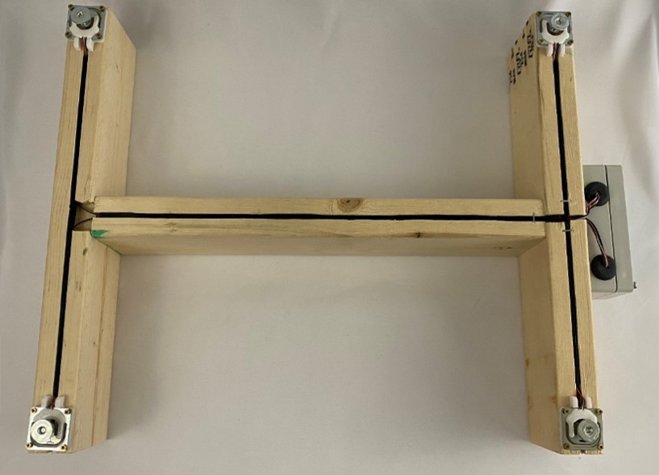

## BroodMinder-W3 Assembly - FIXED FEET

### Hardware (Fixed Feet)

| **Item Description**                                         | **Qty** |
| ------------------------------------------------------------ | ------- |
| (Picture A) Phillips Flat Head # 7 x 5/8"                    | 2       |
| (Picture B) #8x4" Drywall Screw (W3PA &  W3UA)               | 3       |
| (Picture C) #3 3/4 Phil Brass Flat Wood Screw                | 16      |
| (Picture D) Load Cell Custom Support                         | 4       |
| (Picture E) Spline Material                                  | 1       |
| (Picture F) Electronics Assembly                             | 1       |
| 16.5 Inch Pine 2x4 (User provided)   (16.5 inch or adjust for hive width) | 2       |
| 15-16 Inch Pine 2x4 (User provided)                          | 1       |

### Prepare the frame members (Fixed Feet)

- Cut your 2x4s to length. 
  - The length of the end boards should be enough to span the width of your beehive. We typically make them about 16.25”-16.50" long for a typical 10 frame Langstroth hive. The length of the connecting board is not critical but should be around 16”. 
- Cut saw kerfs (1,2,3) as shown in the picture below. They should be around 0.4” -0.75” deep. These will hold the wires from the sensors.
- Cut kerf 4 for the wires to reach the electronics box. (see picture farther down). 
- Test fit the spline and widen the kerfs if necessary.
- Remove the broad area (marked C) with a chisel so that when the 2x4 tips it does not pinch the wire.

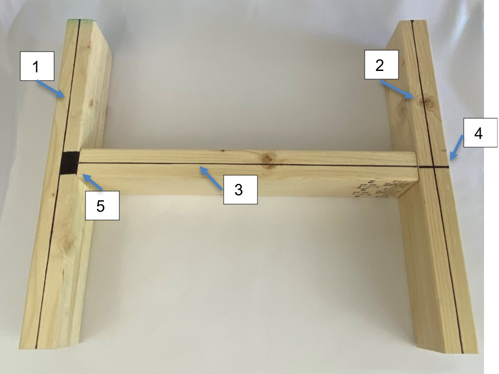

Screw together the frame (Fixed Feet)

Once you’re sure everything is where it needs to be, use 3 letter B screws to secure the boards together.

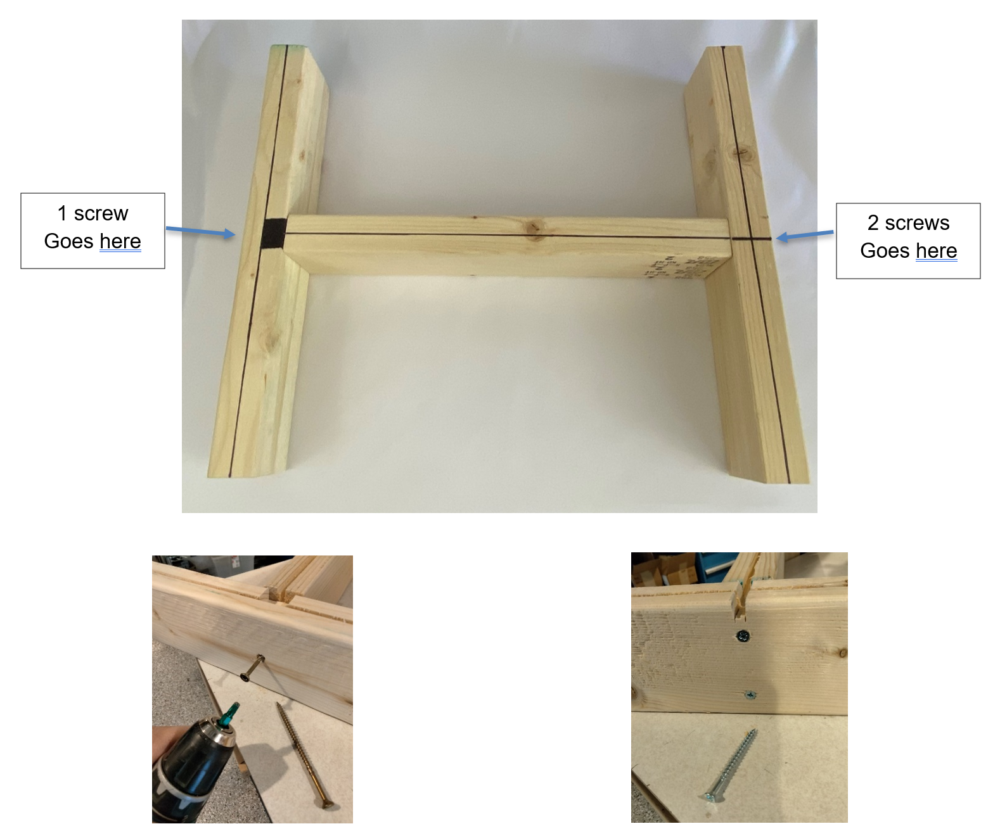

To assemble your frame, make sure you have a flat surface and ensure your pieces are square. Follow the picture above for the correct orientation of the boards. 

Leave the side with 1 screw very slightly loose so that the board may pivot.

### Attach the electronics box (Fixed Feet)

Make sure the box is located center in the frame with the hole opening as shown. There should be a slight gap between the edge of the frame and the box as shown. Use (2) “A” screws.

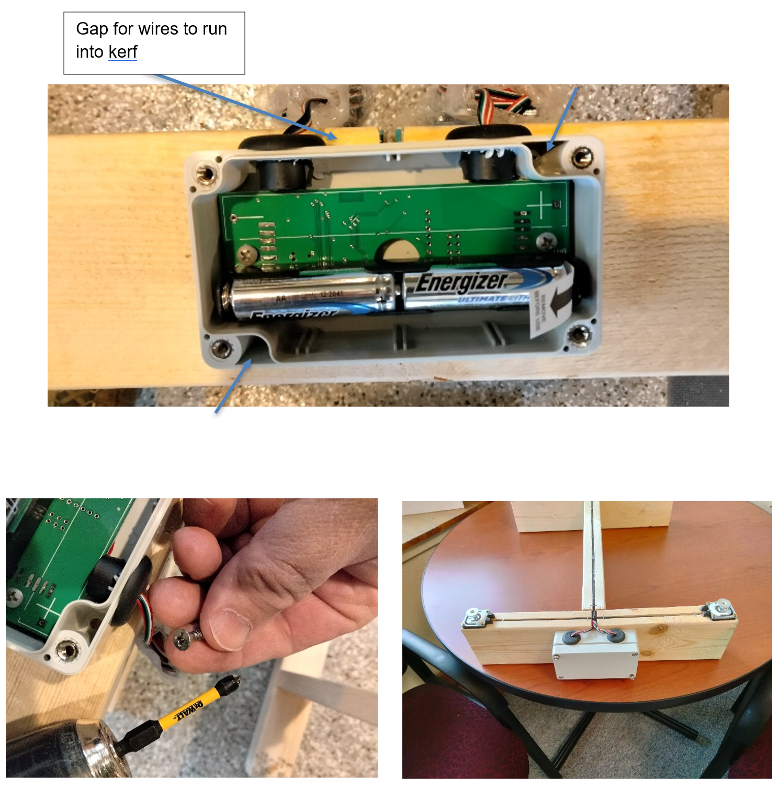

### Sensor Mounting (Fixed Feet)

Position sensors marked 1-4 as shown with mounts “D” as shown.

Use 4 “C” screws per sensor.

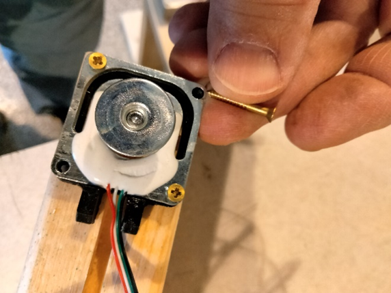

***IMPORTANT: Do not fully tighten these screws. Bending the senor will create a measurement error. Tighten then back off ½ turn.***

### Wire Routing (Fixed Feet)

Tuck the wires into grooves and secure with spline material “E”.  To secure spline material press into groove with flat object, this allows wires to move in the bottom of groove.  Do not create stress on the wires. Remove (2) circuit board mounting screws. Pull the slack wire into electronics box and fold wire behind circuit board, reinstall mounting screws. Secure spline material with staples.

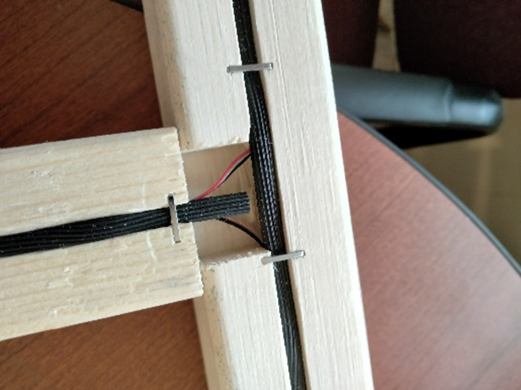

### Finish and Enjoy (Fixed Feet)

Now you can remove the battery tab and replace the lid on the electronics box and enjoy your new BroodMinder beehive scale.

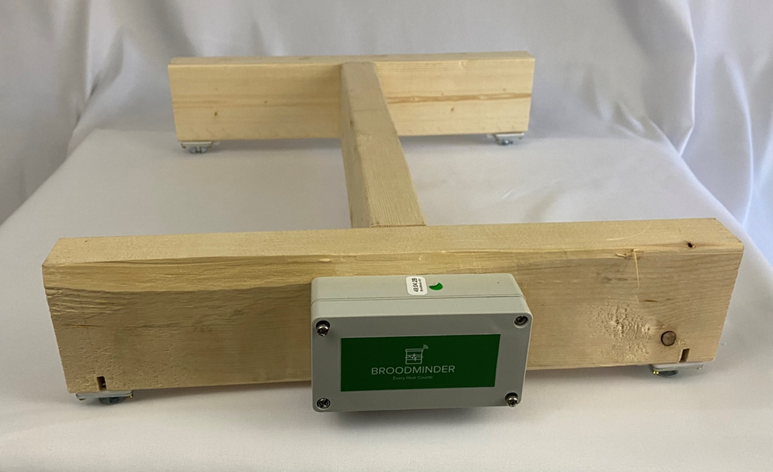

## BroodMinder-W3 Assembly - SWIVEL FEET

### Hardware (Swivel Feet)

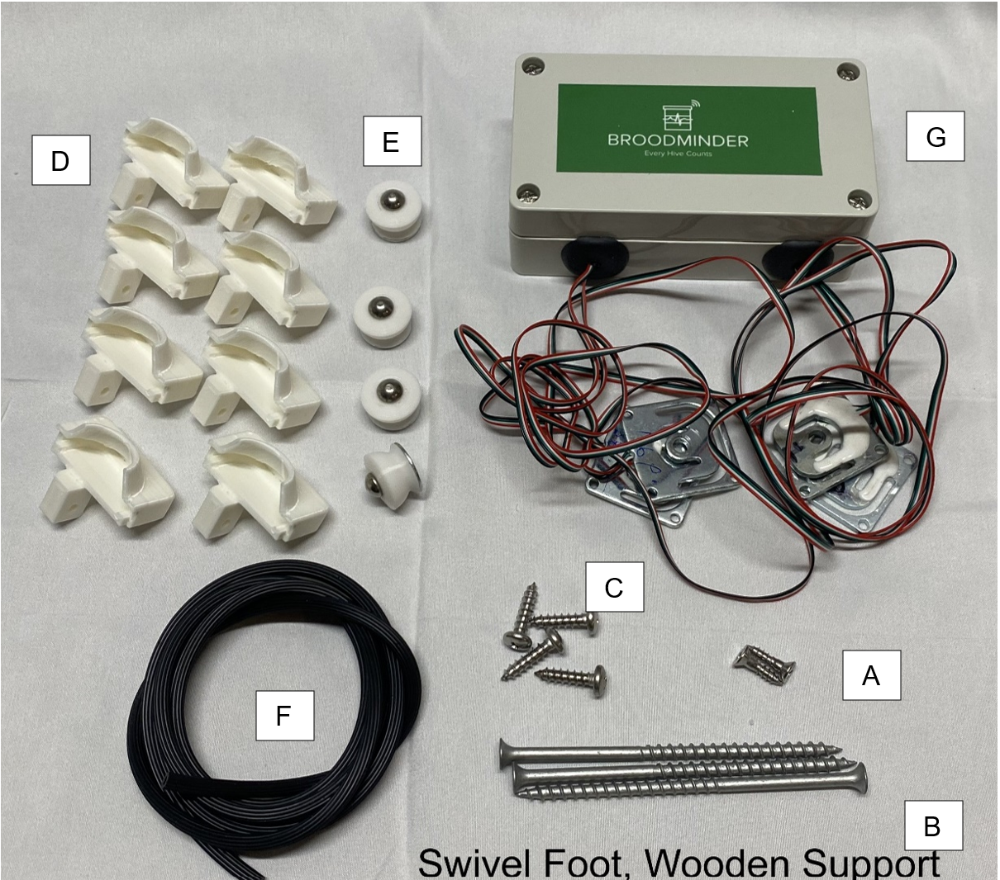

| **Item Description**                                         | **Qty** |
| ------------------------------------------------------------ | ------- |
| (Picture A) Phillips Flat Head # 7 x 5/8"                    | 2       |
| (Picture B) #8x4" Drywall Screw (W3PA & W3UA)                | 3       |
| (Picture C) #10 ¾” SS Round Head Screw                       | 4       |
| (Picture D) Load Cell Custom Support                         | 4       |
| (Picture E) Swivel Feet                                      | 4       |
| (Picture F) Spline Material                                  | 1       |
| (Picture G) Electronics Assembly                             | 1       |
| 16.5 Inch Pine 2x4 (User provided)   (16.5 inch or adjust for hive width) | 2       |
| 15-16 Inch Pine 2x4 (User provided)                          | 1       |

### Prepare the frame members (Swivel Feet)

- Cut your 2x4s to length. 
  - The length of the end boards should be enough to span the width of your beehive. We typically make them about 16.25”-16.50" long for a typical 10 frame Langstroth hive. The length of the connecting board is not critical but should be around 16”. 
- Cut saw kerfs (1,2,3) as shown in the picture below. They should be around 0.4” -0.75” deep. These will hold the wires from the sensors.
- Cut kerf 4 for the wires to reach the electronics box. (see picture farther down). 
- Test fit the spline and widen the kerfs if necessary.
- Remove the broad area (marked C) with a chisel so that when the 2x4 tips it does not pinch the wire.
- Drill qty 4, ¾” holes. The centers should be ¾” from the edge and ¾” deep

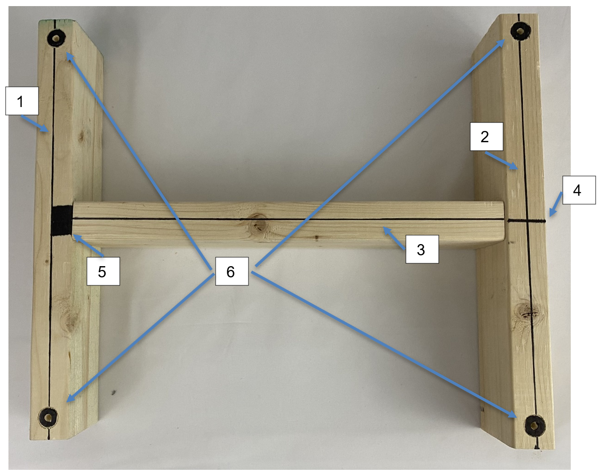

### Screw together the frame (Swivel Feet)

Once you’re sure everything is where it needs to be, use 3 letter B screws to secure the boards together.

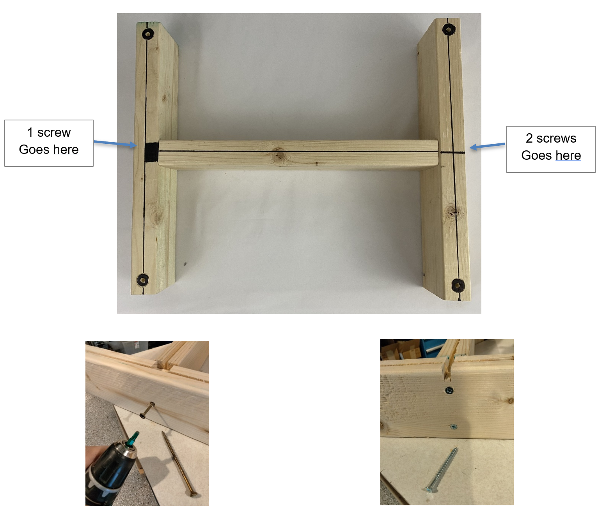

To assemble your frame, make sure you have a flat surface and ensure your pieces are square. Follow the picture above for the correct orientation of the boards. 

Leave the side with 1 screw very slightly loose so that the board may pivot.

### Attach the electronics box (Swivel Feet)

Make sure the box is located center in the frame with the hole opening as shown. There should be a slight gap between the edge of the frame and the box as shown. Use (2) “A” screws.

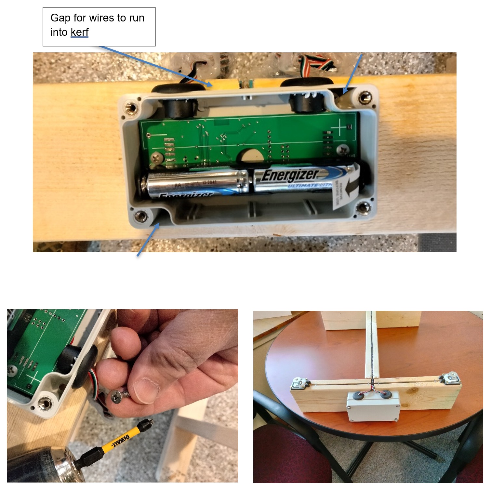

### Sensor Mounting (Swivel Feet)

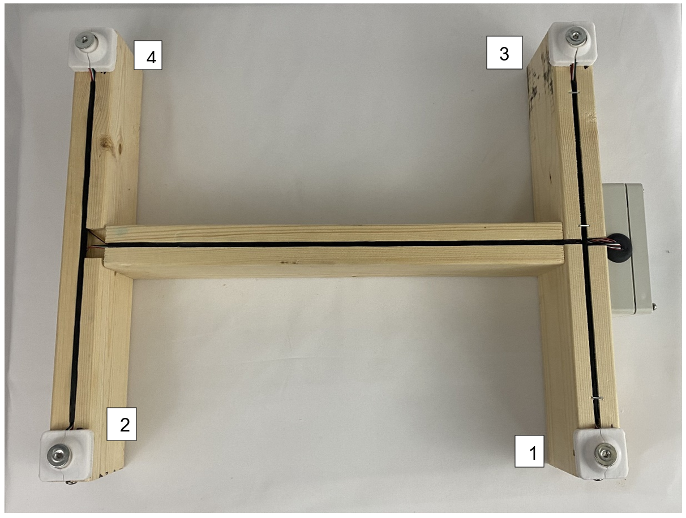

Use 1 “C” screws per sensor.

### Wire Routing (Swivel Feet)

Tuck the wires into grooves and secure with spline material “E”. To secure spline material press into groove with flat object, this allows wires to move in the bottom of groove. Do not create stress on the wires. Remove (2) circuit board mounting screws. Pull the slack wire into electronics box and fold wire behind circuit board, reinstall mounting screws. Secure spline material with staples.

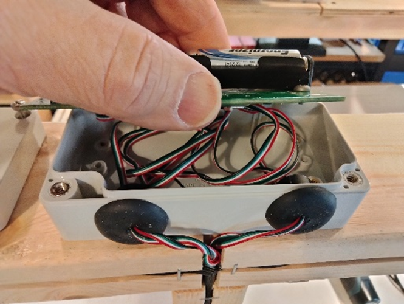

### Finish and Enjoy (Swivel Feet)

Now you can remove the battery tab and replace the lid on the electronics box and enjoy your new BroodMinder beehive scale.

## Appendix: Update fixed feet W3 scales to swivel feet

If you have an Apimaye hive, you may want to upgrade your W3 to include the swivel feet mounting.

 This is quite easy except for one step. Removing the fixed feet from the W3 kit is quite difficult because there is no screw head to grab and the feet are fixed with permanent Loctite.

 We have tried removing them here at Bees on Main and boy… they are difficult.

 Therefore, we recommend modifying the load cell holder and using the load cells with fixed feet. The modification is needed so that the foot reaches the ground.

 All that you must do is remove the skirt that captures the swivel foot.

