# W3 and DIY circuit board assembly and calibration

What follow will explain you how to assemble and calibrate the hive scale boards wheter if they are for the BroodMinder-W3 model or for the BroodMinder-DIY

## Get started with the circuit board.
The XLR2 is a multi purpose board and the first thing you'll have to do is remove two resistors with your soldering iron : `R41` and `R42` as depicted in the scheme below

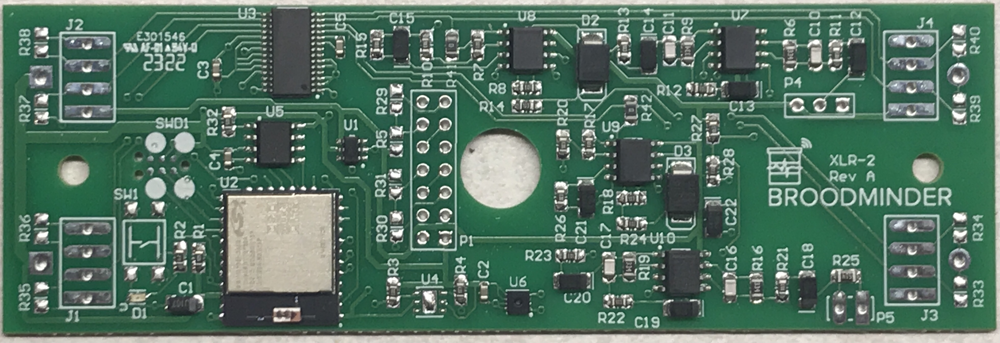

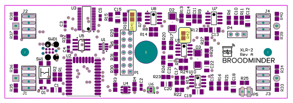

Now apply labels as shown (in the BAT1 slot)

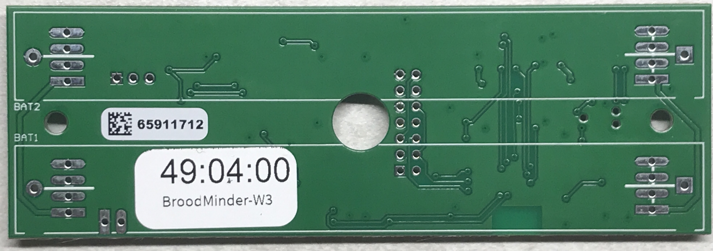

## Program the board

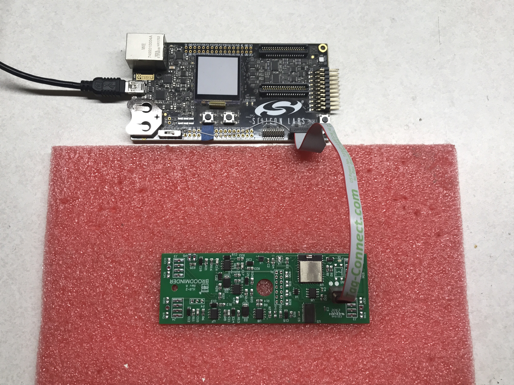

Use the pink foam to set the board.

!!! note
   Programing is only done internally at BroodMinder HQ. If you acquired a DIY or a W3 kit, the programming is already done.

## Prepare the board

- tin all 16 pads on a flat surface

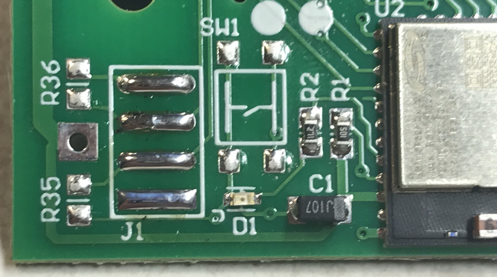

- solder the battery holder on the BAT1 slot (+ goes with the square pad)

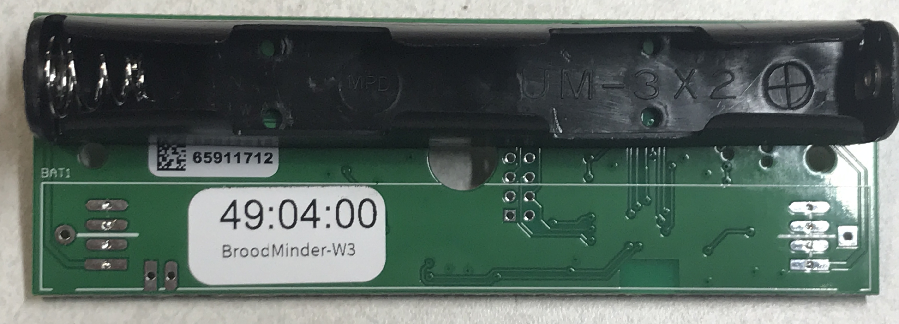

## Prepare the load cells

Now with a permanent marker note the load cell position : J1, J2, J3, J4. 

Remember :

| | Left | Right |
|----|----|----|
| Rear | J4 | J2 |
| Front | J3 | J1 |

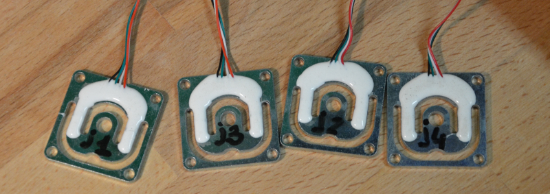

Now cut a slit on the rubber grummit. tape 4 wires together and pull them with a hemostat or pliers.
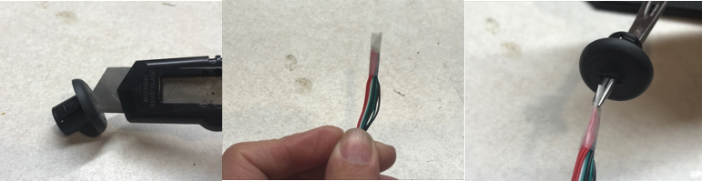
​  

Drill a hole in the box with a 1/2in (12mm) bit.
Route the wires through the hole and solder on the board pads following the color order Black-Green-White-Red as shown in the picture below

!!! note
   take care to associate each loadcell with its coresponding pad J[1-4]

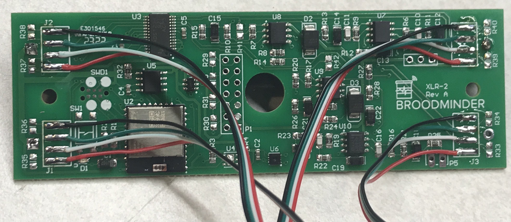

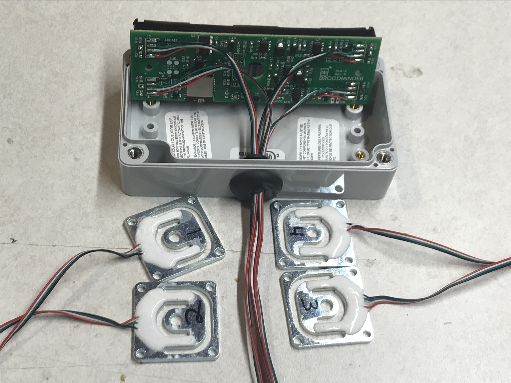

## Mount the scale feet

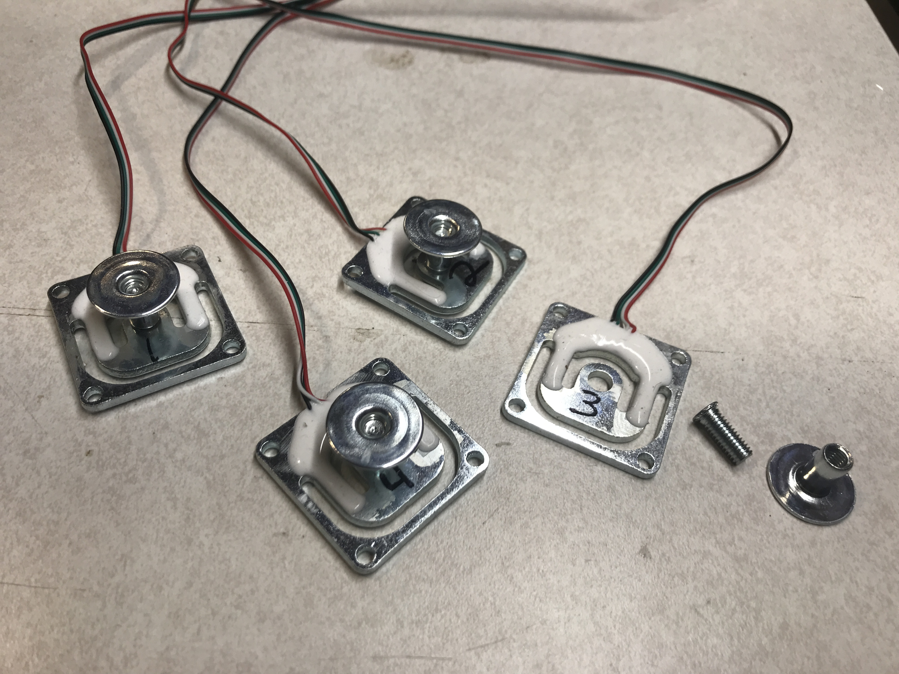

## Mount the scale structure

Here is where the lumber work starts. You can choose whichever scale architecture you wish
- (Square scales is here) xx
- H-scale is here with normal foot and swivel foot versions xx
- DIY scale is here xx

 

!!! info
    REFER TO THE DOCUMENTATION ABOVE FOR DIFERENT SCALE MODELS (and come back here for calibration if you got a DIY kit or a W3 unasembled&uncalibrated kit)

 

## Calibration (Internal)

Use the jig to calibrate the scale

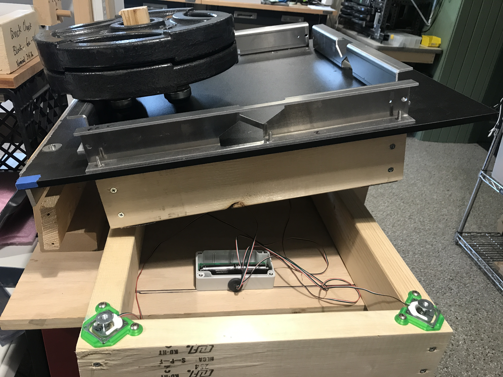

### Four-sensor scale

If you are using 4 sensors together, then you should use the Cal-W3 tab as explained next.

 
A.  Enter the true weight (in lbs) that you will use for calibration in the A zone. Be sure to include anything that will load the sensors (e.g. any extra boards that you use). Here we flip the scale on it’s back and move the weight around on a piece of plywood sitting on the feet.

B.  Remove all the weight from the load cells and press `Cal W3`. The first thing it will do is zero the system. You will see the raw ADC values show up in the zeroed row. After this step, you will see approximate weights shown in (lb) rows. This is based on the slope in the slope row. We use a default value for the -W2 sensors. You can play around with this to get close for your sensors.

C.  Next you should move the calibration weight as directed on region C above. The program automatically advances when it sees a weight > 5 pounds on the appropriate sensor. After the 4 corners are complete, the program calculates the slope for each sensor and updates the Slope line. The next 5 positions are used to verify the scale. If the value is within 0.5 the box lights up Green. ALTERNATIVELY you can press the “Grab” buttons to force the program to grab a weight. This might be necessary depending on the weight you are using.

D.  After you are satisfied with the calibration, press `Update W3` and it will write the values to the circuit board. You know it is complete when the Weight (Wgt) values switch back to pounds.

### Calibration (DIY and W3UA Only)

You can calibrate your scale in two ways:

1. with the Bees app
2. with the PC App. 

Watch the video to get you started :

The excel sheet for calibration is available here :
[https://docs.google.com/spreadsheets/d/1yNMxpkNxwFt1J_uJ8xHo6vfJbq1KBUc7IOpyQM6JVI4/edit](https://docs.google.com/spreadsheets/d/1yNMxpkNxwFt1J_uJ8xHo6vfJbq1KBUc7IOpyQM6JVI4/edit)
You will need to make a copy in your own drive (`File > make a copy`)

