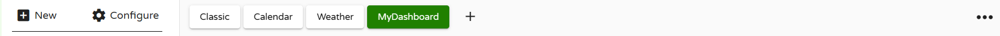
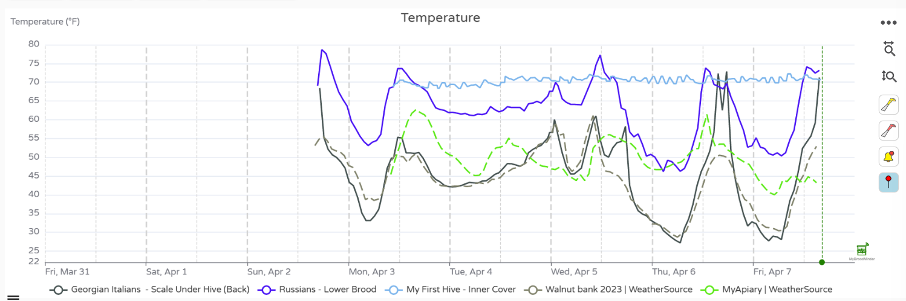

# MyBroodMinder Version 5

## Overview Quick Tour

There are many great features available in MyBroodMinder to view and analyze your data. Please note that there is a lot of context help by either hovering your cursor over an item or clicking the ? next to an item.

The quick tour is pretty long. There are a lot of useful features. Let's start by describing the functions available to you.

The best way to learn is to read this guide while looking at your MyBroodMinder account.

##### Hives

Here you will find a quick glanceable view of all the hives that you own.

##### Apiaries

Here you will find a quick glanceable view of all the apiries that you own.

### Left Sidebar - Choose which hives to view

The left sidebar is your key to navigating your apiaries and hives as well as apiaries shared with you by your friends. There is a lot of functionality built into this menu. Explore by clicking around.

- Clicking on `>` opens up hives in the apiary and devices in the hives
- Hovering over a BroodMinder device will display the ID number
- `...`
  - Apiary - Edit apiary info and location, add hives, share with friends, add apiary notes
  - Hive - Edit hive information, color of graph trace, move to new apiary, add BroodMinder devices, get link to BeeCounted.org, add hive notes
  - Device - Edit device name, adjust/move device location
- Multi-Select is a powerful feature that lets you overlay data from many different hives and apiaries. If you want to focus on one hive at a time, turn it off.
- When you click on an Apiary, it will display the hives in the apiary and bring up the data in the main window. Click it a second time and it removes the data from the view.
- Clicking a second apiary will add the hives to the view. Notice that the hives which are displayed are underlined. The color of the underline is the color of the graph line for that hive.
- Clicking a hive will toggle it to display or not display.
- The small X to the right of `Multi-Select` will clear all of the hive displays.

### Dashboard - Choose how to display the data

The buttons at the top of the view window let you chose how to display your information. We provide some standard views that we believe are useful. You can also add custom view to include many new analysis features.

- Classic
- Calendar
- Weather
- Analytics
- You can create your own custom displays using the `+` 
  - Sensor readings
  - Weather
  - Analysis
  - Maps and images
- Note - The `v` to the right of the notes section will expand the text of all of the notes within the timeframe shown. There are many powerful note features discussed below.
- `...` to the right of the dashboard buttons 
  - Create sharable link - *This is a powerful feature.* Once you get the display looking like you like it, you can create a browser link to share with anybody, even if they do not have a MyBroodMinder account. You can choose a fixed timeframe to share, or a variable timeframe such as the last 2 weeks. When you share it this way, it will always bring up the newest 2 weeks of data. You can also add a description which will display at the top of the graph.
  - Download - You can download the BroodMinder data, the weather data, and/or the notes to a CSV (Comma Separated Variable) file.

- Notice all the BroodMinder IDs of devices in the graph are identified at the very bottom of the view. If you click one, it will take you do the data graph for that device. In that view you will see all of the data for that device no matter where it has been installed.

#### Graph Controls

There are many terrific graph controls available to get your reports looking just right.

- Time Range - Using the dropdown menu at the top, `Last 7 days`, you can chose the duration of the display
- Change the height of each individual graph using the `=` on the leftof the window between the graphs.
- Turn individual graph lines on/off by clicking the legend below the dates
- Highlight the line of a graph by placing the cursor directly over if. The other graph lines will dim.
- Tools to the right of the graph
  - Zoom time scale - click the horizontal tool, then drag the cursor over the region of interest while holding the left mouse button. Un-zoom by clicking the tool again.
  - Zoom vertical - click the vertical tool, then drag the cursor over the region of interest while holding the left mouse button. Un-zoom by clicking the tool again.
  - Clicking the yellow hive tool will hide/unhide hive notes
  - Clicking the red hive tool will hide/unhide the apiary notes
  - Clicking the bell tool will hide/unhide the alerts

#### Adding Notes

There are powerful new note capabilities in both MyBroodMinder and the Bees app. You can use the Bees app to add notes in the field, and then edit or add additional notes when you review them in MyBroodMinder.

The most simple way to add a note is to double click on a graph at the time you want to add a note. An editor will pop up. You can enter text and you can also add tags. Once you save the note it will show up on the graph as a hive tool. 

You can also add a note for the entire apiary such as `Performed OA treatment on all hives`. Do this by clicking the `...` to the right of the apiary in the side bar and choosing add note. This note will display in all hives.

## Configuring

### New

*Note that we recommend setting up your apiaries, hives, and devices using the Bees app. The Bees app makes it easier to assign the devices.*

#### Apiary

When you add a new apiary to your setup you will name it and give it a location. We only track location by zip/postal code in order to preserve privacy. You can also set a default color for the graphs related to this apiary. This color will be used for the weather display of this apiary

#### Hive

It is easiest to add the hive using the `...` to the right of the apiary. This automatically enters the apiary as the location. When you add a hive, you can give a name and a color for the graphs related to this hive. 

#### Device

it is easiest to add the devices using the `...` to the right of the hive. This automatically enters the apiary and hive as the location. You will need to select the location of the device in the hive. You can not have two devices in one location. We include several custom locations if you want to do your own thing.

#### Custom Dashboard

You can create a number of custom dashboards. You can drag any or all of more than a dozen widgets and place them in your preferred order. This allows you to create reports exactly how you would like them. (Amanda and Lorenzo did a great job on this feature.)

#### Apiary Note

Apiary notes are assigned to all hives in an apiary. You will notice that the choices for tags are different than for hives. These notes will show up on the graph with the red hive tool.

#### Hive Note

Hive notes are not shared across an apiary. I suppose this is pretty obvious. Once you create a note, it can not be assigned to a different hive. These notes will show up on the graph with the yellow hive tool.

### Configure

Once you have apiaries/hives/devices added, you may need to move or delete them. All of this can be accomplished in the `Configure` screen. 

#### Apiaries

Here you can update your apiary. You can also set it to hide which will remove it from your Left Sidebar but keep the data. Deleting the apiary will remove all traces of it. Both of these changes can not be reversed.

You can also add a local source of weather information in the apiary. By default, we retrieve weather information from weathersource.com based on your postal code. You can replace this with a BroodMinder device that is in your apiary. You can use any of our devices which broadcast temperature and/or humidity values.

#### Hives

Hives can be configured and moved between apiaries, set inactive (data remains), or deleted (data is destroyed). From this menu you can also display which and when BroodMinder devices were installed and removed.

#### Devices

The devices section will display every BroodMinder device that you own. Note that you can sort this list by clicking the headings and you can filter the list to display only certain types. You can also download a CSV file that lists every device shown. This can be handy for taking care of inventory and battery replacement.

If you sell your device or give it to another beekeeper, you will need to delete it from your account. We only allow one owner of a device at a time for data management reasons.

If you reach out to support, we can rename your device (the "mac address") and then you can keep the data.

#### Hubs

If you own hubs, they will show up here. Hubs will send any data they receive from any apiary, but if you want the hub to show up in the Left Sidebar correctly, you must assign it to the proper apiary.

This is also where you manage and assign tokens which are required for real-time updates. See the Managing tokens section for more information on this.

#### Third Party Devices

Third party devices are sensors that are not made by BroodMinder. Currently we support YoLink sensors. They are managed in this section similar to the `Devices` section. See the Third Party section of this manual for more information.

#### Public Links

The public links feature is a powerful feature of MyBroodMinder. Once you start making them it can be difficult to keep track of them. You can do that here. You can change the notes and graph timeframe of the link.

#### Dashboards

Version 5 is all about dashboards and this is where you control them. You can hide any dashboard and/or duplicate and modify them quite easily.

#### Alerts

There are almost 30 events from hives, devices, & weather that can trigger an alert. In this section you can adjust the thresholds of these alerts and disable any that you do not want to see. It is important to note that you must enable the `Alert Summary Email` (at the top of this section) to enable alerts.

#### My Subscriptions

We wish everything was free, but we want to stay in business and keep paying our bills, so we ask for and appreciate your help. The more advance features, the ones that take a lot of programming work, come at a cost. Here is where you can keep track of your contributions to sustaining the effort.

