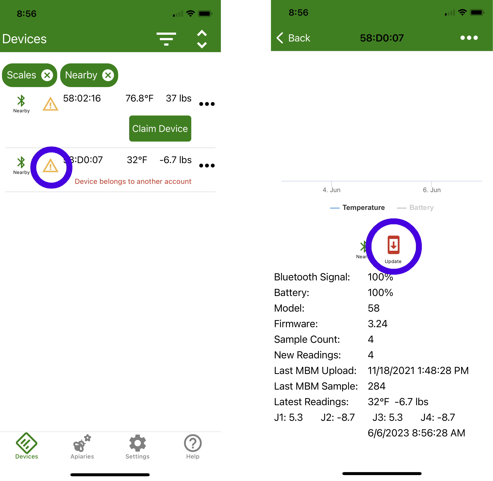
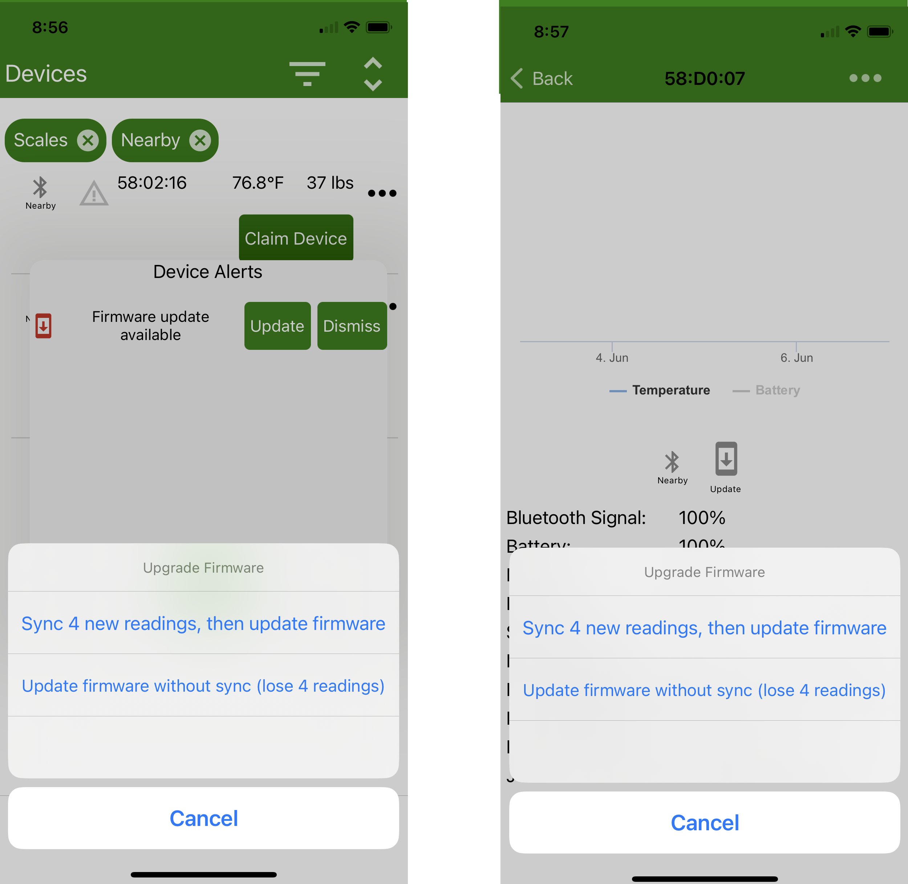
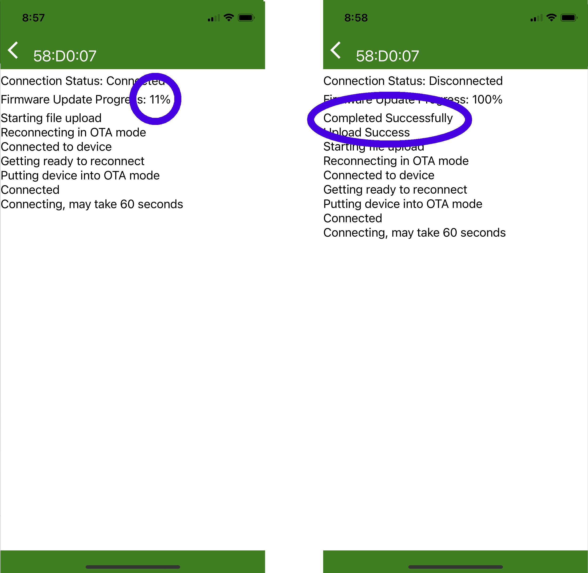
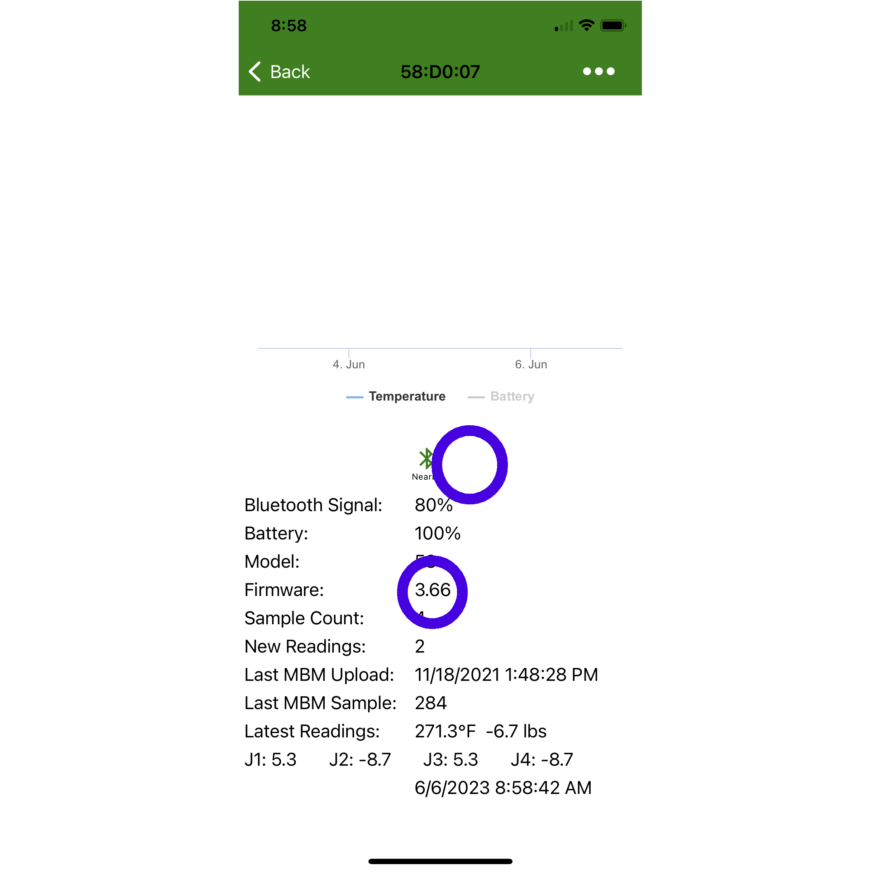

# BroodMinder Device Firmware Updates

## Overview

From time to time we make updates to improve the operation of our sensors. BroodMinder devices use OTA (Over The Air) firmware updates and are very simple to perform. 

This procedure works with the following models (model is the first 2 characters of the ID, for example 47:12:34 is model 47)

Model 47,49, 51, 52, 56, 57, 58, 59, 60, & 63

## Basic Process

- Update Bees App
- Find and select Update Icon for the device in Bees App
- Press "Update Firmware" or "Sync and Update Firmware"
- Wait and watch for 2-3 minutes
- Verify

## Bees App Update

Before beginning the firmware update, be certain to visit the Android Play Store or Apple App Store and update your Bees App. The app will contain the most current version of firmware for all of our devices.

## Notification Icon

When you open the Bees App, you may see a symbol beside you device or in the details page. We will show both locations in the images below.

## Updating the device

Press the symbol and you will be presented with an update page shown below.

Now you have a choice. There is backup data stored on your BroodMinder device. Updating firmware will place the device in "Factory New" state which removes any backup data. Note: All data that you have already retrieved is safe.

1) If all of you data is up to date on MyBroodMinder, you can "Update firmware without sync".
2) If you are not certain, you can sync and then update. This will take longer since we read the entire data log before updating.

The update process will take 2-3 minutes.

## Verify

Once complete, you should see the firmware update icon is removed and the current version is updated. 

If it did not update correctly, remove the batteries for 1 minute, replace the batteries and retry the update.

If you are still having difficulty contact us at support@broodminder.com

