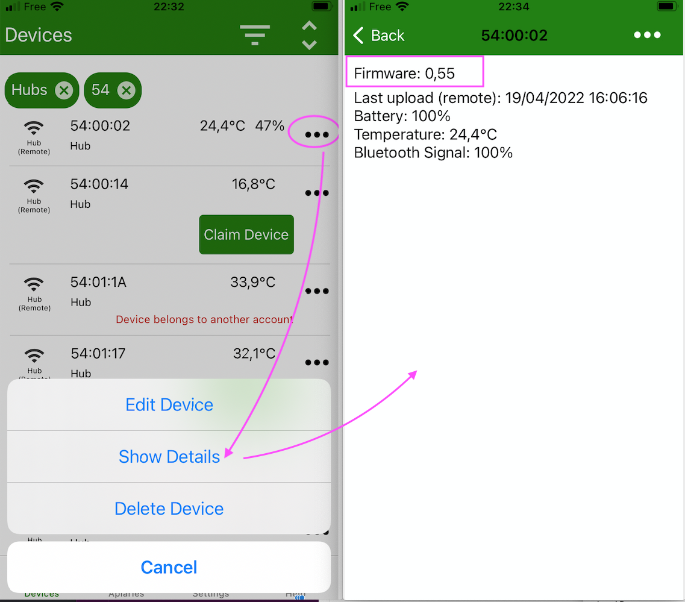

# BroodMinder Hub Firmware Update

## Overview

From time to time we make updates to improve the operation of our sensors. BroodMinder devices use OTA (Over The Air) firmware updates and are very simple to perform. 

## Updating BroodMinder-T91 Cell hub

- Check current hub firmware installed with Bees App (see below)
- Trigger the upgrade (see below)
    - Cycle power
    - When the hub restarts it will go through a green then a blue light for 5 sec
    - During that blue light, press the central button to trigger the upgrade
    - Wait and watch for 2-3 minutes. 
    - The hub will reboot automatically
- Verify with Bees App that the firmware has upgraded

You're done. 

 

 
 

## Check the hub Firmware 

Open Bees App and find your hub in the `Devices` tab. Go to the `...` menu in front of it and hit `Show Details`.

Now you see the current firmware version of your hub.

## Trigger the upgrade

Cycle power and when the led becomes blue, push briefly the central button.
The upgrade is now triggered.
Wait for 2 minutes until it is installed and restarted

!!! note
    During the upgrade the hub pulls the new version over the air. **You need to be on a cell covered zone to upgrade your hub.**

## Verify

Once complete, you should see the updated firmware version in the Hub details page (as you made it before)

## Need help?

If you are still having difficulty contact us at support@broodminder.com

