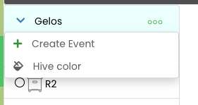
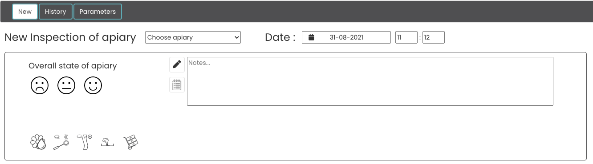
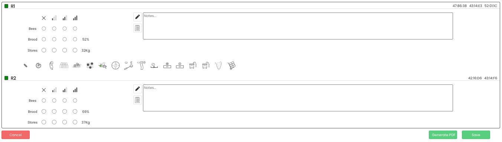
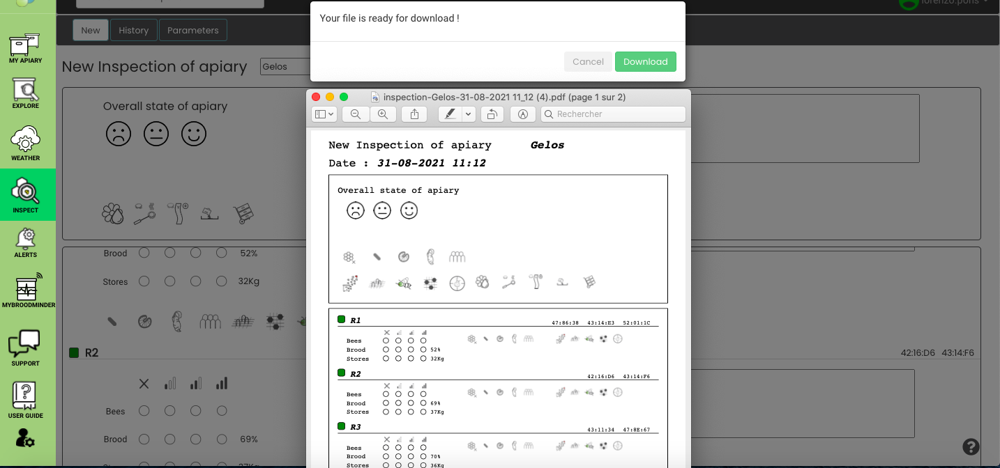
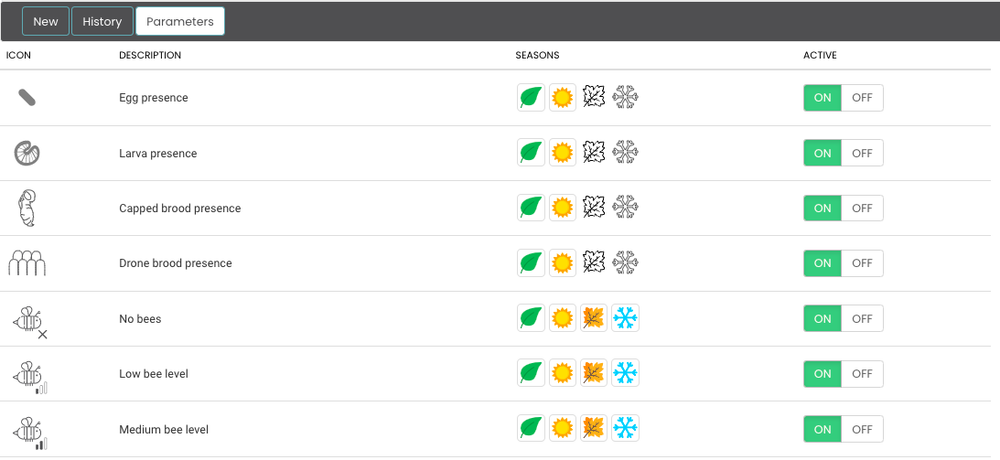

# Mellisphera.com 

## General overview 

Mellisphera is integrated with BroodMinder. Therefore, you must create an account MyBroodMinder and set up your apiaries / hives on https://mybroodminder.com. This website enables you to assign the sensors to each of your hives and to visualize the measured data. 

You will always have a Mellisphera button on the left-hand menu. Simply click on it to get to Mellisphera. If you have recently logged in, you will be automatically connected without needing to enter your email and password. Otherwise, the email field will be auto-filled. 

Now begins your adventure https://bzz.mellisphera.com/login.

## Login page

On the login page, you have the possibility to connect to a demo apiary if you do not have an account or if you are simply curious and eager for something new. You can read about the relationship between BroodMinder and Mellisphera, and learn about what Mellisphera can get you. 

Regarding the login step, **you must use your BroodMinder IDs**. Once you are logged in, you will have access to the complete history of your sensors. You will have the opportunity to explore the past events and to see the evolution of the season from a completely new angle. The first time you log in, you will be warned that the entire history of your data is being loaded. Your missing data will be loaded at every new connection. 

Let's take a look of Mellisphera different features.

## Home screen 

Once you are connected to Mellisphera, you will access this interface, composed of three areas: 

You can select the apiary to display with the top bar. This is also where you can choose your preferences. On the left side, you can see the different environments of Mellisphera. We will explore them in the next chapters.  

Next to each feature, you will find tooltips. They detail the essential information in order to understand the data. 

## Account settings

In the top right corner of the app, you will have access to your account settings. 

This is where you can reset your password. Please note that this will only change the password for the Mellisphera app. 

You can also set some of your preferences:

- language
- date format
- unit system (metric or imperial)

## My Apiary 

This page is the starting point of Mellisphera. You can select the apiary to explore from the top drop-down menu and then navigate through the main information. 

Your navigation is contextualized on the apiary thanks to a picture that enables you to define the location of your hives. You can place "stickers" underneath, carrying the main information (name, weight, brood, etc.) in order to materialize your hives. 

**Picture & location** 

The first time you connect to the Mellisphera app, you will have the opportunity to add a picture of your apiary. You can drag/drop a file from your favourite file explorer or you can open the contextual menu represented by a camera icon (in the top right corner of the photo frame. 

### Apiary view

Your apiary picture - with its stickers - is associated with a set of buttons placed just above. This navigation bar enables you to visualize contextually some information:

You can activate the "name", "brood", "weight" and "device" buttons. This enables you to display respectively the name, the brood, the weight and the sensors of all your hives below the stickers, on the date displayed on the top right of the screen. The date of the previous day - which corresponds to the last day of data in general - is set by default. You can obviously change this date. 

**Device status**

What is special about the sensors is that you can see their status in real time with a color code (grey, red, orange) that determines the status and displays the problem. 

The battery level is systematically calculated. Regarding apiaries that are equipped with a Hub, the signal and connection information are also evaluated. Here is the colour code:

- Grey - everything is normal
- Orange - bad signal or battery to be replaced
- Red - sensor does not emit 

The battery threshold is by default set to 20% but you can modify it in the alert settings. 

The signal and connection information are based on the daily data reading frequency. The quantity and quality of this information is used to determine if there is a disconnection or a bad signal. The first alert is sent 24 hours after the problem started.

**Color stickers**

The stickers indicate the health status of each hive with a color code (black, red, orange, green). You can also hover the hive in order to see the message associated with its status. The health status is calculated every day, at the end of the day, by our BFit model. This is why you systematically visualize the day D-1. You can also navigate through the previous days with the date selector in the top right corner of the screen. 

Please note that hives which do not have devices or those which have no data on day D-1 have a white sticker. 

For more information about our BFit model and how it calculates the hive health status, please refer to the "data interpretation" section. 

**Apiary calendar of events**

You have a specific calendar of events for each of your apiaries. This calendar enables you to track the tasks carried out at the level of the apiary as a whole and to display general observations. The calendar also includes alerts and notifications - we will see how to configure them later - at the apiary level. 

**Apiary notes**

In order to complete the apiary overview, you can write your apiary notes/observations/inspections. This would be placed just below the picture of your apiary. 

In order to add a note, just click on the "+" of the insert, it's very simple! 

You will directly see the note on the calendar of events with this icon: 

### Hive overview

In order to access the hive overview, you should click on its sticker or on its name. The sticker will be surrounded in pink and you will see on the right of the screen three new calendars corresponding to the selected hive.

The displayed data go from the last 5 weeks to the next 3 days - since we can predict 3-day events. 

**Events**

You will see a calendar of events - this time, specific to the selected hive. Apiary and hive events are different. For more precision, please go to the "data interpretation" section. 

**Brood**

You have a global vision of the daily brood evolution with a heatmap calendar. The colours vary from red to green and the percentage from 0 to 100%. For more details about the brood calculation model, please go to the "data interpreration" section. If you have several temperature sensors in your hive, you can check/uncheck the one you want to display. 

**Productivity** 

This calendar offers a global view of the daily weight gain in bubble form. The red color indicates a weight loss and the green color indicates a weight gain. The bubble size is proportional to the weight variation generated by the bees - we remove any possible manipulation of adding/removing material. We will therefore call this "hive productivity". For more details about our model for calculating productivity, please go the "data interpretation" section. You can choose to only display the gains or the losses on the calendar by checking/unchecking the boxes below the calendar. 

**Notes**

It is possible to make annotations on each hive. These notes are separated from your apiary notes and concern only the selected hive. In order to switch back to the apiary mode, just click on the apiary button on the grey navigation bar. 

## Explore

The **apiary** overview gives an insight of the overall situation. In **explorer**, you can navigate through your data in more detail. You will see a new grey navigation bar with three sections: 'Hive', 'Brood' and 'Data'. By default, you will be in the 'Hive' mode. 

Please note that the data for the last month will be displayed by default. You can obviously change the date at the top right of the screen. You can change and customize this data period as you wish or use the arrows to move through the time period. 

### Hive

In the hive mode, you can choose among all the hives of all your apiaries, but please note that you can only select one hive at the time. Once you chose the hive, you will see three calendars. 

**The first calendar** summarizes your hive data. You can choose between different options: 

- Brood 
- Productivity
- fitness
- Internal maximum temperature
- Internal minimum temperature
- Internal maximum humidity
- External maximum temperature
- External minimum temperature

The availability of this information depends on the devices installed in the hive. Brood and internal temperatures require an internal sensor, while productivity and external conditions are associated with a scale.

In case there is a sensor in the `lower brood box` and another in the `upper brood box`, both will be displayed and selectable sequentially at the calendar footer.

**The second calendar** reports the events of your hive as well as the astronomical calendar.

- Events, annotations and alerts
- Astronomical calendar - biodynamics

**The third calendar** shows the weather data of your apiary. This calendar is therefore identical for all of your hives that are in this apiary. You will have access to the general 'weather' data:

- External maximum temperature
- External minimum temperature
- External maximum humidity
- External minimum humidity
- Wind
- Precipitation

The information displayed depends on the selected source (at the calendar footer). By default all apiaries are connected to an internet weather service provided by the company `WeatherSource`. This is a data resulting from a weather model which depending on the apiary location can be quite accurate (or not). Nevertheless, depending on the location, it is also useful to have a `local` source of weather data. This can be done by installing a TH sensor or a scale and declaring it as a weather source (see chapter Weather below).
This latter source can be less complete (no wind or rain measurement) but more accurate on ambient temperature or hygrometry than what WeatherSource does.

Comparing among two sources can be very useful to confirm or not the relevance of WeatherSource and therefore the confidence that can be given.

So you can visualize and switch calendar modes as you wish. Here's an example:

### Brood

In the brood mode, you can, this time, **select as many hives as you wish**, even if these hives are situated in two different apiaries. This way you can compare apiaries or hives with each other.

By hovering over it, you will see information about your hives. 

It is  an extremely powerful tool for analysing data over long or short periods of time, on hives that are from the same apiary or from different ones because the analysis benefits from a great flexibility.

### Weight

The Weight tab offers a complete tool for the analysis of hive weights of all apiaries with 4 views available: 

- Hourly weight
- Daily weight
- Weight gain
- Productivity

[Weight mode](./images/explore_weight.png#largeImg)

By default, the `Daily weight` view is displayed.

**Hourly** displays the graph of the raw hourly weight measurements. Hovering over the graph will display the date, time and corresponding weight. 

**Daily** displays the daily weight measurements taken at midnight. As for the hourly weight, when you hover over the graph, you will see the date and the corresponding weight. An input box allows you to set a 'reference date' or 'T0' which is shown on the graph as a vertical dotted red line. The summary table below the graph automatically lists the weight values at this date. It is completed by the weights at D-7 days and at D-15 days (D being the current day). 

**Gain** displays the daily weight gain (bars) and the cumulative gain (line). The daily weight gain is calculated in relation to the weight of the hive the day before. The cumulative weight gain is calculated in relation to the `reference date` you have chosen. In the table below the graph, the cumulative weight since the reference date (T0), since the last 7 days and since the last 15 days are listed.

**Productivity** displays the daily weight gain and the cumulative gain adjusted by keeping only the gains or losses associated with the bees' activity. That is to say that the possible actions of the beekeeper (addition/removal of supers, feedings, etc.) are not considered.

For all views, on the right of the graph there is a toolbar with 5 icons:
- "zoom" : to zoom in on an area of the graph
- zoom reset" : to return to the initial view (remove the zoom)
- data view" : to see the data in listing
- restore" : to update the data
- save as image" : to download the graph as an image 

The `Gain` and `Productivity` views are complementary. The gain view is used in a feeding context where you want to see the global evolution of the hive weight while the productivity view is more interesting for the follow-up of nectar flow for example or the comparison of performances between colonies/queens.

### Events

It is possible to add events from all available spaces in the Explorer menu. By hovering over the hives or apiaries in the list on the left, the contextual menu with 3 small dots `'...'` appears. Just select the option `Add an event`. Depending on the context it will either be an event that concerns the whole apiary (red frame lift).

Or only a specific hive (yellow frame lift).

Shortcut: In the menu `My apiary`, it is also possible to add an event, by clicking on `'...'` in the Notes area. Again the result will depend on the starting context (hive).

In the window that opens when you want to add an event, rather than writing long sentences, consider using the available pictograms. We have distinguished the `Notes` which correspond to what you have observed, from the `Tasks` which correspond to actions done or to be done on the hive or apiary. 

The tab `Events` lists and allows you to filter all the events created. You can display the events of the whole apiary by clicking on the apiary, or display the events of some hives by selecting them. This is where you can edit or delete them. **The red frame lift indicates an event in the apiary** and **the yellow frame lift indicates an event in the hive**. This is the same color code that is used in the events that appear in the calendar of events in the hive mode. Finally, in the "Notes and Tasks" part: in black the notes and in blue the tasks. 

### Hourly Data

In the data mode, you will see your hive raw data: the internal temperature will be displayed at the top of the screen, the weight in the center and the humidity at the bottom (just like on mybroodminder). In green, you will have the optimal areas for brood and humidity. You can also select as many hives as you wish, even if these hives are situated in two different apiaries. This allows you to compare apiaries or hives between each other.

This tool is very easy to use. The small icons that are on the right side of the graph enable you to zoom in, select areas, move around, view listing data etc.

## Inspect

Above we have seen how the `Events` work. Notes, observations or alerts that are assigned either to the apiary or to the hive in a specific way manually (in the case of notes or spots) or automatically (in the case of alerts). An `Inspection` is a set of events, often entered one after the other in an integrated apiary+hives context.
At the end of the input, the inspection is broken down into Events that are attached to hives and apiaries. 

!!! Attention 
    Once entered and saved, it is no longer possible to edit an inspection. But you can edit the events that resulted from it separately.

### New inspection
The **New** mode allows you to add a new inspection. You can take note of the inspection of the whole apiary. In this case, pictograms allow you to evaluate the general state of the apiary. Then, as for the events, you have a space to make notes and write down the tasks to come. Use the pictograms so that you have to write (but also read!) as little as possible.

Once the general condition of the apiary has been described, it is necessary to make an inventory of each colony. In this case you start by making a systematic survey of :

- bees
- brood 
- stores

Then, as for the apiary, it is possible to complete with notes and pictograms.

 

Once the inspection has been completed and saved, the elements that build up the inspection will be visible on all the screens of the application in their own context (the apiary, the hive(s)).

**Paper inspection**

The option `generate PDF` is designed for those who prefer to bring only paper to the apiary. A printable form is generated with contextual information. 
At this level nothing is entered, to keep track of the inspection it will be necessary to make the entry afterwards.

### Inspection history

The **History** tab tracks all inspections. It is not possible to modify or delete an inspection in this screen. To do so, you must go to `My Apiary`. 

### Settings

The **Settings** tab allows you to adapt the note-taking space according to the practices of each beekeeper. It is thus possible to configure the display or not of each pictogram and to assign them a prevalence season. In this case, the rest of the year they will not be proposed. 

For example the addition of a rise can occur in spring or summer but not in autumn or winter. By default this pictogram is only proposed in spring and summer, and disabled for winter and fall. If some pictograms are never useful to you, you can set them to "OFF". These settings allow you to avoid overloading the note-taking area.

Here are all the event/observation/task pictograms available: 

| **Pictogram** | **Description** |
|- |-- |
|  | Eggs |
|  | Larva |
|  | Capped brood | 
|  | Drone brood |
|  | Queen cell seen | 
|  | No bees |
|  | Low bees |
|  | Average bees | 
|  | High bees |
|  | No brood |
|  | Low brood | 
|  | Average brood | 
|  | High brood |
|  | No stores |
|  | Low stores |
|  | Average stores| 
|  | High stores |
|  | Nectar flow |
|  | Buzzing hive | 
|  | Mosaic brood | 
|  | Sick |
|  | Queen seen |
|  | Swarm |
|  | Oxalic acid vapor |
|  | Oxalic acid drop |
|  | Added strip |
|  | Removed strip |
|  | Mite counter|
|  | Mite counting|
|  | Candi feed |
|  | Syrup feed |
|  | Added super |
|  | Removed super |
|  | Insert queen |
|  | Split |
|  | Added brood frames |
|  | Harvest |
|  | Marked queen |
|  | Stolen hive |
|   |   |

## Alerts 

In this section, you will find the functions that enable you to implement a notification and alert service on each of your apiaries. You will also find a new navigation bar which displays the 3 types of alert: 'Hive', 'Weather', 'Sensor' and the 'Settings' button,dedicated to the configuration. 

### Hive

In this tab, you can see all the alerts concerning your hives. These alert icons can also be found in your hive event calendar. 

You can turn the alerts on and off. And for many of them, you can change their thresholds by sliding the cursor. By default, everything will be activated with auto-adjusted settings. 

On the interface, you also have an 'i' icon for information. By hovering it, you will have a short description of the alert. 

In more detail, here are the available alerts and their characteristics:

| **Pictogram** | **Alert** | **Frequency** | **Description** | 
|- |-- | -- | -- |
|  | Honeydew | weekly | The honeydew alert is triggered when the net weight added to the hive exceeds the indicated threshold. By default, it is set to 15kg/week.| 
|  | Swarming | hourly | The swarm alert operates in **real time** but also indicates **passed** swarms in the case of manual sync. This alert works on hives equipped with temperature sensors. The results will be even more accurate with a scale, but it is not essential.   **We can adjust the detected swarms according to your feedback, do not hesitate to report discrepancies or omissions!**
|  | Swarming risk | daily | Based on a range of parameters, we can estimate the risk of swarming 3 days before.   This alert is currently in development.| 
|  | Over-Temperature | daily | Some colonies can't manage their internal temperature. Often these are small population divisions. But sometimes the weather can have a major effect because of a lack of exposure.   In this case, the hive brood is challenged as temperatures can reach 40°C.| 
|  | Extreme cold | daily | During winter, the cluster tightens and maintains the temperature very locally - sometimes far away from the sensor. This is why the "low temperature" indication can only be informative. Depending on the context, action may be required.| 
|  | Low brood | weekly | In the high season, a hive with brood level below 30% is an anomaly or a division/swarm. This alert can identify colonies that are declining. | 
|  | Weight loss | daily | An excessive/sudden consumption often means that the hive is being robbed by another colony.| 
|  | Weight gain | daily | Daily alert that informs you of weight gains due to bee inputs. To be associated with the weekly honeydew alert.| 
|  | High humidity | daily | During winter, humidity in the hive can naturally reach 80%. However, if the threshold is even higher, you should think about taking action.   Please note that this alert only works with hives equipped with TH sensors. | 
|  | Low humidity | daily | During the season, the optimum humidity zone is between 50 and 75%.| 
|  | Dead hive | daily | If you see this alert, it's too late. It means that there's no life signs left in the hive.| 
|  | Varroa treatment | daily | This alert is triggered when the average brood in the apiary falls below the fixed threshold (15% by default). This is the ideal time to plan an anti-varroa treatment with Oxalic acid.| 
|  | Supper addition | daily | For the hives equipped with scales, this action is automatically detected and displayed on the calendar with an indication of the weight of your empty supers.   We have set the default value for an empty rise to 5kg.   For a dadant hive, we have taken some steps that can help you set this value:   An empty super is between 8.2 and 9.5lbs.   A super with embossed frames weighs about 14.1lbs.   A super with stretched frames will be close to 14.5lbs.| 
|  | Supper removal | daily | For the hives equipped with scales, this action is automatically detected and displayed on the calendar with an indication of the weight of your full supers.   We have set the default value for a full super to 45lbs.| 
|  | Stolen hive | daily | The sensors do not have geolocation. However, for the hives eqquiped with a weight sensor, this alert notifies in case of an abnormally low weight, which could be a possible theft...| 
|  | Weight limit | hourly | It may sometimes be important to monitor the weight of the hives and to set thresholds in order to carry out operations on your hives after they have been reached.   The default value has been set to 220lbs.| 

### Weather

In this tab, you will see all weather alerts. These alert icons can also be found in your apiary events calendar. Here again, you can adjust, deactivate/activate the different alerts. By default, everything will be activated with auto-adjusted settings. 

All weather alerts are predictive at D+7 maximum. 
They are constantly evolving. For example, if an event is predicted at D+7 and then the next day this event is obsolete, it will no longer be displayed.
The alerts mainly concern strong to extreme events.

| **Pictogram** | **Alert** | **Frequency** | **Description** | 
|- |-- | -- | -- |
|  | Rain | daily | Heavy rainfall.  Default value at 50 mm/d  | 
|  | Snow | daily | Heavy snowfall.  Default value at 15cm/d   | 
|  | Wind | daily | Strong winds.  Default value for 30 km/h gusts.   In some regions, we recommend to increase the default value if the alerts become too regular.| 
|  | Cold | daily | Cold day.  Default value for days below 0°C.   In some regions, we recommend to decrease the default value if the alerts become too regular.| 
|  | Hot | daily | Hot day.  Default value for days above 40°C.   You must adjust the default value according to your region.| 

### Devices

The alerts, associated with our sensors, provide information on any connection or battery anomalies. So you are sure that the system is always working nominally. You can configure them in this tab. 

Please note that **these alert icons won't be displayed on your event calendars**. But you can visualize them in 'My Apiary' section, in the 'Sensor' tab. 

Likewise, if the email alerts (next section) are activated, you will be notified of your sensors status. Here again, you can adjust, deactivate/activate the different alerts. By default, everything will be activated with auto-adjusted settings. 

Here are the detailed alerts available for each type of sensor:

| **Pictogram** | **Alert** | **Frequency** | **Description** | 
|- |-- | -- | -- |
|  | Hub offline | daily | The transmitter did not send any data on the last day | 
|  | W offline | daily | The sensor did not send any data on the last day | 
|  | T offline | daily | The sensor did not send any data on the last day | 
|  | W low signal | daily | The W-sensor sent incomplete time records on the last day | 
|  | T low signal | daily | The T-sensor sent incomplete time records on the last day | 
|  | W low signal | daily | The W-sensor has a low battery level | 
|  | T low signal | daily | The T-sensor has a low battery level | 

### Email settings

In this section, you can configure the email sendings. We strongly recommend you to activate these emails. If you have a Hub, we suggest you to select the daily sending. Otherwise the weekly sending may be sufficient. 

The sending is deactivated by default and your email address is written in the first box. You can add a second email address. In this case, emails will be sent to both addresses. To make sure that the tool is working, you can click on the 'Test email' button: an email will be instantly sent to the registered addresses. If you don't receive it in the next few minutes, please contact support@mellisphera.com. 

In these emails, you will have access to the following information:
- The received alerts since the last time data was sent
- The upcoming events (up to 3 days)
- Your hive status
- Your sensor status

Please note that deactivating an alert will make it disappear from the emails and calendars as from the deactivation date - this action is not retroactive. Likewise, if you modify the thresholds, this will only be effective for upcoming alerts. 

Here is a preview of the kind of email that you may receive:

## Weather

This space is dedicated to the analysis of the apiary environment. For each apiary, several information are presented from several sources.
- apiary weather: typically temperature, hygrometry, rainfall and wind.
- Foraging and Honeyflow indexes (see below)
- sources from which these values are derived or computed

### Readings
The weather data displayed in this space is derived from two main sources:

1. By default, they come from WeatherSource. This service provides real-time weather conditions for a given location defined by its country/postal code. The service also includes a 10-day forecast. The current day is indicated by the vertical dotted line. All users have access to this source.
2. When the user has defined a local weather source, the data measured by this personal source is also displayed.

Each apiary is represented with one color. The WeatherSource always displays in lighter color and the local source (when available) in darker color.

On top of the raw weather data we have developed an algorithm translating this information into beekeeping specific metrics. The result takes the form of two indices on a scale of 0-100%: 

- Foraging Index: evaluates the atmospheric conditions for **bees** to forage. This index considers the outside temperature, the hygrometry, rain and wind.

- Honey flow index : evaluates the atmospheric conditions for the nectarification of the **flowers**. Here too, several factors are analyzed in relation to the honeyflow conditions. 0% means that the conditions for honeyflow are not met, 100% that it is damn great. But beware, depending on your climate zone, 100% may never be reached and you will have to be satisfied with lower rates! 
To validate the forecast range, this algorithm has been developed with apiaries located in various climatic zones (temperate, cold, very cold, tropical...); We ensure you that in some cases it can reach 100% 😉

The 10-day weather forecast allows to project these indices over a week and a half. These foraging and honeyflow forecasts are helpful for the beekeeper to identify the relevance of certain actions.

### Configuration
This tab is used to define the devices used as a local weather source.
It can be a T2 or TH sensor placed in a weather envelope, a scale, a hub (model 54 only) or even a Davis Vantage Vue station (the only model supported for the moment)
Our favorite is the Broodminder-TH because compared to the T2 and scales it brings the hygrometry while keeping low cost investment.

Defining a local weather source has two main pourposes:

- computing indexes (only with a TH, Hub or Weather Station)
- refining brood algorithm computations with more acurate ambient temperature (whatever the sensor is)

## MyBroodMinder link

If you click on the MyBroodMinder icon, this will redirect you to the MyBroodMinder.com platform. With a single click, you can switch from one platform to the other: on one side MyBroodMinder to manage your apiary / hive / sensor configurations, and on the other side Mellisphera to accurately analyze your data and to be informed in real time about what is happening on your hives.

Please remember that if you make changes to MyBroodMinder, they will be saved when you log in to mellisphera again. 

## Support

You can contact our support team from this link. Either by direct message, by email at [support@mellisphera.com](mailto:support@mellisphera.com) or by logging in directly on Slack.

Do not hesitate to send us your questions, feedback, experience, improvement ideas and problems. We love customer feedbacks! The good ones and the ones that help us progressing.

## User guide

Click on this link to access the complete user guide: https://doc.mellisphera.com. 

This portal is entirely dedicated to the documentation of our whole system. It is structured in several areas as shown in the image below. 

1. Language choice
2. Documents available
3. Text body
4. Document chapters for quick access
5. Keyword search

Don't hesitate to use the **keyword search**: it is extremely efficient and gives you results on all available documentation.

Here is an example with the 'battery' keyword

### Astronomy
The astronomical calendar clearly shows the moon's phases. It also shows the day length with the sunrise/sunset times, according to your geographical area.

<i>By hovering the moon calendar, you will also get information about the sun.</i>

## Models & algorithms

In this section, we will discuss the more technical aspects of Mellisphera's way of functioning. We will thus present the different models - BFIT, BFORCE, BWEIGHT - as well as the WEATHER sources and ALERTS.

### Colony Health - BFit
BFIT for _Bee Fitness_ is the algorithm that informs the beekeeper of each hive's condition. We use benchmarks such as the time of the season and the surrounding hive state in order to define a "nominal" state. Then we position each hive in relation to this reference.

The display is very easy to understand, with coloured stickers to indicate their condition. To complete the information, a tooltip (on the flyover) specifies the nature of the situation.

The color code is the following:

| color | meaning |
|---|---|
|Green | Healthy |
|Orange | Disturbed (declining or with abnormal events) |
|Red | In trouble |
|Black | Dead |
|White | No data or no weather |

By activating the alerts in Mellisphera, you will receive by e-mail a summary table with all the information:

BFit is based on algorithms that collect events. The 'Learning' algorithm learns from previous events to preserve, or not, future events. Afterwards, it classifies the detected events between those affecting the hive state and the others. 

BFit also takes into account the results from BForce. In this way, it can determine the difference between the current hive dynamics and a theoretical brood dynamics that is constantly changing. These theoretical dynamics are regularly updated. It also takes into account the different regions of the world to provide relevant information according to latitude or climate. 

### Brood level - BForce

Brood development is a key factor for bee colonies. The aim of BForce is to provide an indication of the brood level in the hive on a range of 0 to 100%. 

When the colony is at its full capacity, it reaches a stable state of 35°C. This state is associated with 100% brood. This means that the hive is strong. 

On the contrary, when there is no brood, the bees do not need to regulate the cluster temperature. In this case, the hive internal temperature will roughly follow the ambient temperature. If this is the case, there will be 0% brood.

Between these two extreme points, we can imagine a lot of intermediate situations. 

In order to illustrate this, here are the hourly measurements on two hives from the same apiary. The first is represented in red and the second in grey. Each hive has a very different condition. The red one has an internal temperature close to 25°C/30°C - following the same fluctuations as the external temperature (dotted lines) - while the grey one is situated in the famous 'Optimal Brood Zone' with a constant temperature of 35°C.

In this example, the grey hive has a high proportion of brood, contrary to the red one. **BForce correlates this colony characteristic and translates the raw temperature measurement into standardized and understandable information**. The model takes a range of parameters into account to optimally estimate the brood level.

- hive internal temperature
- ambient temperature
- evolution of surrounding colonies
- season, latitude & climate
- other events identified in the hive
- hive type

BForce is also a **strengthening tool in swarm detection**. In fact, when a swarm has been detected by one of our Machine Learning tools, the brood is impacted by the queen loss and thus the interruption of egg-laying. With BForce, we can classify the different swarms detected.

**Comprehensive results**

Brood calendars & charts show the daily progress of the brood in each hive. The values vary from 0% (no brood) to 100% (complete brood). Generally, 10% is one brood frame, 40% 4 frames, etc. Depending on your practice and the hive model used (Langstroth, Dadant) you might have to adjust these values. Therefore, **hives with a brood level higher than 80% generally produce honey**. 

You can visualize the season's history at a glance. The egg laying stops and restarts are clearly visible.

<i>Brood calendar</i>

You can also compare several hives with each other, whatever their apiary.

<i>Annual brood - same hive compared with two others</i>

With practice, we can identify several events on these graphs. We can identify when the egg-laying starts & stops, of course. But we can also detect swarms, bad weather periods that have impacted brood production, the effect of Asian hornets, etc.  

<i>Two hive path over a season, with some events</i>

### Productivity - BWeight
Having flowers does not necessarily imply nectar - and thus resources for bees. Indeed, many factors condition the occurence of a honeydew: the ambient temperature and humidity, the last rains and their intensity, the root depth for plants such as rapeseed or sunflower. Honeydews are therefore not acquired nor easy to identify. However, understanding them is a basic need for every beekeeper.

A weight sensor installed under a hive provides detailed information on weight gain and loss. However, this information takes into account several factors that are not necessarily related to productivity.

First of all, during the day, weight variations depend on the resources brought in or consumed. But they also depend on the bees' movements: during the day, they are more or less numerous to come out to forage. 

<i>In red: when bees get out of the hive

In blue: when they bring back nectar

In black: dehydration </i>

This is why the hive weight graph shows some "bumps". A bump every day, as you can see in the graph below. On the chart, you can also see sudden weight variations, related to the beekeeper's interventions.

<i>Gross weight history with beekeeper's interventions in blue</i>

With these facts, we can see that **for a proper productivity evaluation, we must only consider the weight variations coming exclusively from the bees' production**. In this way, external events must be ignored: feeding, swarming, addition/withdrawal of suppers, beekeeper interventions, unexplained loss or gain. The BWeight algorithm makes it easy to identify these distinct events and to exclude them from the productivity calculation.

As a result, we have a daily information about weight gain or loss. The graphical representation on the calendar makes it easy to identify the honeydew and its intensity during the season.

<i>Excellent linden honeydew at the end of June!</i>

Taking a wider time scale makes it easy to record and compare the progress of different honeydews.

<i>Honeydew calendar from a transhumant hive in 2018 (from left to right): rapeseed, pear, apple, acacia, cornouille, mulberry tree, chestnut tree, linden</i>
