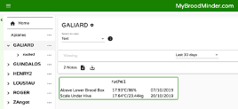
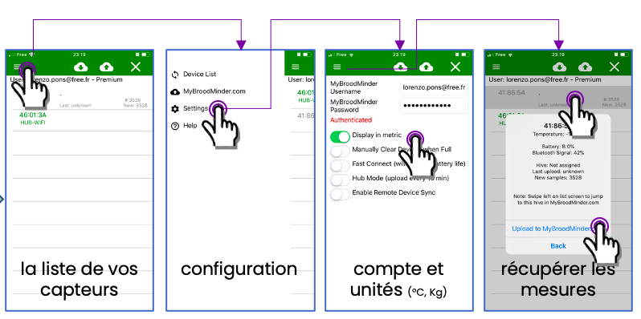
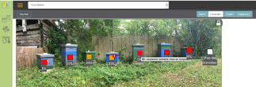
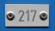
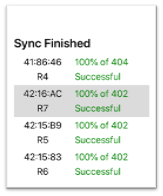
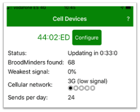
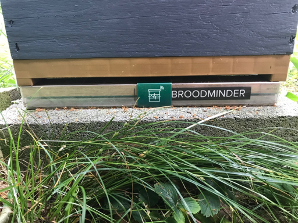
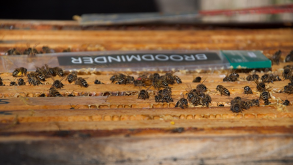

# Quick start guide

## How to start the system in 3 steps

### 1 - Create your MyBroodminder.com account

A single account to create everything: apiary, hives & sensors. 

### 2 - Activate devices

Watch our YouTube video: https://www.youtube.com/watch?v=fanEzs-6fb4 

### 3 - Install the Broodminder Apiary App

Collect your device data. 

### 4 - View & explore

Analyze raw (MyBroodminder) or refined (Mellisphera) data.

**Need some help?** [info@mellisphera.com](info@mellisphera.com)

## Tips to install efficiently your devices

### Name your hives

Identify your hives: numbered, engraved or painted plate... Whatever you want. The main thing is to be able to spot them from afar, without any problem.  

### Set-up the system at home

- Settle down on a large table with your computer, your sensors and some post-it notes. 

- Sequentially switch all your sensors on. Simply check that the red LED flashes for 60s. If your sensor is already on, check that the led keeps flashing quickly.

- Assign each sensor to its hive by writing the hive name on a post-it note. 

- Enter this apiary/hive/sensor configuration in MyBroodminder.com.  

- Make the first sync with your mobile via the Broodminder Apiary app. 

- Check that all sensor data appears on MyBroodminder.

## If you have a Hub

### Download the Cell App

With this app, you can communicate with the hub. 

### Wake up the Hub

- Don't open the hub. It's already ready to use.  

- All you have to do is to take it out from the "deep sleep" mode.

- Wait for the hub to connect to the 3G network.

- Make sure it got all the sensors around.

- You're done, the system is working! Now you can get some well-deserved rest ;) 

## Install at your apiary 

**On the apiary, putting the autopilot on** 

You prepared everything in advance. Now all you have to do is to place the sensors in their hive.  

Place the W scales at the back of your hive (on the shaded side) with a 5x4cm wedge at the front, in the same position. 

If it's possible, position the hives equipped with W scales closer to the Hub because their coverage is lower than the T2 sensors. 

Be careful, if you have Nicot floors, the plastic-plastic contact can be slippery.

The T2 sensors must be centered on the fifth frame head (front view from the left). 

