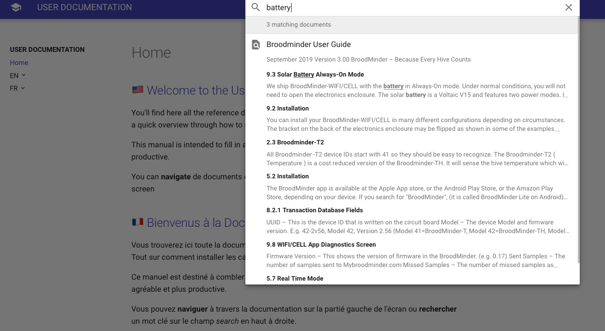

# Support

Can't find the answer to your question in this documentation?

The keyword search didn't give the result you were expecting?

Contact Mellisphera support by email at [support@mellisphera.com](mailto:support@mellisphera.com) 

You can reach us directly from the Mellisphera interface

## Keyword search {#srch}

Feel free to use the **keyword search**: it is extremely powerful and provides you with results on all available documentation.

An example here with the keyword "battery".

