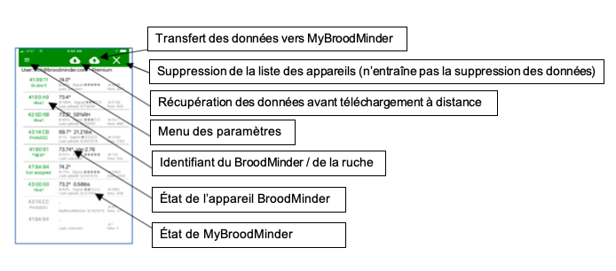
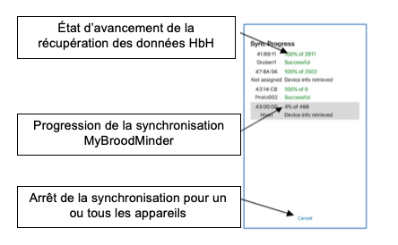
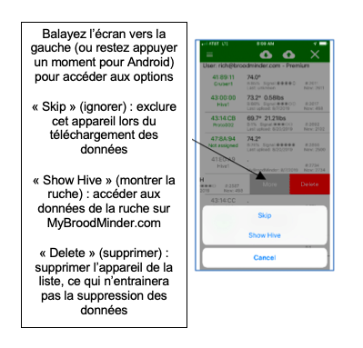
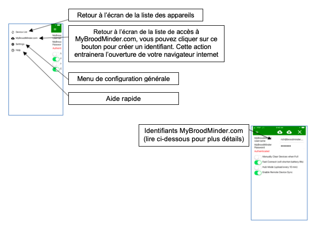
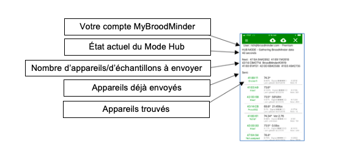
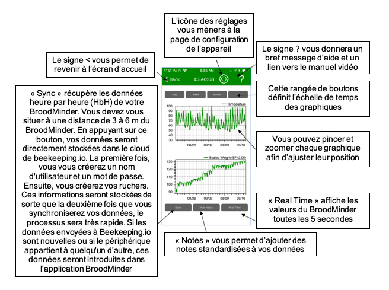
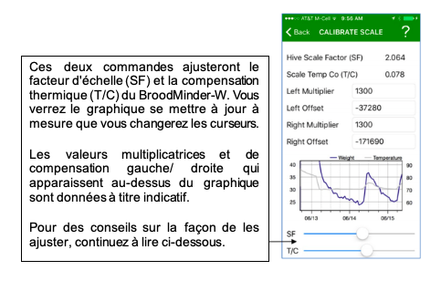

# Récupération des données

Tous les capteurs de la gamme BroodMinder transmettent en Bluetooth. Il existe plusieurs manières de récupérer les données qu'ils enregistrent. En essence via votre smartphone ou via un transmetteur automatique.

## BroodMinder - APIARY

Présentée en 2018, BroodMinder-APIARY est l'application la plus puissante. Elle prend la relève de l'application BroodMinder-LITE.

Nous vous conseillons d'utiliser **Broodminder APIARY**

L'ensemble des utilisateurs peuvent visualiser l'état actuel de leurs capteurs et les télécharger leurs données sur MyBroodMinder.com. Cela permettra un contrôle de base des capteurs ainsi que les mises à jour des micrologiciels.

Les utilisateurs de MyBroodMinder-Premium peuvent visualiser et télécharger les données de chaque capteur BroodMinder de leur rucher directement dans MyBroodMinder en appuyant sur une touche. Il pourront également choisir d'envoyer automatiquement leurs données en temps réel à MyBroodMinder.com toutes les 10 minutes.

Une fois vos données transférées, leur analyse et leur notation peuvent se faire directement sur MyBroodMinder.com. Nous vous le recommandons pour sa facilité d'utilisation.

Veuillez noter que cette application stocke uniquement vos données récoltées heure par heure dans le cloud mais ne conserve pas une copie sur votre téléphone et/ou tablette.

De nouvelles fonctionnalités ont été ajoutées en 2019-2020 :

   - L'affichage de plus de détails concernant les capteurs sont affichés, y compris le nom de la ruche.
   
   - Le téléchargement à distance - l'application fonctionne désormais avec ou sans connexion Internet (pour les utilisateurs Premium uniquement).

  - Le mode Hub – vous pouvez utiliser tout smartphone (iOS ou Android) connecté à internet pour envoyer des données toutes les 10 minutes depuis votre rucher (pour les utilisateurs Premium uniquement).

  - L'activation de BroodMinder-CELL – le capteur peut être tiré d'un profond sommeil.
  
  - La modification de la fréquence d'échantillonnage (de 60 à 15 minutes).
  
  - Les mises à jour du micrologiciel T2 pour le SwarmMinder.
  
  - Le contrôle de la mise hors tension pour le T2.

L'utilisation de l'application est super simple :

1. Rendez-vous sur MyBroodMinder.com et créez votre compte gratuitement

2. Téléchargez BroodMinder-Apiary à partir de l'app store

3. Lancez l'application, cliquez sur l'icône d'engrenage (page de configuration) et entrez vos identifiants MyBroodMinder

4. Retournez à l'écran de la liste et dans quelques secondes, tous les capteurs BroodMinder présents dans la zone s'afficheront automatiquement à l'écran

5. Une fois que les identifiants de vos capteurs BroodMinder sont devenus verts, cliquez sur l'icône  pour commencer le téléchargement des données sur MyBroodMinder

6. L'application vous montrera l'état de progression du téléchargement. La ligne supérieure indique l'état d'avancement de la collecte des données. La ligne inférieure montre le transfert de ces dernières vers MyBroodMinder

Une fois le transfert terminé, les données s'afficheront dans MyBroodMinder. Si vous avez déjà configuré vos capteurs, il vous suffit de regarder le résultat. S'il s'agit de nouveaux capteurs, vous devrez les trouver sur MyBroodMinder « Device Inventory » (inventaire des capteurs) et de les attribuer à un rucher puis à une ruche. Allez à la section suivante pour plus d'informations à ce sujet.

### Écran de la liste des capteurs

### Écran de progression

### Écran des détails du capteur

### Écran des options

### Menu des paramètres

### Menu de configuration générale

- **Affichage en métrique** 

- **Connexion rapide** : ce bouton permettra d'accélérer le temps de connexion en accélérant le « taux de collecte ». Cela signifie que le capteur BroodMinder enverra un signal toutes les secondes au lieu de toutes les 5 secondes. L'inconvénient de cette option est qu'elle réduit la durée de vie de la pile. Il est possible d'accélérer la connexion durant l'été et de la ralentir durant l'hiver.

- **Mode Hub** : voir ci-dessous.

- **Activer la synchronisation à distance (Remote device Sync)** : vous pouvez récupérer vos données même lorsqu'il n'y a pas de connexion internet ou de couverture cellulaire dans votre rucher.

    1. Avant de vous rendre à votre rucher (tant que vous êtes encore connecté), allez sur l'application à l'écran de la liste des capteurs et cliquez sur l'icône . Cela permettra le téléchargement de la liste de tous vos capteurs ainsi que le statut des données remontées lors de la dernière synchronisation. 
    _ATTENTION : Si vous contournez cette étape, c'est l'ensemble de des données dans la mémoire du capteur qui sera récupéré : ça pourrait représenter une année entière de données !_

    2. Une fois sur le terrain, procédez à la synchronisation de vos capteurs comme d'habitude. Le téléchargement vers le cloud échouera mais c'est normal vu que vous n'avez pas d'accès à internet

    3. Lorsque vous revenez à la civilisation, relancez l'application qui vous suggèrera de procéder au téléchargement vers le cloud. Faites-le et MyBroodMinder.com sera mis à jour.

- **Mode Hub** : Le mode Hub vous permet d'utiliser un vieux modèle de téléphone/tablette pour l'envoi automatique de vos données BroodMinder sur MyBroodMinder toutes les 10 minutes. De cette façon, vous pouvez suivre l'état de vos abeilles 24/24h 7/7j depuis n'importe où dans le monde. Il vous suffit d'autoriser le Mode Hub et de revenir à l'écran de la liste de vos capteurs :

## BroodMinder - LITE

Remarque: Nous vous recommandons désormais d'utiliser l'application BroodMinder Apiary. Elle est plus fiable.

### Compatibilité des appareils

#### Apple - iOS

Les capteurs BroodMinder fonctionnent avec tout appareil Apple disposant de la technologie Bluetooth Low Energy (BLE). Ils fonctionnent avec les iPhones 4s & plus récents et avec les iPads de 3e génération & plus récents.

#### Android

Pour Android, c'est un peu plus compliqué. Android a introduit le support BLE dans la version 4.3 (Jelly Bean, juillet 2012). Les appareils plus vieux ne fonctionneront pas. La plupart des nouveaux appareils (2015 & plus récents) fonctionneront. Cependant, il existe de nombreux modèles de téléphones et nous en avons trouvé quelques-uns qui nous posent problème. Si votre appareil ne fonctionne pas, contactez-nous à l'adresse suivante : Support@BroodMinder.com.

Une nouvelle fonctionnalité a été ajoutée à l'application dans la version 2.97 afin d'augmenter le taux d'envoi des capteurs BroodMinder. Tel qu'il est livré, un capteur BroodMinder envoie un message toutes les cinq secondes qui contient des informations sur la température et le poids. La page des paramètres généraux dispose désormais d'un bouton de configuration Bluetooth qui vous permet de modifier le taux d'envoi à un message toutes les secondes. Cela accélérera la connexion du capteur et rendra la récupération des données plus rapide. Il réduira toutefois la durée de vie de la batterie à 3-6 mois.

Un bouton "Reset Android Bluetooth" a également été ajouté sous le bouton "Bluetooth Config". Cela vous permettra de réinitialiser le système de la fonction Bluetooth. Nous avons constaté que sur certains téléphones, cela aide à rétablir la communication.

Vous trouverez plus d'informations sur le site https://mybroodminder.com/app/resources.

### Installation

L'application BroodMinder est disponible sur l'App Store d'Apple, sur le Play Store Android ou encore sur le Play Store Amazon, en fonction de votre appareil. Si vous recherchez « BroodMinder » (BroodMinder Lite sur Android), vous le trouverez. Installez-le comme n'importe quelle autre application.

Une fois installée, démarrez l'application. Un message de bienvenue et de félicitations devrait apparaitre en ouvrant l'application. Vous pouvez choisir de regarder notre Queen Bee, Laura Davis, vous faire une démonstration de l'installation ou vous pouvez ignorer ce message et laisser l'application faire son travail.

L'application commencera à rechercher les capteurs BroodMinder présents dans la zone et remplira automatiquement l'écran avec tous ceux qu'elle trouvera dans la zone.

Si aucun capteur n'apparait :

- Assurez-vous que la languette de la pile a été retirée du BroodMinder-TH et que la pile est bien en place sur le BroodMinder-W.
- Assurez-vous que le Bluetooth est activé sur votre téléphone / tablette.
- Assurez-vous de vous tenir à une distance de 3 à 6 m de votre dispositif BroodMinder.

### Écran d'accueil

BroodMinder-T affichera la température
BroodMinder-TH affichera la température et le taux d'humidité
BoordMinder-W affichera la température et le poids

### Détails et graphiques

### Page de configuration générale

### Page de configuration du capteur

### Mode Temps Réel

Si vous souhaitez voir vos données en temps réel, vous pouvez utiliser le bouton « Real Time » sur l'écran du graphique. En pressant ce bouton, le taux d'échantillonnage passera à 5 secondes et vous verrez apparaitre des valeurs dans la partie inférieure de l'écran.

**B** : niveau de la pile  
**T** : température (actuellement uniquement disponible en Fahrenheit :1°F = -17°C) 
**H** : humidité relative (en%) 
**L/R** : équilibre entre les capteurs de droite et de gauche. S'ajoute à 100% (balance BroodMinder-W uniquement) 
**W** : poids total (actuellement uniquement disponible en livre : 1 livre = 453 g) (balance BroodMinder-W uniquement) 
**Delta** : variation de poids depuis le lancement du temps réel (balance BroodMinder-W uniquement) 

Ces données seront également enregistrées dans le fichier de suivi. 

Ré-appuyer sur le bouton « *Real Time* » permettra de ce mode et fera repasser automatiquement le taux d'échantillonnage à 1 heure.

### Réglage du facteur de poids BroodMinder-W

Par défaut, le facteur de poids du BroodMinder-W est fixé à 2.0. Cela signifie que tout poids observé par le BroodMinder-W sera doublé afin de refléter le poids total de la ruche. En regardant les caractéristiques de la situation (annexe ci-dessous), nous savons qu'il s'agit d'une approximation, qui n'est donc pas totalement exacte. Dans la plupart des cas, elle est suffisamment proche de la réalité car de petits changements seront encore visibles et une erreur à 5-10% du poids total n'est pas importante.

Un affichage plus précis du poids total peut être obtenu en ajustant le facteur d'échelle pour tenir compte de la situation spécifique de la ruche.

Allez à l'écran du graphique de l'échelle et appuyez sur le bouton « Real Time ». En quelques secondes, l'application affichera le relevé de la balance toutes les 5 secondes en bas de l'écran. Vous pouvez également voir le % de charge sur chaque cellule de charge.

Ajoutez maintenant un poids (entre 4 et 10 kg) sur la ruche et centrez-le. Vous devriez voir le poids changer en fonction sur l'application. Vous pouvez ensuite ajuster le facteur d'échelle pour qu'il corresponde exactement au changement de poids effectué.

**Exemple :**

| **Poids** | **Poids delta** | **Facteur d'échelle** | **Notes** |
| --- | --- | --- | --- |
| 121.2 | 0.0 | 2.0 | Lancement du temps réel |
| 132.2 | 11.0 | 2.0 | Ajout du poidsChangement du facteur d'échelle |
| 129.5 | 10.0 | 1.82 | Calibrage plus proche |
| 117.0 | 0.0 | 1.82 | Enlèvement du poidsPoids de la ruche plus précis |

### Réglage de la compensation thermique du BroodMinder-W

Les capteurs présents dans le BroodMinder-W sont de très grande qualité et présentent peu d'effet de la température. Cependant, il peut toujours y avoir des variations d'une balance à l'autre. C'est pourquoi nous vous proposons un moyen d'améliorer la précision des résultats grâce au réglage de la compensation thermique de la balance – « Scale TempCo ».

Pour ajuster le TempCo, choisissez une portion de votre graphique de poids pour laquelle vous savez qu'il n'y a que peu de changement en raison de l'activité des abeilles. Un jour nuageux est le moment idéal car nous savons qu'elles ne butinent pas. Il serait également intéressant de choisir un jour où la température extérieure varie d'au moins 6°C au cours de la journée.

En apportant de petites modifications à la valeur TempCo, vous verrez le graphique s'équilibrer pour donner un poids uniforme comme on pourrait s'y attendre.

Si vous constatez des pics de poids même après ajustement, c'est probablement parce que la balance est exposée au soleil. Le soleil peut chauffer la balance assez rapidement et de façon spectaculaire. Il sera donc très difficile pour le TempCo d'être efficace.

### Annotations sur les graphiques

En appuyant sur « *Hive Notes* », vous pourrez ajouter du texte à tout moment sur le graphique. C'est particulièrement utile pour expliquer un brusque changement dans les données récoltées ou encore indiquer une inspection de la ruche.

Appuyer sur ce bouton fera apparaître un sous-menu composé de huit groupes d'évènements ou d'actions possibles. Sélectionnez le groupe le plus approprié à votre situation et choisissez la balise correspondante. Choisissez le groupe « *Custom* » (personnaliser) si les groupes de liste ne couvrent pas votre cas. Les sélections dans l'application seront mises à jour au fil du temps pour refléter au mieux les balises les plus utilisées.

L'heure indiquée dans la partie haute de l'écran correspond à l'heure actuelle si les graphiques n'ont pas été déplacés par pincement ou balayage, avant d'avoir appuyé sur le bouton « *Tag Graph* » n'ait été enfoncé. Le temps peut être ajusté en cliquant simplement dessus.

Lorsque vous notez un évènement passé, il serait pertinent de déplacer le graphique pour aligner l'heure de l'évènement avec le « *Note Time Indicator* », avant d'appuyer sur « *Hive Notes* ». Dans ce cas, l'heure qui s'affichera dans la partie haute de l'écran correspondra à l'heure du « *Note Time Indicator* » et non l'heure actuelle.

Le bouton « *Inspection* » présente un intérêt particulier. En appuyant sur ce bouton, vous serez amené à répondre à six questions faciles sur l'état de votre ruche. C'est Dick Rogers qui nous a partagé́ ces questions et nous pensons que c'est un moyen rapide et efficace de documenter la ruche.

## BroodMinder - HUB 

BroodMinder-WIFI/CELL est un composant facultatif qui se place dans votre rucher et vous permet de transmettre les données depuis vos appareils BroodMinder directement sur MyBroodMinder.com par connexion wifi ou mobile. Nous avons conçu le BroodMinder-WIFI/CELL pour se mettre automatiquement en marche à la mise sous tension.

Pour de meilleurs résultats, regardez la vidéo de l'installation sur [BroodMinder.com/pages/videos](https://broodminder.com/pages/videos)

### Instructions de démarrage rapide

**IMPORTANT** : synchronisez tous vos appareils et transférez vos données sur MyBroodminder.com avant de démarrer votre appareil BroodMinder-WIFI/CELL

- Placer votre BroodMinder-WIFI/CELL dans le rucher avec le panneau solaire orienté vers le soleil

- Téléchargez l'application BroodMinder-CELL (que vous ayez un appareil BroodMinder-CELL ou BroodMinder-WIFI)
- Lancez l'application – votre appareil BroodMinder-WIFI/CELL devrait apparaitre dans la liste
- Cliquez sur « exit deep sleep » (tirer du sommeil profond)
- WIFI uniquement – entrer le nom de votre réseau wifi ou mobile ainsi que le mot de passe associé
- Vos données devraient apparaitre automatiquement sur MyBroodminder.com une heure après

### Installation

Vous pouvez installer votre BroodMinder-WIFI/CELL avec de nombreuses configurations différentes selon les circonstances. Le support à l'arrière du boîtier électronique peut être retournée comme on peut le voir sur quelques exemples.

Quelques remarques relatives à l'installation :

- Le panneau solaire aura complètement chargé la batterie en 4 heures d'ensoleillement direct

- La batterie devrait tenir 3-4 jours sans ensoleillement
- La réception sans fil est entravée par les arbres. Mais monter sur un arbre peut s'avérer problématique si votre connexion est instable
- Pour les cas les plus extrêmes, nous vous suggérons d'utiliser une antenne plus sensible (pour le réseau mobile uniquement). Contactez-nous sur [support@BroodMinder.com](mailto:support@BroodMinder.com) pour plus d'informations
- Des colliers de serrage ou pour tuyaux peuvent être utilisés afin de sécuriser le système
- Ceux de 7cm que l'on trouve dans les magasins de bricolage fonctionnent parfaitement. Ils ont des languettes qui peuvent être légèrement pliées pour permettre l'insertion du BroodMinder-WIFI/CELL. Ensuite, un collier de serrage en bas permet de sécurise l'installation

### La batterie solaire en mode permanent (Always-On)

Nous vous envoyons le BroodMinder-WIFI/CELL avec la batterie en mode permanent (Always-On). Dans des conditions normales, vous n'aurez pas besoin d'ouvrir le boîtier électronique.

La batterie solaire est une batterie voltaïque 15V qui dispose de deux modes d'alimentation :

- En mode permanent (_Always-On_), la batterie ne s'éteint jamais

- En mode arrêt automatique (_Auto-Off_), la batterie s'éteint automatiquement au bout de 20mn

Il est important de laisser la batterie en mode permanent afin que le BroodMinder-WIFI/CELL puisse fonctionner 24/24h.

Pour récapituler : nous vous envoyons le BroodMinder-WIFI/CELL avec la batterie en mode permanent. Si vous n'avez pas maintenu le bouton d'alimentation de la batterie solaire pendant plus de 5 secondes, vous n'avez rien à changer.

Si vous avez maintenu le bouton d'alimentation de la batterie pendant plus de 5 secondes, cela aura modifié le mode d'alimentation. Cette action permet d'alterner entre le mode permanent et le mode arrêt automatique mais il peut s'avérer difficile de savoir sur quel mode vous êtes.

Pour faire la différence entre les deux modes, **regardez la lumière de la batterie APRES les 3 flashs** décrits ci-dessous :

- Bloquez le panneau solaire afin d'avoir moins de confusion
- Appuyez sur le bouton d'alimentation et maintenez-le enfoncé
- Au bout de 6 secondes, les LED de la batterie clignoteront 3 fois
- Si la lumière reste allumée pendant encore quelques secondes, cela signifie que la batterie est sur le mode permanent (_Always-On_). C'est bon !
- Relâchez le bouton

Si après les 3 flashs, la lumière de la batterie s'éteint, cela signifie qu'elle est sur le mode arrêt automatique (_Auto-Off_). Recommencez la manipulation et la batterie devrait être sur le bon mode cette fois.

Accédez à notre vidéo pour activer facilement le mode _Always-On_ ici https://youtu.be/geVp0FDxm3U 

### Les voyants lumineux WIFI/CELL

## BroodMinder - CELL

L'application BroodMinder-CELL vous permet de gérer votre HUB qu'ils soit 3G ou WiFi. Parmi les éléments que vous pouvez contrôler :

- Mode sommeil profond (_Deep Sleep_) – voir ci-dessous
- État actuel du BroodMinder-WIFI/CELL (initialisation, délai jusqu'au prochain transfert de données, connexion au WIFI, envoi de données)
- Nombre d'appareils BroodMinder trouvés dans le rucher
- Force du signal du WIFI
- De nombreuses fonctions de diagnostic

Nous n'entrerons pas dans les détails dans ce manuel car il n'y a pas beaucoup d'ajustements à faire sur l'application. En effet, les seuls éléments que vous pouvez ajuster sont le moment et la fréquence de transferts de données sur MyBroodminder.com.io. Le reste de l'application est destiné à aider notre équipe de support client à diagnostiquer des problèmes.

Lorsque vous recevez votre BroodMinder-WIFI/CELL, ce dernier devrait être en mode sommeil profond (_Deep Sleep_) afin d'économiser la batterie pendant le transport. Vous aurez besoin de l'application BroodMinder-CELL pour le sortir de ce sommeil profond.

Par défaut, le BroodMinder-WIFI/CELL transférera vos données toutes les heures.

### Écran d'accueil de l'application WIFI/CELL

*Remarque : si vous balayez l'écran vers gauche, vous pouvez supprimer les appareils BroodMinder-WIFI/CELL non utilisés.*

### Écran de configuration de l'application WIFI/CELL

### Écran de diagnostic de l'application WIFI/CELL

### Écran de réseau wifi/mobile de l'application WIFI/CELL

### Écran de réseau cellulaire de l'application WIFI/CELL

*Remarque : il s'agit des commandes du modem mobile. Pour les commandes du modem wifi, rendez-vous à la page suivante. Si le modem n'est pas allumé, l'actionnement de toute commande entrainera son allumage. Attendez quelques secondes et actionnez de nouveau la commande souhaitée. Le résultat s'affichera en bas de l'écran.*

### Écran de réseau wifi/cellulaire de l'application WIFI/CELL

## Compatibilité

Nous avons conçu l'application BroodMinder pour fonctionner avec la plupart des appareils iOS (iPhone, iPad) et Android. Nous testons notre logiciel sur de nombreux appareils.

### Apple iOS

L'application BroodMinder fonctionne avec tous les appareils Apple dotés de la technologie Bluetooth Low Energy (BLE). Il fonctionnera avec les modèles iPhone 4 ou plus récents ainsi qu'avec les iPads de 3ème génération ou plus récents.

### Android

Pour Android, c'est un peu plus compliqué. Android a introduit le support BLE dans sa version 4.3 (Jelly Bean, juillet 2012). Les appareils plus anciens ne fonctionneront pas. La plupart des nouveaux appareils (2015 ou plus récents) fonctionnent. Cependant, il existe de nombreux modèles de téléphone et nous en avons trouvé́ quelques-uns qui posent problème. Si votre appareil ne fonctionne pas, contactez- nous à l'adresse [support@mellisphera.com](mailto:support@mellisphera.com)

Une nouvelle fonctionnalité a été ajoutée à l'application dans la version 2.97 dans le but d'augmenter le « taux d'annonce » de vos appareils BroodMinder. Tel qu'expédié, le BroodMinder est programmé pour envoyer un message transmettant les données de température et de poids toutes les 5 secondes. La page de configuration générale est désormais dotée d'une section de configuration Bluetooth qui vous permet de passer le taux d'annonce à 1 message par seconde. Cela vous permettra d'accélérer la connexion des appareils ainsi que la récupération des données. Cependant, cette manipulation réduira la durée de vie de la pile à 3-6 mois.

Nous avons également ajouté l'option « Réinitialiser Bluetooth Android » en-dessous de la section de configuration Bluetooth. Cela permettra de réinitialiser la fonction Bluetooth. En effet, nous avons constaté que sur certains modèles de téléphone, cette manipulation aide à rétablir la communication.

Vous trouverez plus d'informations sur MyBroodMinder.com/resources