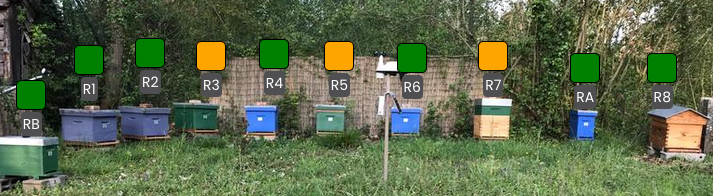

# Mellisphera.com

## Présentation générale 

<!-- Vidéo ancienne en français : https://www.youtube.com/watch?v=Nqh_R37O8IE  -->

<!-- Vidéo récente en anglais : https://www.youtube.com/watch?v=pbCqpf8EY0s -->

Mellisphera est intégrée avec BroodMinder. Ainsi, vous devez créer un compte MyBroodMinder et configurer vos ruchers / ruches sur [MyBroodMinder.com](https://mybroodminder.com). Le site vous permet d'affecter les capteurs à chaque ruche et de visualiser les données mesurées. 

Un bouton Mellisphera est toujours visible sur le menu de gauche, il suffit de cliquer sur celui-ci pour y accéder. Si vous vous êtes connectés récemment, la connexion se fera sans que vous ayez besoin de rentrer votre email et votre mot de passe. Dans le cas contraire, le champ de l'email sera pré-rempli. 

Votre aventure commence donc maintenant [https://bzz.mellisphera.com/login](https://bzz.mellisphera.com/login)

## Page de connexion 

Sur la page de connexion, vous avez la possibilité de vous connecter à un rucher démo si vous ne possédez aucun compte ou si vous êtes curieux et avide de nouveauté. Vous pouvez lire les informations qui vous en apprendront davantage sur la relation entre BroodMinder et Mellisphera et sur ce que Mellisphera peut vous apporter.

Passons à l'étape de la connexion. **Il faut que vous utilisiez vos identifiants BroodMinder**. Une fois connecté, vous hériterez de l'historique complet de vos capteurs. Vous pourrez explorer les événements passés et suivre l'évolution de la saison sous un angle complètement nouveau. Lors de la première connexion, vous êtes averti que le chargement de l'ensemble de l'historique de vos données est lancé. A chaque nouvelle connexion, nous chargeons vos données manquantes.

Nous allons faire un tour ensemble des différentes fonctionnalités de Mellisphera.

## Ecran d'accueil

Une fois connecté à Mellisphera vous devriez arriver sur cette interface. Elle se décompose en trois zones:

La barre d'en haut vous permet de sélectionner le rucher à visualiser. Un peu plus loin se trouvent vos préférences. Sur le côté gauche se trouvent les différents environnements de Mellisphera. Nous allons explorer chacun de ces espaces dans les prochains chapitres. 

Des infobulles sont également positionnées à côté de chaque fonctionnalité. Elles détaillent les informations essentielles à la compréhension des données.

## Paramètres de compte

En haut à droite sur l'app Mellisphera, vous avec accès à vos paramètres de compte. 

Vous pouvez réinitialiser votre mot de passe. Attention, cela ne modifie le mot de passe que pour la plateforme Mellisphera. 

Vous pouvez également définir quelques préférences:

- le format de la date 
- le système d’unité (métrique ou impérial)
- la langue (français, espagnol ou anglais pour le moment)
- la source météo

## Vue du rucher

Cette page est le point de départ de Mellisphera. Sélectionnez le rucher à explorer sur le menu déroulant tout en haut et ensuite naviguez visuellement parmi les principales informations.

Cette navigation est contextualisée sur le rucher à l'aide d'une photo qui vous permet de situer l'emplacement de vos ruches. Par dessous vous pourrez positionner des "pastilles" qui matérialisent la ruche et portent les informations associées (nom, poids, couvain etc).

**Photo et placement**

Lors de votre première connexion, vous pourrez ajouter une photo de votre rucher. Soit par glisser/déposer d'un fichier depuis votre explorateur de fichiers préféré, soit en ouvrant le menu contextuel matérialisé par une icone "appareil photo" en haut à droite du cadre de la photo.

**Export des données**

Sur l'image, vous avez également un icône pour l'export de vos données. C'est un export excel (csv ou .xlx) des données de vos ruchers (ruches, capteurs, batterie, couvain, poids) et de vos dernières notes. Cela s'avère très utile lors de vos visites au rucher.

**Navigation photo**

L'image du rucher et les pastilles, sont associées à un ensemble de boutons positionnés juste au dessus. Cette barre de navigation vous permet de visualiser contextuellement diverses informations: 

Les boutons 'Nom', 'Couvain', 'Poids', et 'Capteur' sont activables. Cela permet d'afficher sur la photo en dessous des pastilles respectivement le nom, le couvain, le poids et les capteurs de l'ensemble des ruches de votre rucher à la date affichée en haut à droite. Par défaut, c'est la date de la veille (qui correspond au dernier jour de données en général). Vous pouvez bien entendu changer de date. 

**Etat des capteurs**

Petite particularité pour les capteurs, vous visualisez leur état en temps réel par une couleur (grise, rouge, orange) qui détermine l'état et un affichage au survol du problème.

Le niveau de batterie est calculé systématiquement. Pour les ruchers équipés d'un Transmetteur sont également traitées les informations de signal et de connexion. Le code couleur est le suivant :

- Gris - tout est nominal
- Orange - mauvais signal ou batterie à remplacer
- Rouge - le capteur n'émet pas 

Le seuil de batterie est fixé à 20% par défaut, vous pouvez le régler dans les paramètres d'alertes. 

Les informations de signal et de connexion sont basées sur la fréquence des relevés de données chaque jour. Leur quantité et qualité permet de déterminer s'il y a une déconnexion ou un mauvais signal. La première alerte est envoyée 24 heures après le début du problème. 

**Pastilles de couleur des ruches**

Les pastilles indiquent l'état de chaque ruche avec un code couleur (noir, rouge, orange, vert). Vous pouvez également regarder au survol le message associé à chaque état. L'état est calculé à une fréquence journalière en fin de journée par le modèle BFit. C'est pour cela que vous visualisez systématiquement le jours j-1. Avec le sélecteur de date en haut à droite, vous pouvez naviguer parmi les jours précédents également. 

Notez que les ruches non équipées de capteurs ou celles qui n'ont pas de données au jour j-1 présentent une pastille blanche. 

Pour plus d'information à propos du modèle BFit calculant l'état des ruches, vous pouvez consulter la section 'Interprétation des données'. 

**Calendrier des événements du rucher**

Vous disposez d'un calendrier d'événements propre à chaque rucher. Ce calendrier vous permet de tracer les interventions réalisées au niveau de l'ensemble du rucher, ou des observations générales. 
Le calendrier affiche également les alertes et notifications (nous verrons comment les configurer plus loin) au niveau du rucher. 

**Notes de rucher**

Pour terminer la vue rucher, vous pouvez saisir vos notes/inspections de rucher. Cela se situe juste en dessous de la photo de votre rucher.

Pour écrire une nouvelle note, il suffit de cliquer sur le '+' de l'encart, c'est très simple. 

Vous verrez apapraître la note directement sur le calendrier des événements avec l'icône suivante.

## Vue de la ruche

Pour accéder à la vue d'une ruche, vous devez cliquer sur sa pastille ou son nom. La pastille s'entoure en rose et trois nouveaux calendriers correspondant à la ruche selectionnée apparaissent sur la droite. 

Les données affichées sont des données issues des 5 dernières semaines ainsi que des 3 prochains jours puisque nous pouvons prédire des événements à 3 jours. 

**Evénements**

Vous retrouvez le calendrier d'événenements qui est cette fois-ci propre à la ruche selectionnée. Les événements de ruchers et de ruches sont différents. Pour plus de précision, aller dans la section 'Interprétation des données'.

**Couvain**

Vous avez une vision globale de l'évolution du couvain journalier sous forme de calendrier heatmap. Les couleurs varient de rouge à vert et le pourcentage de 0 à 100%. Pour plus de détails quant au model de calcul du couvain, il faut se rendre dans la section 'Interprétation des données'. Si vous possédez plusieurs capteurs de température sur votre ruche, vous pouvez cocher ou décocher celui que vous voulez afficher.

**Productivité**

Ce calendrier offre une vue globale de l'apport de poids journalier sous forme de bulle. Les couleurs sont rouge pour une perte et vert pour un gain. La taille des bulles est proportionnelle à la variation de poids générée par les abeilles (nous soustrayons toute éventuelle manipulation d'ajout ou suppression de matériel). Nous appelerons donc cela la productivité de la ruche. Pour plus de détails quant au modèle de calcul de la productivité, il faut se rendre dans la section 'Interprétation des données'. Vous pouvez afficher uniquement les gains ou les pertes sur le calendrier en cochant/décochant les cases en dessous du calendrier. 

**Notes**

Il est possible de prendre des annotations au niveau de chaque ruche. Ce sont des notes distinctes de vos notes de rucher et qui ne concernent que la ruche sélectionnée. Pour repasser en mode rucher, il suffit de cliquer sur le bouton 'Rucher' de la barre de naviguation grise.

## Explorer

La vue **Rucher** donne un aperçu global de la situation. Dans **Explorer**, vous pourrez naviguer parmi vos données de façon plus approfondie. Une nouvelle barre grise apparait avec trois nouveaux espaces : 'Ruche', 'Couvain', 'Données'. Par défaut, vous arrivez sur le mode 'Ruche'. 
De plus, les données du dernier mois s'afficheront par défaut. Vous pouvez modifier la date en haut à droite. Vous pouvez modifier et personnaliser cette période de données à votre guise ou en utilisant les flèches pour vous déplacer dans le temps de période en période. 

**Ruche**

Dans le mode ruche, vous pouvez choisir entre toutes les ruches de tous vos ruchers mais vous ne pouvez sélectionner qu'une seule ruche à la fois. Vous avez une vue de trois calendriers. 

**Le premier calendrier** récapitule les données de votre ruche, vous pouvez choisir entre les différentes options 

- Couvain 
- Productivité
- Température interne maximum
- Température interne minimum
- Humidité interne maximum
- Température externe maximum
- Température externe minimum

**Le deuxième calendrier** fait état des événements de votre ruche et du calendrier astronomique. 

- Evénements, annotations et alertes
- Calendrier astronomique - biodynamique

**Le troisième calendrier** présente les données météo de votre rucher. Il est donc identique à toutes les ruches d'un même rucher. Vous aurez accès aux données générales 'Météo',

- Température externe maximum
- Température externe minimum
- Humidité externe maximum
- Humidité externe minimum
- Vent
- Précipitations

Vous pouvez aussi visualiser des prévisions météo jusqu'à 5 à 15 jours en fonction du modèle sélectionné. 
Si vous n'avez aucune donnée météo, veuillez vous référer à la FAQ. Pour avoir des détails sur les différents modèles, il faut se rendre dans la section 'Interprétation des données'. 

Vous pouvez donc visualiser et échanger les modes du calendrier comme vous le souhaitez. Voici un exemple :

**Couvain**

Dans le mode Couvain, vous pouvez, cette fois-ci, **sélectionner autant de ruches que vous le souhaitez** et ce, même si ces ruches sont dans deux ruchers différents. Cela vous permet de comparer des ruchers ou des ruches entre elles.

Au survol, vous pourrez voir les informations relatives aux ruches. 

Cet outil est extrêmement performant pour analyser des données sur des longues ou courtes périodes de temps, sur des ruches d'un même rucher ou de différents ruchers. Il donne une énorme flexibilité pour l'analyse.

**Données** 

Dans le mode Données, vous visualiserez les données brutes de vos ruches avec la température interne en haut, le poids au centre et l'humidité en bas (un peu comme sur mybroodminder). En vert, vous aurez les zones optimales pour le couvain et l'humidité. Vous pouvez également sélectionner autant de ruches que vous le souhaitez et ce, même si ces ruches sont dans deux ruchers différents. Cela vous permet de comparer des ruchers ou des ruches entre elles.

Il est très facile de se servir de l’outil. Les petites icones sur la droite du graphique vous permettent de zoomer, sélectionner des zones, vous déplacer, voir les données en listing, etc. 

## Alertes

Dans cet espace vous trouverez toutes les fonctions pour mettre en oeuvre un service de notifications et alertes sur chacun de vos ruchers. Ici aussi vous trouverez une nouvelle barre de navigation qui est en fait un classement du type d'alertes selon 3 catégories: 'Ruche', 'Météo', 'Capteur' plus le bouton 'Paramètres' qui est dédié à la configuration 

### Ruche

Dans cet onglet, vous pouvez voir toutes les alertes concernant vos ruches. Ces icônes d'alertes pourront se retrouver dans votre calendrier d'événements de ruches. 

Chaque alerte peut être activée/désactivée 'ON/OFF'. Pour un grand nombre d'entre elles il est possible de modifier les seuils en faisant glisser le curseur. Par défaut, tout est activé avec des paramètres auto ajustés. 

Sur l'interface la petite icône 'i' d'information permet au survol, d'avoir un bref descriptif de l'alerte. 

De façon plus détaillée, voici les alertes disponibles et leurs caractéristiques :

| **Pictogramme** | **Alerte** | **Fréquence** | **Description** | 
|- |-- | -- | -- |
|  | Miellée | hebdo | l'alerte miellée se déclenche lorsque l'apport de poids net dans la ruche dépasse le seuil indiqué. Par défaut il est défini à 15kg/semaine.| 
|  | Essaimage | ??? | Alerte des essaimages en **temps réel** mais aussi **passés** dans le cas d'une synchro manuelle. Cette alerte fonctionne sur ruches équipées de capteurs de température. Avec une balance ce sera encore plus précis mais ce n'est pas indispensable.   **Nous pouvons ajuster les essaimages détectés en fonction de vos retours, n'hésitez pas à nous signaler des incohérences ou des oublis !**
|  | Risque d'essaimage | ??? | En partant d'un certain nombre de paramètres on évalue le risque d'essaimage à 3 jours.   Cette alerte est en cours de mise au point.| 
|  | Sur-Temperature | ??? | Certaines colonies n'arrivent pas à gérer leur température interne. Souvent il s'agit de divisions petites populations. Mais parfois c'est la météo qui a un effet majeur à cause d'un défaut d'exposition   Dans ce cas, le couvain de la ruche est mis à l'épreuve, car les températures peuvent atteindre les 40°C.| 
|  | Froid extrême | ??? | En hiver, la grappe se resserre et maintient la température très localement - en étant parfois loin du capteur. C'est pour cela que l'indication de "basse température" ne peut être qu'informative. En fonction du contexte, il faudra peut être agir.| 
|  | Faible couvain | hebdo | En pleine saison, une ruche qui présente des niveaux de couvain en dessous de 30% est une anomalie ou une division/essaim. Cette alerte permet d'identifier les colonies qui décrochent. | 
|  | Perte de poids | journée | Une consommation excessive/soudaine signifie souvent pillage de la ruche par une autre colonie.| 
|  | Gain de poids | journée | Alerte journalière qui informe d'un gain de poids lié aux apports des abeilles. Certainement à associer avec l'alerte miellée hebdo.| 
|  | Forte humidité | journée | En hiver, l'humidité dans la ruche peut atteindre 80% de façon naturelle. Toutefois, si le seuil est encore plus haut il faut penser à intervenir.   Cette alerte est uniquement opérationnelle avec les ruches équipées de capteurs TH| 
|  | Faible humidité | journée | En saison, la zone optimale d'humidité se situe entre 50 et 75%.| 
|  | Ruche morte | journée | Si vous voyez arriver cette alerte, c'est trop tard. Cela signifie qu'il n'y a plus de signal de vie dans la ruche.| 
|  | Traiter varroa | journée | Cette alerte se déclenche lorsque le couvain moyen du rucher descend en dessous du seuil fixe (defaut à 15%). C'est le moment de planifier un traitement anti-varroa à l'acide Oxalique.| 
|  | Ajout hausse | journée | Pour les ruches équipées de balance, cette action est automatiquement détectée et affichée sur le calendrier.| 
|  | Retrait hausse | journée | Pour les ruches équipées de balance, cette action est automatiquement détectée et affichée sur le calendrier.| 
|  | Ruche volée | ??? | Les capteurs ne disposent pas d'une géolocalisation. Cependant, pour les ruches disposant d'un capteur de poids, cette alerte prévient d'un poids anormalement faible, déclencheur possible d'un vol...| 

### Météo 

Dans cet onglet, vous pourrez voir toutes les alertes concernant la météo. Ces icônes d'alertes pourront se retrouver dans votre calendrier d'événements de rucher. Vous pouvez une nouvelle fois ajuster et désactiver/activer les différentes alertes. Par défaut, tout est activé avec des paramètres auto ajustés. 

Toutes les alertes météo sont des alertes de prédiction à J+7 maximum. 
Elles sont évolutives. Si un événement est prévu à J+7 et que le lendemain cet événement n'a plus lieu d'être il n'est plus affiché.
Les alertes concernent majoritairement des évenements forts à extrêmes.

| **Pictogramme** | **Alerte** | **Fréquence** | **Description** | 
|- |-- | -- | -- |
|  | Pluie | jour | Forte pluie.  Valeur par défaut à 50 mm/j  | 
|  | Neige | jour | Neige importante.  Valeur par défaut à 15cm/j   | 
|  | Vent | jour | Vents forts.  Valeur par défaut pour des rafales à 30 km/h   Dans certaines régions, il est conseillé d'augmenter le seuil par défaut si les alertes sont trop régulières.| 
|  | Froid | jour | Cette alerte est déclenchée en pleine saison lorsqu'il est prévu une période dite 'froide'. Cela inclut des journées ou des nuits jugées fraiches par rapport aux normales de saison. Nous fixons les paramètres nous-mêmes.| 

### Capteurs

Les alertes associées aux capteurs informent sur les éventuelles anomalies de connexion ou de batterie. Pour être toujours certain que le système fonctionne nominalement. Cet onglet permet de les configurer. 

Il faut noter que **ces icônes d'alertes ne s'affichent pas dans les calendriers d'événements**. A la place, leur état est visible dans la partie 'Mon Rucher' avec l'onglet 'Capteur'. 

De même, si vous avez activé les emails d'alertes (prochaine partie), vous serez averti des états de vos capteurs. 

Vous pouvez une nouvelle fois ajuster et désactiver/activer les différentes alertes. Par défaut, tout est activé avec des paramètres auto ajustés. 

Voici le détail des alertes disponibles pour chaque type de capteur

| **Pictogramme** | **Alerte** | **Fréquence** | **Description** | 
|- |-- | -- | -- |
|  | Hub déconnecté | jour | Le transmetteur n'a pas envoyé de données durant le dernier jour  | 
|  | W déconnecté | jour | Le capteur n'a pas envoyé de données durant le dernier jour   | 
|  | T déconnecté | jour | Le capteur n'a pas envoyé de données durant le dernier jour   | 
|  | W faible signal | jour | Le capteur W a envoyé des relevés horaires incomplets le dernier jour   | 
|  | T faible signal | jour | Le capteur T a envoyé des relevés horaires incomplets le dernier jour   | 
|  | W faible signal | jour | Le capteur W a un faible niveau de batterie  | 
|  | T faible signal | jour | Le capteur T a un faible niveau de batterie  | 

### Paramètres d'email

C'est dans cet onglet que vous pourrez configurer les envois par email. Nous vous conseillons fortement d'activer ces emails. Si vous avez un Hub, il est conseillé de sélectionner l'envoi journalier. Dans les autres cas, une semaine peut être suffisant. 

Par défaut, l'envoi est OFF et votre adresse mail est inscrite dans la première case. Vous pouvez ajouter une deuxième adresse. Les emails seront envoyés aux deux adresses. Pour vérifier que l'outil fonctionne, vous pouvez cliquer sur le bouton 'Tester email', un email sera instantanément envoyer vers les adresses enregistrées. Si vous ne recevez rien dans les minutes suivantes, veuillez contacter support@mellisphera.com. 

Dans ces emails, vous aurez accès à quatre informations :
- Les alertes obtenues depuis le dernier envoi de l'ensemble de vos ruches et ruchers
- Les événements à venir jusqu'à 3 jours
- L'état de vos ruches 
- L'état de vos capteurs 

Attention, lorsque vous désactivez une alerte, elle n'apparaitra plus dans les emails ni dans les calendriers à partir de la date de la désactivation, ce n'est pas rétroactif. De même, si vous effectuez un changement dans les seuils, cela s'effectuera uniquement pour les nouvelles alertes. 

Voici un aperçu d'un mail que vous pourrez recevoir :

## Lien MyBroodMinder

Vous serez redirigé vers la plateforme MyBroodMinder.com en cliquant sur l'icône de MyBroodMinder. En un seul clic vous pouvez passer d'une plateforme à l'autre, d'un côté sur MyBroodMinder pour gérer vos configurations de ruchers, ruches, capteurs et de l'autre sur Mellisphera pour analyser vos données avec précision et être informé en temps réel de ce qu'il se passe sur vos ruches.

Rappelez-vous que les modifications effectuées sur MyBroodMinder seront récupérées lorsque vous vous connecterez à nouveau sur mellisphera. 

## Support

A partir de ce lien vous pouvez contacter notre support. Soit par message direct, soit par email à [support@mellisphera.com](mailto:support@mellisphera.com) ou en vous connectant directement sur Slack.

Envoyez nous vos questions, vos retours, votre expérience, vos idées d'améliorations et vos problèmes. On aime les retours client! les bons et ceux qui nous aident à progresser.

## Guide utilisateur 

Ce bouton vous renvoie sur l'ensemble de la documentation utilisateur : https://doc.mellisphera.com. 

Ce portail, entièrement dédié à la documentation de l'ensemble du système, est structuré en plusieurs zones comme indiqué dans l'image ci-dessous. 

1. Choix de la langue de la documentation
2. Documents disponibles
3. Corps du document
4. Chapitres du document sélectionné permettant un accès rapide
5. Recherche par mot clé

N'hésitez pas à utiliser la **recherche par mot clé**: elle est extremement puissante et vous fournit des résultats sur l'ensemble de la documentation disponible

Un exemple ici avec le mot clé "batterie"

## Environnement des colonies
La météo et les saisons sont des facteurs clé en apiculture. Avec Mellisphera, nous rapprochons ces informations avec celles des colonies et des apiculteurs pour vous fournir la vue la plus complète des évènements.

### Météorologie
Deux sources météo sont disponibles dans Mellisphera

- WeatherSource (recommandée)
- Open WeatherMaps

La météo est associée au rucher, ainsi qu'à chacune des ruches. Chaque ruche a un registre météo qui lui est propre. C'est à dire que deux ruches qui, à un instant T, se trouvent dans le même rucher vont partager la même météo sur cette période. Mais si l'une d'elles part en transhumance, c'est la météo de chaque rucher qu'elle visitera qui sera enregistrée.

**Prévision à 7 jours**
Avec WeatherSource, il est également possible de visualiser la prévision météo. Le jour J est systématiquement repéré avec un carré violet comme dans l'image ci-dessous.

<i>Météo moyenne du mois et prévision à J+7</i>

### Astronomie
Le calendrier astronomique présente très visuellement les phases de la lune. Mais également la durée du jour avec les heures de lever et coucher du soleil selon votre zone géographique.

<i>Au survol du calendrier lunaire on obtient aussi les informations du soleil</i>

## Modèles et algorithmes 

Dans cette partie sont abordés les aspects plus techniques du fonctionnement de Mellisphera. On y présente les différents modèles BFIT, BFORCE, BWEIGHT ainsi que les sources METEO et les ALERTES.

### Santé des colonies - BFit
BFIT comme _Bee Fitness_ est l'algorithme qui informe l’apiculteur de l'état de chaque ruche. Nous utilisons des repères comme la période de la saison et l’état des ruches environnantes pour définir un état « nominal » de la ruche. Ensuite, nous positionnons chaque ruche par rapport à cette référence.

Le rendu est très visuel avec des pastilles de couleurs pour indiquer leur état. Pour compléter l'information une infobulle (au survol) précise la nature de la situation.

Le code couleur est le suivant :

| couleur | signification|
|---|---|
|Vert    | En forme |
|Orange  | Perturbée (en déclin ou avec des événements anormaux) |
|Rouge   | En difficulté |
|Noir    | Morte|
|Blanc   | Pas de données ou pas de météo |

En activant l'envoi d'alertes dans Mellisphera vous recevrez par email un tableau récapitulatif avec l'ensemble des informations :

BFit repose sur les algorithmes qui collectent les événements. L’algorithme ‘Learning’ apprend des événements précédents pour conserver, ou non, les événements futurs. Il y a, par la suite, une classification entre les événements détectés ayant une incidence sur l’état de la ruche et les autres. 

BFit prend aussi en compte les résultats fournis par BForce. De cette façon il est capable de déterminer l’écart entre la dynamique actuelle de la ruche et une dynamique du couvain théorique en constante évolution. Cette dynamique théorique est régulièrement actualisée. Elle prend également en compte les différentes régions du monde pour fournir des informations pertinentes selon la latitude ou le climat. 

### Niveau de couvain - BForce

Le développement du couvain est un facteur clé pour les colonies d'abeilles. L'objectif de BForce est de fournir une indication du niveau de couvain dans la ruche sur une échelle de 0 à 100%. 

Lorsque la colonie est à plein régime elle atteint un état stable à 35°C. Cet état est associé au 100% de couvain. La ruche est forte. 
Au contraire lorsqu'elle n'a pas de couvain, les abeilles n'ont pas besoin de réguler la température de la grappe. Dans ce cas la température interne de la ruche suivra peu ou prou la température ambiante. Dans ce cas on aura 0% de couvain.

Entre ces deux points extrêmes on peut imaginer toutes les situations intermédiaires. 

Pour illustrer ces propos, voici les mesures horaires sur deux ruches du même rucher. La première est représentée en rouge et la deuxième en gris. Chacune présente un état bien différent. La rouge possède une température interne avoisinant les 25°C/30°C suivant les mêmes fluctuations que la température extérieure (en pointillés), tandis que la grise, est constante autour des 35°C dans la fameuse ‘Zone optimale de couvain' ou 'Brood zone'.

Dans cet exemple la ruche grise a une grande proportion de couvain alors que la rouge n’en a que très peu. **BForce met en équation cette caractéristique des colonies et traduit la mesure brute de température en une information standardisée et compréhensible**. Le modèle prend en compte un certain nombre de paramètres pour estimer au mieux le niveau de couvain.

- température interne de la ruche
- température ambiante
- évolution des colonies voisines
- saison, latitude et climat
- autres évènements identifiés dans la ruche
- type de ruche

BForce est également un **outil de renforcement dans la détection d’essaimage** puisque lorsqu’un essaimage a déjà été détecté par un autre de nos outils de Machine Learning, le couvain s’en voit impacté par la perte de la reine et donc l’arrêt de la ponte. Cela nous permet donc également de classifier nos différents essaimages détectés. 

**Résultats complets**

Les calendriers et graphiques du couvain affichent la progression journalière du couvain de chaque ruche. Les valeurs sont graduées de 0% (pas de couvain) à 100% (couvain complet). En règle générale, 10% est un cadre de couvain, 40% 4 cadres, etc. Selon votre pratique et le modèle de ruche utilisé (Langstroth, Dadant) vous devez ajuster ces relations. Ainsi, **en général les ruches dont le niveau de couvain est supérieur à 80% produisent du miel**. 

En un coup d’oeil il est possible de visualiser l’historique de la saison. Les arrêts et reprises de ponte étant clairement repérables.

<i>Calendrier de couvain</i>

Il est également possible de comparer plusieurs ruches entre elles, quel que soit leur rucher.

<i>La même ruche avec le couvain annuel comparée à deux autres ruches</i>

Avec l'habitude on arrive à identifier plusieurs évènements sur ces courbes. Il est possible de repérer les débuts et arrêts de ponte certes. Mais aussi les essaimages, les périodes de mauvaise météo qui ont impacté la production de couvain, l'effet des frelons asiatiques, etc. 

<i>Trajectoire de deux ruches sur une saison avec quelques évènements</i>

### Productivité - BWeight
Avoir des fleurs n’implique pas nécessairement l’existence de nectar, et donc de ressources pour les abeilles. En effet, de nombreux facteurs conditionnent l’existence d’une miellée : la température et l'humidité ambiantes, les dernières pluies et leur intensité, la profondeur des racines pour des plantes comme le colza ou le tournesol. La miellée n’est donc pas acquise ni aisée à identifier. Pourtant, comprendre les miellées est un besoin élémentaire pour chaque apiculteur.

Un capteur de poids installé sous la ruche fournit des informations détaillées de gain et perte de poids. Toutefois ces informations prennent en compte plusieurs aspects qui ne sont pas en lien avec la productivité.

En premier lieu, dans la journée les variations de poids dépendent des ressources apportées ou consommées, mais aussi du déplacement des abeilles qui, en journée, sortent butiner plus ou moins nombreuses. 

<i>Sortie des abeilles butineuses et retour avec du nectar</i>

C'est pour cette raison que les courbes de poids de la ruche présentent des "bosses". Une chaque jour, comme dans le graphique ci-dessous. Sur le graphique, on voit également des variations soudaines de poids qui sont liées aux interventions de l'apiculteur.

<i>Historique de poids avec interventions de l'apiculteur</i>

Avec ces constats, on voit que **pour bien évaluer la productivité, il faut considérer uniquement les variations de poids provenant exclusivement de la production des abeilles**. De cette façon, il faut négliger les évènements extérieurs : nourrissement, essaimage, ajout/retrait de hausse, interventions de l'apiculteur, perte ou augmentation inexpliquée. L'algorithme BWeight permet de repérer facilement ces évènements bien distincts et de les écarter du calcul de productivité. 

Le résultat est une information journalière de gain ou perte de poids. La représentation graphique sur le calendrier permet de bien repérer la miellée dans la saison ainsi que son intensité.

<i>Excellente miellée de tilleul fin juin !</i>

En prenant une échelle de temps plus large, au niveau de la saison, il est facile de relever et comparer le déroulement des différentes miellées.

<i>Calendrier des miellées d'une ruche transhumante en 2018</i>
