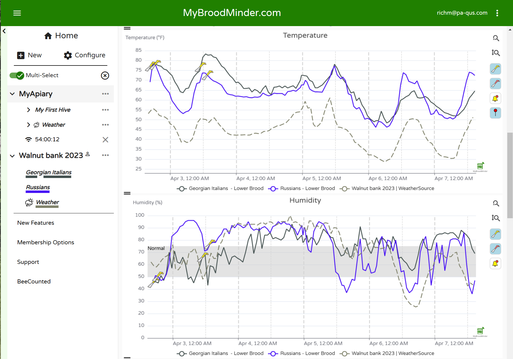

# Introduction

## Bienvenue dans l'univers de BroodMinder
Si vous lisez ceci, c'est le début d'une nouvelle aventure. Vous faites désormais partie de la communauté des apiculteurs de précision. Une communauté qui utilise l'information pour améliorer la santé des abeilles. Mais aussi pour améliorer la pratique de chacun, grâce à une connaissance plus approfondie du comportement des colonies et de leurs écosystèmes.

## Introduction à l'apiculture de précision ##

Dans l'apiculture de précision, l'objectif est d'utiliser au mieux toutes les données disponibles pour fournir à l'apiculteur les bonnes informations au bon moment. L'apiculteur est informé en temps réel de tous les événements qui se produisent dans son rucher. Ceux qui se déroulent en ce moment, mais aussi ceux à venir. Il peut ainsi planifier les inspections à l'avance et sait d'avance à quoi s'attendre. Le diagnostic est établi avant le déplacement au rucher et complété par l'inspection elle-même.

Pour atteindre cet objectif, les algorithmes sont nos meilleurs amis. Il s'agit de modèles qui analysent les informations collectées et les traduisent en "langage apicole". 

Some resources on precision beekeeping: 

- [Precision beekeeping - Wikipedia](https://en.wikipedia.org/wiki/Precision_beekeeping)
- <a href="https://eu.broodminder.com/blogs/blog/precision-beekeeping-101/" target="_blank">Precision beekeeping 101</a>

## Overview of the system
The Broodminder system consists of several components. With this very modular system, you can start simply and then expand the use according to your needs.

Here in a few words are the main components of the system.

### BroodMinder Sensors

Weight, temperature, humidity sensors... A complete and at the same time modular range of devices that enable you to equip your hives according to your needs. 

All the sensors transmit the information via Bluetooth and, of course, you can use your smartphone to collect this data. Simply download the BroodMinder Bees App from your favorite store (Apple or Android).

### BroodMinder Bees App

The 4th generation app for your phone or table is call the "Bees" app and is available for iPhone or Android. This is the quickest and easiest way to start collection data from the sensors. Use it in the apiary to locate the sensors and to take hive/apiary notes by either typing or speaking to the phone. With the app you can collect and review the data regardless of if the apiary has cellular or WiFi connectivity. The app will then automatically synchronize with MyBroodMinder.com, our cloud based analysis system. when internet becomes available.

### MyBroodMinder.com

The data transmitted by your phone or by the hub arrive on the [Mybroodminder.com](https://mybroodminder.com) portal. In this space, you can configure your apiary, your hives and assign your sensors to them. You can also visualize the raw data on fluid and interactive graphs.

### Hub 

For those who want real-time data, the hub is the solution. This autonomous box must be installed in the middle of the apiary. It automatically reads the information from all the sensors and transmits them via the 3G/4G cellular network or WIFI to the cloud, where they are processed.

## And the adventure begins!
We hope that this first round makes you want to continue discovering the full potential of the system. Each brick that makes up the system has its own features and you will explore them in greater depth as you go along.