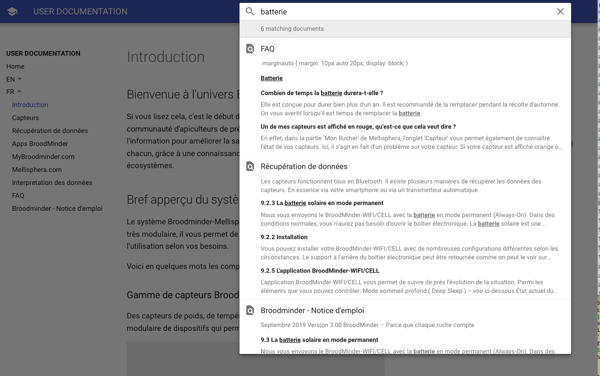

# Support

Vous ne trouvez pas de réponse à votre question dans cette docuentation?

La [recherche par mot clé](#srch) n'a pas donné le résultat que vous attendez?

Contactez le support Mellisphera par email à [support@mellisphera.com](mailto:support@mellisphera.com) 

Vous pouvez nous joindre directement depuis l'interface Mellisphera

## Recherche par mot clé {#srch}

N'hésitez pas à utiliser la **recherche par mot clé**: elle est extremement puissante et vous fournit des résultats sur l'ensemble de la documentation disponible

Un exemple ici avec le mot clé "batterie"

