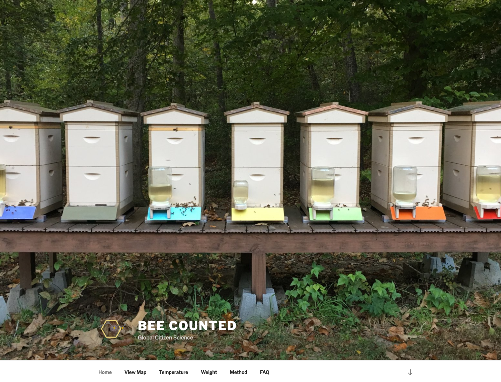
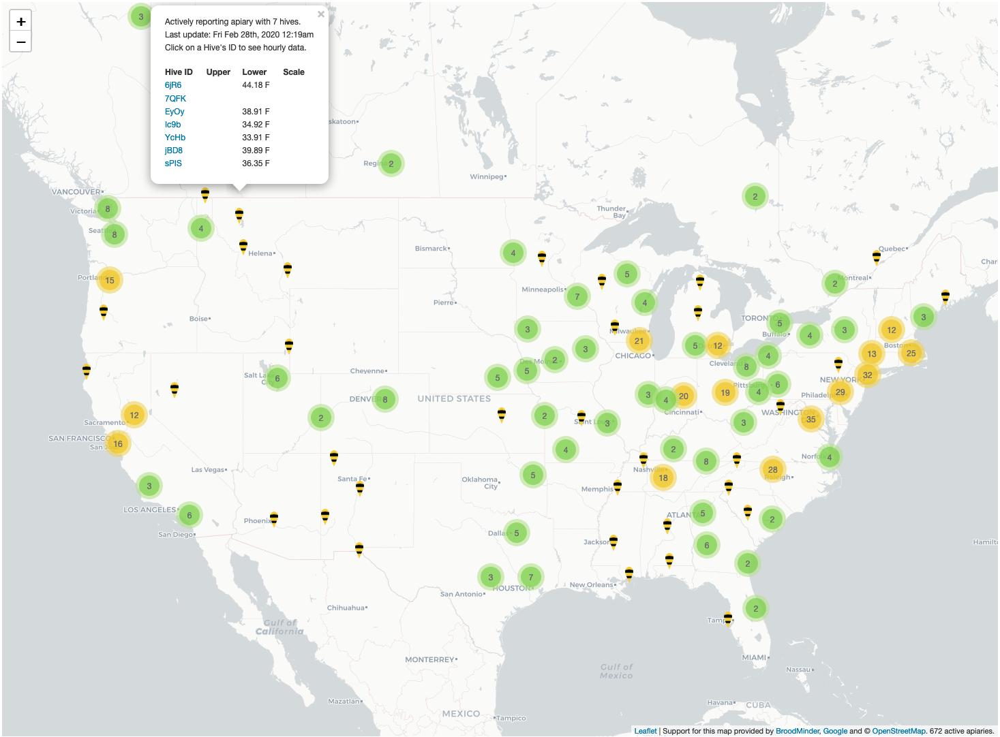

# Science Citoyenne

Broodminder et Mellisphera collaborent avec [Beecounted.org](https://beecounted.org). Nos applications ouvrent la possibilité de partager ses données avec cette initiative internationale. 

Beecounted.org collecte les informations de centaines d'apiculteurs _Citizen Scientists_ qui partagent les données de leurs ruches avec la communauté. 
Ces données sont publiquement accessibles et aident chercheurs et scientifiques à améliorer la connaissance sur les abeilles.

Beecounted c'est également el moyen de faire un tour du monde des ruches. Comment se portent les colonies au Canada en ce moment? Allez voir!

