# Guide de démarrage rapide

## Mise en route du système en 3 étapes

**1 - Créez votre compte MyBroodminder.com**

Un seul compte pour tout créer: rucher, ruches & capteurs. 

**2 - Activez vos capteurs** 

Regardez la vidéo YouTube: https://www.youtube.com/watch?v=fanEzs-6fb4 

**3 - Installez l'app Broodminder Apiary** 

Récupérez les données de vos capteurs. 

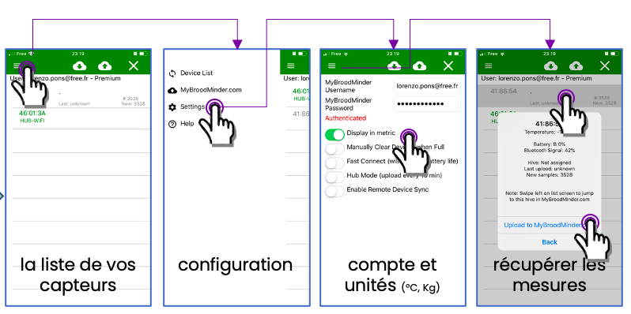

**4 - Visualisez et explorez** 

Analyser les données brutes (MyBroodminder) ou raffinées (Mellisphera). 

**Besoin d'aide?** info@mellisphera.com 

## Trucs & astuces pour installer vos capteurs efficacement 

**1 - Numérotation des ruches** 

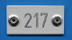

Identifiez vos ruches: plaque numérotée, gravure, peinture... Faites comme vous voulez. L'essentiel est de pouvoir les repérer de loin, sans problème. 

**2 - Préparez le système à la maison** 

- Posez-vous sur une grande table avec votre ordinateur, vos capteurs et des post-it. 

- Allumez tous les capteurs séquentiellement. Vérifiez que la led rouge clignote pendant 60s. Si le capteur est déjà allumé, vérifiez que la led scintille rapidement.

- Affectez chaque capteur à sa ruche en écrivant le nom de la ruche sur un post-it. 

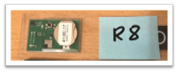

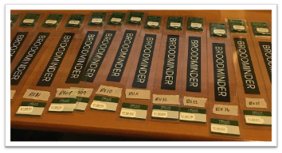

- Saisissez cette configuration de rucher/ruche/capteur dans MyBroodminder.com. 

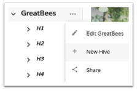

- Faites la première synchro avec votre mobile en utilisant Broodminder Apiary. 

- Vérifiez que les données de tous les capteurs apparaissent sur MyBroodminder 

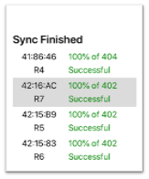

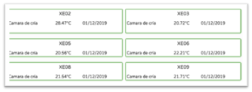

**SI VOUS AVEZ UN BOÎTIER TRANSMETTEUR (HUB)** 

**3 - Installez l'app Broodminder Cell** 

Elle vous permet de communiquer avec le boîtier. 

**4 - Sortez le boîtier du "deep sleep"** 

- N'ouvrez pas le boîtier. Il est déjà prêt à l'emploi. 

- Seule action à réaliser: le sortir du mode "deep sleep".

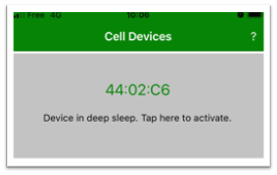

- Attendez que le boîtier se connecte au réseau 3G.

- Vérifiez qu'il recense tous les capteurs qui l'entourent.

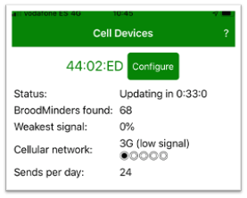

- Vous avez terminé, le système est en route! Prenez du repos bien mérité ;) 

## Installation sur le rucher 

**Sur le rucher, mettez le pilote automatique** 

Vous avez tout préparé en amont. Maintenant, il ne vous reste qu'à positionner les capteurs dans leur ruche. 

Les balances W se placent à l'arrière de la ruche (face ombragée) avec une cale de 5x4cm à l'avant, positionnée de façon équivalente. 

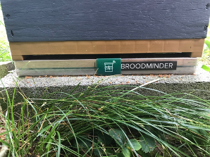

Si possible, positionnez les ruches équipées de balances W plus près du Hub car leur portée est inférieure à celle des capteurs T2. 

Attention, si vous avez des planchers Nicot, le contact platique/plastique peut être glissant. 

Les capteurs T2 doivent être centrés sur la tête du cadre n°5 (vue de devant à partir de la gauche). 

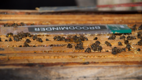