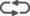
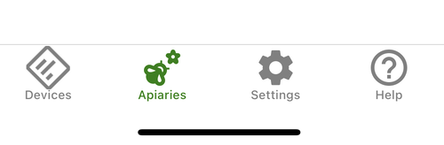
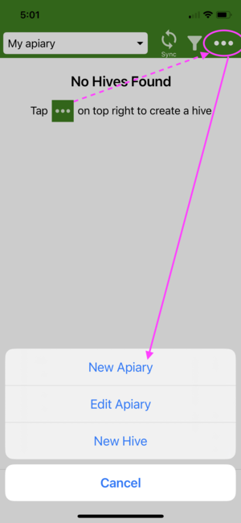
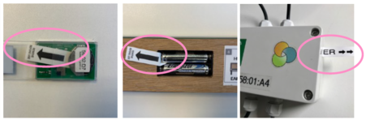
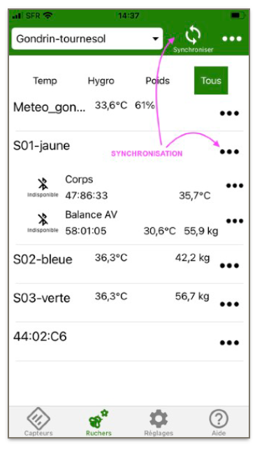
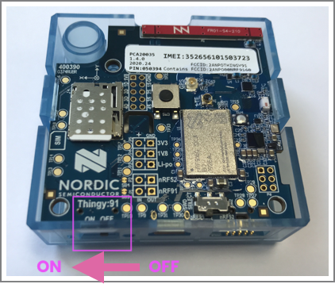
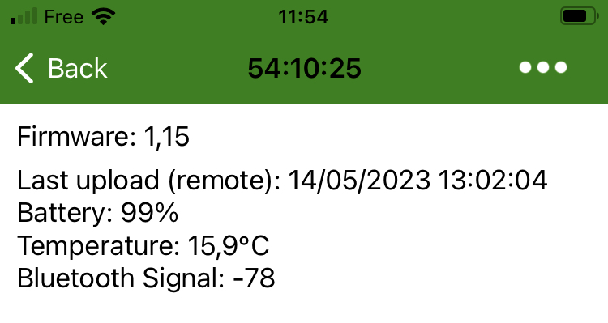
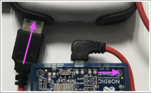
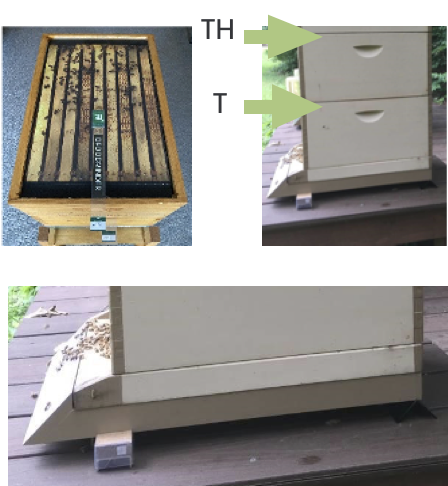
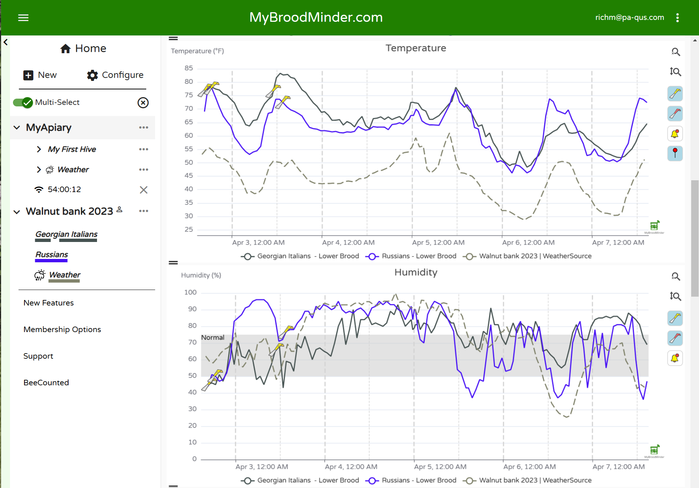

# Guide de Démarrage Rapide

Nous avons fait de notre mieux pour rendre l'installation et l'utilisation de votre BroodMinder intuitives et faciles. 

## Suivez ces étapes

| | |  | |
| -- | -- | -- | -- |
| A LA MAISON   |  | | 
| 1. |   | Installer l'App | 
| 2. |   | Créer votre compte | 
| 3. |   | Allumer les capteurs | 
| 4. |   | Assigner à une ruche | 
| 5. |   | Faire la première synchro | 
| 6. |   | Activer votre hub | 
|  AU RUCHER  |  | | 
| 7. |   | Installer sur les ruches | 
| 8. |   | Installer le Hub | 
| 9. |   | Actualiser la date de début | 
| 10. |  | Voir et explorer | 

## Notez les bonnes pratiques suivantes:

A. Utiliser notre bibliothèque de vidéos

- Regardez la vidéo d'aide "[Quick Start with CS Kit](https://youtu.be/6WicH4_l2FQ)"

B. Etiquetez vos ruches

- R1, R2, R3, A, B, C, K722, ST023 .. : Faites ce qu'il faut pour identifier vos ruches de façon unique. Vous ne le regretterez pas.

C. Préparez tout A LA MAISON

- Assurez-vous que le système est fonctionnel avant de l'installer dans le rucher. Autrement par la suite tout devient plus compliqué et moins confortable.

Besoin d'aide ?

- Vous pouvez toujours nous contacter [Support@BroodMinder.com](mailto:Support@BroodMinder.com)

-----

## 🏠 DEMARREZ A LA MAISON
###  1. Installer BroodMinder Bees

Téléchargez [Broodminder Bees](https://mybroodminder.com/beesapp) dans le store de votre choix. Scannez ce code QR pour y accéder. :

###  2. Créer votre compte

Créez votre compte dans l'application Bees. Un seul compte pour tout : App et Web MyBroodminder.

Dans BeesApp, dans l'onglet `Rucher`, créez votre premier *rucher* et votre première *ruche*, ils seront nécessaires pour les étapes suivantes.

Dans Bees vous avez plusieurs onglets que nous allons naviguer par la suite
- l'onglet `Capteurs` (Devices)
- l'onglet `Ruchers` (Apiaries)
- l'onglet `Paramètres` (settings)
- l'onglet `Aide` (Help)

Maintenant allez `Ruchers > ... > Créer rucher` et créez un rucher et des ruches.

Nous pourrons par la suite affecter des capteurs à cette ruche qui vient d'être créée.

 

###  3. Activer les capteurs
En général, tous nos appareils sont équipés d'une tirette.
Les modèles plus anciens (T2) peuvent avoir un bouton poussoir.

!!! warning "Faites attention à cela:"
    Ne retirez aucune partie en plastique. Elles assurent la protection.
    
    Vérifiez que tous les joints sont correctement installés sur les boitiers.
    
    Vérifiez que les presse-étoupes sont également bien serrés, le cas échéant.

###  4. Assigner les capteurs aux ruches

D'abord vous devez `Réclamer les capteurs` en cliquant sur le bouton vert `Réclamer` que vous trouverez dans l'onglet `Capteurs`. Cette oppération a pour effet d'associer à votre compte chaque capteur que vous réclamerez. 
Dans la foulée il vous est proposé de rattacher le capteur à une ruche. Vous pouvez procéder ou annule et y revenir plus tard via le menu `...`. 

Rattachez chaque appareil à une ruche. 

 

###  5. Faites la première syncro

Avec l'application BroodMinder Bees, il y a plusieurs façons de synchroniser vos données : 

- `Multi-Sync` se trouve en haut de l'écran, dans l'onglet `Ruchers`. Cette fonction synchronise tous les appareils en un seul geste et c'est une fonction Premium.
- `Single-Sync` se trouve dans chacun des menus 3points `...` , que ce soit dans l'onglet `Capteurs` ou dans l'onglet `Ruchers`.

!!! Tip "Conseil" 
    Vous ne pouvez synchroniser que les appareils apparaissant en vert (à portée de Bluetooth).

Maintenant regardez vos premières données `... > Show Graph` ou `... > Show Details`.

!!! info
    Lors de votre première synchronisation, vous ne verrez probablement pas beaucoup de données puisqu'il n'y a qu'un ou deux échantillons.

###  6. Activez votre Hub

Cette étape est optionnelle : elle n'est destinée qu'à ceux qui possèdent un Hub pour la monitoring en temps réel.
Rappelez-vous de la [page Hubs](./60_hubs/) qu'il existe plusieurs versions de hub : 

- Broodminder-T91 4G [solaire, météo, nu]
- BroodMinder-Wifi
- BroodMinder-SubHub

#### 6.1 Hub 4G version Météo
1. Retirer la protection orange en silicone
2. Allumez le hub à l'aide du petit interrupteur noir (utilisez la pointe d'un stylo pour l'actionner).

3. Les diodes de couleur clignotent en vert, puis en bleu, puis à nouveau en vert.
4. Vérifier sur Bees App que la transmission a été établie. Se rendre sur `Onglet Capteurs > Hub 54:xx:yy > Afficher details > MBM dernier envoi ` doit afficher la date et l'heure actuelles.

5. Installer à nouveau la protection orange, en commençant par le côté de la prise USB.

6. Insérez le T91 dans la protection météorologique avec la face USB sur le côté pour éviter le dépôt de condensation sur cette face et sur la face opposée.

#### 6.2 Hub 4G version solaire
Suivez le même processus que ci-dessus, à la différence que vous devrez brancher la fiche USB à la batterie (nous expédions la batterie débranchée pour éviter qu'elle ne se décharge pendant le transport).

1. Dévisser le couvercle transparent du boitier.
2. Enfoncer la fiche USB dans la batterie
3. Faire glisser l'interrupteur d'alimentation vers ON

4. Le Hub démarre et vous pouvez vérifier la transmission des données à l'aide de l'application Bees comme décrit ci-dessus.

## 🐝 PASSER MAINTENANT AU RUCHER

###  7. Installer les capteurs

Installez les BroodMinder-T et -TH dans le cadre du milieu (généralement le n°5) en commençant par le côté gauche vu de l'avant de la ruche. 

Placez votre balance BroodMinder-W à l'arrière de la ruche. Veillez à ce que la ruche soit aussi bien nivelée que possible. 
Les balances  BroodMinder-W3 et W4 n’ont pas besoin de nivellement précis.

###  8. Installer le Hub

Cette étape est facultative : elle n'est destinée qu'à ceux qui possèdent un Hub pour la surveillance en temps réel. 

En règle générale, pour tout type de hub, vous devez savoir que :
- la portée globale pour un Hub <=> sonde interne est de ~ 10 mètres
- la portée globale pour un Hub <=> capteur externe est de ~ 30-40 m

!!! Important 
    - les hubs doivent être placés à au moins 1,5 m du sol (la réception cellulaire et Wifi est TRES REDUITE lorsque le dispositif est proche du sol) .
    - éviter l'exposition directe au soleil

Il existe plusieurs façons d'installer le hub
- Les versions solaires peuvent être placées sur un poteau, murale ou même sur le toit d'une ruche.

- les autres versions de 4G et les SubHubs s'installent sans problème dans l'enveloppe météo.

Vérifiez maintenant la connectivité
- Vérifiez la connectivité du hub avec l'application Bees (dans l'onglet `Capteurs > ID du hub > ... > Afficher les détails`).
- Vous devez avoir un signal réseau supérieur à 20% pour être à l'aise.

###  9. Actualiser la date/heure de départ

Pour éviter d'avoir des mesures provenant de l'extérieur de la ruche, modifiez la date de début des capteurs.
Pour ce faire allez dans `BeesApp > Ruchers > déplier les ruches pour voir les capteurs > "..." > Changer la position actuelle`. 
Editer la ` date de début`.

###  10. Exploree et découvrez

Désormais, vous pouvez également vous rendre sur [MyBroodMinder.com](https://mybroodminder.com) et explorer vos données.

Dans cette interface, vous pourrez suivre les niveaux de couvain, les gains et pertes de poids, configurer vos alertes ou encore la météo passée et prévue ainsi que les indices de flux de nectar et bien plus encore !

!!! info
    Attention : Certaines données sont calculées quotidiennement et vous commencerez à les voir à partir de J+3 (J1 ne compte pas car données partielles, J2 sera le premier jour complet qui sera affiché le jour suivant => J3).

