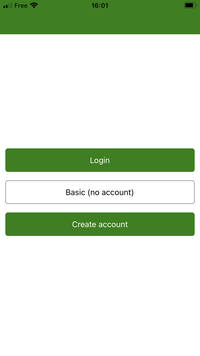
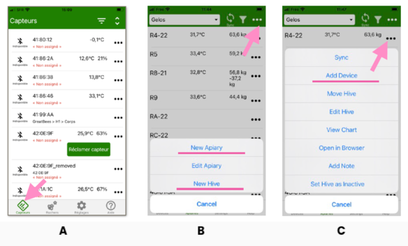

# Guide de Démarrage Rapide

Nous avons fait de notre mieux pour rendre l'installation et l'utilisation de votre BroodMinder intuitives et faciles. 

## Suivez ces étapes

| | |  | |
| -- | -- | -- | -- |
| A LA MAISON   |  | | 
| 1. |   | Installer l'App | 
| 2. |   | Créer votre compte | 
| 3. |   | Allumer les capteurs | 
| 4. |   | Assigner à une ruche | 
| 5. |   | Faire la première synchro | 
|  AU RUCHER  |  | | 
| 6. |   | Installer sur les ruches | 
| 7. |   | Actualiser la date de début | 
| 8. |   | Voir et explorer | 

## Notez les bonnes pratiques suivantes:

A. Utiliser notre bibliothèque de vidéos

- Regardez la vidéo d'aide "[Quick Start with CS Kit](https://youtu.be/6WicH4_l2FQ)"

B. Etiquetez vos ruches

- R1, R2, R3, A, B, C, K722, ST023 .. : Faites ce qu'il faut pour identifier vos ruches de façon unique. Vous ne le regretterez pas.

C. Préparez tout A LA MAISON

- Assurez-vous que le système est fonctionnel avant de l'installer dans le rucher. Autrement par la suite tout devient plus compliqué et moins confortable.

Besoin d'aide ?

- Vous pouvez toujours nous contacter [Support@BroodMinder.com](mailto:Support@BroodMinder.com)

-----

## 🏠 DEMARREZ A LA MAISON
###  1. Installer BroodMinder Bees

Téléchargez [Broodminder Bees](https://mybroodminder.com/beesapp) dans le store de votre choix. Scannez ce code QR pour y accéder. :

###  2. Créer votre compte

Créez votre compte dans l'application Bees. Un seul compte pour tout : App et Web MyBroodminder.

Dans BeesApp, dans l'onglet `Rucher`, créez votre premier *rucher* et votre première *ruche*, ils seront nécessaires pour les étapes suivantes.

###  3. Activer les capteurs
En général, tous nos appareils sont équipés d'une tirette.
Les modèles plus anciens (T2) peuvent avoir un bouton poussoir.

!!! warning "Faites attention à cela:"
    Ne retirez aucune partie en plastique. Elles assurent la protection.
    
    Vérifiez que tous les joints sont correctement installés sur les boitiers.
    
    Vérifiez que les presse-étoupes sont également bien serrés, le cas échéant.

###  4. Assigner les capteurs aux ruches
Rattachez chaque appareil à une ruche. Tout se passe dans les menus 3points `...`. 

- A les capteurs apparaîtront dans l'onglet `Capteurs`.

- B Dans l'onglet `Rucher > ...`, vous pouvez créer des ruchers et des ruches.

- C puis assigner des appareils aux ruches

###  5. Faites la première syncro

Avec l'application BroodMinder Bees, il y a plusieurs façons de synchroniser vos données : 

- `Multi-Sync` se trouve en haut de l'écran, dans l'onglet `Ruchers`. Cette fonction synchronise tous les appareils en un seul geste et c'est une fonction Premium.
- `Single-Sync` se trouve dans chacun des menus 3points `...` , que ce soit dans l'onglet `Capteurs` ou dans l'onglet `Ruchers`.

!!! Tip "Conseil" 
    Vous ne pouvez synchroniser que les appareils apparaissant en vert (à portée de Bluetooth).

Maintenant regardez vos premières données `... > Show Graph` ou `... > Show Details`.

!!! info
    Lors de votre première synchronisation, vous ne verrez probablement pas beaucoup de données puisqu'il n'y a qu'un ou deux échantillons.

## 🐝 PASSER MAINTENANT AU RUCHER

###  6. Installer les capteurs

Installez les BroodMinder-T et -TH dans le cadre du milieu (généralement le n°5) en commençant par le côté gauche vu de l'avant de la ruche. 

Placez votre balance BroodMinder-W à l'arrière de la ruche. Veillez à ce que la ruche soit aussi bien nivelée que possible. 
Les balances  BroodMinder-W3 et W4 n’ont pas besoin de nivellement précis.

###  7. Actualiser la date/heure de départ

Pour éviter d'avoir des mesures provenant de l'extérieur de la ruche, modifiez la date de début des capteurs.
Pour ce faire allez dans `BeesApp > Ruchers > déplier les ruches pour voir les capteurs > "..." > Changer la position actuelle`. 
Editer la ` date de début`.

###  8. Exploree et découvrez

Désormais, vous pouvez également vous rendre sur [MyBroodMinder.com](https://mybroodminder.com) et explorer vos données.

Dans cette interface, vous pourrez suivre les niveaux de couvain, les gains et pertes de poids, configurer vos alertes ou encore la météo passée et prévue ainsi que les indices de flux de nectar et bien plus encore !

!!! info
    Attention : Certaines données sont calculées quotidiennement et vous commencerez à les voir à partir de J+3 (J1 ne compte pas car données partielles, J2 sera le premier jour complet qui sera affiché le jour suivant => J3).

