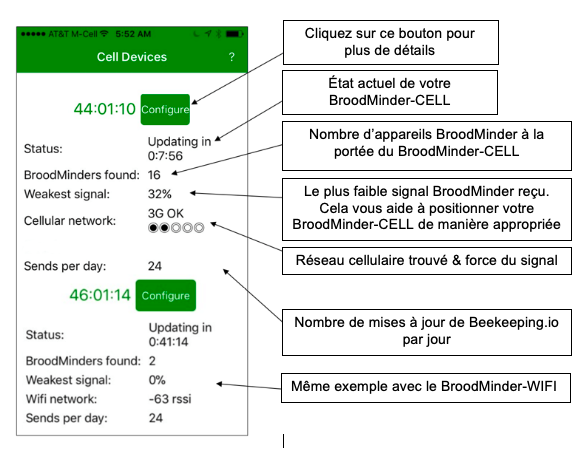
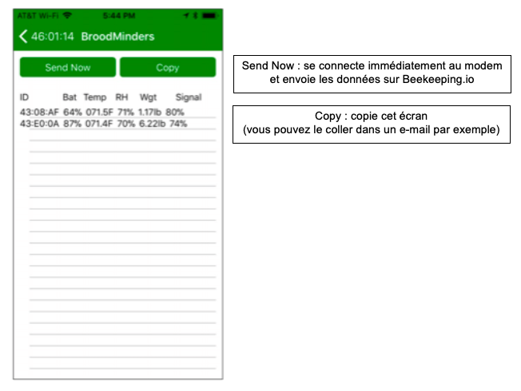
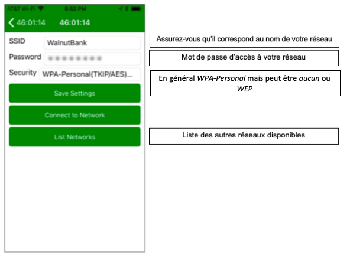

# Récupération de données

Les capteurs fonctionnent tous en Bluetooth. Il existe plusieurs manières de récupérer les données des capteurs. En essence via votre smartphone ou via un transmetteur automatique.

### 9.1 Applications mobiles
Pour plus de détails sur les Apps c'est [ici](./3_apps)

### 9.2 Broodminder Cell/Wifi

BroodMinder-WIFI/CELL est un composant facultatif qui se place dans votre rucher et vous permet de transmettre les données depuis vos appareils BroodMinder directement sur MyBroodMinder.com par connexion wifi ou mobile. Nous avons conçu le BroodMinder-WIFI/CELL pour se mettre automatiquement en marche à la mise sous tension.

Pour de meilleurs résultats, regardez la vidéo de l'installation sur BroodMinder.com/pages/videos

#### 9.2.1 Instructions de démarrage rapide

**IMPORTANT** : synchronisez tous vos appareils et transférez vos données sur Beekeeping.io avant de démarrer votre appareil BroodMinder-WIFI/CELL

- Placer votre BroodMinder-WIFI/CELL dans le rucher avec le panneau solaire orienté vers le soleil

- Téléchargez l'application BroodMinder-CELL (que vous ayez un appareil BroodMinder-CELL ou BroodMinder-WIFI)
- Lancez l'application – votre appareil BroodMinder-WIFI/CELL devrait apparaitre dans la liste
- Cliquez sur « exit deep sleep » (tirer du sommeil profond)
- WIFI/CELL uniquement – entrer le nom de votre réseau wifi ou mobile ainsi que le mot de passe associé
- Vos données devraient apparaitre automatiquement sur beekeeping.io une heure après

#### 9.2.2 Installation

Vous pouvez installer votre BroodMinder-WIFI/CELL avec de nombreuses configurations différentes selon les circonstances. Le support à l'arrière du boîtier électronique peut être retournée comme on peut le voir sur quelques exemples.

Quelques remarques relatives à l'installation :

- Le panneau solaire aura complètement chargé la batterie en 4 heures d'ensoleillement direct

- La batterie devrait tenir 3-4 jours sans ensoleillement
- La réception sans fil est entravée par les arbres. Mais monter sur un arbre peut s'avérer problématique si votre connexion est instable
- Pour les cas les plus extrêmes, nous vous suggérons d'utiliser une antenne plus sensible (pour le réseau mobile uniquement). Contactez-nous sur [support@BroodMinder.com](mailto:support@BroodMinder.com) pour plus d'informations
- Des colliers de serrage ou pour tuyaux peuvent être utilisés afin de sécuriser le système
- Ceux de 7cm que l'on trouve dans les magasins de bricolage fonctionnent parfaitement. Ils ont des languettes qui peuvent être légèrement pliées pour permettre l'insertion du BroodMinder-WIFI/CELL. Ensuite, un collier de serrage en bas permet de sécurise l'installation

#### 9.2.3 La batterie solaire en mode permanent

Nous vous envoyons le BroodMinder-WIFI/CELL avec la batterie en mode permanent (Always-On). Dans des conditions normales, vous n'aurez pas besoin d'ouvrir le boîtier électronique.

La batterie solaire est une batterie voltaïque 15V qui dispose de deux modes d'alimentation :

- En mode permanent (_Always-On_), la batterie ne s'éteint jamais

- En mode arrêt automatique (_Auto-Off_), la batterie s'éteint automatiquement au bout de 20mn

Il est important de laisser la batterie en mode permanent afin que le BroodMinder-WIFI/CELL puisse fonctionner 24/24h.

Pour récapituler : nous vous envoyons le BroodMinder-WIFI/CELL avec la batterie en mode permanent. Si vous n'avez pas maintenu le bouton d'alimentation de la batterie solaire pendant plus de 5 secondes, vous n'avez rien à changer.

Si vous avez maintenu le bouton d'alimentation de la batterie pendant plus de 5 secondes, cela aura modifié le mode d'alimentation. Cette action permet d'alterner entre le mode permanent et le mode arrêt automatique mais il peut s'avérer difficile de savoir sur quel mode vous êtes.

Pour faire la différence entre les deux modes, regardez la lumière de la batterie APRES les 3 flashs décrits ci-dessous :

- Bloquez le panneau solaire afin d'avoir moins de confusion

- Appuyez sur le bouton d'alimentation et maintenez-le enfoncé
- Au bout de 6 secondes, les LED de la batterie clignoteront 3 fois
- Si la lumière reste allumée pendant encore quelques secondes, cela signifie que la batterie est sur le mode permanent (_Always-On_). C'est bon !
- Relâchez le bouton

Si après les 3 flashs, la lumière de la batterie s'éteint, cela signifie qu'elle est sur le mode arrêt automatique (_Auto-Off_). Recommencer la manipulation et la batterie devrait être sur le bon mode cette fois.

Vous trouverez plus d'informations à ce sujet sur [https://www.voltaicsystems.com/always-on/](https://www.voltaicsystems.com/always-on/)

#### 9.2.4 Les voyants lumineux WIFI/CELL

#### 9.2.5 L'application BroodMinder-WIFI/CELL

L'application BroodMinder-WIFI/CELL vous permet de suivre de près l'évolution de la situation. Parmi les éléments que vous pouvez contrôler :

- Mode sommeil profond (_Deep Sleep_) – voir ci-dessous

- État actuel du BroodMinder-WIFI/CELL (initialisation, délai jusqu'au prochain transfert de données, connexion au WIFI, envoi de données)
- Nombre d'appareils BroodMinder trouvés dans le rucher
- Force du signal du WIFI
- De nombreuses fonctions de diagnostic

Nous n'entrerons pas dans les détails dans ce manuel car il n'y a pas beaucoup d'ajustements à faire sur l'application. En effet, les seuls éléments que vous pouvez ajuster sont le moment et la fréquence de transferts de données sur beekeeping.io. Le reste de l'application est destiné à aider notre équipe de support client à diagnostiquer des problèmes.

Lorsque vous recevez votre BroodMinder-WIFI/CELL, ce dernier devrait être en mode sommeil profond (_Deep Sleep_) afin d'économiser la batterie pendant le transport. Vous aurez besoin de l'application BroodMinder-CELL pour le sortir de ce sommeil profond.

Par défaut, le BroodMinder-WIFI/CELL transférera vos données toutes les heures.

#### 9.2.6 Écran d'accueil de l'application WIFI/CELL

*Remarque : si vous balayez l'écran vers gauche, vous pouvez supprimer les appareils BroodMinder-WIFI/CELL non utilisés.*

#### 9.2.7 Écran de configuration de l'application WIFI/CELL

#### 9.2.8 Écran de diagnostic de l'application WIFI/CELL

#### 9.2.9.Écran de réseau wifi/mobile de l'application WIFI/CELL

#### 9.2.10 Écran de réseau cellulaire de l'application WIFI/CELL

*Remarque : il s'agit des commandes du modem mobile. Pour les commandes du modem wifi, rendez-vous à la page suivante. Si le modem n'est pas allumé, l'actionnement de toute commande entrainera son allumage. Attendez quelques secondes et actionnez de nouveau la commande souhaitée. Le résultat s'affichera en bas de l'écran.*

#### 9.2.11 Écran de réseau wifi/cellulaire de l'application WIFI/CELL

