# Balance DIY - Faites-le vous même

## Vue d'ensemble

Le DIY est la carte que nous utilisons dans les autres balances Broodminder. Avec elle, vous pouvez construire votre propre balance et elle fonctionnera avec toute la suite BroodMinder et Mellisphera. Nous espérons que cette carte permettra à de nombreux bricoleurs de créer, chez eux, de parfaits appareils pour surveiller leurs ruches. N'oubliez pas de partager vos créations avec nous et nous les partagerons avec le reste du monde !

Le DIY c'est :

- Une conception épprouvée, autonomie de 5 ans
- **Aucune ligne de code à écrire**
- Fonctionne avec la plupart des pesons et cellules de charge du marché
- S'intègre dans le vaste écosystème BroodMinder-Mellisphera
- Utilise un circuit intégré de cellule de charge 24 bits à 4 canaux (TI ADS1234)
- Les données sont diffusées via BLE (Bluetooth Low Energy)
- Les données stockées sont lisibles par l'application BroodMinder et Mellisphera

Pour pouvoir utiliser le DIY, vous devrez vous équiper à minima de
- une carte DIY
- un peson ou cellule de charge (voir modèles) 
- un dongle BLED112 de Silicon labs
- un PC windows et le logiciel BroodMinder PC pour calibrer le dispositif.

La carte fonctionne avec la plupart des cellules de charge que vous trouverez sur le marché, mais attention de ne pas faire le mauvais choix. Chaque dispositif a ses avantages et inconvénients. Par exemple, les cellules de pese personne peuvent présenter des fluctuations plus importantes que d'autres modèles plus industriels. 

## Quelques Modèles

Nos équipes ont créé quelques modèles dont nous vous partageront la conception bientôt.

### Bâti avec 4 balances

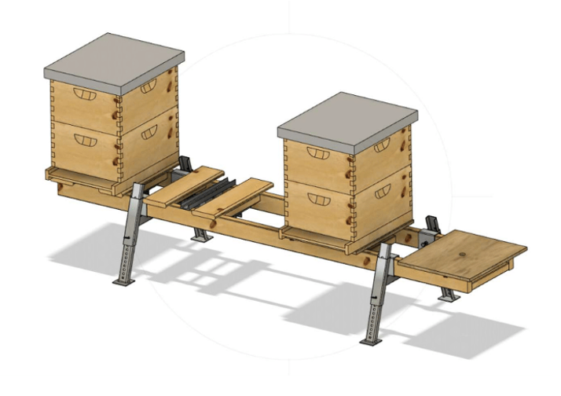

Cet ensemble est réalisé avec une plateforme équipée d'une cellule de 200kg. Le support métallique de la ruche est disponible chez [Lyson](http://lyson.eu/home/3254-bee-hive-stand-zinc-set-2-pcs-5903661513191.html?search_query=hive+stand&results=303).

### Balance socle pour ruche

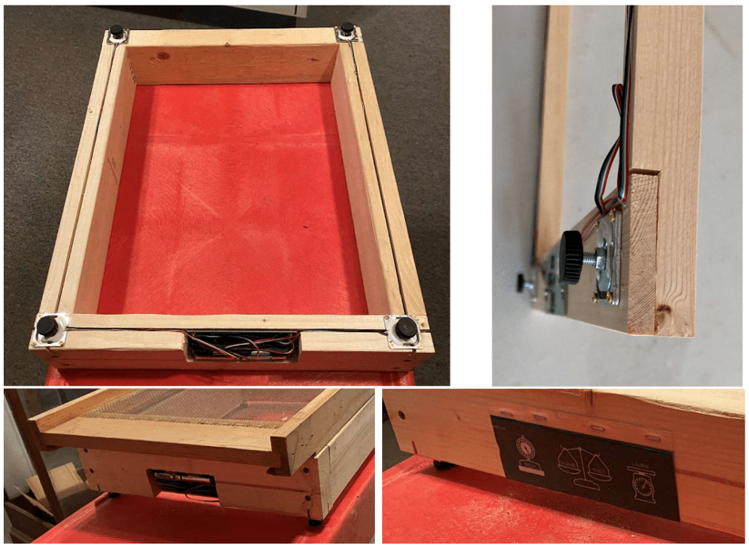

Voici un autre modèle basé sur balance balance W2, dont la mise en œuvre est minimaliste et qui utilise des [pieds de 5mm](https://www.amazon.fr/poignet-Cheville-Machines-broche-filet%C3%A9e/dp/B01NAPROVJ/ref=sr_1_6?__mk_fr_FR=%C3%85M%C3%85%C5%BD%C3%95%C3%91&dchild=1&keywords=Pieds+nivellement+M5&qid=1616082834&sr=8-6). Assurez-vous de protéger l'électronique des intempéries si vous décidez de construire cette balance.

Il est facile de créer un espace sous le peson pour permettre la déformation sans interférence en utilisant des forets Forstner.

La version de gauche a été créée avec des longerons bois de 40x80 en une heure environ. Vous pouvez fraiser des canaux pour les fils et les remplir de silicone. Créez un renfoncement pour y loger la carte et la protéger de la pluie. Il faudra également utiliser un bois traité et peindre le tout puis créer un couvercle pour la carte. 

### Autres modèles
Nous vous recommandons également de visiter ces sites web open source sur les ruches pour avoir une idée de la conception de votre balance. 
En voici quelques-uns à consulter, ou inventez la vôtre : 

- [https://www.honey-pi.de/](https://www.honey-pi.de/)
- [https://community.hiveeyes.org](https://community.hiveeyes.org)
- [http://www.openhivescale.org/](http://www.openhivescale.org/)
- [http://wiki.hivetool.org/](http://wiki.hivetool.org/)

N'oubliez pas de partager vos idées, nous les rendrons publiques, si vous nous le permettez. 

***

## Matériel nécessaire
Pour vous lancer dans l'aventure DIY il vous faudra :
- [ ] une carte DIY
- [ ] une ou plusieurs cellules de charge, quel que soit le modèle
- [ ] un PC windows 7, 10 avec l'application broodminder PC
- [ ] un dongle Bluetooth Silicon Labs (BLED112)

Photo AVEC TOUT CE QUI EST POSSIBLE

### Cellules de charge 

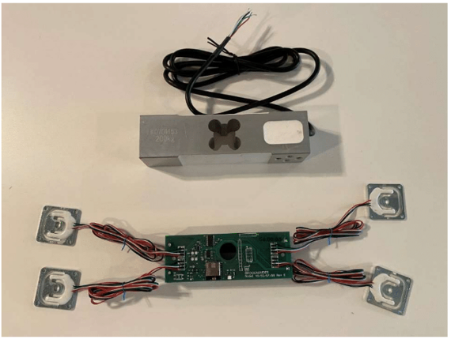

Nous vous porposons trois types de cellules de charge: 
- pesons de 50kg
- cellule de 100kg
- cellule de 200kg

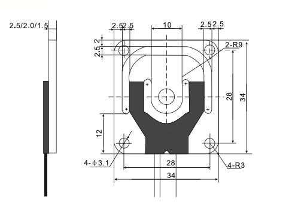
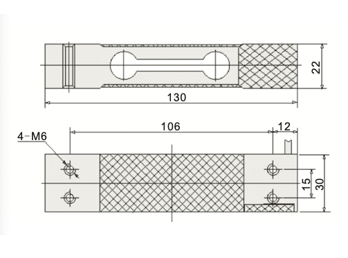
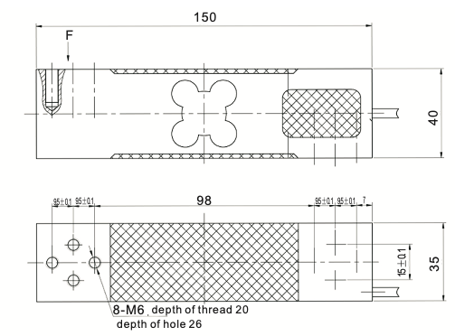

Nous sommes ravis de pouvoir vous les fournir. Si vous vous procurez les vôtres, assurez-vous qu'elles sont compensées en température et qu'elles ont un très faible fluage (creep). La résistance de la cellule de charge de 200KG est d'environ 300 ohms par canal. Pour la charge de 50kg il est d'environ 750 ohms.

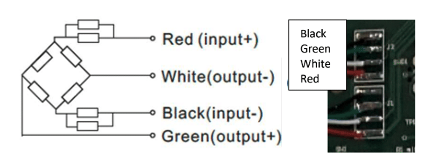

La plupart des cellules de charge semblent utiliser ce schéma de couleurs pour les fils. Si c'est le cas, alors câblez-les comme ceci.
Noir, vert, blanc, rouge (de haut en bas).
Les sorties se trouvent au milieu. Si les choses sont mélangées, elles seront généralement corrigées pendant l’étalonnage. 

Le trou central de la cellule de charge de 50KG a un diamètre de 5mm.
La longueur du cable :

- peson de 50kg : 74cm 
- cellule de charge de 100kg : 40cm
- cellule de charge de 200kg : 140cm

### Dongle bluetooth
Pour communiquer avec la carte il est nécessaire d'utiliser le [dongle BLED112 de silicon labs.](https://www.silabs.com/wireless/bluetooth/bluegiga-low-energy-legacy-modules/device.bled112)

Parfois il peut être nécessaire d'adapter le pilote. Notre ami ABU en Suisse a résolu un problème d’installation du dongle sous Windows 10 avec la procédure suivante :

1.   Aller sur le site Silabs pour prendre le dernier driver v1.09 (la date plus récente que la 1.10) [https://www.silabs.com/wireless/bluetooth/bluegiga-low-energy-legacy-modules/device.bled112](https://www.silabs.com/wireless/bluetooth/bluegiga-low-energy-legacy-modules/device.bled112)
2.   Déziper le fichier Bluegiga
3.   Connecter le dongle
4.   Appuyez en même temps les touches Windows   et Pause   de votre clavier. La page Informations système générales s’ouvre.
5.   Dans la colonne de gauche, sélectionnez Gestionnaire de périphériques.
6.   Sous Ports (COM et LPT) on trouve un nouveau port Périphérique série USB (par exemple COM 3 ou COM4).
7.   Clique de droite pour choisir mettre à jour le pilote.
8.   Choisir Parcourir mon poste de travail pour rechercher des pilotes.
9.   Par le bouton parcourir choisir le répertoire Bluegiga que vous avez dézippé précédemment et cliquer sur le bouton suivant.
10.  A la question Voulez-vous installer ce logiciel de périphérique ? cliquer sur le bouton Installer.
11.  Une fois la mise à jour effectuée cliquer sur le bouton suivant.
12.  Vous devez obtenir dans Gestionnaire de périphérique Bluegiga Bluetooth Low Energy (com..) (COM 3 ou4).
13.  Fermer les fenêtres de configuration.

Et maintenant ouvrir l'application BroodMinderPC

### Protection et étanchéité

La météo est votre ennemie, vous aurez donc besoin d'un boîtier et de presse-étoupes, nous vous recommandons ceux de chez Digikey.com ou Mouser.fr : 

- Boîte étanche - [Bud Industries PN-1332-CMB](https://www.budind.com/wp-content/uploads/2019/01/hbpn1332.pdf) 15,00€
- Boîte étanche - [Hammond 1554N2GYCL](http://www.hammondmfg.com/pdf/1554N.pdf) 19,00€ 
- Boite IP55 - [Hammond 1591XXTSFL](https://www.hammfg.com/files/parts/pdf/1591XXTSFLBK.pdf) 6,90€ (Pas tout à fait étanche, mais une bonne taille avec des oreilles)
- [Presse-étoupe - Bud Industries IPG-2227](https://www.digikey.fr/product-detail/en/bud-industries/IPG-2227/377-2183-ND/5291485) 0,41€

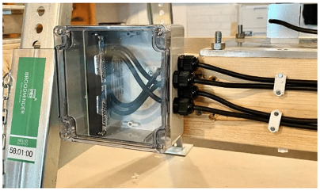

Voici la boîte étanche Hammond 1554N2GYCL installée sur le support Lyson.

### Carte DIY

******** Photo carte + socle piles

La carte est fournie avec un socle pour deux piles AA. Vous devrez le monter, plier les pattes et les souder sur les pôles + et -.

!!! Attention 
    La tension maximale d'alimentation de la carte est de 3.5V. Audelà vous risquez de l'abimer !

REMARQUE : Les premières cartes DIY expédiées mesurent 11,43 x 4,5cm. Celles expédiées en juin seront un peu plus petites (10,92 x 3,91cm). Il est possible de réduire la carte de  11,43 x 4,5cm en 10,92 x 3,91cm sans affecter les opérations mais nous ne le recommandons pas. Procurez-vous une taille de boîte adéquate. 

NOTEZ AUSSI CECI... Si vous décidez de couper la carte, N'UTILISEZ PAS une scie circulaire classique. Cela risque de déchirer la carte et de vous blesser. J'ai utilisé une scie à carreaux (sans dents), ou les "cisailles à métaux" fonctionnent également assez bien.

Nous avons décidé de ne pas trop travailler sur la protection électrique de la carte car nous avons constaté que c’était très bien dans notre configuration et voulons faire économiser à nos utilisateurs autant de coûts que possible. Vous pourrez avoir besoin ou envie d’ajouter une protection de circuit. C’est à vous de voir. 

Digikey.com (ou Silabs.com ou TI.com) sont une bonne base pour ceux qui veulent consulter des fiches techniques ou creuser un peu plus. 

REMARQUE : Vous trouverez ci-dessous nos circuits. Vous vous demandez peut-être pourquoi nous partageons cela... La vérité est que le circuit ne vous mènera pas très loin. Il faut beaucoup, beaucoup (et beaucoup) de logiciels pour tenir tout cela ensemble.
Nous espérons que le circuit vous aidera si vous en avez besoin ou si vous voulez en savoir plus.

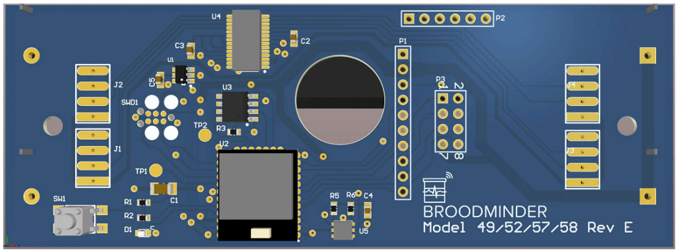
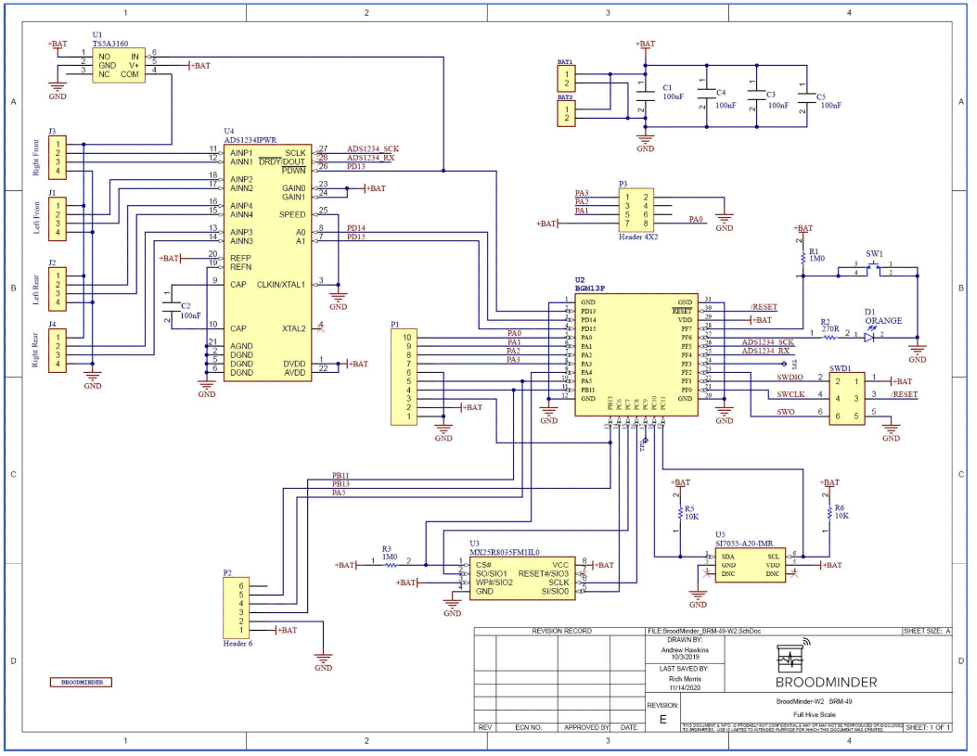

***

## Étalonnage de la balance

Une fois que vous aurez construit votre balance, il faudra l’étalonner. Vous devez régler le décalage (offset) et l'échelle (divisor) pour chaque canal ADC qui sont stockés en mémoire flash dans le processeur. Pour ce faire, nous mettons à votre disposition notre application PC interne. Malheureusement, elle n'est pas disponible pour Apple mais elle fonctionnera sur un PC Windows. L'application est disponible [ici](https://www.dropbox.com/sh/nmhfpuy9s5x086f/AADkyDIcJrfsqsd9yUJ-7Lr6a?dl=0).

Pour la communication BLE (Bluetooth Low Energy), vous devez disposer d'un [Doogle BLE112](https://www.mellisphera.com/produit/balance-diy/) de Silicon Labs.

Beaucoup de fonctions sont expliquées rien qu’en survolant avec la souris sur le contrôle. Cette application n'a pas été conçue pour une utilisation externe, pardonnez-nous pour son design pas de toute beauté 😅. Elle fonctionne, nous avons calibré des milliers de balances avec.

### Balance à 1 ou 2 pesons

Le processus est le suivant :

1. Démarrez l'application et vérifiez que le BroodMinder-DIY apparaît sur la liste des annonces.

2.	Assurez-vous que l'ID `58:xx:xx` se trouve dans la case `Device to connect to`

3.	Sélectionnez l'onglet "Configuration", le BRM-58 devrait se connecter automatiquement.

4.	Par défaut la période de connexion est de 3600 secondes. Réglez-la sur 3 secondes et cliquez sur `update log period`.

5.	Appuyez sur `Start real time`, vous devriez voir l'enregistrement démarrer et `Elapsed` s'incrémenter toutes les 3 secondes.

6.	Mettez à vide votre balance et appuyez sur `Tare XLR` (XLR est notre nom pour la carte). Tous les capteurs doivent afficher `0.0 pounds` après cela.

7.	Mettez un poids connu sur la balance.

8.	Ajustez le `divisor` pour chaque canal et appuyez sur la touche `Cal xx Weight` pour transférer et stocker les facteurs sur la carte.

9.	Notez vos diviseurs. A l'heure actuelle, ils ne peuvent pas être lus à partir du BRM-58.

!!! Attention 
    toute la calibration se fait en livres. Prenez vos dispositions pour ne pas vous tromper! Un petit fichier excel fait très bien l'affaire.
    
!!! Note 
    saisisez `divisor = 0` pour les canaux qui restent inutilisés
    en général les `offset` restent à 0 sur tous les canaux
    A chaque fois que vous actualiserez un diviseur il faudra relancer `start real time`

!!! Note 
    Les diviseurs sont les valeurs qui convertissent les lectures brutes de l'ADC en poids. 31 000 est un bon point de départ pour les petites cellules de charge. Pour une grande c’est plutôt de l'ordre de 10 000. Les relevés que vous voyez dans ce programme sont en livres. Il est simple de fixer le diviseur à une valeur, après faites un test de poids. Et ajustez ensuite le diviseur de manière appropriée. Par exemple :
    Poids réel = 30,0 livres, Diviseur = 31 000, le poids du BRM-58 est de 20,0 livres.
    Changez le diviseur à 31000 * 20,0 / 30,0 = 20 666 et le poids devrait lire correctement 30,0.

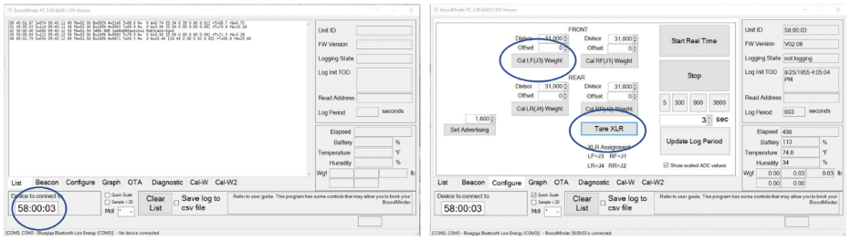

Il existe de nombreuses autres commandes et fonctionnalités que nous n'aborderons pas ici. Vous pouvez toujours les explorer.
Si vous utilisez 4 capteurs ensemble, alors vous devez utiliser l'onglet `Cal-W2` comme expliqué ci-après.

### Balance à 4 pesons

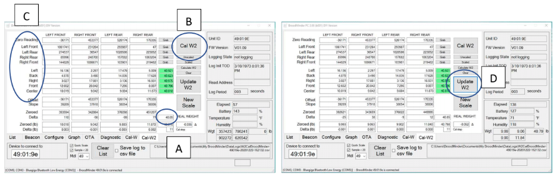

1.	Saisissez le poids réel que vous utiliserez pour l’étalonnage. Si vous calibrez un BroodMinder-W2 vous devez ajouter 1,7 lbs pour le poids de la moitié supérieure de la balance.

2.	Enlevez tout le poids des cellules de charge et appuyez sur `Cal W2`. La première chose qu'il fera est de mettre à zéro le système. Vous verrez les valeurs brutes de l'ADC apparaître dans la ligne mise à zéro. Après cette étape, vous verrez les poids approximatifs apparaître dans les lignes (lb). C’est basé sur la pente de la ligne de pente. Nous utilisons une valeur par défaut pour les capteurs -W2. Vous pouvez jouer avec cela pour vous rapprocher de vos capteurs.

3.	Ensuite, vous devez déplacer le poids d'étalonnage comme indiqué sur la zone C ci-dessus. Le programme avance automatiquement lorsqu'il voit un poids > 5 livres sur le capteur approprié. Une fois les 4 coins complets, le programme calcule la pente pour chaque capteur et met à jour la ligne de pente. Les 5 positions suivantes sont utilisées pour vérifier l'échelle. Si la valeur est inférieure à 0,5, la case s'allume en vert.

4.	Lorsque vous êtes satisfait de l'étalonnage, appuyez sur `Update W2` et les valeurs seront enregistrées dans la carte. Vous savez que c’est terminé lorsque les valeurs de poids (Wgt) reviennent à livres.

En gros, ce qui se passe ici, c'est que nous utilisons l'algèbre linéaire pour résoudre les équations simultanées générées par les 5 premières positions. Après la mise à zéro des capteurs, il y a 4 poids et 4 variables (pentes). Par la magie des mathématiques, nous obtenons les réponses.

Vous pouvez utiliser cette carte pour connecter 4 ruches, cela nous convient. 

Si vous utilisez des connecteurs, assurez-vous d'en utiliser de bonne qualité et résistants aux intempéries. Ils sont généralement le maillon faible.

Essayez d'éviter tout ce qui pourrait entraîner des frictions ou des frottements. Il est important de constater qu'un frottement minuscule aura un grand impact. N'utilisez pas de charnières, elles ne sont pas adaptées. Même les roulements à billes entraînent des erreurs importantes. Les pivots sont bien.

Voici donc un très bref aperçu de la manière de procéder. Si vous avez besoin d'aide supplémentaire ou si vous voyez des choses que nous devrions ajouter à ce guide pour les prochains utilisateurs, n'hésitez pas à nous contacter à [support@mellisphera.com](mailto:support@mellisphera.com)

## Dépannage 
Le plus souvent, le problème est simplement le câblage. Commencez par mesurer entre les fils de la cellule de charge. Vous devriez voir des centaines d'ohms, pas 0 ni l'infini. Sachez également que nous utilisons des trous traversants plaqués. Si vous les percez (comme Lorenzo l'a fait), les plots ne seront plus conducteurs du haut vers le bas de la carte. Vous pouvez résoudre ce problème en soudant des fils de liaison avec le schéma comme guide.
