# BroodMinder-W3 Kit Guide

This full assembly guide (12 pages) can be found at
[https://broodminder.com/pages/broodminder-w3](https://broodminder.com/pages/broodminder-w3)

## Overview

For the purposes of this guide, we will refer to the BroodMinder-W3 as:
- W3PA - BroodMinder-W3 kit, partially assembled & calibrated
- W3UA - BroodMinder-W3 kit, unassembled & uncalibrated

To get you started watch the [W3 video user guide](https://mybroodminder.com/app/resources/video-guides).

## 1 Electronics Assembly

### 1.1 Drilling Wire Entry Hole (W3UA only)

To start assembling your DIY kit a wire pass thru must be made for the watertight box. The hole should be located at the rear side of the box that will be mounted down. The hole has to be D=10mm to easily accommodate the Black PVC 11mm Cable Grommet. The finished holes should look like the image below.

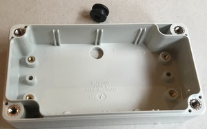
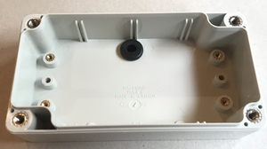

### 1.2 Soldering

The boards provided with the DIY kit have already been programmed. You will need to add the load cells and battery holder.

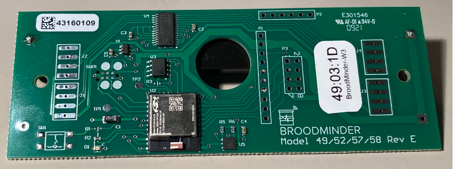

Solder as shown in the diagram below. The battery holder will go on the back side of the board, matching up with the (+) and (-) leads labeled on the back where it is marked "BAT2". Once the battery holder is soldered, trim the excess leads.

Tin the pads to prepare for soldering the load cells. Make sure you have routed the load cell wires through the watertight box prior to soldering or you will have to start over.

**IMPORTANT: The exact order of the wires is critical.**

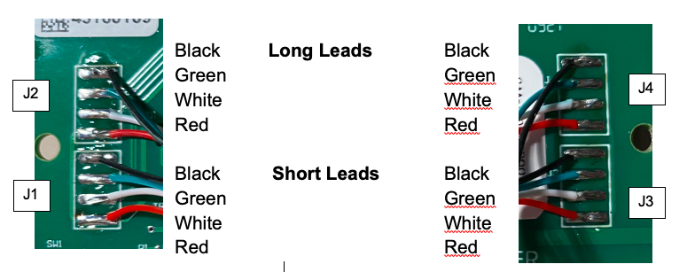

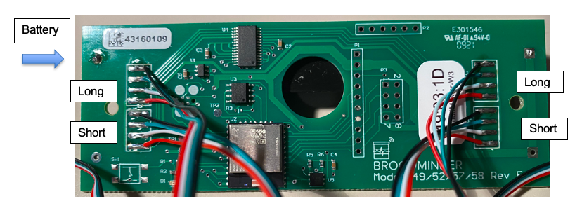

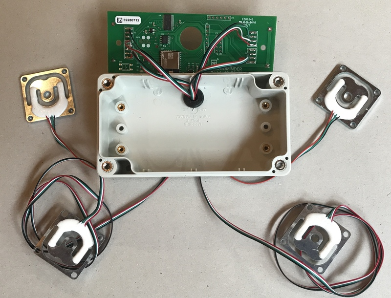

Now with a permanent marker note the sensor position on each loadcell. 

Remember :

| | Left | Right |
|----|----|----|
| Rear | J4 | J2 |
| Front | J3 | J1 |

### 1.3 Assembly

Install the board into the box but do not screw it yet, you'll need to pull some extra wire-length after routing.

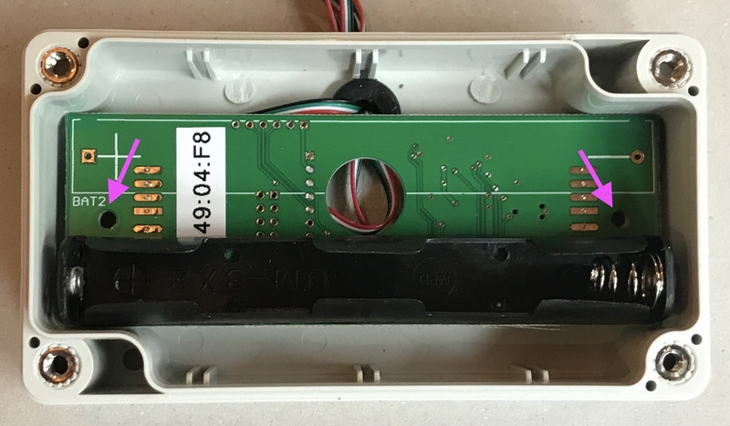

Attach the feet using the press fit stud, 10-32 Thread, 1/2" Long. You will want to get then nice and tight to prevent wiggling. It is a little tricky to hold the head of the studs. Use nice sharp pliers to grab them.

**IMPORTANT: We strongly recommend using permanent thread locker such as Locktite Threadlocker Red. It is difficult to tighten the feet with them mounted in place.**

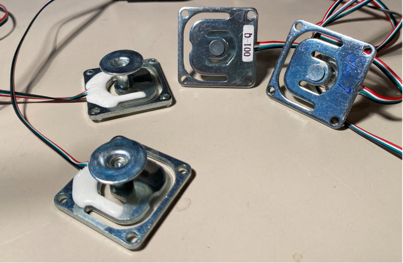

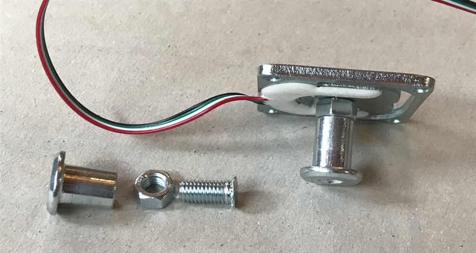

## 2 Frame Assembly

### 2.1 Cutting lumber

To begin frame assembly for a 10 frame hive, you will need:

- USA Langstroth : four 16 ¾" lengths of 2x4. (for 8 frame hives use 16 ¾" & 13 ¾") 
- EU Dadant : two 45x70x430 mm (front) and two 45x70x410 mm (side)

These can be cut by using any means you have, just make sure your pieces are cut straight and double check to make sure your lengths are accurate. 

It is worth taking care to have the cuts square in order to not have the frame twisted when the screws are pulled tight.

Some folks like to use a table saw to cut grooves in the lumber to hold the wires. A single pass on the saw works well. Then you can seal it with RTV.

### 2.2 Assembling the Frame

To assemble your frame, make sure you have a flat surface and ensure your pieces are square. Follow the picture to the right for the correct orientation of the boards.

Once you're sure everything is where it needs to be, use letter B screws and a #2 phillips to secure the boards together. Two screws in a vertical pattern should be used on each corner. If you have trouble keeping the frame flat, using weights or a clamp can help prevent the frame from shifting.

**IMPORTANT: Take care to keep the mounting surface for the sensors very flat. Since the sensor holder spans both parts, they need to be level. Failure to do this may result in measurement errors.**

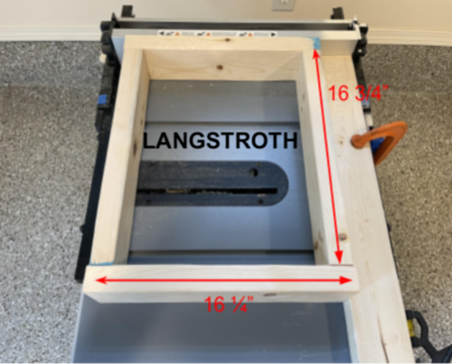
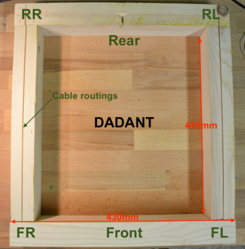

### 2.3 Mounting Sensors, Brackets and Box

Next, route the sensors along the grooves, and ensure the wires are properly aligned and tight.

Next mount the weight sensor brackets together with the sensors to the frame on each corner using C screws and a #2 Phillips screwdriver.

The sensors should go to the same side on the frame as the side they come out of the box. 
With the long sensors going to the furthest end, and the short ones closest to the box.
| | Left | Right |
|----|----|----|
| Rear | J4 | J2 |
| Front | J3 | J1 |

**IMPORTANT: Do not fully tighten these screws. Bending the senor will create a measurement error. Tighten then back off ½ turn.**

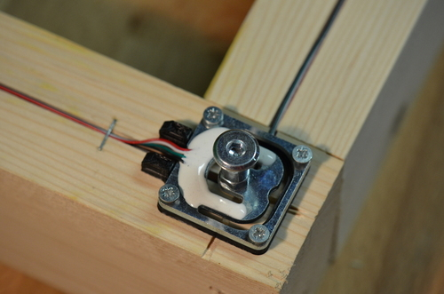 

Now mount the box on the lumber and pull in any extra wire length.
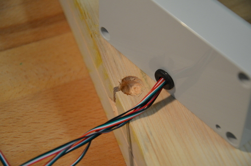 
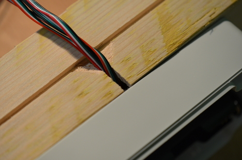 

You can now screw the board into the box using A screws.
Now screw the box on the lumber with  with C screws.Since these screws go through the box, you may need an extension to adequately reach.
**IMPORTANT: Be certain to mount the box on the scale with the wire entry down. It is harder for water to run uphill.**

Close the box using the gasket and screws provided from the manufacturer.
**IMPORTANT** : **The curved side of the gasket should face into the groove of the lid.**

Congrats, if you used an already calibrated board, you're finished! If not, move on to calibration.

## 3 Calibration (W3UA Only)

You can calibrate your scale in two ways:

1. with the Bees app (new feature in Oct. 2022) 
2. with the PC App. 

Watch the video to get you started :

The excel sheet is available here :

********** URL excel sheet

See the BroodMinder user guide for more complete instructions on calibration.

## 4 Hardware list

| picture | **Item Description** | **Qty** |
| --- | --- | --- |
|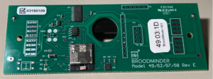 | Circuit Card, BRM-49 | 1 |
|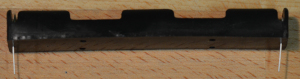 | BC12AAPC-ND Battery Holder AAx2 | 1 |
| | BATTERY, AA, LITHIUM | 2 |
|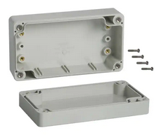 | Hammond 1554CGY Box | 1 |
|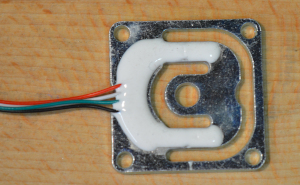| GML670-50KG, with 750mm cable | 4 | 
|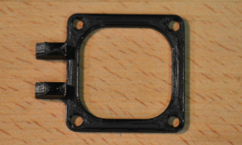 | JW Manufacturing Custom Support | 4 |
|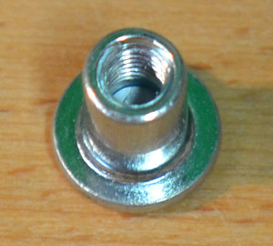  | Round Base Weld Nuts | 4 |
|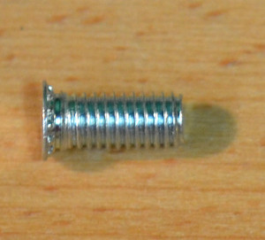| Press Fit Stud, 10-32 Thread, 1/2" Long | 4 |
| |  |  |
|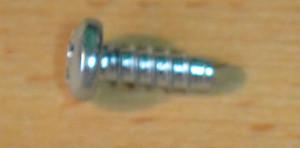  | (A) #6 Self Tapping Screw x 1/4" | 2 |
|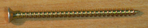  | (B) #8x3" (4x70mm) Drywall Screw (W3PA & W3UA) | 8 |
|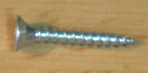  | (C) #3 3/4 (3x20mm) Phil Flat Wood Screw | 18 |
| | | |
| | Pine 2x4x16" (500x45x70mm) (Customer Supplied) | 4 |

