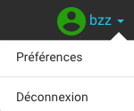
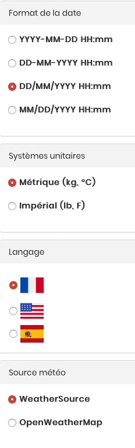

# FAQ

## Capteurs et logiciels 

### Quelles sont les différentes applications mobile de BroodMinder ?

L'application BroodMinder (ou BroodMinder Lite) est l'application gratuite de base. Elle vous permet de consulter vos appareils, de vous envoyer des données par courrier électronique, de voir des graphiques, d'annoter vos inspections...etc.

 
BroodMinder Apiary est une application plus performante. Elle permet de télécharger les données de tous vos appareils BroodMinder en un seul geste. C'est un excellent gain de temps pour les utilisateurs disposant de nombreux capteurs. L'application est gratuite mais elle nécessite de disposer d'un abonnement pour les fonctionnalités de productivité.

BroodMinder Cell est l'application qui permet de contrôler les Hub.

### Récupération des données des capteurs

#### Les capteurs enregistrent-ils les mesures ?

Tous les capteurs ont une mémoire interne. A chaque heure, ils effectuent un relevé et ils l'enregistrent dans leur mémoire. La capacité de stockage est d'environ un an de mesures. On voit souvent des capteurs avec plus de 7000 relevés ! (365*24=8760 relevés/an). Il est possible de vider cette mémoire soit en enlevant la pile quelques secondes, soit à partir de l'application mobile. Bien sûr avant de faire cela, assurez-vous que vous avez bien synchronisé les données avec mybroodminder ! 

#### Comment fonctionne la récupération de données avec smartphone ?

Vous devez vous rendre sur votre rucher avec un smartphone possédant l'une des applications BroodMinder (Lite ou Apiary). La synchronisation pour les comptes gratuits se fait capteur par capteur. L'ensemble des capteurs fonctionne en Bluetooth. La portée du smartphone est de quelques mètres.

#### Comment fonctionne la récupération de données avec un Hub ?

Avec le Hub, vous bénéficiez d’un suivi en temps réel. Vous avez accès à l’ensemble des alertes et pouvez anticiper les travaux sur votre rucher avant même de vous y déplacer. Il existe deux déclinaisons, Wifi ou GSM, selon votre connectivité. Ce transmetteur se place au milieu de votre rucher. Il récoltera et vous transmettra les données de façon automatique, que vous ayez un seul ou des dizaines de capteurs sur un rayon d'environ 20 mètres. 

Vous pouvez visionner la vidéo suivante : 

#### Je n'arrive pas à synchroniser mes ruches, que puis-je faire ?

La portée du Bluetooth dépend de nombreux facteurs. Sur certaines ruches, la portée est faible. Positionnez-vous au plus près de la ruche et essayez de nouveau en suivant les instructions. Si un nouvel échec apparaît, contactez-nous à support@mellisphera.com. 

### Batterie 

#### La pile est-elle remplaçable ?

Oui, toutes les piles sont de type bouton CR2032, disponibles dans toute grande surface.

#### Combien de temps la batterie dure-t-elle ?

En conditions normales la batterie dure plus d'un an. Il est recommandé de la remplacer pendant la récolte d'automne. On vous avertit lorsqu'il est temps de la remplacer.

#### Les capteurs BroodMinder durent-t-il plus d'un an ?

Une fois la pile remplacée, ne vous inquiétez pas, les capteurs resteront utilisables pendant de très nombreuses années.

## Connexion et paramètres

### Je n'arrive pas à me connecter à Mellisphera, que puis-je faire ?

Contactez-nous grâce au lien situé en dessous de la connexion. Nous tâcherons de résoudre votre problème le plus rapidement possible. 

### Je voudrais explorer Mellisphera mais je ne suis pas encore equipé

Vous pouvez utiliser le compte démo. Il possède les données de quelques ruches afin de vous montrer les fonctionnalités de la solution. Manipulez et éditez sans peur, le compte est remis au propre chaque soir!

### Paramètres du compte

#### Où puis-je changer la langue, le format des dates, les unités ou la source météo ?

En haut à droite de l'app Mellisphera, vous avec accès à l'ensemble des paramètres de votre compte. 

Vous pouvez changer votre système d’unité (métrique ou impérial). Vous pouvez également changer le format de la date à votre guise ou encore la langue (français, espagnol ou anglais pour le moment). Une dernière possibilité s’offre à vous, celle du choix de la source météo. Selon votre préférence et vos retours, vous pourrez choisir votre source préférée. 

## Données

### A quel moment sont actualisées les données ?
Les données horaires sont actualisées toutes les heures si de nouvelles données sont disponibles. 

Les données journalières (météo, couvain, poids, etc.) sont actualisées à deux moments de la journée pour que chaque matin en Europe et en Amérique les données soient disponibles : entre 6h30 et 7h30 et entre 12h30 et 13h30 UTC.

Actualisation des données journalières

Heure   UTC | Paris   CET | NewYork   EDT
--- | --- | ---
7:00 | 8:00 | 1:00
13:00 | 14:00 | 9:00

(*) a noter qu'il peut s'appliquer +1h en heure d'été.

Enfin, nous récupérons vos données manquantes et réajustons les données des capteurs et ruches qui ont changé d'emplacement dans la journée chaque nuit (entre 1h et 3h UTC).

### Je n'ai aucune donnée à ma connexion, pourquoi ? 

Vos données se chargent à chaque nouvelle connexion. Lors de votre première connexion, il se peut que le processus soit long si vous disposez d’un nombre conséquent de capteurs. Soyez patient, cela peut prendre plusieurs dizaines de minutes lors de votre toute première connexion.

### Déplacer un capteur ou une ruche

#### Comment déplacer mon capteur de ruche ou ma ruche de rucher ?

Dans le cas où vous souhaitez changer votre capteur de ruche ou la ruche de rucher, vous devez vous rendre sur MyBroodMinder.com pour effectuer ce changement. Dans la section ‘Configurer’, cliquez sur 'Historique emplacements' pour le capteur concernée ou 'Historiques ruchers' pour la ruche concerné. 

Sur cette page, vous pouvez voir l’historique des positions de vos capteurs dans vos différentes ruches, et également l'historique de vos ruchers pour vos ruches. Vous pouvez donc modifier ou ajouter une nouvelle localisation pour votre capteur ou votre ruche. N’oubliez pas de bien préciser les dates de début et de fin pour toutes les localisations. Les données sont affectés à la ruche uniquement à partir de la date/heure indiquée.

Vous trouverez ces changements dans Mellisphera lors de votre prochaine connexion. L’historique de vos données est conservée sur la ruche précédente et les nouvelles données arriveront dorénavant sur la ruche mentionnée dans la nouvelle localisation. 

#### J'ai une ruche morte, puis-je la déclarer morte et ne plus la voir apparaître au sein de l'application ?

Oui ! Il faut se rendre sur MyBroodMinder.com dans 'Configurer'. Dans le menu 'Ruches', vous pouvez 'désactiver' la ruche souhaitée. Lors de votre reconnexion sur Mellisphera, vous ne la verrez plus. 
Toutefois rassurez vous, les données restent et vous pouvez encore les retrouver.

Attention, cette action est irréversible. Vous ne pourrez plus activer de nouveau cette ruche mais vous pourrez toutefois en créer une nouvelle sous le même nom.

#### Mon calendrier lunaire ainsi que les calendriers associés à la météo sont toujours vides, que faire ? 

Vos calendriers sont vides si vous n’avez pas rempli les champs ‘Code Postal’ et ‘Code Pays’ à la création de votre rucher. Si c’est le cas, nous vous conseillons de vérifier ces paramètres sur MyBroodMinder (dans Configurer puis Ruchers). 

Il nous faut connaitre (un peu) la localisation du rucher pour pouvoir relever les données lunaires et météorologiques. Vos calendriers devraient ressembler à l'image suivante si vos paramètres sont corrects :

#### La météo de mon rucher montre qu’il a beaucoup plu hier alors que ce n’est pas vrai, pourquoi ?

Les services météo se basent sur des modèles et une localisation qui ne sont pas toujours précis. Dans certains cas, les données peuvent être légèrement différentes de la réalité. Si les résultats ne vous conviennent pas, vous avez la possibilité de changer de source météo dans les paramètres de compte Mellisphera (voir plus haut dans la section des paramètres).

#### Ma ruche a perdu énormément de poids hier suite au retrait d’une hausse mais le calendrier des variations de poids prétexte le contraire, pourquoi ? 

Le calendrier de "poids" affiche la productivité journalière de vos ruches équipées. Chaque jour, nous calculons les apports de poids ou les consommations de vos abeilles. Cela signifie que nous ne prenons pas en compte les opérations de l’apiculteur (alimentation, retrait ou ajout de hausse, etc.) ou les variations excessives de poids dues à un essaimage par exemple.

#### J’ai plusieurs relevés de poids chaque jour, je ne comprends pas leur signification.

Cela signifie que vous possédez plusieurs capteurs de poids qui sont assignés à votre ruche. Vérifiez les assignations de vos capteurs sur MyBroodMinder.com. Si cela est voulu, vous pouvez cocher ou décocher en haut du calendrier le capteur que vous souhaitez afficher comme le montre l'image suivante. Par défaut, l'ensemble des capteurs de poids sont affichés.

#### Pourquoi ai-je des pastilles blanches sur la photo de mon rucher? 

Lorsqu’une pastille est blanche (sans couleur), cela signifie qu’il n’y a pas de données associées à ce capteur à la date choisie. Les raisons peuvent être multiples, mais la cause principale est un défaut de transmission ou de synchronisation.

#### Je ne veux plus voir les alertes de météo sur mon calendrier, est-ce possible ?

Oui ! Vous pouvez modifier les alertes comme vous le souhaitez. Elles sont même personnalisables. Il vous suffit de vous rendre dans les paramètres d’alertes. 

Cependant, cette action n'est pas rétroactive. La modification sera active à partir de l'instant où vous changez les paramètres, nous ne revenons pas sur l'historique des alertes. Les modifications effectuées ne concerneront que les nouvelles alertes. Prenez garde, le message affiché au survol des alertes dépend uniquement de vos paramètres actuels. Les modifications sont effectives immédiatement dans vos calendriers d’événements.

#### Je ne reçois aucun email pour les alertes, pourquoi ?

Par défaut, l’envoi d’email est désactivé. Vous devez vous rendre dans les paramètres des alertes (bouton suivant) puis dans les paramètres (voir ci-dessous).

Vous pouvez les activer simplement en cliquant sur ‘ON’. Par défaut, votre email de connexion est inscrit dans l’encart ‘Email 1’, vous pouvez le modifier ou en ajouter un deuxième. Les emails s’envoient sur les deux adresses si vous choisissiez d’en inscrire deux. Vous pouvez tester que cela est bien fonctionnel en appuyant sur le bouton de test, un email vous sera envoyé instantanément. 

Enfin, vous pouvez régler la fréquence d’envoi comme vous le souhaitez. Dans cet email, vous retrouverez un récapitulatif des événements à venir et passés, mais également un récapitulaitf de l'état de vos ruches et capteurs.

#### Un de mes capteurs est affiché en rouge, qu’est-ce que cela veut dire ?

En effet, dans la partie ‘Mon Rucher’ de Mellisphera, l’onglet ‘Capteur’ vous permet également de connaître l’état de vos capteurs. Ici, il s’agit en fait d’un problème sur votre capteur. Si votre capteur est affiché en orange ou en rouge, nous vous conseillons d’aller le vérifier. Le message affiché au survol de la souris peut vous donner des indications (voir ci-contre). Cela peut-être aussi bien la batterie qui est faible ou bien si vous êtes équipé d’un Hub, cela signifie que votre capteur a un problème de signal. Dans tous les cas, nous vous conseillons d’aller vérifier votre appareil. 

Mellisphera possède un système d’alertes qui vous prévient de ce type d’événement sur votre ruche. On pourra donc vous informer par email (à condition que vous ayez activé le système) de l'état de vos capteurs.

## Partage

#### Y a-t-il un moyen de partager mes données avec la communauté ?

Oui ! Sur MyBroodminder vous pouvez séléctionner différents types de partage
- partager vos relevés de capteurs avec https://beecounted.org, une initiative de science collaborative
- partager vos relevées de balances avec Bee Informed Partnership https://beeinformed.org/
- partager un ou plusieurs de vos ruchers avec d'autres utilisateurs de Broodminder/Mellisphera

Notez que tous les comptes gratuits partagent par défaut **les données des capteurs** sur beecounted.org.

#### Les gens sauront-ils où se trouve ma ruche ?

Non. Nous ne connaissons pas la position exacte de votre rucher, seulement le code postal. Votre rucher est alors affiché sur le clocher de l'église de votre commune. :)

#### Puis-je voir ces données publiques ?

Oui, en allant sur BeeCounted.org, vous pouvez visualiser des dizaines de ruchers d'apiculteurs partout dans le monde!

#### Puis-je partager mes ruchers avec mes amis apiculteurs ?

Cette fonction n'est pas encore disponible sur Mellisphera, mais c'est possible sur MyBroodMinder. Rendez-vous dans Configurer/Ruchers/Partager. Choisissez les o, sélectionnez un rucher et cliquez sur "partager". Il  vous faut entrer uniquement l'email de l'utilisateur avec qui vous voulez partager. 
Une fois partagé, votre rucher sera visible de leur propre compte en mode lecture seule.  

