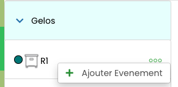
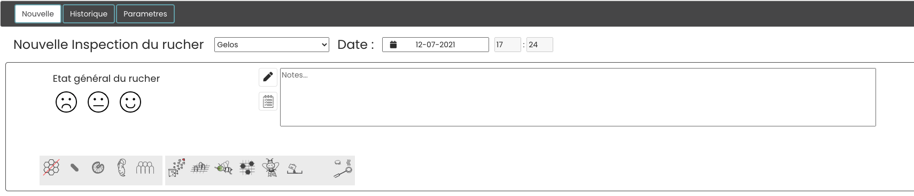
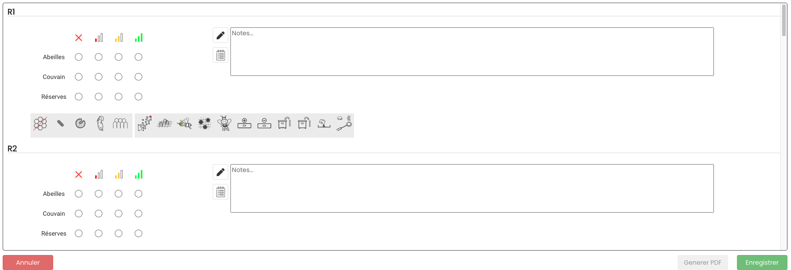
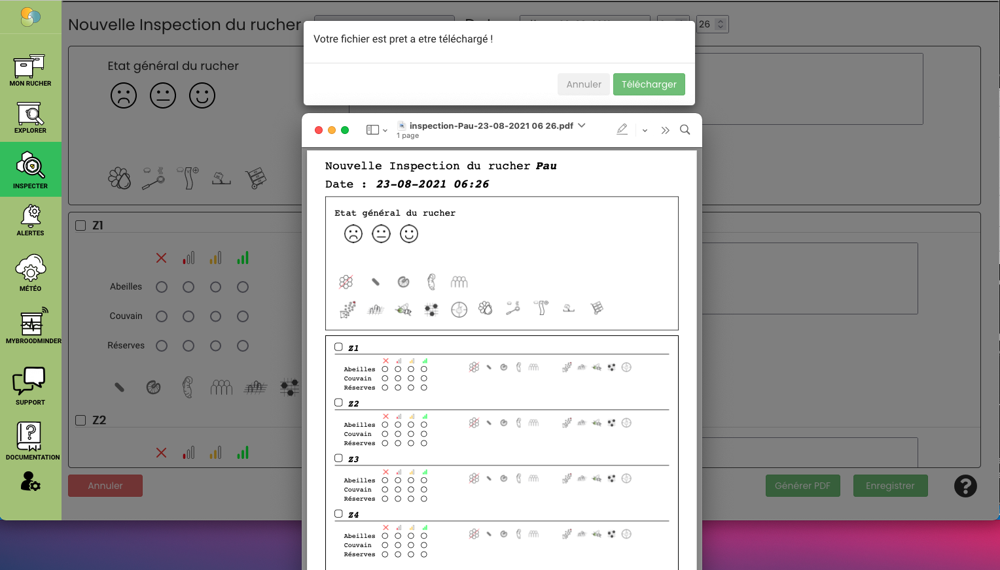
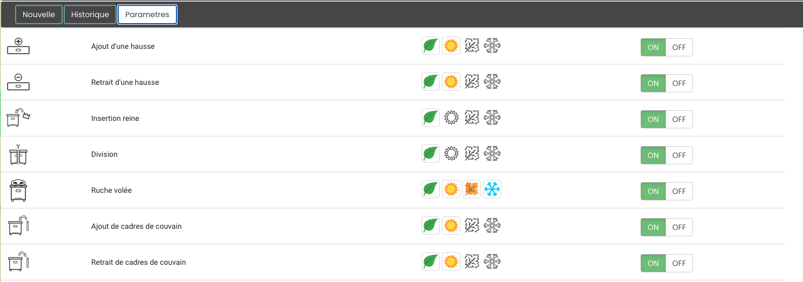

# Mellisphera.com

Mellisphera est intégrée avec BroodMinder. Ainsi, vous devez créer un compte MyBroodMinder et configurer vos ruchers / ruches soit avec la `BeesApp` soit sur [MyBroodMinder.com](https://mybroodminder.com). Ces deux outils permettent de façon indistincte de créer des ruchers et ruches, leur affecter les capteurs et de visualiser les données brutes mesurées. 

Un bouton Mellisphera est toujours visible sur le menu de gauche, il suffit de cliquer sur celui-ci pour y accéder. Si vous vous êtes connectés récemment, la connexion se fera sans que vous ayez besoin de rentrer votre email et votre mot de passe. Dans le cas contraire, le champ de l'email sera pré-rempli. 

Votre aventure commence donc maintenant [https://bzz.mellisphera.com/login](https://bzz.mellisphera.com/login)

## Page de connexion 

 

Sur la page de connexion, vous avez la possibilité de vous connecter à un rucher démo si vous ne possédez aucun compte ou si vous êtes curieux et avide de nouveauté. Vous pouvez lire les informations qui vous en apprendront davantage sur la relation entre BroodMinder et Mellisphera et sur ce que Mellisphera peut vous apporter.

Passons à l'étape de la connexion. **Il faut que vous utilisiez vos identifiants BroodMinder**. Une fois connecté, vous hériterez de l'historique complet de vos capteurs. Vous pourrez explorer les événements passés et suivre l'évolution de la saison sous un angle complètement nouveau. Lors de la première connexion, vous êtes averti que le chargement de l'ensemble de l'historique de vos données est lancé. A chaque nouvelle connexion, nous chargeons vos données manquantes.

Nous allons faire un tour ensemble des différentes fonctionnalités de Mellisphera.

## Ecran d'accueil

Une fois connecté à Mellisphera vous devriez arriver sur cette interface. Elle se décompose en trois zones:

La barre d'en haut vous permet de sélectionner le rucher à visualiser. Un peu plus loin se trouvent vos préférences. Sur le côté gauche se trouvent les différents environnements de Mellisphera. Nous allons explorer chacun de ces espaces dans les prochains chapitres. 

Des infobulles sont également positionnées à côté de chaque fonctionnalité. Elles détaillent les informations essentielles à la compréhension des données.

## Paramètres de compte

En haut à droite sur l'app Mellisphera, vous avec accès à vos paramètres de compte. 

Vous pouvez réinitialiser votre mot de passe. Attention, cela ne modifie le mot de passe que pour la plateforme Mellisphera. 

Vous pouvez également définir quelques préférences:

- langue
- format de date 
- système d’unités (métrique ou impérial)

## Mon rucher

Cette page est le point de départ de Mellisphera. Sélectionnez le rucher à explorer sur le menu déroulant tout en haut et ensuite naviguez visuellement parmi les principales informations.

Cette navigation est contextualisée sur le rucher à l'aide d'une photo qui vous permet de situer l'emplacement de vos ruches. Par dessous vous pourrez positionner des "pastilles" qui matérialisent la ruche et portent les informations associées (nom, poids, couvain etc).

**Photo et placement**

Lors de votre première connexion, vous pourrez ajouter une photo de votre rucher. Soit par glisser/déposer d'un fichier depuis votre explorateur de fichiers préféré, soit en ouvrant le menu contextuel matérialisé par une icone "appareil photo" en haut à droite du cadre de la photo.

### Vue du rucher

L'image du rucher et les pastilles, sont associées à un ensemble de boutons positionnés juste au dessus. Cette barre de navigation vous permet de visualiser contextuellement diverses informations: 

Les boutons 'Nom', 'Couvain', 'Poids', et 'Capteur' sont activables. Cela permet d'afficher sur la photo en dessous des pastilles respectivement le nom, le couvain, le poids et les capteurs de l'ensemble des ruches de votre rucher à la date affichée en haut à droite. Par défaut, c'est la date de la veille (qui correspond au dernier jour de données en général). Vous pouvez bien entendu changer de date. 

**Etat des capteurs**

Petite particularité pour les capteurs, vous visualisez leur état en temps réel par une couleur (grise, rouge, orange) qui détermine l'état et un affichage au survol du problème.

Le niveau de batterie est calculé systématiquement. Pour les ruchers équipés d'un Transmetteur sont également traitées les informations de signal et de connexion. Le code couleur est le suivant :

- Gris - tout est nominal
- Orange - mauvais signal ou batterie à remplacer
- Rouge - le capteur n'émet pas 

Le seuil de batterie est fixé à 20% par défaut, vous pouvez le régler dans les paramètres d'alertes. 

Les informations de signal et de connexion sont basées sur la fréquence des relevés de données chaque jour. Leur quantité et qualité permet de déterminer s'il y a une déconnexion ou un mauvais signal. La première alerte est envoyée 24 heures après le début du problème. 

**Pastilles de couleur des ruches**

Les pastilles indiquent l'état de chaque ruche avec un code couleur (noir, rouge, orange, vert). Vous pouvez également regarder au survol le message associé à chaque état. L'état est calculé à une fréquence journalière en fin de journée par le modèle BFit. C'est pour cela que vous visualisez systématiquement le jours j-1. Avec le sélecteur de date en haut à droite, vous pouvez naviguer parmi les jours précédents également. 

Notez que les ruches non équipées de capteurs ou celles qui n'ont pas de données au jour j-1 présentent une pastille blanche. 

Pour plus d'information à propos du modèle BFit calculant l'état des ruches, vous pouvez consulter la section 'Interprétation des données'. 

**Calendrier des événements du rucher**

Vous disposez d'un calendrier d'événements propre à chaque rucher. Ce calendrier vous permet de tracer les interventions réalisées au niveau de l'ensemble du rucher, ou des observations générales. 
Le calendrier affiche également les alertes et notifications (nous verrons comment les configurer plus loin) au niveau du rucher. 

**Notes de rucher**

Pour terminer la vue rucher, vous pouvez saisir vos notes/inspections de rucher. Cela se situe juste en dessous de la photo de votre rucher.

Pour écrire une nouvelle note, il suffit de cliquer sur le '+' de l'encart, c'est très simple. 

Vous verrez apapraître la note directement sur le calendrier des événements avec l'icône suivante.

### Vue de la ruche

Pour accéder à la vue d'une ruche, vous devez cliquer sur sa pastille ou son nom. La pastille s'entoure en rose et trois nouveaux calendriers correspondant à la ruche selectionnée apparaissent sur la droite. 

Les données affichées sont des données issues des 5 dernières semaines ainsi que des 3 prochains jours puisque nous pouvons prédire des événements à 3 jours. 

**Evénements**

Vous retrouvez le calendrier d'événenements qui est cette fois-ci propre à la ruche selectionnée. Les événements de ruchers et de ruches sont différents. Pour plus de précision, aller dans la section 'Interprétation des données'.

**Couvain**

Vous avez une vision globale de l'évolution du couvain journalier sous forme de calendrier heatmap. Les couleurs varient de rouge à vert et le pourcentage de 0 à 100%. Pour plus de détails quant au model de calcul du couvain, il faut se rendre dans la section 'Interprétation des données'. Si vous possédez plusieurs capteurs de température sur votre ruche, vous pouvez cocher ou décocher celui que vous voulez afficher.

**Productivité**

Ce calendrier offre une vue globale de l'apport de poids journalier sous forme de bulle. Les couleurs sont rouge pour une perte et vert pour un gain. La taille des bulles est proportionnelle à la variation de poids générée par les abeilles (nous soustrayons toute éventuelle manipulation d'ajout ou suppression de matériel). Nous appelerons donc cela la productivité de la ruche. Pour plus de détails quant au modèle de calcul de la productivité, il faut se rendre dans la section 'Interprétation des données'. Vous pouvez afficher uniquement les gains ou les pertes sur le calendrier en cochant/décochant les cases en dessous du calendrier. 

**Notes**

Il est possible de prendre des annotations au niveau de chaque ruche. Ce sont des notes distinctes de vos notes de rucher et qui ne concernent que la ruche sélectionnée. Pour repasser en mode rucher, il suffit de cliquer sur le bouton 'Rucher' de la barre de naviguation grise.

## Explorer

La vue **Rucher** donne un aperçu global de la situation. Dans `Explorer`, vous pourrez naviguer parmi vos données de façon plus approfondie. Une nouvelle barre grise apparait avec plusieurs espaces : `Ruche`, `Couvain`, `Poids`, `Evenements`, `Données horaires`. Le mode `Ruche` est celui affiché par défaut avec les données du dernier mois. Vous pouvez modifier la plage de données affichée en haut à droite. Tout comme sauter des périodes de temps (ex: d'un mois au précédent) avec les flèches.

Les filtres permettent de trier le type d'information qui sera présenté sur l'écran dans les différents onglets. Il est possible d'activer ou desactiver l'affichage contextuel des inspections, evenements ou alertes. Ils aparaitront ainsi sur les courbes, rendant l'analyse contextuelle plus facile.

### Ruche

Dans ce mode il est possible d'éxplorer en détail les données d'une ruche à la fois. Le résultat est présenté sur la forme de trois calendriers qui regroupent les informations 1/ de la ruche 2/ de l'apiculteur 3/ de l'environnement.

**Le premier calendrier** récapitule les données de la ruche. Plusieurs données peuvent être selectionnées avec les icones au dessus du calendrier : 

- Couvain 
- Productivité
- santé de la ruche
- Température interne maximum
- Température interne minimum
- Humidité interne maximum
- Température externe maximum 
- Température externe minimum

La disponibilité de ces informations dépend des capteurs qui sont installés sur la ruche. Le couvain et les températures internes nécessitent une sonde interne, alors que la productivité et les conditions externes sont associées à une balance.

Dans le cas où il existe un capteur dans le `corps` et un autre dans la `hausse`, les deux sont affichés et selectionnables sequentiellement en pied du calendrier.

**Le deuxième calendrier** fait état des événements de votre ruche et du calendrier astronomique. 

- Evénements, annotations et alertes
- Calendrier astronomique - biodynamique

**Le troisième calendrier** présente les données météo du rucher. Il est donc identique à toutes les ruches d'un même rucher. Vous aurez accès aux données générales 'Météo',

- Température externe maximum
- Température externe minimum
- Humidité externe maximum
- Humidité externe minimum
- Vent
- Précipitations

Les informations affichées dépendent de la source selectionnée (en pied du calendrier). Par défaut tous les ruchers sont branchés avec un service météorologique sur internet fourni par la société `WeatherSource`. C'est une donnée résultant d'un modèle météo qui selon la localisation du rucher peut s'averer assez précise (ou non). Néanmoins selon les localisations, il est aussi utile de disposer d'une source `locale` de données météo. Cela peut être fait en installant un capteur TH ou une balance et en le déclarant comme source météo (voir chapitre Météo plus bas).
Cette dernière source peut être moins complète (pas de mesure de vent ou de pluie) mais plus précise sur la température ambiente ou l'hygrométrie que ce que fait WeatherSource. 

La comparaison entre les deux sources est souvent d'une grande utilité pour affermir ou pas la pertinence de WeatherSource et donc la confiance qu'on peut lui donner.

Vous pouvez donc visualiser et échanger les modes du calendrier comme vous le souhaitez. Voici un exemple :

### Couvain

Dans l'onglet Couvain est présentée l'évolution du couvain de la ruche. Ici on peut **sélectionner multiples ruches** et les comparer entre elles. Même si ces ruches sont dans des ruchers différents.

Au survol, vous pourrez voir les informations relatives aux ruches et les evenements, inspections ou encore alertes qu'elles ont subi.

Cet outil est extrêmement performant pour analyser des données sur des longues ou courtes périodes de temps, sur des ruches d'un même rucher ou de différents ruchers. Il donne une large flexibilité pour l'analyse.

Nota : si vous souhaitez approfondir cette métrique de couvain et le fonctionnement de l'algorithme subjacent, vous pouvez [lire ceci](#niveau-de-couvain-bforce).

### Poids

L'onglet Poids propose un outil complet pour l'analyse des poids des ruches de tous les ruchers avec 4 vues qui sont disponibles : 

- Poids horaire
- Poids journalier
- Gain de poids
- Productivité

Par défaut, c'est la vue en `Poids journalier` qui s'affiche.

**Vue Horaire** affiche le graphique des mesures de poids horaires brutes. En survolant le graphique, vous verrez s'afficher, la date, l'heure et le poids correspondant. 

**Vue Journalier** affiche les mesures de poids journalièr relevé à minuit. Comme pour le poids horaires, au survol vous verrez s'afficher la date et le poids correspondant. Une case de saisie permet de figer une `date de référence` ou `T0` qui se matérialise sur le graphique par une ligne verticale en pointillés rouge. Le tableau de synthèse sous le graphique recense automatiquement les valeurs de poids à cette date. Il est completé par les poids à J-7 jours et à J-15 jours (J étant le jour actuel). 

**Vue Gain** affiche le gain de poids journalier (barres) et le gain cumulé (ligne). Le gain de poids journalier est calculé par rapport au poids de la ruche la veille. Le gain de poids cumulé est calculé par rapport à la `date de référence` que vous aurez choisi. Dans le tableau en dessous du graphique, sont listés le poids cumulé depuis la date de référence (T0), depuis les 7 derniers jours et depuis les 15 derniers jours.

**Vue Productivité** affiche le gain de poids journalier et le gain cumulé ajustés en gardant uniquement les gains ou pertes associés à l'activité des abeilles. C'est à dire que les éventuelles actions de l'apiculteur (ajout/retrait de hausse, nourrissements, etc) ne sont pas considérées.

Pour toutes les vues, sur la droite du graphique il y a une barre d'outils avec 5 icônes :
- "zoom" : pour zoomer sur une zone du graphique
- "zoom reset" : pour revenir à la vue initiale (enlever le zoom)
- "data view" : pour voir les données en listing
- "restore" : pour actualiser les données
- "save as image" : pour télécharger le graphique comme une image 

L'utilité des vues de `Gain` et de `Productivité` est complémentaire. Le gain est utilie dans un cadre de  nourrissement où l'on souhaite voir l'évolution globale du poids de la ruche alors que la vue productivité est plus intéressante pour le suivi de miellées par exemple ou la comparaison de performances entre colonies/souches.

### Évènements

Il est possible d'ajouter des évènements depuis tous les espaces disponibles dans le menu Explorer. En survolant les ruches ou ruchers dans la liste à gauche, apparait le menu contextuel avec 3 petits points `'...'`. Il suffit de selectionner l'option `Ajouter un évènement`. Selon le contexte de départ il s'agira soit d'un évènement qui concerne l'ensemble du rucher (lève cadre rouge), soit uniquement une ruche (lève cadre jaune).

Raccourci : Dans le menu `Mon rucher`, il est également possible d'ajouter un évènement, en cliquant sur `'...'` dans l'espace Notes. Là aussi le résultat dependra du contexte de départ (rucher/ruche).

Dans la fenêtre qui s'ouvre lorsque vous souahitez ajouter un évènement, plutôt que d'écrire de longues phrases, pensez à utiliser les pictogrammes disponibles. Nous avons distingué les `Notes` qui correspondent à ce que vous avez observé, des `Tâches` qui correspondent aux actions réalisées ou à réaliser sur la ruche ou le rucher. 

L'onglet `Évènements` recense et permet de filtrer tous les évènements créés. Vous pouvez afficher les évènements du rucher dans son intégralité en cliquant sur le rucher, ou d'afficher les évènements de certaines ruches en les selectionnant. C'est ici qu'il est possible de les éditer et ou supprimer. **Le lève cadre rouge indique un évènement du rucher** et **le lève cadre jaune indique un évènement de la ruche**. C'est ce même code couleur qui est utilisé dans les évènement qui apparaissent dans le calendrier des évènement du mode Ruche. Enfin, dans la partie "Notes et Taches" : en noir les notes et en bleu les taches. 

### Données horaires

Dans cet onglet sont présentées les données brutes issues des capteurs de chaque ruche avec la température interne en haut, le poids au centre et l'humidité en bas (un peu comme sur mybroodminder). En vert sont marquées les zones optimales pour le couvain et l'humidité. L'interface rend très facile la comparaison croisée entre ruches quel que soit leur rucher.

Les petites icones sur la droite du graphique permettent de zoomer, sélectionner des zones, se déplacer ou encore voir les données en listing. 

## Inspecter

Ci-dessus nous avons vu le fonctionnement des `Evènements`. Des notes, observation ou alertes qui sont affectées soit au rucher, soit à la ruche de manière spécifique manuellement (cas des notes ou taches) ou automatiquement (cas des alertes). Une `Inspection` est un ensemble d'évenements, sais souvent les uns après les autres dans un contexte intégré rucher+ruches.
A la fin de la saisie, l'inspection est ventilée en Evènements qui se ratachent aux ruches et ruchers. 

!!! Attention 
    Une fois saisie et enregistrée, il n'est plus possible d'éditer une inspection. Mais on peut éditer séparement les évenements qui en ont découlé.

### Nouvelle inspection
Le mode **Nouvelle** permet d'ajouter une nouvelle inspection. Vous pouvez prendre note de l'inspection du rucher dans son ensemble. Dans ce cas, des pictogrammes vous permettent d'évaluer l'état général du rucher. Puis commme pour les évènements, vous avez un espace pour prendre des notes et écrire les tâches à venir. Utilisez les pictogrammes pour avoir à écrire (mais aussi à lire!) le moins possible.

Une fois décrit l'état général du rucher il faut recenser celui de chaque colonie. Dans ce cas vous commencez par faire un état systématique :

- des abeilles
- du couvain 
- des réserves

Ensuite, comme pour le rucher, il est possible de compléter avec des notes et pictogrammes.

 

Une fois la saisie de l'inspection terminée et enregistrée les éléments qui la composent seront visibles sur tous les écrans de l'appication dans leur contexte propre (le rucher, la/les ruches).

**Inspection papier**

L'option `générer un PDF` est pensée pour ceux qui préfèrent amener seulement du papier au rucher. Un formulaire imprimable est généré avec les informations contextuelles. 
A ce niveau rien n'est enrtegistré, pour garder une trace de l'inspection il faudra réaliser la saisie à posteriori.

### Historique des inspections

L'onglet **Historique** retrace l'ensemble des inspections. Il n'est pas possible de modifier ou supprimer une inspection dans cet écran. Pour cela il faut se rendre dans `Mon Rucher`. 

### Paramètres

L'onglet **Paramètres** permet d'adapter l'espace de prise de notes selons les pratiques de chaque apiculteur. Il est ainsi possible de configurer l'affichage ou non chaque pictogramme et de leur affecter une saison de prévalence. Dans ce cas, le reste de l'année ils ne seront pas proposés. 

Par example l'ajout d'une hausse peut survenir au printemps ou en été mais pas en automne ou en hiver. Par défaut ce pictogramme est proposé uniquement au pintemps et en été, et désactivé pour l'hiver et l'automne. Si certains pictogrammes ne vous sont jamais utiles, vous pouvez les mettre en mode "OFF". Ces réglagles permettent de na pas surcharger l'espace prise de notes.

Voici tous les pictogrammes d'évènement/observations/tâches disponibles : 

| **Pictogramme** | **Description** |
|- |-- |
|  | Présence d'oeuf |
|  | Présence de larve |
|  | Présence de couvain operculé |
|  | Présence de couvain mâle | 
|  | Cellule de reine vue |
|  | Pas d'abeilles |
|  | Peu d'abeilles |
|  | Moyenne en abeille |
|  | Populeuse |
|  | Sans couvain |
|  | Niveau de couvain faible |
|  | Niveau de couvain normal |
|  | Niveau de couvain élevé |
|  | Pas de réserves |
|  | Peu de réserves |
|  | Moyenne en reserves |
|  | Bon niveau de reserves | 
|  | Miéllée |
|  | Bourdonneuse |
|  | Couvain mosaïque |
|  | Abeilles malades |
|  | Reine vue |
|  | Essaimage |
|  | Traitement varroa acide oxalique Vap. |
|  | Traitement varroa acide oxalique Deg.|
|  | Compteur de varroa|
|  | Comptage de varroa|
|  | Ajout lanière |
|  | Retrait lanière |
|  | Nourissement au candi |
|  | Nourissement au sirop |
|  | Ajout d'une hausse |
|  | Retrait d'une hausse |
|  | Introduction d'une reine |
|  | Divison |
|  | Ajout de cadres de couvain |
|  | Récolte |
|  | Marquage de la reine |
|  | Ruche volée |
|   |   |

## Alertes

Dans cet espace vous trouverez toutes les fonctions pour mettre en oeuvre un service de notifications et alertes sur chaque rucher. Une nouvelle barre de navigation permet de naviguer sur 3 catégories d'alertes : 'Ruche', 'Météo', 'Capteur' en plus du bouton 'Paramètres' qui est dédié à la configuration.

### Ruche

Dans cet onglet, sont listées toutes les alertes concernant la ruche. Ces icônes d'alertes pourront se retrouver dans le calendrier d'événements. 

Chaque alerte peut être activée/désactivée 'ON/OFF'. Pour un grand nombre d'entre elles il est possible de modifier les seuils en faisant glisser le curseur. Par défaut, tout est activé avec des paramètres auto ajustés. 

Sur l'interface la petite icône 'i' d'information permet au survol, d'avoir un bref descriptif de l'alerte. 

De façon plus détaillée, voici les alertes disponibles et leurs caractéristiques :

| **Pictogramme** | **Alerte** | **Fréquence** | **Description** | 
|- |-- | -- | -- |
|  | Miellée | hebdo | l'alerte miellée se déclenche lorsque l'apport de poids net dans la ruche dépasse le seuil indiqué. Par défaut il est défini à 15kg/semaine.| 
|  | Potentiel essaimage détecté | horaire | Alerte des essaimages en **temps réel** mais aussi **passés** dans le cas d'une synchro manuelle. Cette alerte fonctionne sur ruches équipées de capteurs de température. Avec une balance ce sera encore plus précis mais ce n'est pas indispensable.   **Nous pouvons ajuster les essaimages détectés en fonction de vos retours, n'hésitez pas à nous signaler des incohérences ou des oublis !**
|  | Journée a risque pour l'essaimage | journée | En partant d'un certain nombre de paramètres on évalue le risque d'essaimage à 3 jours.   **Cette alerte est en cours de mise au point.**| 
|  | Sur-Temperature | journée | Certaines colonies n'arrivent pas à gérer leur température interne. Souvent il s'agit de divisions petites populations. Mais parfois c'est la météo qui a un effet majeur à cause d'un défaut d'exposition   Dans ce cas, le couvain de la ruche est mis à l'épreuve, car les températures peuvent atteindre les 40°C.| 
|  | Froid extrême | journée | En hiver, la grappe se resserre et maintient la température très localement - en étant parfois loin du capteur. C'est pour cela que l'indication de "basse température" ne peut être qu'informative. En fonction du contexte, il faudra peut être agir.| 
|  | Faible couvain | hebdo | En pleine saison, une ruche qui présente des niveaux de couvain en dessous de 30% est une anomalie ou une division/essaim. Cette alerte permet d'identifier les colonies qui décrochent. | 
|  | Perte de poids | journée | Une consommation excessive/soudaine signifie souvent pillage de la ruche par une autre colonie.| 
|  | Gain de poids | journée | Alerte journalière qui informe d'un gain de poids lié aux apports des abeilles. Certainement à associer avec l'alerte miellée hebdo.| 
|  | Forte humidité | journée | En hiver, l'humidité dans la ruche peut atteindre 80% de façon naturelle. Toutefois, si le seuil est encore plus haut il faut penser à intervenir.   Cette alerte est uniquement opérationnelle avec les ruches équipées de capteurs TH| 
|  | Faible humidité | journée | En saison, la zone optimale d'humidité se situe entre 50 et 75%.| 
|  | Ruche morte | journée | Si vous voyez arriver cette alerte, c'est trop tard. Cela signifie qu'il n'y a plus de signal de vie dans la ruche.| 
|  | Traiter varroa | journée | Cette alerte se déclenche lorsque le couvain moyen du rucher descend en dessous du seuil fixe (defaut à 15%). C'est le moment de planifier un traitement anti-varroa à l'acide Oxalique.| 
|  | Ajout hausse | journée | Pour les ruches équipées de balance, cette action est automatiquement détectée et affichée sur le calendrier à l'aide d'une indication du poids de vos hausses vides.   Nous avons fixé la valeur par défaut d'une hausse vide à 5kg.   Pour une ruche dadant, nous avons pris certaines mesures pouvant vous aider à fixer cette valeur :   Une hausse vide se situe entre 3,7 et 4,3kg.   Une hausse avec des cadres gaufrés pèse environ 6,40kg.   Une hausse avec des cadres etirés sera proche de 6,60kg.| 
|  | Retrait hausse | journée | Pour les ruches équipées de balance, cette action est automatiquement détectée et affichée sur le calendrier à l'aide d'une indication du poids de vos hausses pleines.   Nous avons fixé la valeur par défaut d'une hausse pleine à 20kg.  | 
|  | Ruche volée | journée | Les capteurs ne disposent pas d'une géolocalisation. Cependant, pour les ruches disposant d'un capteur de poids, cette alerte prévient d'un poids anormalement faible, déclencheur possible d'un vol...| 
|  | Seuil de poids | horaire | Il peut être parfois important de suivre le poids des ruches et d'en fixer des seuils afin d'effectuer des opérations sur vos ruches après ceux-ci atteints.   La valeur par défaut a été fixée à 100kg. | 

### Alertes Météo 

Dans cet onglet sont listées les alertes concernant la météo. Ces icônes d'alertes pourront se retrouver dans le calendrier d'événements de rucher. Vous pouvez une nouvelle fois ajuster et désactiver/activer les différentes alertes. Par défaut, tout est activé avec des paramètres auto ajustés. 

Toutes les alertes météo sont des alertes de prédiction à J+7 maximum. 
Elles sont évolutives. Si un événement est prévu à J+7 et que le lendemain cet événement n'a plus lieu d'être il n'est plus affiché.
Les alertes concernent majoritairement des évenements forts à extrêmes.

| **Pictogramme** | **Alerte** | **Fréquence** | **Description** | 
|- |-- | -- | -- |
|  | Pluie | jour | Forte pluie.  Valeur par défaut à 50 mm/j  | 
|  | Neige | jour | Neige importante.  Valeur par défaut à 15cm/j   | 
|  | Vent | jour | Vents forts.  Valeur par défaut pour des rafales à 30 km/h   Dans certaines régions, il est conseillé d'augmenter le seuil par défaut si les alertes sont trop régulières.| 
|  | Froid | jour | Journée froide.  Valeur par défaut pour des journée en dessous de 0°C.   Dans certaines régions, il est conseillé de diminuer le seuil par défaut si les alertes sont trop régulières.|
|  | Chaud | jour | Journée chaude.  Valeur par défaut pour des journée au dessus de 40°C.   Vous devez ajuster le seuil par défaut en fonction de votre région.|

### Capteurs

Les alertes associées aux capteurs informent sur les éventuelles anomalies de connexion ou de batterie. Pour être toujours certain que le système fonctionne nominalement. Cet onglet permet de les configurer. 

Il faut noter que **ces icônes d'alertes ne s'affichent pas dans les calendriers d'événements**. A la place, leur état est visible dans la partie 'Mon Rucher' avec l'onglet 'Capteur'.

De même, si vous avez activé les emails d'alertes (prochaine partie), vous serez averti des états de vos capteurs. Vous pouvez une nouvelle fois ajuster et désactiver/activer les différentes alertes. Par défaut, tout est activé avec des paramètres auto ajustés. 

Voici le détail des alertes disponibles pour chaque type de capteur

| **Pictogramme** | **Alerte** | **Fréquence** | **Description** | 
|- |-- | -- | -- |
|  | Hub déconnecté | jour | Le transmetteur n'a pas envoyé de données durant le dernier jour  | 
|  | W déconnecté | jour | Le capteur n'a pas envoyé de données durant le dernier jour   | 
|  | T déconnecté | jour | Le capteur n'a pas envoyé de données durant le dernier jour   | 
|  | W faible signal | jour | Le capteur W a envoyé des relevés horaires incomplets le dernier jour   | 
|  | T faible signal | jour | Le capteur T a envoyé des relevés horaires incomplets le dernier jour   | 
|  | W faible signal | jour | Le capteur W a un faible niveau de batterie  | 
|  | T faible signal | jour | Le capteur T a un faible niveau de batterie  | 

### Paramètres d'email

Cet onglet permey de configurer les envois par email. Nous vous conseillons fortement d'activer ces emails. Si vous avez un Hub, il est conseillé de sélectionner l'envoi journalier. Dans les autres cas, une fréquence hebdomadaire peut être suffisante. 

Par défaut, l'envoi est OFF et votre adresse mail est inscrite dans la première case. Vous pouvez ajouter une deuxième adresse. Les emails seront envoyés aux deux adresses. Pour vérifier que l'outil fonctionne, vous pouvez cliquer sur le bouton 'Tester email', un email sera instantanément envoyer vers les adresses enregistrées. Si vous ne recevez rien dans les minutes suivantes, veuillez contacter support@mellisphera.com. 

Dans ces emails, vous aurez accès à quatre informations :
- Les alertes obtenues depuis le dernier envoi de l'ensemble de vos ruches et ruchers
- Les événements à venir jusqu'à 3 jours
- L'état de vos ruches 
- L'état de vos capteurs 

Attention, lorsque vous désactivez une alerte, elle n'apparaitra plus dans les emails ni dans les calendriers à partir de la date de la désactivation, ce n'est pas rétroactif. De même, si vous effectuez un changement dans les seuils, cela s'effectuera uniquement pour les nouvelles alertes. 

Voici un aperçu d'un mail que vous pourrez recevoir :

## Météo

Cet espace est consacré à l'analyse de l'environnement du rucher. Pour chacun des ruchers sont présentées plusieurs informations:

- les `indices de Butinage` et de `Indices de Miellée` (c) (voir plus bas)
- la météo du rucher : température, hygrométrie, pluviométrie et le vent.
- les source à partir desquelles ces valeurs sont issues ou calculés.

### Relevés
Les données affichées dans cet espace peuvent être issues de plusieurs sources:

Par défaut elles sont issues du service météorologique fourni par la société WeatherSource. Ce service donne en temps réel les conditions météorologiques sur un emplacement donné qui est défini par le couple pays/code postal. Le service comporte également une prévision à 10 jours. Le jour présent est matérialisé par le trait pointillé vertical. Tous les utilisateurs ont accès à cette source.

Lorsque l'utilisateur a défini une source météo locale, sont également affichées les données mesurées par cette source personnelle.

Chaque rucher est représenté par une couleur. La source `WeatherSource` en couleur pâle et la source `locale` (lorsquelle existe) en couleur foncée.

Par dessus les données météo brutes nous avons mis au point un algorithme qui traduit ces informations en métriques propres à l'apiculture. Le resultat prend le forme de deux indices sur une échelle de 0-100% : 

- **Indice de Miellée** : évalue les conditions atmosphériques pour la **nectarification des fleurs**. Là aussi sont analysés plusieurs facteurs en relation avec les conditions de miellée. 0% signifie que les conditions pour une miellée ne sont pas réunies, 100% que c'est absolument parfait. Mais attention, selon votre zone climatique, le 100% peut ne jamais être atteint et vous devrez vous satisfaire de taux inférieurs!. 
Pour valider la plage de prévision, cet algorithme a été mis au point avec des ruchers situés dans des zones climatiques diverses (tempérées, froides, très froides, tropicales...). Attention néanmoins, cet indicateur ne sait pas si vous avez des ressources ou pas dans votre emplacement. Il dit seulement si les conditions atmosphériques seraient réunies.

- **Indice de Butinage** : évalue les conditions atmosphériques pour le butinage des **abeilles**. Cet indice considère la température extérieure, l'hygrométrie ou encore le vent. S'il fait grand beau il sera à 100%, si au contraire il fait frais ou il bruine ou il vente l'indice sera inférieur.

Avec Weathersource les données ne sont pas hyper locales mais en revanche la prévision météo à 10 jours permet de projeter les indices sur une semaine et demie. Ces prévisions de butinage et de miellée servent d'aide à la décision à l'apiculteur qui pourra identifier la pertinence de certaines actions.

### Configuration des sources locales
Cet onglet sert à définir les capteurs qui sont utilisés en tant que source météo locale.
Il peut s'agir d'une sonde T2 ou TH qu'on place dans une enveloppe météo, d'une balance, un hub (modèle 54 uniquement) ou carrement d'une station Davis Vantage Vue (seul modèle supporté pour l'instant)
Notre préféré est le capteur TH car comparé aux T2 et balances il apporte l'hygrométrie en plus à un cout très modéré.

La définition d'une source météo locale sert a deux choses :

- le calcul des indices (seulement avec un TH, Hub ou Station météo)
- alimenter plus finement les algorithmes de couvain (quel qu'il soit le capteur)

## Lien MyBroodMinder

Vous serez redirigé vers la plateforme MyBroodMinder.com en cliquant sur l'icône de MyBroodMinder. En un seul clic vous pouvez passer d'une plateforme à l'autre, d'un côté sur MyBroodMinder pour gérer vos configurations de ruchers, ruches, capteurs et de l'autre sur Mellisphera pour analyser vos données avec précision et être informé en temps réel de ce qu'il se passe sur vos ruches.

Rappelez-vous que les modifications effectuées sur MyBroodMinder seront récupérées lorsque vous vous connecterez à nouveau sur mellisphera. 

## Support

A partir de ce lien vous pouvez contacter notre support. Soit par message direct, soit par email à [support@mellisphera.com](mailto:support@mellisphera.com) ou en vous connectant directement sur Slack.

Envoyez nous vos questions, vos retours, votre expérience, vos idées d'améliorations et vos problèmes. On aime les retours client! les bons et ceux qui nous aident à progresser.

## Guide utilisateur 

Ce bouton vous renvoie sur l'ensemble de la documentation utilisateur : https://doc.mellisphera.com. 

Ce portail, entièrement dédié à la documentation de l'ensemble du système, est structuré en plusieurs zones comme indiqué dans l'image ci-dessous. 

1. Choix de la langue de la documentation
2. Documents disponibles
3. Corps du document
4. Chapitres du document sélectionné permettant un accès rapide
5. Recherche par mot clé

N'hésitez pas à utiliser la **recherche par mot clé**: elle est extremement puissante et vous fournit des résultats sur l'ensemble de la documentation disponible

Un exemple ici avec le mot clé "batterie"

## Modèles et algorithmes 

Dans cette partie sont abordés les aspects plus techniques du fonctionnement de Mellisphera. On y présente les différents modèles BFIT, BFORCE, BWEIGHT ainsi que les sources METEO et les ALERTES.

### Santé des colonies - BFit
BFIT comme _Bee Fitness_ est l'algorithme qui informe l’apiculteur de l'état de chaque ruche. Nous utilisons des repères comme la période de la saison et l’état des ruches environnantes pour définir un état « nominal » de la ruche. Ensuite, nous positionnons chaque ruche par rapport à cette référence.

Le rendu est très visuel avec des pastilles de couleurs pour indiquer leur état. Pour compléter l'information une infobulle (au survol) précise la nature de la situation.

Le code couleur est le suivant :

| couleur | signification|
|---|---|
|Vert    | En forme |
|Orange  | Perturbée (en déclin ou avec des événements anormaux) |
|Rouge   | En difficulté |
|Noir    | Morte|
|Blanc   | Pas de données ou pas de météo |

En activant l'envoi d'alertes dans Mellisphera vous recevrez par email un tableau récapitulatif avec l'ensemble des informations :

BFit repose sur les algorithmes qui collectent les événements. L’algorithme ‘Learning’ apprend des événements précédents pour conserver, ou non, les événements futurs. Il y a, par la suite, une classification entre les événements détectés ayant une incidence sur l’état de la ruche et les autres. 

BFit prend aussi en compte les résultats fournis par BForce. De cette façon il est capable de déterminer l’écart entre la dynamique actuelle de la ruche et une dynamique du couvain théorique en constante évolution. Cette dynamique théorique est régulièrement actualisée. Elle prend également en compte les différentes régions du monde pour fournir des informations pertinentes selon la latitude ou le climat. 

### Niveau de couvain - BForce

Le développement du couvain est un facteur clé pour les colonies d'abeilles. L'objectif de BForce est de fournir une indication du niveau de couvain dans la ruche sur une échelle de 0 à 100%. 

Lorsque la colonie est à plein régime elle atteint un état stable à 35°C. Cet état est associé au 100% de couvain. La ruche est forte. 
Au contraire lorsqu'elle n'a pas de couvain, les abeilles n'ont pas besoin de réguler la température de la grappe. Dans ce cas la température interne de la ruche suivra peu ou prou la température ambiante. Dans ce cas on aura 0% de couvain.

Entre ces deux points extrêmes on peut imaginer toutes les situations intermédiaires. 

Pour illustrer ces propos, voici les mesures horaires sur deux ruches du même rucher. La première est représentée en rouge et la deuxième en gris. Chacune présente un état bien différent. La rouge possède une température interne avoisinant les 25°C/30°C suivant les mêmes fluctuations que la température extérieure (en pointillés), tandis que la grise, est constante autour des 35°C dans la fameuse ‘Zone optimale de couvain' ou 'Brood zone'.

Dans cet exemple la ruche grise a une grande proportion de couvain alors que la rouge n’en a que très peu. **BForce met en équation cette caractéristique des colonies et traduit la mesure brute de température en une information standardisée et compréhensible**. Le modèle prend en compte un certain nombre de paramètres pour estimer au mieux le niveau de couvain.

- température interne de la ruche
- température ambiante
- évolution des colonies voisines
- saison, latitude et climat
- autres évènements identifiés dans la ruche
- type de ruche

BForce est également un **outil de renforcement dans la détection d’essaimage** puisque lorsqu’un essaimage a déjà été détecté par un autre de nos outils de Machine Learning, le couvain s’en voit impacté par la perte de la reine et donc l’arrêt de la ponte. Cela nous permet donc également de classifier nos différents essaimages détectés. 

**Résultats complets**

Les calendriers et graphiques du couvain affichent la progression journalière du couvain de chaque ruche. Les valeurs sont graduées de 0% (pas de couvain) à 100% (couvain complet). En règle générale, 10% est un cadre de couvain, 40% 4 cadres, etc. Selon votre pratique et le modèle de ruche utilisé (Langstroth, Dadant) vous devez ajuster ces relations. Ainsi, **en général les ruches dont le niveau de couvain est supérieur à 80% produisent du miel**. 

En un coup d’oeil il est possible de visualiser l’historique de la saison. Les arrêts et reprises de ponte étant clairement repérables.

<i>Calendrier de couvain</i>

Il est également possible de comparer plusieurs ruches entre elles, quel que soit leur rucher.

<i>La même ruche avec le couvain annuel comparée à deux autres ruches</i>

Avec l'habitude on arrive à identifier plusieurs évènements sur ces courbes. Il est possible de repérer les débuts et arrêts de ponte certes. Mais aussi les essaimages, les périodes de mauvaise météo qui ont impacté la production de couvain, l'effet des frelons asiatiques, etc. 

<i>Trajectoire de deux ruches sur une saison avec quelques évènements</i>

### Productivité - BWeight
Avoir des fleurs n’implique pas nécessairement l’existence de nectar, et donc de ressources pour les abeilles. En effet, de nombreux facteurs conditionnent l’existence d’une miellée : la température et l'humidité ambiantes, les dernières pluies et leur intensité, la profondeur des racines pour des plantes comme le colza ou le tournesol. La miellée n’est donc pas acquise ni aisée à identifier. Pourtant, comprendre les miellées est un besoin élémentaire pour chaque apiculteur.

Un capteur de poids installé sous la ruche fournit des informations détaillées de gain et perte de poids. Toutefois ces informations prennent en compte plusieurs aspects qui ne sont pas en lien avec la productivité.

En premier lieu, dans la journée les variations de poids dépendent des ressources apportées ou consommées, mais aussi du déplacement des abeilles qui, en journée, sortent butiner plus ou moins nombreuses. 

<i>Sortie des abeilles butineuses et retour avec du nectar</i>

C'est pour cette raison que les courbes de poids de la ruche présentent des "bosses". Une chaque jour, comme dans le graphique ci-dessous. Sur le graphique, on voit également des variations soudaines de poids qui sont liées aux interventions de l'apiculteur.

<i>Historique de poids avec interventions de l'apiculteur</i>

Avec ces constats, on voit que **pour bien évaluer la productivité, il faut considérer uniquement les variations de poids provenant exclusivement de la production des abeilles**. De cette façon, il faut négliger les évènements extérieurs : nourrissement, essaimage, ajout/retrait de hausse, interventions de l'apiculteur, perte ou augmentation inexpliquée. L'algorithme BWeight permet de repérer facilement ces évènements bien distincts et de les écarter du calcul de productivité. 

Le résultat est une information journalière de gain ou perte de poids. La représentation graphique sur le calendrier permet de bien repérer la miellée dans la saison ainsi que son intensité.

<i>Excellente miellée de tilleul fin juin !</i>

En prenant une échelle de temps plus large, au niveau de la saison, il est facile de relever et comparer le déroulement des différentes miellées.

<i>Calendrier des miellées d'une ruche transhumante en 2018</i>
