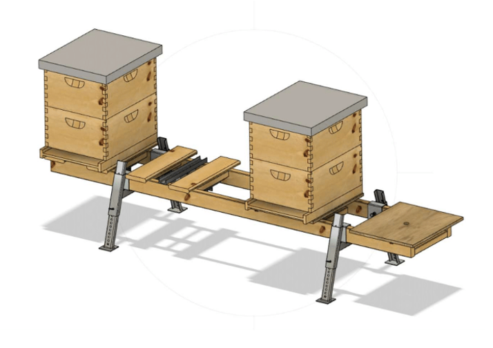
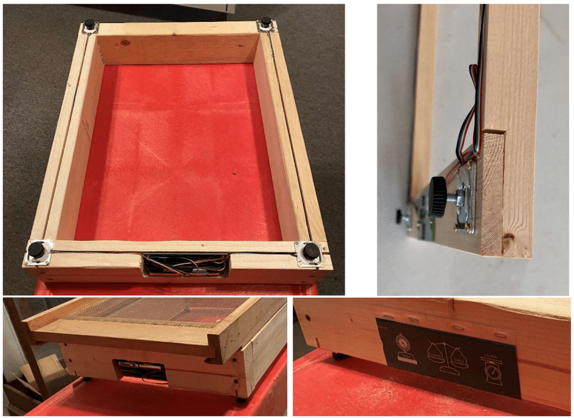
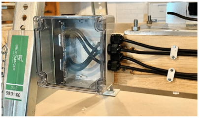
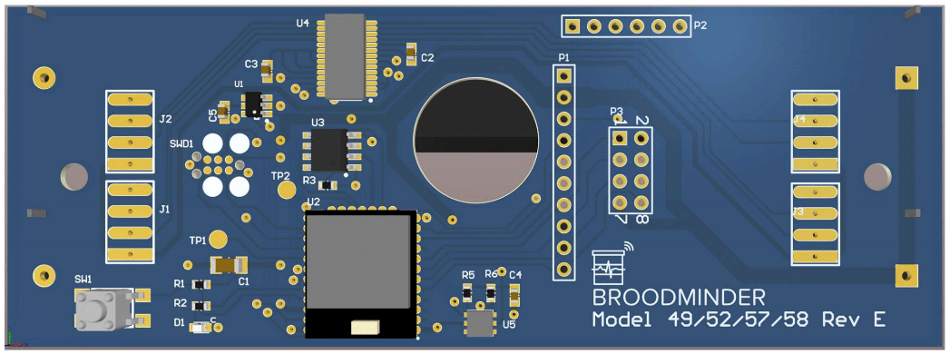
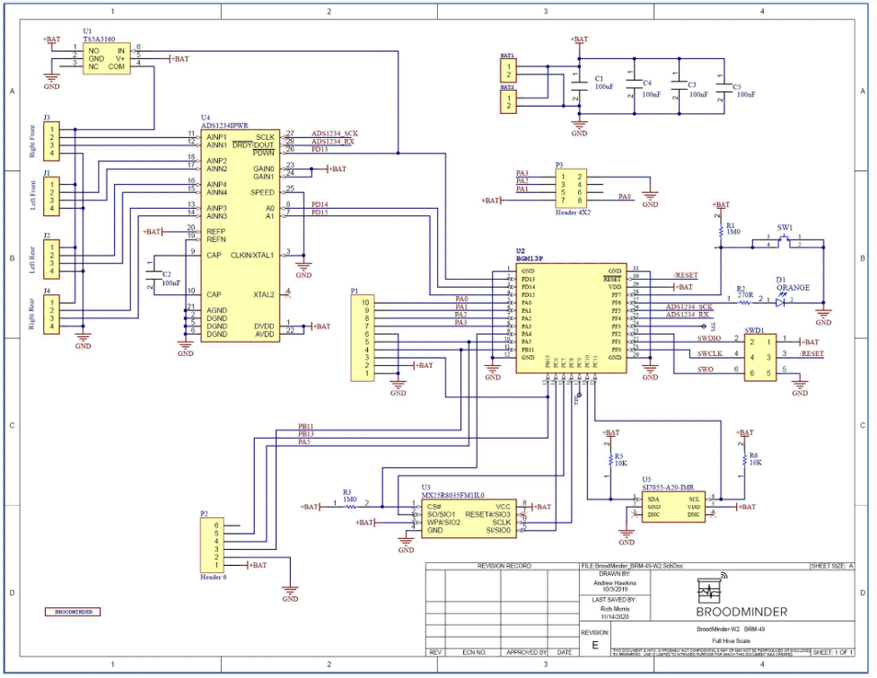
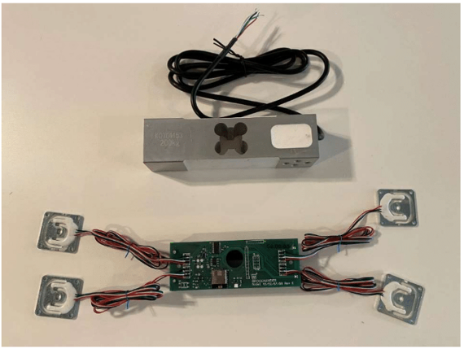
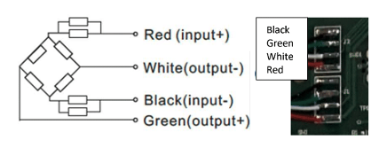
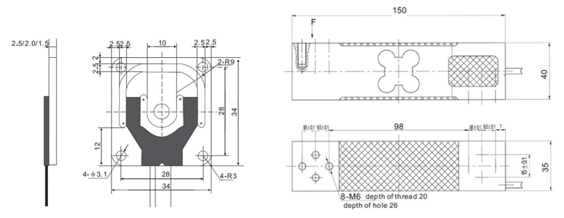

# Balance DIY - Faites-le vous même

## Vue d'ensemble

Le DIY est la carte que nous utilisons dans les autres balances Broodminder. Avec elle, vous pouvez construire votre propre balance et elle fonctionnera avec tous les logiciels standard BroodMinder et Mellisphera. Nous espérons que cette carte permettra à de nombreux bricoleurs de créer, chez eux, de parfaits appareils pour surveiller leurs ruches. N'oubliez pas de partager vos créations avec nous et nous les partagerons avec le reste du monde !

- Une conception épprouvée, autonomie de 5 ans
- **Aucune ligne de code à écrire**
- Fonctionne avec la plupart des pesons et cellules de charge du marché
- S'intègre dans le vaste écosystème BroodMinder-Mellisphera
- Utilise un circuit intégré de cellule de charge 24 bits à 4 canaux (TI ADS1234)
- Les données sont diffusées via BLE (Bluetooth Low Energy)
- Les données stockées sont lisibles par l'application BroodMinder et Mellisphera

Pour pouvoir utiliser le DIY, vous devrez ajouter une cellule de charge. 
La carte fonctionne avec la plupart des cellules de charge que vous trouverez sur le marché, mais attention de ne pas faire le mauvais choix. Chaque dispositif a ses avantages et inconvénients. Par exemple, les cellules de pese personne peuvent présenter des fluctuations plus importantes que d'autres modèles plus industriels. 

## Modèles

Nos équipes ont créé quelques modèles dont nous vous partageront la conception bientôt.
Voici un aperçu : 

Le support métallique de la ruche est disponible chez [Lyson](http://lyson.eu/home/3254-bee-hive-stand-zinc-set-2-pcs-5903661513191.html?search_query=hive+stand&results=303).

Voici un autre modèle basé sur balance balance W2, dont la mise en œuvre est minimale et qui utilise des [pieds de 5mm](https://www.amazon.fr/poignet-Cheville-Machines-broche-filet%C3%A9e/dp/B01NAPROVJ/ref=sr_1_6?__mk_fr_FR=%C3%85M%C3%85%C5%BD%C3%95%C3%91&dchild=1&keywords=Pieds+nivellement+M5&qid=1616082834&sr=8-6). Assurez-vous de protéger l'électronique des intempéries si vous décidez de construire cette balance.

Il est facile de créer un espace sous le capteur pour permettre la flèche en utilisant des forets Forstner.

La version de gauche a été créée avec des longerons bois de 40x80 en une heure environ. Vous pouvez fraiser des canaux pour les fils et les remplir de silicone. Créez un renfoncement pour y loger la carte et la protéger de la pluie. Il faudra également utiliser un bois traité et peindre le tout puis créer un couvercle pour la carte. 

## Autres modèles
Nous vous recommandons également de visiter certains sites web open source sur les ruches pour avoir une idée de la conception de votre balance. 
En voici quelques-uns à consulter, ou inventez la vôtre : 

- [https://www.honey-pi.de/](https://www.honey-pi.de/)
- [https://community.hiveeyes.org](https://community.hiveeyes.org)
- [http://www.openhivescale.org/](http://www.openhivescale.org/)
- [http://wiki.hivetool.org/](http://wiki.hivetool.org/)

N'oubliez pas de partager vos idées, nous les rendrons publiques, si vous nous le permettez. 

## Protection et étanchéité

La météo est votre ennemie, vous aurez donc besoin d'un boîtier et de presse-étoupes, nous vous recommandons ceux de chez Digikey.com : 

- [Boîte étanche - Bud Industries](https://www.digikey.fr/products/en?keywords=•%09Bud%20Industries%20PN-1322-CMB%20) PN-1322-CMB 9,50€
- [Boîte étanche - Hammond](https://www.digikey.fr/products/en?keywords=Hammond%201554N2GYCL%20) 1554N2GYCL 21,65€
- Pas tout à fait étanche, mais une bonne taille avec des oreilles [Hammond 1591CS FLBK](https://www.digikey.fr/products/en?keywords=Hammond%201591CSFLBK%20) - 4,90€
- [Presse-étoupe - Bud Industries IPG-2227](https://www.digikey.fr/product-detail/en/bud-industries/IPG-2227/377-2183-ND/5291485) 0,41€

Voici la boîte étanche Hammond 1554N2GYCL installée sur le support Lyson.

REMARQUE : Les premières cartes DIY expédiées mesureront 11,43cm x 4,5cm. Celles expédiées en juin seront un peu plus petite (10,92cm x 3,91cm). Il est possible de réduire la carte de  11,43cm x 4,5cm en 10,92cm x 3,91cm sans affecter les opérations mais nous ne le recommandons pas. Procurez-vous une taille de boîte adéquate. Beaucoup sont disponibles sur Digikey.com et Mouser.com. 

NOTEZ AUSSI CECI... Si vous décidez de couper la carte, N'UTILISEZ PAS une scie circulaire classique. Cela risque de déchirer la carte et de vous blesser. J'ai utilisé une scie à carreaux (sans dents), ou les "cisailles à métaux" fonctionnent également assez bien.

Nous avons décidé de ne pas trop travailler sur la protection électrique de la carte car nous avons constaté que c’était très bien dans notre configuration et voulons faire économiser à nos utilisateurs autant de coûts que possible. Vous pourrez avoir besoin ou envie d’ajouter une protection de circuit. C’est à vous de voir. 

Digikey.com (ou Silabs.com ou TI.com) sont une bonne base pour ceux qui veulent consulter des fiches techniques ou creuser un peu plus. 

REMARQUE : Vous trouverez ci-dessous nos circuits. Vous vous demandez peut-être pourquoi nous partageons cela... La vérité est que le circuit ne vous mènera pas très loin. Il faut beaucoup, beaucoup (et beaucoup) de logiciels pour tenir tout cela ensemble.
Nous espérons que le circuit vous aidera si vous en avez besoin ou si vous voulez en savoir plus.

## Cellules de charge 

Voici deux types de cellules de charge (également appelées jauges de contrainte). Nous sommes ravis de pouvoir vous fournir l'une ou l'autre. Si vous vous procurez les vôtres, assurez-vous qu'elles sont compensées en température et qu'elles ont un très faible fluage (creep). La résistance de la cellule de charge de 200KG est d'environ 300 ohms par canal. Pour la charge de 50KG il est d'environ 750 ohms.

La plupart des cellules de charge semblent utiliser ce schéma de couleurs pour les fils. Si c'est le cas, alors câblez-les comme ceci.
Noir, vert, blanc, rouge (de haut en bas).
Les sorties se trouvent au milieu. Si les choses sont mélangées, elles seront généralement corrigées pendant l’étalonnage. 

Le trou central de la cellule de charge de 50KG a un diamètre de 5mm.

## Étalonnage de la balance

Cette partie est en cours de construction et sera disponible très prochainement. 

🚧 🏗

