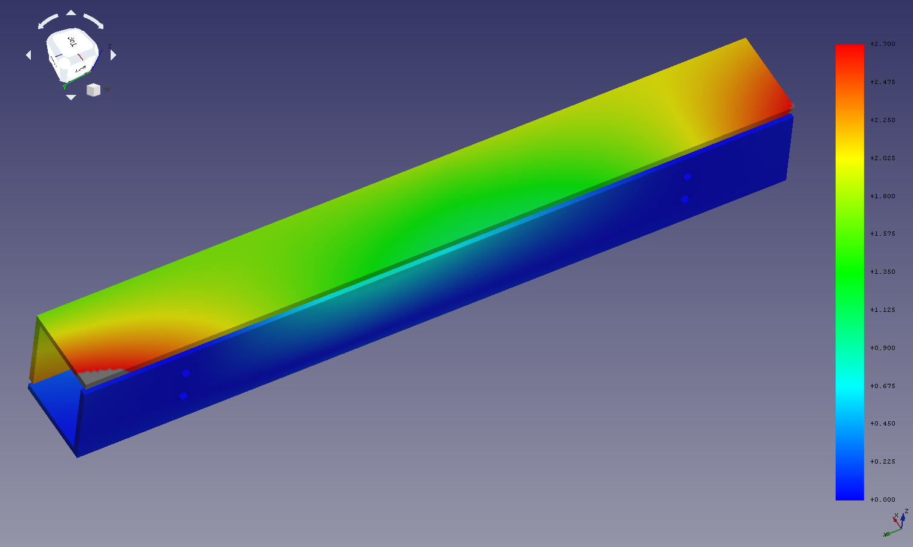

# Projets customisés 
## LSCALE - Design Costa Rica

Le besoin :

## La solution

## Version 4 

Ici on a encore une cornière en 40x30 mais elles n'existent pas sur le marché

## Version 5

On passe en cornière 50x50 c
Rien ne change sur l'empilement vertical de la cellule
Seul hic les déplacements aux extremités ne sont pas symétriques. -3,5mm vs -2,5 du côté où la cellule appuie
Il va falloir déplacer la celulle pour que l'appui haut se fasse plus au centre, car il n'y a pas suffisament de compensation

On voit aussi les limites de la cornière sur la rigidité de la structure. Elle a tendance a se déplier, ici augmenté x12.
Il faut peut être un crochet au centre également

## Version 6

Cellule déplacée de 30 mm vers la droite.

Si j'utilise une Part pour déplacer le sous ensemble ça fore lors de la création des Boolean fragments. Il garde l'ancienne position et si je prends la part au lieu des body part passe en warning) => KO en aval, marche pas car le maillage ne se génére pas.

Donc je deplace chaque body à la main

On a deplacé le problème de l'autre côté de la balance. 3,30mm de déplacement sur la gauche maintenant. Et seulement 2.4mm sur la droite

Au niveau du chargement on dépasse les 90MPa sur la première attache. Ce sera moins ponctuel avec les vis, mais il faut des rondelles larges.

Eventuellement mettre un deuxième crochet au niveau de l'attache inférieure de la cellule s'il n'y a pas d'interférence

## Version 7

Cellule déplacée de 15 mm vers la droite. (retour en arrière)

Dans cette configuration on mesure des déplacements de 2,95mm
Ce qui avec l'empilement actuel 40+5+5 = 50mm comparé a la hauteur de paroi du support = 50-4 = 46mm

On a 4 mm de battement pour une déformation maxi à 3mm sous 200kg.
Cela ne mène pas large !

Déplacements 
Droite  : 2,90
Gauche : 2,70

les crochets se déforment mais très peu comparé avec l'autre moitié de la structure. On peut les laisser là où ils sont.

## Fabrication proto v07
Voici donc la version 7 fabriquée

Quelques leçons apprises

- La charge latérale peut faire toucher les deux parties : il faut dimensionner avec un cas de charge d'un seul côté
- Le mieux serait de décaler les L pour qu'ils aient une course sans collisioner l'un contre l'autre
- les trous des cornières sont à faire en D6.5mm
- les trous des plaquettes sont à faire en D7.0mm pour ne pas ajouter à l'empilement de tolérances
- la cotation doit démarrer si possible du même côté / une seule référence
- les trous des crochets sont à ajuster selon le produit du marché 
- marquer les plans des pièces top, bottom, etc

- les tolérances sont importantes si on veut avoir des alignements parfaits entre les deux L, sinon ça se voit vite.

- Le plus gros problème qui reste à gérer est le système d'anti basculement. Sur le bati de chez moi qui est trop large cela ne marche pas, trop loin des appuis.

## Version 07 avec charge latérale

Charge latérale de 50kg resulte en un déplacement de 4,19mm == collision

## Version 08 avec pattes d'appui anti-basculement

Ajout de deux pattes d'arret

Elargir les trous des cales à 7mm et des cornières à 6,5mm pour les tolérances

On a centré la cellule par rapport a l'espace disponible (+1mm ver l'ext)

Descendu les trous des crochets pour pouvoir insérer le supérieur

Choix de ne pas desaligner les cornières. c'est trop moche sinon. 
Si on avait des collisions on ajouterait une cale supplémentaire de 3-5mm pour faire plus haut

## A l'atelier

