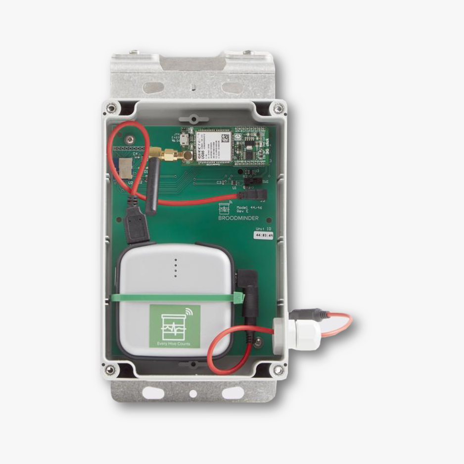

# Dépannage du Cell Hub modèles 44, 46 et 50

**NOTA : Ce guide s'applique aux modèles 44, 46 et 50 seulement**

Ces hubs ne sont pas configurables avec Broodminder Bees app. **Vous devez installer Broodminder Cell App** [Android](https://play.google.com/store/apps/details?id=com.broodminder.cell&hl=en_US&gl=US), [iOs](https://play.google.com/store/apps/details?id=com.broodminder.cell&hl=en_US&gl=US) to manage the settings




## Installez la SIM
Voici les étapes pour installer la SIM
1. débranchez la carte 3G
2. ouvrir le boitier : le faire glisser vers le haut à travers l'antenne avec le pouce puis le tirer vers le haut pour le sortir
3. introduisez la SIM dans la bonne position


4. pull down and slide down to lock


## Démarrage typique
Allumez le hub,
vous devriez voir :

- la led D1 (orange) cligniter plusieurs fois
- la led PWR1 (verte) allumée
- la led STAT (jaune) allumée
- puis, après un moment, quans la connection au réseau est établie, tout s'éteint

Notez qu'à chaque fois que vous irez dans l'app Cell dans `Configure > Diagnostics > Cell network` vous devriez voir la led PWR1 verte allumée


## Connection au réseau Cell
Il pleut arriver que votre hub trouve un réseau 3G mais ne soit pas capable d'aquérir le service. 


Pour trouver ce qui ne va pas, vérifiez d'abord votre code APN

### Vérifiez que vous avons le bon APN
Chaque fournisseur de SIM a son propre APN (Access Point Name) il pleut être *hologram*, *matooma.m2m*, etc...
Allez dans `Configure > Diagnostics > Cell network > Custom APN`


### Vérifiez la communication par modem et tracez
Juste après avoir allumé le hub, allez rapidemment dans `Configure > Diagnostics > Modem communication` Ici vous pouvez suivre le processus de connection. Laissez le tourner jusqu'à ce qu'il s'arrête puis copiez le résltat et envoyez le au support

Voici une trace de démarrage typique :
````
AT
+UMWI: 0,1
+UMWI: 0,2
+UMWI: 0,3
+UMWI: 0,4
AT
OK
AT+UGPIOC=23,0,1
AT+UGPIOC=23,0,1
OK
AT&F0
AT&F0
OK
ATE0
ATE0
OK
AT&K3
OK
AT+CSQ
+CSQ: 14,1
AT+UPSD=0,1,"hologram0,1,""
OK
AT+UPSDA=0,3
OK
AT+ctzu=1
OK
AT+UPSND=0,0
+UPSND: 0,0,"10.59.51.129"
OK
OK
beekeeping_BaseURL?250043A5001045050043A0104000001000140000000000999999999999999.","r.txt"
OK
+UUHTTPCR: 0,1,1
AT+URDFILE="r.txt"
+URDBLOCK: "r.txt",50,"HTTP/1.0 200 OK
Content-Type: application/vnd.api"
OK
no more
AT+URDFILE="r.txt"
+URDBLOCK: "r.txt",50,".cellresponsewrappermedia+json
X-Appengine-Log-Fl"
OK
no more
AT+URDFILE="r.txt"
+URDBLOCK: "r.txt",50,"ush-Count: 0
X-Cloud-Trace-Context: b54c6eae28321"
OK
no more
AT+URDFILE="r.txt"
+URDBLOCK: "r.txt",50,"ff97d2787042a9e8a98
Date: Sun, 20 Sep 2020 15:48:"
OK
no more
AT+URDFILE="r.txt"
+URDBLOCK: "r.txt",50,"01 GMT
Server: Google Frontend
Content-Length: 4"
OK
no more
AT+URDFILE="r.txt"
+URDBLOCK: "r.txt",47,"2
{"code":"200","t":"[1600616881s2881h15]"}
"
OK
````

### Trace typique avec un mauvais APN 
À gauche le mauvais APN, à droit OK

