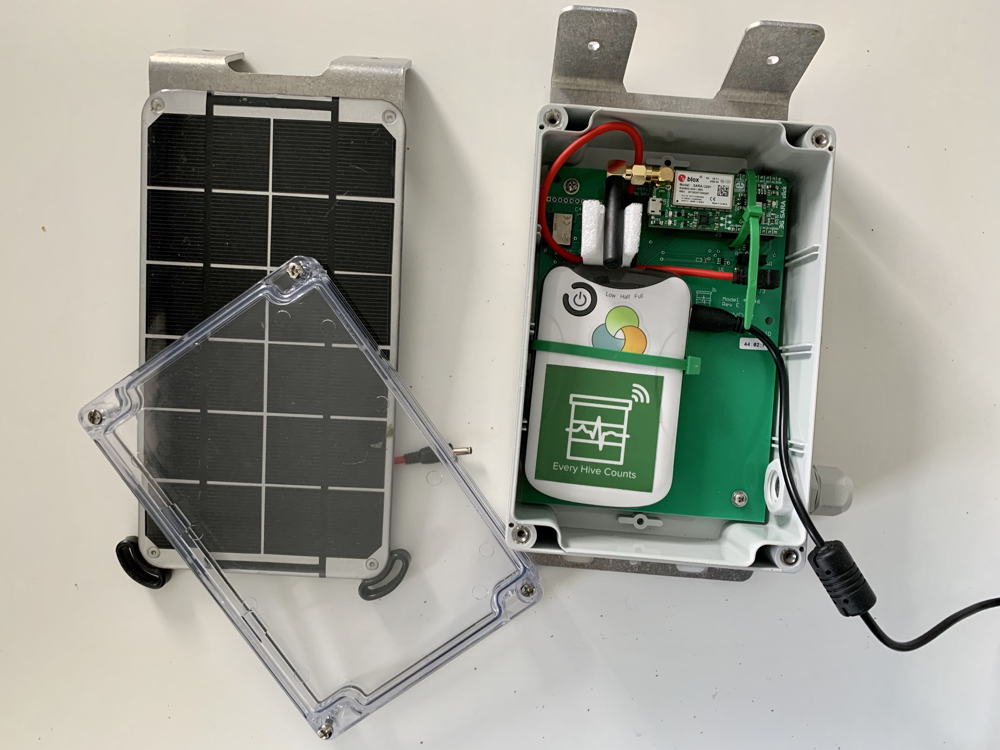

# Check-list Entretien d'hiver

Pour être tranquille et plus efficient la saison prochaine, nous vous recommandons d'entretenir vos capteurs à la fin de chaque saison.
Démarrer la saison suivante avec des mémoires vides, des batteries chargées et les mises à jour effectuées mettra toutes les chances de votre côté. 

## Préparez vos capteurs

- [ ] Commandez quelques piles CR2032 pour avoir suffisamment de stock.

!!! note 
    Oubliez les supermarchés tout comme l'achat en ligne sur sites low cost où la qualité des piles n'est pas garantie. 
    Le bon choix : commandez un lot de piles dans un magasin spécialisé pour avoir le meilleur rapport qualité prix. Il faut compter environ 0,50€ par pile pour des lots >10 unités.
    Consultez chez [Farnell](https://fr.farnell.com/renata/cr-2032-mfr-1bl/pile-bouton-3v/dp/1823479?st=cr2032) par exemple.   

- [ ] Récupérez tous vos capteurs et ramenez-les chez vous pour travailler confortablement.
- [ ] Synchronisez tous vos capteurs avec l'App Apiary pour récupérer toutes les informations que le hub aurait éventuellement pu oublier (laissez votre téléphone faire la synchronisation et prenez vous un café ou deux)

## Maintenance T2

- [ ] Changez la pile comme décrit dans la vidéo

- [ ] Démarrez le capteur

- [ ] Faîtes la mise à jour du micro logiciel si nécessaire

## Maintenance TH

- [ ] Changez la pile comme décrit dans la vidéo

-  [ ] Faîtes la mise à jour du micro logiciel si nécessaire (voir plus haut)

## Maintenance W

- [ ] Changez la pile comme décrit dans la vidéo en utilisant l'outil fourni pour la retirer

!!! Attention
    Retirez la pile délicatement en la soulevant d'un côté et de l'autre de son support, en appuyant légérement sur la carte électronique pour qu'elle reste bien plaquée contre la partie en bois. Cela vous evitera de faire sortir la carte électronique hors de la balance ou de casser le support de la pile avec trop de pression.

!!! Attention
    Une fois que c'est fait, remetez soigneusement le petit outil à son emplacement d'origine pour éviter toute interférence s'il se retrouvait coincé entre les deux parties amovibles de la balance. 

## Maintenance Hub

- [ ] Chagez la battterie au maximum en utilisant un cable micro-usb

- [ ] Installez toutes les mise à jour disponibles (l'App Broodminder Cell vous le dira)
- [ ] Après la mise à jour du Hub 3G vérifiez que l'APN est toujours le bon `matooma.m2m` (dans `Configure > Diagnostics > Cell Network > Custom APN`)

!!! Attention
    Souvenez-vous que la batterie a deux modes : **Always on** et **Auto off** : dans la ruche il doit être en **Always on**.

